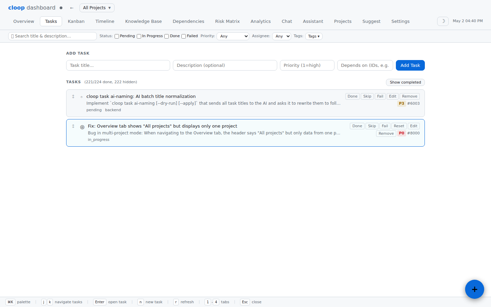
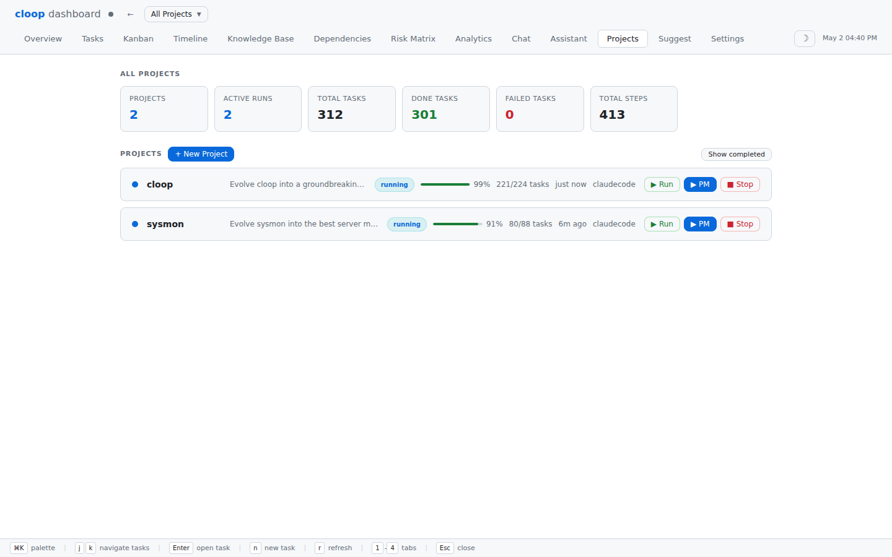
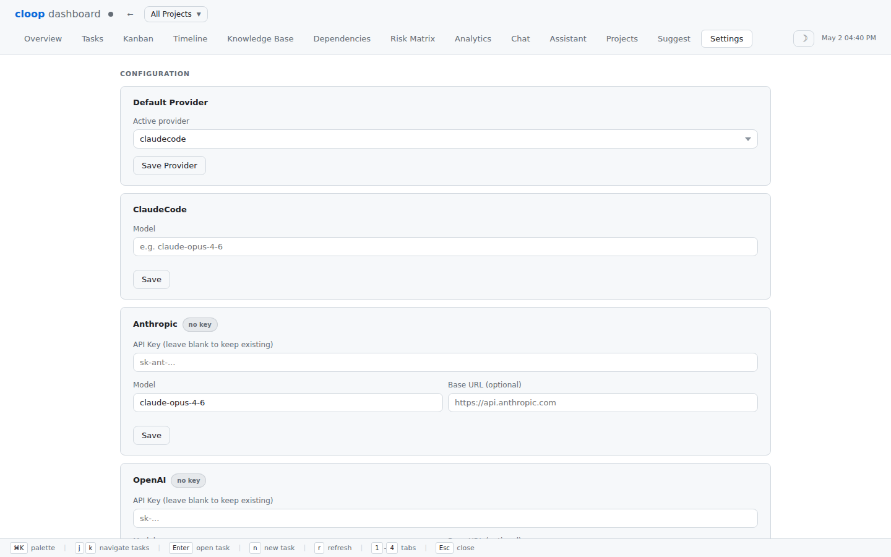
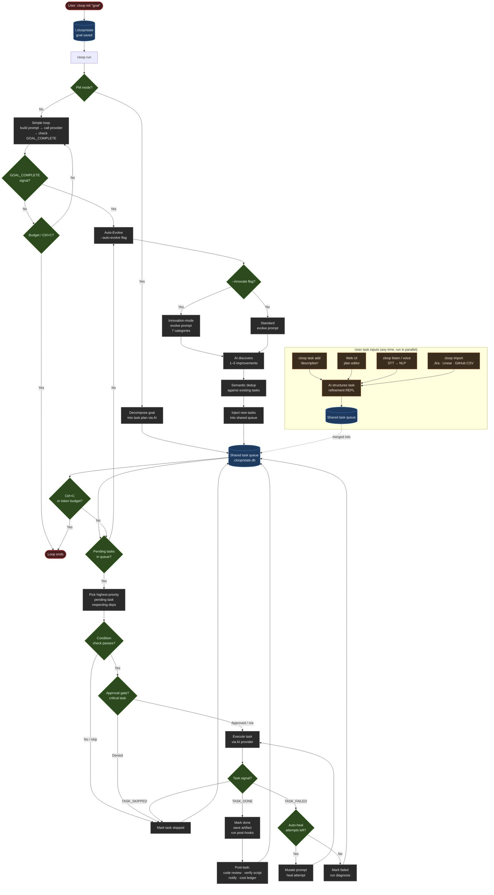

# cloop — Autonomous AI Product Manager

[](https://github.com/blechschmidt/cloop/actions/workflows/ci.yml)

cloop drives AI providers (Claude Code, Anthropic API, OpenAI, Ollama) in a goal-driven autonomous loop. Define a project goal and cloop iterates until it's done — decomposing work into tasks, executing them, reviewing code, forecasting delivery, and continuously improving.

## Screenshots

### Multi-Project Overview


### Task Management


### Project Overview


### Step History


### Settings


## Install

```bash
go install github.com/blechschmidt/cloop@latest
```

Or build from source:

```bash
git clone https://github.com/blechschmidt/cloop.git
cd cloop
go build -o cloop .
sudo mv cloop /usr/local/bin/
```

### Prerequisites

- Go 1.24+
- At least one provider configured (see [Providers](#providers))

## Quick Start

```bash
mkdir my-project && cd my-project

# Set a goal
cloop init "Build a REST API in Go with SQLite, JWT auth, and user CRUD"

# Let the AI work autonomously
cloop run

# Watch progress
cloop status
cloop log
```

## How It Works

The diagram below shows the complete cloop lifecycle — from goal setting through autonomous execution, auto-evolution, and continuous user interaction.



**Key paths:**

1. **`cloop init "goal"`** — saves the project goal to `.cloop/state.db`
2. **`cloop run`** — decomposes the goal into a prioritised task plan (PM mode) or enters a simple goal loop
3. **Task execution** — tasks are picked by priority, dependencies checked, approval gates enforced, then executed via the AI provider; auto-heal retries mutated prompts on failure
4. **Post-task pipeline** — code review, verification script, desktop/Slack notifications, cost ledger entry
5. **Auto-Evolve** — once the queue drains, the AI analyses the codebase and injects new improvement tasks; `--innovate` activates a richer 7-category discovery prompt
6. **User inputs** — `cloop task add`, the Web UI plan editor, voice/STT (`cloop listen`), and CSV import all feed the same shared queue in parallel with the AI loop
7. **Loop ends** — on Ctrl+C, token budget exhaustion, or when no more tasks remain and auto-evolve is off

## Providers

cloop supports four AI backends. Switch with `--provider` flag or `cloop config set provider <name>`.

| Provider | Description | Auth |
|----------|-------------|------|
| `claudecode` | Claude Code CLI (default) | `claude auth login` |
| `anthropic` | Anthropic API directly | `ANTHROPIC_API_KEY` |
| `openai` | OpenAI Chat Completions | `OPENAI_API_KEY` |
| `ollama` | Local Ollama server | None (local) |

### Configure providers

```bash
# Show all providers and their status
cloop providers
cloop providers --test   # verify connectivity

# Set the default provider
cloop config set provider anthropic

# Configure Anthropic
cloop config set anthropic.api_key sk-ant-...
cloop config set anthropic.model claude-opus-4-6

# Configure OpenAI
cloop config set openai.api_key sk-...
cloop config set openai.model gpt-4o

# Configure OpenAI-compatible server (e.g., Azure, local)
cloop config set openai.base_url https://my-azure-endpoint.openai.azure.com

# Configure Ollama
cloop config set ollama.base_url http://localhost:11434
cloop config set ollama.model llama3.2

# Configure Claude Code model
cloop config set claudecode.model claude-sonnet-4-6

# Show current config (API keys are masked)
cloop config show
```

### Role-Based Routing

In PM mode, different task roles can be routed to different providers:

```bash
cloop router set backend anthropic    # use Claude for backend tasks
cloop router set frontend openai      # use GPT-4o for frontend tasks
cloop router set testing ollama       # use Ollama for test writing
cloop router set security anthropic   # use Claude for security tasks
cloop router list                     # show current routing table
cloop router clear backend            # remove a route
cloop router clear --all              # remove all routes
```

Valid roles: `backend`, `frontend`, `testing`, `security`, `devops`, `data`, `docs`, `review`

### Use a provider for one run

```bash
cloop run --provider anthropic
cloop run --provider openai --model gpt-4o
cloop run --provider ollama --model llama3.2
```

---

## Commands Reference

### `cloop init [goal]`

Initialize a new project with a goal.

```bash
cloop init "Build a CLI tool that converts CSV to JSON"
cloop init --max-steps 20 "Refactor to clean architecture"
cloop init --model claude-opus-4-6 --instructions "Use Go, no external deps" "Build a web scraper"
cloop init --pm "Build a full REST API"   # Product Manager mode
```

| Flag | Default | Description |
|------|---------|-------------|
| `--max-steps` | `0` (unlimited) | Max autonomous steps |
| `--instructions` | | Additional constraints for the AI |
| `--model` | | Model override |
| `--provider` | | Provider override |
| `--pm` | `false` | Enable Product Manager mode |

### `cloop run`

Start or continue the autonomous loop.

```bash
cloop run
cloop run --provider anthropic
cloop run --auto-evolve
cloop run --model claude-opus-4-6 --step-timeout 15m
cloop run --add-steps 10      # extend max if paused at limit
cloop run --dry-run           # show prompts without executing
cloop run --pm                # enable PM mode for this run
cloop run --pm --plan-only    # decompose goal into tasks, then stop
cloop run --pm --retry-failed # retry previously failed tasks
cloop run --pm --replan       # discard plan and re-decompose
```

| Flag | Default | Description |
|------|---------|-------------|
| `--provider` | from config | AI provider to use |
| `--model` | from config | Model override |
| `--auto-evolve` | `false` | After goal completion, keep improving |
| `--innovate` | `false` | Innovation mode: push evolve toward novel capabilities |
| `--step-timeout` | `10m` | Timeout per step |
| `--max-tokens` | `0` | Max output tokens per step |
| `--add-steps` | `0` | Add more steps to max before running |
| `--steps` | `0` | Run at most N steps this session (not persisted) |
| `--dry-run` | `false` | Show prompts without running |
| `--pm` | `false` | Product Manager mode |
| `--plan-only` | `false` | PM mode: decompose tasks but don't execute |
| `--retry-failed` | `false` | PM mode: retry failed tasks |
| `--replan` | `false` | PM mode: discard existing plan and re-decompose |
| `--max-failures` | `3` | PM mode: consecutive task failures before stopping |
| `--context-steps` | `3` | Recent steps to include in prompts (0 = none) |
| `--step-delay` | | Delay between steps (e.g. `5s`, `1m`) |
| `--on-complete` | | Shell command to run on goal completion (e.g. `notify-send done`) |
| `--token-budget` | `0` | Stop when cumulative tokens reach this limit (0 = unlimited) |
| `--notify` | `false` | Send OS desktop notifications on task done, task failed, and session complete |
| `-v, --verbose` | `false` | Show full step output (no truncation) |

**Stopping:** Press `Ctrl+C` to pause gracefully. Run `cloop run` again to resume.

### `cloop status`

Show current project status including provider, progress, and token usage.

```
Goal:     Build a REST API with auth
Status:   complete
Provider: anthropic
Progress: 5/10 steps
Tokens:   12450 in / 3820 out
Created:  2026-05-01 14:00
Updated:  2026-05-01 14:15
```

### `cloop log`

Show step history.

```bash
cloop log              # all steps (truncated output)
cloop log --step 3     # specific step
cloop log --last 5     # show only the 5 most recent steps
cloop log --lines 0    # full output (no truncation)
cloop log --json       # machine-readable JSON array
cloop log --grep "error"  # filter steps containing "error" (case-insensitive)
```

### `cloop goal`

Show or update the project goal without reinitializing (preserves all steps, task plan, and settings).

```bash
cloop goal                        # show current goal
cloop goal "New goal text"        # update the goal in-place
```

### `cloop export`

Export the session as a markdown report (goal, steps, task plan).

```bash
cloop export                  # print to stdout
cloop export -o report.md     # write to file
```

### `cloop report`

Generate a rich progress report with task completion status, timeline, token usage, and cost estimates.

```bash
cloop report                         # terminal report
cloop report --format md             # markdown report to stdout
cloop report --format md -o out.md   # save markdown to file
cloop report --show-outputs          # include step/task output excerpts
```

| Flag | Default | Description |
|------|---------|-------------|
| `--format` | `terminal` | Output format: `terminal`, `md`, `markdown` |
| `--show-outputs` | `false` | Include step/task output excerpts |
| `-o, --output` | | Save report to file instead of stdout |

### `cloop providers [--test]`

List all providers with their configuration status.

```bash
cloop providers         # show all providers + config
cloop providers --test  # also verify connectivity
```

### `cloop config`

Manage project configuration stored in `.cloop/config.yaml`.

```bash
cloop config show                          # show config (keys masked)
cloop config set provider anthropic        # set default provider
cloop config set anthropic.api_key sk-...  # set a value
```

Supported keys: `provider`, `anthropic.api_key`, `anthropic.model`, `anthropic.base_url`, `openai.api_key`, `openai.model`, `openai.base_url`, `ollama.base_url`, `ollama.model`, `claudecode.model`, `webhook.url`, `github.token`, `github.repo`

### `cloop task`

Manage tasks in Product Manager mode.

```bash
cloop task list                    # show all tasks with status
cloop task list --json             # output tasks as JSON array (for scripting)
cloop task show <id>               # show full task details (untruncated)
cloop task show <id> --json        # output task as JSON
cloop task next                    # show the next pending task (preview before running)
cloop task add "Title" --desc "Description" --priority 1
cloop task edit <id> --title "New title" --priority 2
cloop task skip <id>               # mark as skipped
cloop task done <id>               # mark as done
cloop task fail <id>               # mark as failed
cloop task reset <id>              # reset to pending
cloop task remove <id>             # remove from plan
```

### `cloop diff`

Show git changes in the current project.

```bash
cloop diff              # all uncommitted changes vs HEAD
cloop diff --stat       # summary (files changed, insertions, deletions)
cloop diff --name-only  # just the list of changed files
cloop diff --session    # diff from when the cloop session was initialized
```

`--session` is useful for reviewing everything the AI changed during this session.
It finds the last git commit that existed before `cloop init` was run, then diffs from there.

### `cloop watch`

Live-refresh the project status while `cloop run` runs in another terminal.

```bash
cloop watch              # refresh every 2s (default)
cloop watch --interval 5s
```

Shows: goal, status, provider, step/task progress, token counts, and the last step's output — automatically stopping when the session ends.

### `cloop stats`

Show aggregated session statistics.

```bash
cloop stats
```

Includes step timing (total/avg/min/max), token usage, cost estimate for known models, and task breakdown in PM mode.

### `cloop reset`

Reset progress but keep the goal and configuration.

### `cloop clean`

Remove `.cloop/` directory entirely.

---

## Product Manager Mode

PM mode decomposes the goal into a structured task plan, then executes each task one at a time.

```bash
# Initialize with PM mode
cloop init --pm "Build a monitoring dashboard in Go"

# Decompose into tasks first (review before running)
cloop run --pm --plan-only

# Execute the plan
cloop run --pm

# Resume after interruption
cloop run --pm

# Retry any failed tasks
cloop run --pm --retry-failed

# Discard the existing plan and re-decompose
cloop run --pm --replan
```

The AI signals task outcomes with terminal keywords:
- `TASK_DONE` — task completed successfully
- `TASK_SKIPPED` — task not applicable / already done
- `TASK_FAILED` — task could not be completed

Tasks can declare dependencies on other tasks via `depends_on` in the JSON plan.
A task will not start until all its dependencies are `done` or `skipped`.
If a dependency fails, all tasks that depend on it are automatically skipped.

---

## Analysis & Forecasting

### `cloop scope [goal]`

AI-powered project scope analysis before you start. Estimates task count, complexity, risks, prerequisites, and recommends the best execution mode.

```bash
cloop scope "Build a REST API with auth"
cloop scope                           # analyze current project goal
cloop scope --provider anthropic "Add OAuth support"
```

Output: task count estimate, complexity (low/medium/high/very_high), estimated AI invocations, risks, prerequisites, assumptions, and recommended execution mode.

### `cloop forecast`

AI-powered completion forecast with optimistic, expected, and pessimistic scenarios. Renders an ASCII burn-down chart and streams an AI narrative about delivery outlook and acceleration opportunities.

```bash
cloop forecast                       # full forecast (chart + AI narrative)
cloop forecast --quick               # metrics and chart only, no AI
cloop forecast --no-chart            # AI narrative without the chart
cloop forecast --provider anthropic  # use a specific provider
```

| Flag | Default | Description |
|------|---------|-------------|
| `--quick` | `false` | Show metrics and chart only (no AI) |
| `--no-chart` | `false` | Skip the burn-down chart |
| `--provider` | from config | AI provider |
| `--model` | from config | Model override |

### `cloop insights`

AI-powered project health analysis: task velocity, risk score, bottlenecks, role breakdowns, and AI-generated recommendations.

```bash
cloop insights                       # full AI analysis
cloop insights --quick               # metrics panel only, no AI call
cloop insights --provider anthropic
```

| Flag | Default | Description |
|------|---------|-------------|
| `--quick` | `false` | Show metrics only, skip AI analysis |
| `--provider` | from config | AI provider for analysis |
| `--model` | from config | Model override |

### `cloop retro`

AI-powered sprint retrospective: what went well, what went wrong, bottlenecks, velocity notes, key insights, and recommended next actions.

```bash
cloop retro                          # terminal retrospective
cloop retro --format md              # markdown output
cloop retro --format md -o retro.md  # save markdown to file
cloop retro --save-memory            # persist insights to project memory
cloop retro --provider anthropic
```

| Flag | Default | Description |
|------|---------|-------------|
| `--format` | `terminal` | Output format: `terminal` or `md` |
| `-o, --output` | | Write output to file (for `--format md`) |
| `--save-memory` | `false` | Save insights to project memory |
| `--timeout` | `120s` | Analysis timeout |
| `--provider` | from config | Provider to use |
| `--model` | from config | Model override |

### `cloop standup`

Generate an AI-powered daily standup report: what was accomplished, what's planned next, blockers, and delivery forecast. Can post to Slack via webhook.

```bash
cloop standup                          # AI standup (last 24h)
cloop standup --hours 48               # look back 48 hours
cloop standup --quick                  # metrics only, no AI
cloop standup --post                   # post to Slack webhook
cloop standup --save                   # save to .cloop/standup-DATE.md
cloop standup --format slack           # Slack-formatted output
cloop standup --provider anthropic
```

| Flag | Default | Description |
|------|---------|-------------|
| `--hours` | `24` | Reporting window in hours |
| `--quick` | `false` | Show activity summary only, skip AI |
| `--post` | `false` | Post to configured webhook/Slack |
| `--save` | `false` | Save to `.cloop/standup-YYYYMMDD.md` |
| `--format` | `text` | Output format: `text`, `slack` |
| `--provider` | from config | AI provider |
| `--model` | from config | Model override |

To enable Slack posting:
```bash
cloop config set webhook.url https://hooks.slack.com/services/...
```

---

## Planning & Prioritization

### `cloop backlog`

AI-generated prioritized product backlog from your codebase. Surfaces the highest-value improvements ranked by impact-to-effort ratio.

```bash
cloop backlog                          # analyze current project
cloop backlog --format md              # markdown output
cloop backlog --format md -o backlog.md
cloop backlog --as-tasks               # add top items to PM plan
cloop backlog --max-items 10           # limit to top 10 items
cloop backlog --provider anthropic
```

Each item includes:
- **Type**: `feature`, `bug`, `tech_debt`, `performance`, `security`, `docs`
- **Impact**: `high`, `medium`, `low`
- **Effort**: `xs` (<1h), `s` (1-4h), `m` (4-16h), `l` (1-5d), `xl` (>1wk)

| Flag | Default | Description |
|------|---------|-------------|
| `--format` | `terminal` | Output format: `terminal` or `md` |
| `-o, --output` | | Write output to file |
| `--as-tasks` | `false` | Add backlog items to the PM task plan |
| `--max-items` | `0` (all) | Maximum number of items to show/add |
| `--provider` | from config | Provider to use |
| `--model` | from config | Model override |

### `cloop prioritize`

AI-powered smart task reprioritization. Analyzes the current plan and suggests the optimal execution order based on the critical path, dependencies, risk factors, and value delivery.

```bash
cloop prioritize                       # show AI priority suggestions
cloop prioritize --apply               # apply suggestions immediately
cloop prioritize --provider anthropic
```

| Flag | Default | Description |
|------|---------|-------------|
| `--apply` | `false` | Apply suggested priority changes |
| `--dry-run` | `false` | Show suggestions without applying (default) |
| `--provider` | from config | AI provider |
| `--model` | from config | Model override |

### `cloop milestone`

Sprint and release planning. Organize PM tasks into milestones with deadlines and velocity-based forecasting.

```bash
cloop milestone create "v1.0 Launch" --deadline 2026-06-15 --tasks 1,2,3
cloop milestone list                   # show all milestones with progress
cloop milestone show "v1.0 Launch"     # detailed status
cloop milestone assign "v1.0 Launch" --tasks 4,5
cloop milestone plan                   # AI generates milestone structure
cloop milestone forecast               # velocity-based completion forecast
cloop milestone delete "Foundation"
```

**`milestone create`** flags:
| Flag | Description |
|------|-------------|
| `--deadline` | Target deadline in `YYYY-MM-DD` format |
| `--description` | One-sentence milestone description |
| `--tasks` | Comma-separated task IDs to assign (e.g. `1,2,3`) |

**`milestone plan`** flags:
| Flag | Description |
|------|-------------|
| `--force` | Replace existing milestones with AI-generated plan |
| `--provider` | AI provider to use |
| `--model` | Model override |

### `cloop simulate <scenario>`

AI what-if scenario analysis: simulate hypothetical changes before committing. Projects the impact on timeline, risk, and task priorities.

```bash
cloop simulate "what if we cut the authentication module?"
cloop simulate "what if the deadline moves up by 2 weeks?"
cloop simulate "what if we add a second engineer to the project?"
cloop simulate "what if we defer all testing tasks to phase 2?"
cloop simulate "what if we focus only on the critical path?" --apply
cloop simulate "what if we switch from REST to GraphQL?" --provider anthropic
```

Output: summary, timeline delta, risk before/after, confidence, recommendations, task changes, trade-offs, and warnings.

| Flag | Default | Description |
|------|---------|-------------|
| `--apply` | `false` | Apply recommended task changes to the project |
| `--quick` | `false` | Print project snapshot only, no AI call |
| `--provider` | from config | AI provider |
| `--model` | from config | Model override |

---

## Code Quality

### `cloop review [commit-range]`

AI-powered code review for git diffs. Returns a quality score, issues by severity, praise, and suggestions.

```bash
cloop review                           # review all uncommitted changes
cloop review --staged                  # review only staged changes
cloop review --last                    # review the last commit
cloop review HEAD~3..HEAD              # review a range of commits
cloop review --task 3                  # include PM task context in review
cloop review --format md               # markdown output
cloop review --format md -o review.md  # save markdown to file
cloop review --quick                   # diff stats only, no AI call
cloop review --provider anthropic
```

| Flag | Default | Description |
|------|---------|-------------|
| `--staged` | `false` | Review only staged changes |
| `--last` | `false` | Review the last commit |
| `--commit` | | Review a specific commit (hash) |
| `--task` | `0` | Include PM task context in review (task ID) |
| `--format` | `terminal` | Output format: `terminal` or `md` |
| `-o, --output` | | Write output to file |
| `--quick` | `false` | Show diff stats only, no AI call |
| `--timeout` | | Review timeout (e.g. `60s`, `2m`) |
| `--provider` | from config | Provider to use |
| `--model` | from config | Model override |

Issues are graded as: `critical`, `major`, `minor`, `suggestion`.

---

## Collaboration & Automation

### `cloop ask <question>`

Ask the AI anything about your project state, tasks, progress, or blockers. The AI has full context: goal, task plan, recent activity, and project memory.

```bash
cloop ask "What are the remaining blockers?"
cloop ask "Summarize what has been done so far"
cloop ask "Which tasks failed and why?"
cloop ask "What should I do next?"
cloop ask "How long will the remaining tasks take?"
cloop ask --provider anthropic "Are there any risks in the current plan?"
```

| Flag | Default | Description |
|------|---------|-------------|
| `--recent-steps` | `3` | Number of recent steps to include in context (0 = none) |
| `--provider` | from config | Provider to use |
| `--model` | from config | Model override |

### `cloop chat`

Interactive conversational AI product manager. Ask questions, get suggestions, or let the AI update your task plan — all through natural conversation.

```bash
cloop chat
cloop chat --provider anthropic
cloop chat --save         # auto-save transcript on exit
```

**Slash commands inside chat:**

| Command | Description |
|---------|-------------|
| `/status` | Show current project status |
| `/tasks` | List all tasks |
| `/help` | Show available commands |
| `/clear` | Clear conversation history |
| `/save` | Save conversation transcript |
| `/quit` | Exit the chat (also: `/exit`, Ctrl+D) |

The AI can take PM actions on your behalf: mark tasks done, create new tasks, and add notes to project memory.

| Flag | Default | Description |
|------|---------|-------------|
| `--provider` | from config | AI provider |
| `--model` | from config | Model override |
| `--timeout` | `120s` | Response timeout |
| `--save` | `false` | Auto-save transcript on exit |

### `cloop compare [prompt]`

Benchmark the same prompt across multiple AI providers simultaneously. Compare response quality, latency, token counts, and cost side-by-side.

```bash
cloop compare "What is the best way to structure a Go project?"
cloop compare --providers anthropic,openai "Explain REST vs GraphQL"
cloop compare --judge "Write a haiku about software"
cloop compare --task 3           # use a PM task's prompt
cloop compare --format md -o results.md "Design a caching strategy"
cloop compare --full "Summarize microservices best practices"
```

| Flag | Default | Description |
|------|---------|-------------|
| `--providers` | all configured | Comma-separated providers to compare |
| `--judge` | `false` | Use an AI judge to score each response (0-10) |
| `--judge-provider` | first successful | Provider to use as judge |
| `--task` | `0` | Use prompt from PM task #N |
| `--format` | `table` | Output format: `table` or `md` |
| `-o, --output` | | Save output to file |
| `--timeout` | `120` | Per-provider timeout in seconds |
| `--full` | `false` | Show full responses (not truncated) |

### `cloop github`

Sync tasks with GitHub Issues and pull requests.

```bash
cloop github sync                      # import open issues as tasks
cloop github sync --repo owner/repo    # specify repo
cloop github sync --labels bug,enhancement  # filter by label
cloop github sync --dry-run            # preview without saving
cloop github push                      # create issues for unlinked tasks
cloop github push --dry-run            # preview what would be created
cloop github push --done               # also close issues for done tasks
cloop github prs                       # list open PRs with CI status
cloop github prs --state all           # include closed PRs
cloop github link 3 42                 # link task #3 to issue #42
cloop github unlink 3                  # remove task #3's issue link
cloop github status                    # show sync overview
```

Configure GitHub access:
```bash
cloop config set github.token ghp_...         # personal access token
cloop config set github.repo owner/repo       # default repo
```

The repo is auto-detected from the `origin` git remote if not configured. GitHub token is also read from `GITHUB_TOKEN` env var.

### `cloop agent`

Autonomous background agent: executes PM tasks without supervision at a regular interval.

```bash
# Start the agent
cloop agent start                      # every 5 minutes
cloop agent start --interval 2m        # every 2 minutes
cloop agent start --provider anthropic # use Claude API

# Monitor the agent
cloop agent status                     # is it running? what's it doing?
cloop agent logs                       # full log stream
cloop agent logs --tail 30             # last 30 lines
cloop agent follow                     # tail log in real time

# Stop the agent
cloop agent stop

# Maintenance
cloop agent clear-logs                 # truncate the log file
```

The agent executes one PM task per interval, records results, and stores a running state in `.cloop/agent-state.json`. Logs are written to `.cloop/agent.log`.

---

## Project Memory

### `cloop memory`

Manage the project's persistent memory stored in `.cloop/memory.json`. Memory entries are key learnings that are injected into future session prompts.

```bash
cloop memory list                      # list all stored memory entries
cloop memory add "Always use chi router, not net/http"  # add a manual entry
cloop memory delete <id>               # delete a specific entry by ID
cloop memory clear                     # delete all memory entries
```

Memory entries can be created automatically via:
- `cloop retro --save-memory` — saves retro insights to memory
- `cloop chat` — the AI can add notes via natural conversation

### `cloop checkpoint`

Save, restore, or list named snapshots of the project state. Useful before risky changes or experiments.

```bash
cloop checkpoint save before-deploy    # save a named checkpoint
cloop checkpoint save                  # save with auto-generated timestamp name
cloop checkpoint list                  # list all saved checkpoints
cloop checkpoint restore before-deploy # restore (current state auto-backed up)
cloop checkpoint delete before-deploy  # delete a checkpoint
```

Checkpoints are stored as `.json` files in `.cloop/checkpoints/`. Restoring a checkpoint automatically backs up the current state first.

---

## MCP Server (Model Context Protocol)

### `cloop mcp`

Start cloop as an MCP server, exposing it as a set of tools to Claude Desktop, Cursor, Zed, and any other client that supports the [Model Context Protocol](https://spec.modelcontextprotocol.io).

The server speaks JSON-RPC 2.0 over newline-delimited stdio. All log output goes to stderr so it does not corrupt the MCP stream.

```bash
cloop mcp                          # use the configured/auto-detected provider
cloop mcp --provider anthropic     # force a specific provider
cloop mcp --provider openai --model gpt-4o
```

#### Available MCP Tools

| Tool | Description |
|------|-------------|
| `get_status` | Return current orchestrator state: goal, status, step counts, provider |
| `get_plan` | Return the full PM-mode task plan as JSON with all task details |
| `add_task` | Append a new task to the current plan (title, description, priority) |
| `complete_task` | Mark a task done by ID with an optional result summary |
| `run_task` | Execute a one-shot AI prompt using the configured provider |

#### Claude Desktop Configuration

Add to `~/.claude/claude_desktop_config.json` (or the equivalent on your OS):

```json
{
  "mcpServers": {
    "cloop": {
      "command": "cloop",
      "args": ["mcp"],
      "cwd": "/path/to/your/project"
    }
  }
}
```

Once configured, Claude Desktop will offer the cloop tools in any conversation. You can ask Claude to check the plan status, add tasks, or run one-off AI prompts directly through cloop's provider.

#### Cursor Configuration

In `.cursor/mcp.json` at the project root:

```json
{
  "mcpServers": {
    "cloop": {
      "command": "cloop",
      "args": ["mcp"]
    }
  }
}
```

#### Example Session (raw JSON-RPC)

```json
// Client → cloop
{"jsonrpc":"2.0","id":1,"method":"initialize","params":{"protocolVersion":"2024-11-05","capabilities":{}}}

// cloop → Client
{"jsonrpc":"2.0","id":1,"result":{"capabilities":{"tools":{}},"protocolVersion":"2024-11-05","serverInfo":{"name":"cloop","version":"1.0.0"}}}

// Client → cloop
{"jsonrpc":"2.0","method":"initialized"}

// Client → cloop
{"jsonrpc":"2.0","id":2,"method":"tools/call","params":{"name":"get_plan","arguments":{}}}

// cloop → Client
{"jsonrpc":"2.0","id":2,"result":{"content":[{"type":"text","text":"{ ... plan JSON ... }"}]}}
```

---

## Web Dashboard

### `cloop ui`

Start a local web dashboard with real-time updates via SSE (Server-Sent Events).

```bash
cloop ui                  # start on default port 8080
cloop ui --port 9090      # use a custom port
cloop ui --no-browser     # don't open the browser automatically
```

The dashboard shows: project goal, status, step history with outputs, task list (PM mode), live progress, and run/stop controls.

| Flag | Default | Description |
|------|---------|-------------|
| `--port` | `8080` | Port to listen on |
| `--no-browser` | `false` | Do not open the browser automatically |

---

## Auto-Evolve

With `--auto-evolve`, cloop enters a second phase after the goal is complete. The AI independently:

- Adds useful features
- Writes tests
- Improves code quality
- Fixes edge cases
- Adds documentation
- Optimizes performance

Each iteration focuses on **one** improvement. Runs until you press `Ctrl+C`.

```bash
cloop init "Build a monitoring dashboard"
cloop run --auto-evolve
# GOAL_COMPLETE
# Evolve #1: adds sparkline charts
# Evolve #2: adds TCP connection stats
# Evolve #3: adds unit tests
# ... keeps going until Ctrl+C
```

## Innovation Mode

Innovation mode supercharges `--auto-evolve` by changing the evolve prompt to push the AI beyond incremental improvements toward genuinely novel capabilities.

Without `--innovate`, each evolve iteration picks one conventional improvement: add a feature, write tests, refactor, improve docs, or optimize performance.

With `--innovate`, the AI is explicitly directed to think unconventionally and invent capabilities that don't exist in other tools:

- **Cross-provider intelligence** — use multiple providers together, consensus across models, fallback chains
- **Self-optimization** — analyze own performance, tune prompts, learn from failures
- **Predictive capabilities** — anticipate what the user needs next
- **Meta-learning** — extract patterns from past iterations to improve future ones
- **Novel interaction patterns** — watch mode enhancements, collaborative modes, execution branching
- **Emergent behaviors** — capabilities the AI discovers are useful
- **Integration points** — webhooks, external APIs, CI/CD hooks, tool integrations

```bash
# Standard evolve: incremental improvements
cloop run --auto-evolve

# Innovation mode: push toward genuinely novel capabilities
cloop run --auto-evolve --innovate

# PM mode + innovation: structured execution with creative post-completion evolution
cloop init --pm "Build a monitoring dashboard"
cloop run --pm
cloop run --auto-evolve --innovate
```

Innovation mode only affects the evolve phase (after `GOAL_COMPLETE`). It has no effect without `--auto-evolve`.

---

## Environment Variables

`CLOOP_*` environment variables override config file values but are overridden by CLI flags. Useful for CI/CD pipelines or when you don't want to persist credentials in `.cloop/config.yaml`.

| Variable | Overrides |
|----------|-----------|
| `CLOOP_PROVIDER` | Default provider |
| `CLOOP_MODEL` | Model for this run |
| `CLOOP_ANTHROPIC_API_KEY` | `config.anthropic.api_key` |
| `CLOOP_ANTHROPIC_BASE_URL` | `config.anthropic.base_url` |
| `CLOOP_OPENAI_API_KEY` | `config.openai.api_key` |
| `CLOOP_OPENAI_BASE_URL` | `config.openai.base_url` |
| `CLOOP_OLLAMA_BASE_URL` | `config.ollama.base_url` |

Standard provider env vars (`ANTHROPIC_API_KEY`, `OPENAI_API_KEY`, `GITHUB_TOKEN`) are also read for provider auto-detection.

---

## State

All state is stored in `.cloop/`:

| File | Contents |
|------|----------|
| `state.json` | Goal, instructions, provider, step history, token counts, PM task plan, milestones |
| `config.yaml` | Provider config, API keys, router routes, webhook URL |
| `memory.json` | Persistent cross-session learnings |
| `checkpoints/` | Named state snapshots |
| `agent.log` | Background agent log |
| `agent-state.json` | Background agent runtime state |
| `standup-DATE.md` | Saved standup reports |
| `chat-TIMESTAMP.txt` | Saved chat transcripts |

Status values: `initialized`, `running`, `complete`, `failed`, `paused`, `evolving`

---

## Error Handling

- **Provider error (regular mode)** → stops immediately
- **3 consecutive task failures (PM mode)** → stops automatically (configurable with `--max-failures`)
- **Ctrl+C** → graceful pause after current step
- **Rate limits / transient errors** → automatic retry with exponential backoff (up to 3 attempts, retries on 429/5xx)

---

## Examples

### Build a project from scratch with Anthropic

```bash
mkdir api && cd api
cloop config set provider anthropic
cloop config set anthropic.api_key $ANTHROPIC_API_KEY
cloop init \
  --instructions "Use Go, chi router, GORM with SQLite, JWT auth" \
  "Build a REST API with users, posts, and comments"
cloop run --auto-evolve
```

### Use PM mode for structured execution

```bash
cd my-project
cloop init --pm "Add comprehensive test coverage and CI pipeline"
cloop run --pm --plan-only   # review the task plan first
cloop run --pm               # execute
```

### Full PM workflow with analysis

```bash
cloop scope "Add OAuth2 support"         # pre-flight scope analysis
cloop init --pm "Add OAuth2 support"
cloop run --pm --plan-only               # decompose into tasks
cloop milestone plan                     # organize into sprints
cloop prioritize --apply                 # AI-optimized task order
cloop run --pm                           # execute
cloop review                             # review the resulting code changes
cloop retro --save-memory                # retrospective + save learnings
```

### Simulate before committing to a decision

```bash
cloop simulate "what if we cut the payment module for the v1 launch?"
cloop simulate "what if we add two more weeks to the deadline?" --apply
```

### Run locally with Ollama (no API costs)

```bash
cloop config set provider ollama
cloop config set ollama.model llama3.2
cloop init "Refactor this Python script to be more readable"
cloop run
```

### One-shot task

```bash
cloop init --max-steps 1 "Add comprehensive unit tests for the auth package"
cloop run
```

### Autonomous background execution

```bash
cloop init --pm "Migrate all HTTP handlers to the new router pattern"
cloop run --pm --plan-only         # decompose tasks
cloop agent start --interval 5m    # execute autonomously in background
cloop agent status                 # check progress
cloop agent follow                 # watch in real time
cloop agent stop                   # when done
```

### Desktop notifications for long-running sessions

```bash
# Get notified when each task completes or fails, and when the session finishes
cloop run --pm --notify

# Combine with a completion hook for maximum alerting
cloop run --pm --notify --on-complete 'say "cloop done"'
```

`--notify` uses `notify-send` on Linux (requires `libnotify`) and `osascript` on macOS. It is silently ignored on unsupported platforms or headless environments. Events fired: **Task Done**, **Task Failed**, **All Tasks Complete** (PM mode) / **Goal Complete** (loop mode).

### Cross-provider comparison

```bash
cloop compare --providers anthropic,openai --judge \
  "Design the database schema for a multi-tenant SaaS app"
```

### GitHub integration

```bash
cloop config set github.token ghp_...
cloop github sync --labels bug,enhancement   # import open issues as tasks
cloop run --pm                               # execute imported tasks
cloop github push --done                     # close completed issues
```

## Shell Completion

cloop provides tab-completion scripts for **bash**, **zsh**, **fish**, and **PowerShell** via the built-in `completion` command. Completions cover all subcommands, flags, and dynamic values such as provider names, template names, and task IDs.

### Quick load (current session)

```bash
# Bash
source <(cloop completion bash)

# Zsh
source <(cloop completion zsh)

# Fish
cloop completion fish | source

# PowerShell
cloop completion powershell | Out-String | Invoke-Expression
```

### Permanent installation

**Bash — Linux**
```bash
cloop completion bash > /etc/bash_completion.d/cloop
```

**Bash — macOS** (requires [bash-completion@2](https://formulae.brew.sh/formula/bash-completion@2))
```bash
cloop completion bash > $(brew --prefix)/etc/bash_completion.d/cloop
```

**Zsh**
```zsh
# Add to ~/.zshrc:
source <(cloop completion zsh)

# Or install to $fpath:
cloop completion zsh > "${fpath[1]}/_cloop"
```

**Fish**
```fish
cloop completion fish > ~/.config/fish/completions/cloop.fish
```

**PowerShell** — add to your `$PROFILE`:
```powershell
Invoke-Expression (&cloop completion powershell)
```

### What gets completed

| Context | Completions |
|---------|-------------|
| `--provider` flag (all commands) | `anthropic`, `claudecode`, `ollama`, `openai` |
| `--template` flag (`cloop init`) | `web-app`, `cli-tool`, `data-pipeline`, `api-service`, `refactor`, `security-audit` |
| `cloop task show/skip/done/fail/reset/edit/…` | Live task IDs from `.cloop/state.json` |
| `cloop task tag/untag <id>` | Task ID for first argument |
| `cloop task merge <id…>` | All task IDs for multi-ID arguments |
| Subcommands | All registered subcommands with descriptions |

## Security Model

### What data leaves the machine

When you run cloop in any AI-powered mode (PM, suggest, explain, etc.) cloop sends
**only the following** to your configured AI provider:

| Data sent | When |
|-----------|------|
| Your project **goal** and **task descriptions** | Every prompt |
| **Step output** from previous tasks (for context) | When building task context |
| **Codebase snippets** injected by `--inject-context` or `cloop context` | When context injection is enabled |
| Git log / diff excerpts | Commands that require them (pr, commit-msg, trace, …) |

**No API keys, passwords, or environment variables** are ever included in prompts.
**No telemetry** is sent to Anthropic or any third party by cloop itself.

### API key storage

| Location | What is stored |
|----------|----------------|
| `.cloop/config.yaml` | API keys (optional — env vars are preferred) |
| Environment variables | Recommended: `ANTHROPIC_API_KEY`, `OPENAI_API_KEY`, `GITHUB_TOKEN` |
| `.cloop/state.db` | Goal, task list, step outputs — **no API keys** |

**Config file permissions:** cloop writes `.cloop/config.yaml` with mode `0600`
(owner read/write only). On load, cloop warns if the file has world- or
group-readable permissions so you can run `chmod 600 .cloop/config.yaml`.

**Encrypted secrets** (`cloop secret`) are stored in `.cloop/secrets.enc` using
AES-256-GCM and never written to any AI prompt.

### State file integrity (optional HMAC)

Set the `CLOOP_STATE_HMAC_KEY` environment variable to enable HMAC-SHA256
signing of exported state. The `pkg/security` package provides `Sign()` /
`Verify()` utilities; tooling that exports or imports state can use these to
detect tampering.

### Web UI (`cloop ui`)

The web dashboard binds to **localhost only** by default. When a `--token` is
set:

- Every `/api/*` request must present `Authorization: Bearer <token>` or
  `?token=<token>`.
- Failed authentication attempts are **rate-limited**: after 5 consecutive
  failures from the same IP the endpoint returns HTTP 429 and blocks that IP
  for 60 seconds.
- All responses include hardened HTTP headers:
  - `Content-Security-Policy` — restricts resource loading to same-origin
  - `X-Content-Type-Options: nosniff`
  - `X-Frame-Options: DENY`
  - `Referrer-Policy: no-referrer`
- CORS is restricted to `localhost` / `127.0.0.1` origins only (no wildcard).

### TLS / provider communication

All three remote providers (Anthropic, OpenAI, custom OpenAI-compatible) use
Go's default `http.Client` which validates TLS certificates against the system
CA pool. There is **no `InsecureSkipVerify` option** in cloop.

For self-hosted models on plain HTTP (Ollama), set `ollama.base_url` to the
local endpoint. Outbound traffic to Anthropic/OpenAI is always TLS.

### Shell hooks and command injection

Pre/post task hooks (`hooks.pre_task`, `hooks.post_task`, etc.) are **user-
configured shell commands** from `.cloop/config.yaml`. Task context
(title, status, role) is passed as **environment variables** — never
interpolated into the hook command string — so task content cannot inject shell
commands through the hook mechanism.

### Dependency security

cloop uses `govulncheck` (golang.org/x/vuln) for dependency audits. The
`toolchain` directive in `go.mod` pins the minimum Go version to one that
resolves all known stdlib vulnerabilities.

## License

MIT
