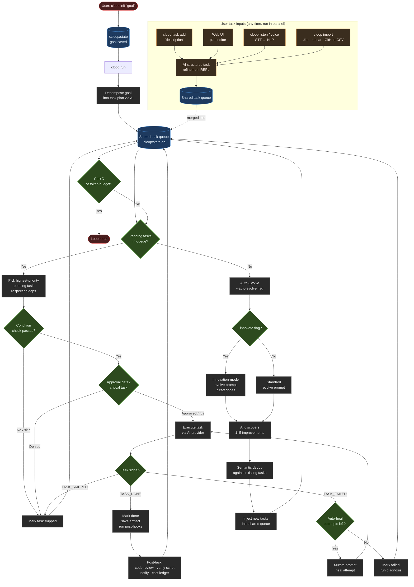
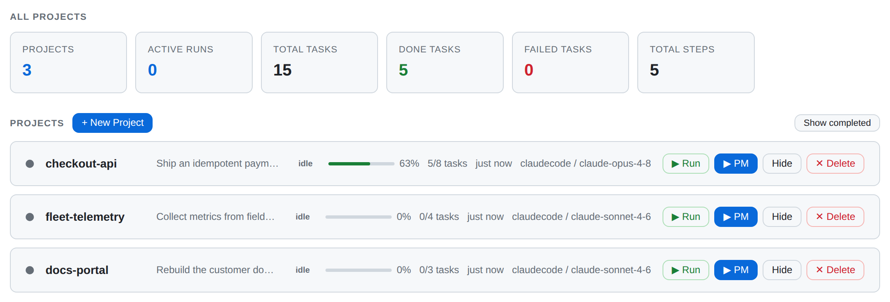
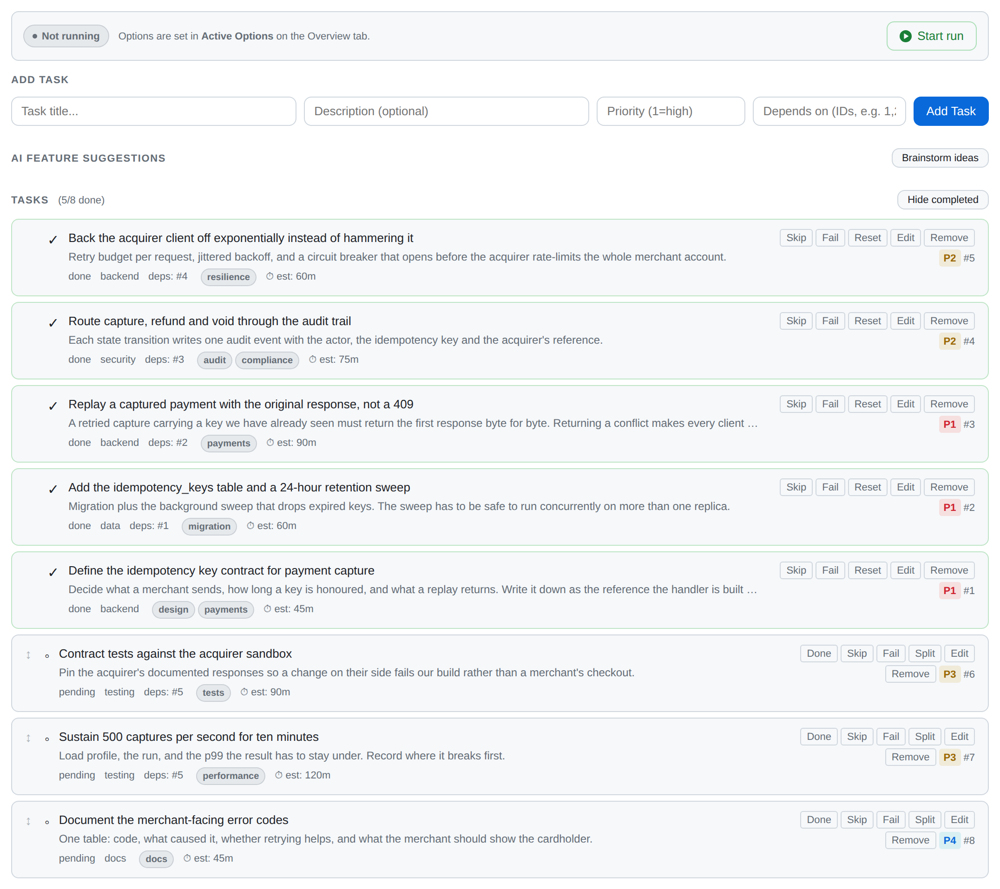
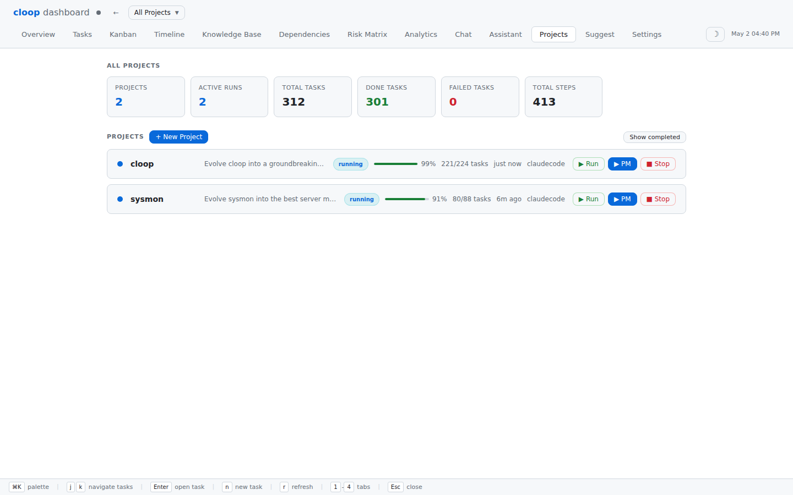
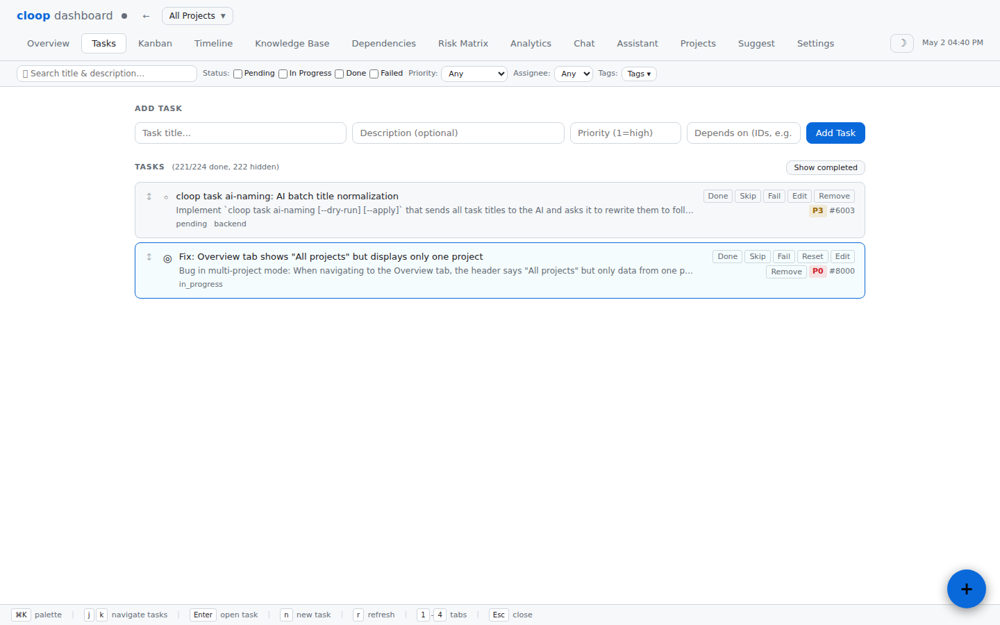
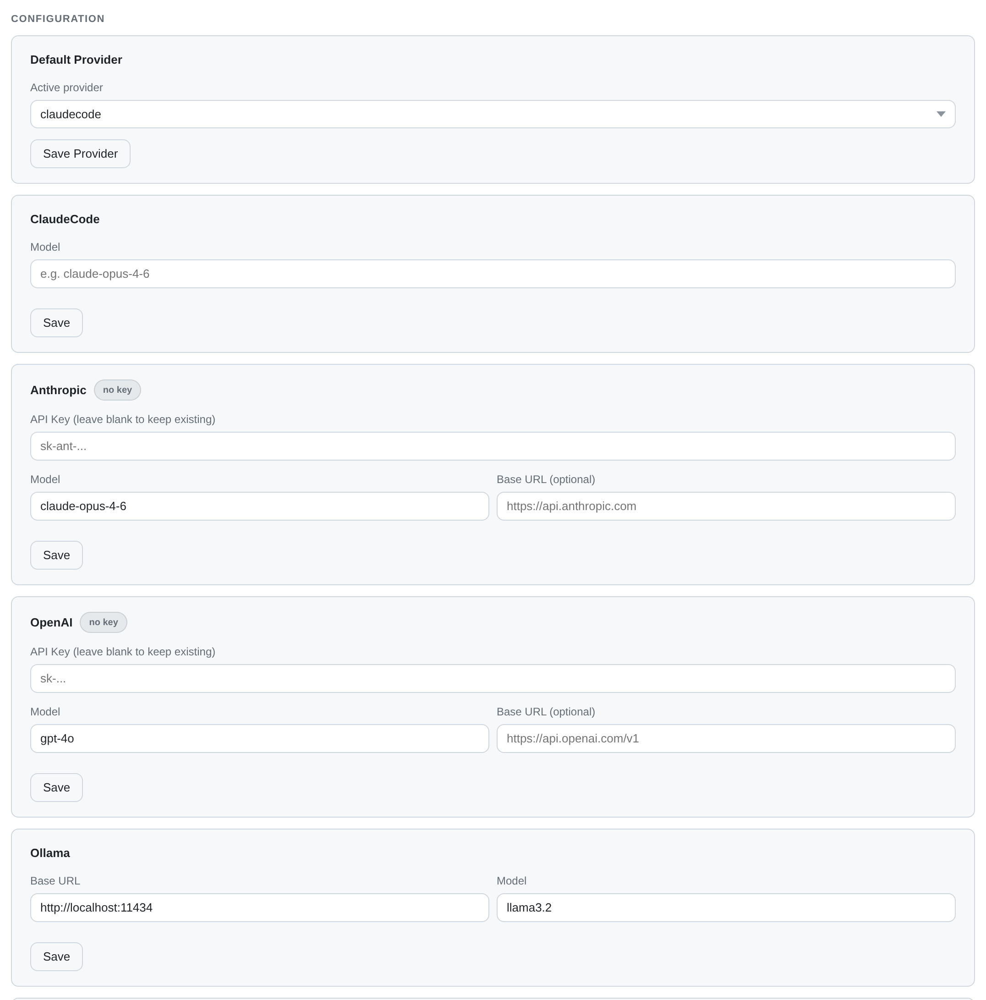

# cloop — Autonomous AI Product Manager

[](https://github.com/blechschmidt/cloop/actions/workflows/ci.yml)

cloop drives AI providers (Claude Code, Anthropic API, OpenAI, Ollama) in a goal-driven autonomous loop. Define a project goal and cloop iterates until it's done — decomposing work into tasks, executing them, reviewing code, forecasting delivery, and continuously improving.

## Install

```bash
go install github.com/blechschmidt/cloop@latest
```

Or build from source:

```bash
git clone https://github.com/blechschmidt/cloop.git
cd cloop
go build -o cloop .
sudo mv cloop /usr/local/bin/
```

### Prerequisites

- Go 1.24+
- At least one provider configured (see [Providers](#providers))

## Quick Start

```bash
mkdir my-project && cd my-project

# Set a goal
cloop init "Build a REST API in Go with SQLite, JWT auth, and user CRUD"

# Let the AI work autonomously
cloop run

# Watch progress
cloop status
cloop log
```

## How It Works

The diagram below shows the complete cloop lifecycle — from goal setting through autonomous execution, auto-evolution, and continuous user interaction.


```mermaid
flowchart TD
    %% ── Entry points ──────────────────────────────────────────────
    A([User: cloop init &quot;goal&quot;]) --> B[(\.cloop/state\ngoal saved)]
    B --> C[cloop run]

    %% ── Run startup ───────────────────────────────────────────────
    C --> F[Decompose goal\ninto task plan via AI]

    %% ── PM task loop ──────────────────────────────────────────────
    F --> G[(Shared task queue\n.cloop/state.db)]

    G --> H{Pending tasks\nin queue?}
    H -- No --> AE[Auto-Evolve\n--auto-evolve flag]
    H -- Yes --> I[Pick highest-priority\npending task\nrespecting deps]

    I --> J{Condition\ncheck passes?}
    J -- No / skip --> K[Mark task skipped]
    K --> G

    J -- Yes --> L{Approval gate?\ncritical task}
    L -- Denied --> K
    L -- Approved / n/a --> M[Execute task\nvia AI provider]

    M --> N{Task signal?}
    N -- TASK_DONE --> O[Mark done\nsave artifact\nrun post-hooks]
    N -- TASK_FAILED --> P{Auto-heal\nattempts left?}
    N -- TASK_SKIPPED --> K

    P -- Yes --> Q[Mutate prompt\nheal attempt]
    Q --> M
    P -- No --> R[Mark failed\nrun diagnosis]
    R --> G

    O --> S[Post-task:\ncode review · verify script\nnotify · cost ledger]
    S --> G

    %% ── Auto-Evolve ───────────────────────────────────────────────
    AE --> AE1{--innovate flag?}
    AE1 -- Yes --> AE2[Innovation-mode\nevolve prompt\n7 categories]
    AE1 -- No  --> AE3[Standard\nevolve prompt]
    AE2 & AE3 --> AE4[AI discovers\n1–5 improvements]
    AE4 --> AE5[Semantic dedup\nagainst existing tasks]
    AE5 --> AE6[Inject new tasks\ninto shared queue]
    AE6 --> G

    %% ── User task input path (parallel) ──────────────────────────
    subgraph USER ["User task inputs  (any time, run in parallel)"]
        U1[cloop task add\n'description'] --> UA[AI structures task\nrefinement REPL]
        U2[Web UI\nplan editor] --> UA
        U3[cloop listen / voice\nSTT → NLP] --> UA
        U4[cloop import\nJira · Linear · GitHub CSV] --> UA
        UA --> UB[(Shared task queue)]
    end
    UB -.->|merged into| G

    %% ── Loop termination ──────────────────────────────────────────
    G --> TC{Ctrl+C\nor token budget?}
    TC -- Yes --> Z([Loop ends])
    TC -- No --> H

    %% ── Styles ────────────────────────────────────────────────────
    classDef queue fill:#1e3a5f,stroke:#4a90d9,color:#e8f4fd
    classDef decision fill:#2d4a1e,stroke:#6abf4b,color:#e8f8e8
    classDef action fill:#2a2a2a,stroke:#888,color:#eee
    classDef endpoint fill:#4a1e1e,stroke:#d94a4a,color:#fde8e8
    classDef user fill:#3a2d1e,stroke:#d9944a,color:#fdf0e8

    class G,B,UB queue
    class H,J,L,N,P,AE1,TC decision
    class F,I,M,O,S,AE,AE2,AE3,AE4,AE5,AE6,Q,R,K action
    class A,Z endpoint
    class U1,U2,U3,U4,UA user
```

**Key paths:**

1. **`cloop init "goal"`** — saves the project goal to `.cloop/state.db`
2. **`cloop run`** — decomposes the goal into a prioritised task plan; every unit of work is a visible task
3. **Task execution** — tasks are picked by priority, dependencies checked, approval gates enforced, then executed via the AI provider; auto-heal retries mutated prompts on failure
4. **Post-task pipeline** — code review, verification script, desktop/Slack notifications, cost ledger entry
5. **Auto-Evolve** — once the queue drains, the AI analyses the codebase and injects new improvement tasks; `--innovate` activates a richer 7-category discovery prompt
6. **User inputs** — `cloop task add`, the Web UI plan editor, voice/STT (`cloop listen`), and CSV import all feed the same shared queue in parallel with the AI loop
7. **Loop ends** — on Ctrl+C, token budget exhaustion, or when no more tasks remain and auto-evolve is off

## Providers

cloop supports four AI backends. Switch with `--provider` flag or `cloop config set provider <name>`.

| Provider | Description | Auth |
|----------|-------------|------|
| `claudecode` | Claude Code CLI (default) | `claude auth login` |
| `anthropic` | Anthropic API directly | `ANTHROPIC_API_KEY` |
| `openai` | OpenAI Chat Completions | `OPENAI_API_KEY` |
| `ollama` | Local Ollama server | None (local) |

### Configure providers

```bash
# Show all providers and their status
cloop providers
cloop providers --test   # verify connectivity

# Set the default provider
cloop config set provider anthropic

# Configure Anthropic
cloop config set anthropic.api_key sk-ant-...
cloop config set anthropic.model claude-opus-4-6

# Configure OpenAI
cloop config set openai.api_key sk-...
cloop config set openai.model gpt-4o

# Configure OpenAI-compatible server (e.g., Azure, local)
cloop config set openai.base_url https://my-azure-endpoint.openai.azure.com

# Configure Ollama
cloop config set ollama.base_url http://localhost:11434
cloop config set ollama.model llama3.2

# Configure Claude Code model
cloop config set claudecode.model claude-sonnet-4-6

# Show current config (API keys are masked)
cloop config show
```

### Role-Based Routing

In PM mode, different task roles can be routed to different providers:

```bash
cloop router set backend anthropic    # use Claude for backend tasks
cloop router set frontend openai      # use GPT-4o for frontend tasks
cloop router set testing ollama       # use Ollama for test writing
cloop router set security anthropic   # use Claude for security tasks
cloop router list                     # show current routing table
cloop router clear backend            # remove a route
cloop router clear --all              # remove all routes
```

Valid roles: `backend`, `frontend`, `testing`, `security`, `devops`, `data`, `docs`, `review`

### Use a provider for one run

```bash
cloop run --provider anthropic
cloop run --provider openai --model gpt-4o
cloop run --provider ollama --model llama3.2
```

---

## Documentation

The README is an overview. The detail lives in [`docs/`](docs/README.md):

| | |
| --- | --- |
| **[Executor architecture](docs/architecture/executors.md)** | how a task travels from the orchestrator to a sandbox and back — the four backends, placement, health supervision, failover, and remote agent enrollment |
| **[Security model](docs/security/model.md)** | the four trust boundaries, the no-host-execution guarantee, SSO and RBAC, and a table mapping every guarantee to the test that machine-checks it |
| **[Threat model](docs/security/threat-model.md)** | STRIDE per boundary, with an honest residual-risk column |
| **[Secrets and egress](docs/guides/secrets.md)** | granting a GitHub repo/PAT, kubeconfig, registry login or Internet lease, with TTLs and constraints |
| **[Operator runbook](docs/operations/runbook.md)** | backup and restore, audit verification, key rotation, upgrade, rollback, incident playbooks |
| **[Command reference](docs/reference/commands.md)** | every command and flag |
| **[Configuration reference](docs/reference/configuration.md)** | every `.cloop/config.yaml` key |
| **[Deployment](deploy/README.md)** | container image, docker-compose evaluation stack, Helm chart |

---

## Commands

Full detail — every flag, every subcommand — is in the
[command reference](docs/reference/commands.md).

**Core loop**

| Command | Does |
| --- | --- |
| `cloop init [goal]` | initialize a project; `--interactive` for a guided setup |
| `cloop run` | decompose the goal into tasks and execute them |
| `cloop status` | goal, provider, progress, task list |
| `cloop log` / `cloop watch` | step history; re-evaluate on file change |
| `cloop task …` | add, edit, split, merge, decompose, assign, annotate, archive |
| `cloop goal` | change the goal and re-plan |
| `cloop reset` / `cloop clean` | discard the plan; remove `.cloop/` |

**Analysis and planning** — `scope`, `forecast`, `insights`, `retro`,
`standup`, `backlog`, `prioritize`, `milestone`, `simulate`, `review`

**Collaboration** — `ask`, `chat`, `compare`, `github`, `agent`, `memory`,
`checkpoint`, `mcp`

**Hub and fleet**

| Command | Does |
| --- | --- |
| `cloop ui` | start the web dashboard |
| `cloop hub bootstrap` | generate a secure-by-default hub configuration |
| `cloop hub tls-init` / `pin` | development certificate; SPKI pin for agents |
| `cloop executor list` / `ls` / `test` | registered backends; fleet health; preflight |
| `cloop executor enroll` / `agent` / `revoke` | enrol an edge device, run one, revoke it |
| `cloop executor cordon` / `drain` / `uncordon` / `reap` | take a node out of rotation; clean up strays |

**Credentials and access**

| Command | Does |
| --- | --- |
| `cloop secret mint` / `grant` / `grants` / `revoke` | store a credential; grant scoped, expiring access |
| `cloop secret lease` | dry-run what an executor would receive |
| `cloop egress grant` / `list` / `revoke` / `test` | lease the hub's Internet connection to a sandbox |

**Operations**

| Command | Does |
| --- | --- |
| `cloop db backup` / `restore` / `verify` / `maintain` | hot backup; restore; integrity check; VACUUM + ANALYZE |
| `cloop audit-log list` / `verify` / `export` | audit trail; hash-chain verification; JSONL/CSV/CEF export |
| `cloop hub healthcheck` | probe `/healthz` or `/readyz` |
| `cloop migrate` | apply schema migrations |

`cloop <command> --help` for anything not listed.

---

## Enterprise deployment

cloop runs as a multi-user hub with SSO, RBAC, brokered credentials and
isolated executors. The hub itself never spawns a harness: workloads run in
containers, on enrolled edge devices, or as Kubernetes Pods.

```bash
cloop hub bootstrap --external-url https://cloop.example.com \
  --oidc-issuer https://idp.example.com --oidc-client-id cloop-hub
```

That writes a configuration with `executors.allow_host_process: false` and
`default_role: none` — no host execution, deny by default. From there:

- **[Executor architecture](docs/architecture/executors.md)** — pick and
  configure a backend, enrol edge devices
- **[Security model](docs/security/model.md)** — trust boundaries, SSO, RBAC,
  and what each guarantee is worth
- **[Secrets and egress](docs/guides/secrets.md)** — grant credentials that
  expire
- **[Operator runbook](docs/operations/runbook.md)** — run it in production
- **[Deployment](deploy/README.md)** — image, compose stack, Helm chart

### Security conformance suite

`tests/security/` is an executable specification of the threat model. Every
check asserts a property whose absence is **invisible at runtime**: the feature
still works, the logs look normal, and only an attacker notices the difference.

```bash
go test -race ./tests/security/
```

It runs as a required CI job. Each guarantee is mapped to the exact test that
checks it in the
[security model](docs/security/model.md#the-guarantee--test-table).

---

## Auto-Evolve

With `--auto-evolve`, cloop enters a second phase after the goal is complete. The AI independently:

- Adds useful features
- Writes tests
- Improves code quality
- Fixes edge cases
- Adds documentation
- Optimizes performance

Each iteration focuses on **one** improvement. Runs until you press `Ctrl+C`.

```bash
cloop init "Build a monitoring dashboard"
cloop run --auto-evolve
# GOAL_COMPLETE
# Evolve #1: adds sparkline charts
# Evolve #2: adds TCP connection stats
# Evolve #3: adds unit tests
# ... keeps going until Ctrl+C
```

## Innovation Mode

Innovation mode supercharges `--auto-evolve` by changing the evolve prompt to push the AI beyond incremental improvements toward genuinely novel capabilities.

Without `--innovate`, each evolve iteration picks one conventional improvement: add a feature, write tests, refactor, improve docs, or optimize performance.

With `--innovate`, the AI is explicitly directed to think unconventionally and invent capabilities that don't exist in other tools:

- **Cross-provider intelligence** — use multiple providers together, consensus across models, fallback chains
- **Self-optimization** — analyze own performance, tune prompts, learn from failures
- **Predictive capabilities** — anticipate what the user needs next
- **Meta-learning** — extract patterns from past iterations to improve future ones
- **Novel interaction patterns** — watch mode enhancements, collaborative modes, execution branching
- **Emergent behaviors** — capabilities the AI discovers are useful
- **Integration points** — webhooks, external APIs, CI/CD hooks, tool integrations

```bash
# Standard evolve: incremental improvements
cloop run --auto-evolve

# Innovation mode: push toward genuinely novel capabilities
cloop run --auto-evolve --innovate

# PM mode + innovation: structured execution with creative post-completion evolution
cloop init --pm "Build a monitoring dashboard"
cloop run --pm
cloop run --auto-evolve --innovate
```

Innovation mode only affects the evolve phase (after `GOAL_COMPLETE`). It has no effect without `--auto-evolve`.

---

## Environment Variables

`CLOOP_*` environment variables override config file values but are overridden by CLI flags. Useful for CI/CD pipelines or when you don't want to persist credentials in `.cloop/config.yaml`.

| Variable | Overrides |
|----------|-----------|
| `CLOOP_PROVIDER` | Default provider |
| `CLOOP_MODEL` | Model for this run |
| `CLOOP_ANTHROPIC_API_KEY` | `config.anthropic.api_key` |
| `CLOOP_ANTHROPIC_BASE_URL` | `config.anthropic.base_url` |
| `CLOOP_OPENAI_API_KEY` | `config.openai.api_key` |
| `CLOOP_OPENAI_BASE_URL` | `config.openai.base_url` |
| `CLOOP_OLLAMA_BASE_URL` | `config.ollama.base_url` |

Standard provider env vars (`ANTHROPIC_API_KEY`, `OPENAI_API_KEY`, `GITHUB_TOKEN`) are also read for provider auto-detection.

---

## State

All state is stored in `.cloop/`:

| File | Contents |
|------|----------|
| `state.json` | Goal, instructions, provider, step history, token counts, PM task plan, milestones |
| `config.yaml` | Provider config, API keys, router routes, webhook URL |
| `memory.json` | Persistent cross-session learnings |
| `checkpoints/` | Named state snapshots |
| `agent.log` | Background agent log |
| `agent-state.json` | Background agent runtime state |
| `standup-DATE.md` | Saved standup reports |
| `chat-TIMESTAMP.txt` | Saved chat transcripts |

Status values: `initialized`, `running`, `complete`, `failed`, `paused`, `evolving`

---

## Error Handling

- **3 consecutive task failures** → stops automatically (configurable with `--max-failures`)
- **Task failure** → auto-heal retries with a mutated prompt before giving up
- **Ctrl+C** → graceful pause after current step
- **Rate limits / transient errors** → automatic retry with exponential backoff (up to 3 attempts, retries on 429/5xx)

---

## Examples

### Build a project from scratch with Anthropic

```bash
mkdir api && cd api
cloop config set provider anthropic
cloop config set anthropic.api_key $ANTHROPIC_API_KEY
cloop init \
  --instructions "Use Go, chi router, GORM with SQLite, JWT auth" \
  "Build a REST API with users, posts, and comments"
cloop run --auto-evolve
```

### Use PM mode for structured execution

```bash
cd my-project
cloop init --pm "Add comprehensive test coverage and CI pipeline"
cloop run --pm --plan-only   # review the task plan first
cloop run --pm               # execute
```

### Full PM workflow with analysis

```bash
cloop scope "Add OAuth2 support"         # pre-flight scope analysis
cloop init --pm "Add OAuth2 support"
cloop run --pm --plan-only               # decompose into tasks
cloop milestone plan                     # organize into sprints
cloop prioritize --apply                 # AI-optimized task order
cloop run --pm                           # execute
cloop review                             # review the resulting code changes
cloop retro --save-memory                # retrospective + save learnings
```

### Simulate before committing to a decision

```bash
cloop simulate "what if we cut the payment module for the v1 launch?"
cloop simulate "what if we add two more weeks to the deadline?" --apply
```

### Run locally with Ollama (no API costs)

```bash
cloop config set provider ollama
cloop config set ollama.model llama3.2
cloop init "Refactor this Python script to be more readable"
cloop run
```

### One-shot task

```bash
cloop init --max-steps 1 "Add comprehensive unit tests for the auth package"
cloop run
```

### Autonomous background execution

```bash
cloop init --pm "Migrate all HTTP handlers to the new router pattern"
cloop run --pm --plan-only         # decompose tasks
cloop agent start --interval 5m    # execute autonomously in background
cloop agent status                 # check progress
cloop agent follow                 # watch in real time
cloop agent stop                   # when done
```

### Desktop notifications for long-running sessions

```bash
# Get notified when each task completes or fails, and when the session finishes
cloop run --pm --notify

# Combine with a completion hook for maximum alerting
cloop run --pm --notify --on-complete 'say "cloop done"'
```

`--notify` uses `notify-send` on Linux (requires `libnotify`) and `osascript` on macOS. It is silently ignored on unsupported platforms or headless environments. Events fired: **Task Done**, **Task Failed**, **All Tasks Complete**.

### Cross-provider comparison

```bash
cloop compare --providers anthropic,openai --judge \
  "Design the database schema for a multi-tenant SaaS app"
```

### GitHub integration

```bash
cloop config set github.token ghp_...
cloop github sync --labels bug,enhancement   # import open issues as tasks
cloop run --pm                               # execute imported tasks
cloop github push --done                     # close completed issues
```

## Shell Completion

cloop provides tab-completion scripts for **bash**, **zsh**, **fish**, and **PowerShell** via the built-in `completion` command. Completions cover all subcommands, flags, and dynamic values such as provider names, template names, and task IDs.

### Quick load (current session)

```bash
# Bash
source <(cloop completion bash)

# Zsh
source <(cloop completion zsh)

# Fish
cloop completion fish | source

# PowerShell
cloop completion powershell | Out-String | Invoke-Expression
```

### Permanent installation

**Bash — Linux**
```bash
cloop completion bash > /etc/bash_completion.d/cloop
```

**Bash — macOS** (requires [bash-completion@2](https://formulae.brew.sh/formula/bash-completion@2))
```bash
cloop completion bash > $(brew --prefix)/etc/bash_completion.d/cloop
```

**Zsh**
```zsh
# Add to ~/.zshrc:
source <(cloop completion zsh)

# Or install to $fpath:
cloop completion zsh > "${fpath[1]}/_cloop"
```

**Fish**
```fish
cloop completion fish > ~/.config/fish/completions/cloop.fish
```

**PowerShell** — add to your `$PROFILE`:
```powershell
Invoke-Expression (&cloop completion powershell)
```

### What gets completed

| Context | Completions |
|---------|-------------|
| `--provider` flag (all commands) | `anthropic`, `claudecode`, `ollama`, `openai` |
| `--template` flag (`cloop init`) | `web-app`, `cli-tool`, `data-pipeline`, `api-service`, `refactor`, `security-audit` |
| `cloop task show/skip/done/fail/reset/edit/…` | Live task IDs from `.cloop/state.json` |
| `cloop task tag/untag <id>` | Task ID for first argument |
| `cloop task merge <id…>` | All task IDs for multi-ID arguments |
| Subcommands | All registered subcommands with descriptions |

## License

MIT

## Screenshots

### Multi-Project Overview


### Task Management


### Project Overview


### Step History


### Settings

