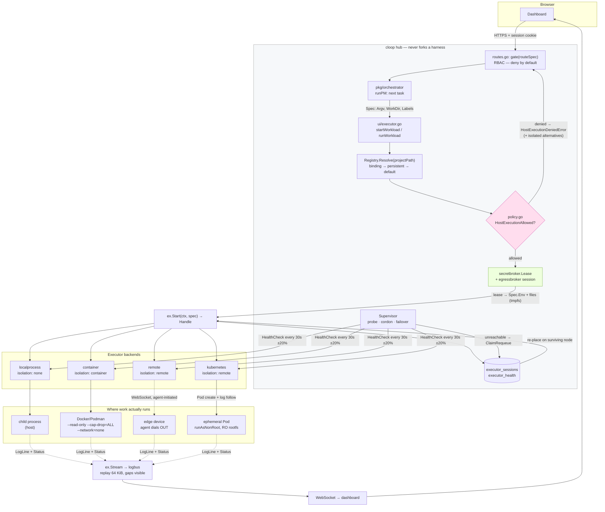
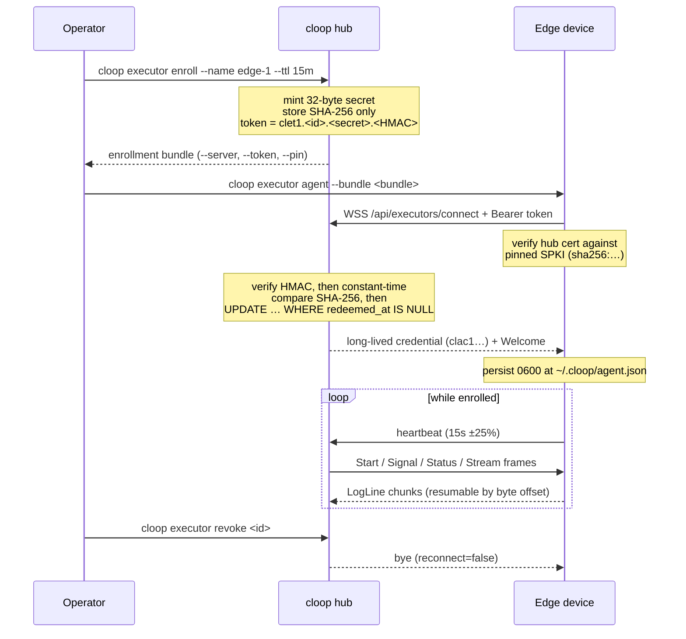

# Executor architecture

How a task travels from the orchestrator to a sandbox and back.

The central claim this architecture exists to make good on: **the hub never runs
a harness itself.** It resolves an executor, hands it a `Spec`, and reads back
lines. Everything below is the machinery that keeps that true across four very
different backends, a fleet that can lose nodes mid-task, and a control plane
that must not become the thing it is isolating.

- [The interface](#the-interface)
- [Backends](#backends)
- [Registry and binding](#registry-and-binding)
- [Placement](#placement)
- [Supervision, health and failover](#supervision-health-and-failover)
- [End to end](#end-to-end)
- [Remote agent enrollment](#remote-agent-enrollment)

---

## The interface

`pkg/executor/executor.go` defines one interface every backend implements:

```go
type Executor interface {
	ID() string                                                          // stable instance id
	Kind() string                                                        // driver name — a Kind* const
	Capabilities() Capabilities                                          // isolation, streaming, limits, platform
	Start(ctx context.Context, spec Spec) (Handle, error)                // launch; workload outlives ctx
	Signal(ctx context.Context, handleID string, sig Signal) error       // interrupt / terminate / kill
	Status(ctx context.Context, handleID string) (Status, error)         // point-in-time snapshot
	Stream(ctx context.Context, handleID string) (<-chan LogLine, error) // live output, replayed from start
	HealthCheck(ctx context.Context) error                               // can this node accept work?
}
```

Two properties of this interface are load-bearing and easy to get wrong:

**`ctx` governs the call, not the workload.** Cancelling the context passed to
`Start` aborts the act of starting; it does not kill what started. The Web UI
launches long-lived runs from short-lived HTTP handlers, so tying workload
lifetime to the request context would kill every run the moment its originating
request returned (`executor.go:311-319`). Callers that *do* want ctx-bound
lifetime use the `Run` helper, which wires cancellation to `SignalKill`.

**`Stream` replays.** Output produced between `Start` and `Stream` is buffered
and replayed (bounded, 64 KiB) so a subscriber cannot race the workload's first
writes. The channel never blocks the producer: when a subscriber's buffer fills,
chunks are dropped and the gap is visible as a jump in `LogLine.Seq`
(`internal/logbus`). Silent truncation would be worse than a visible gap.

### Spec, Handle, Status

| Type | Carries | Notes |
| --- | --- | --- |
| `Spec` | `WorkDir`, `Argv`, `Env`, `Labels`, `ResourceLimits`, `TimeoutMinutes` | `Argv` is never shell-quoted — there is no shell. `Env == nil` inherits the control plane's environment on `localprocess`, and means *empty* on `container`. |
| `Handle` | `ID`, `ExecutorID`, `PID`, `StartedAt` | `PID` is 0 where the concept is meaningless (Pods, remote agents). |
| `Status` | `State`, `ExitCode`, `Error` | States: `pending`, `running`, `exited`, `failed`, `killed`, `unknown`. |
| `LogLine` | `HandleID`, `Stream`, `Text`, `Time`, `Seq` | `Seq` gaps mean dropped chunks, not reordering. |

### Isolation

`Capabilities().Isolation` is what the host-execution policy reads, so it is a
security-relevant declaration, not a hint:

| Isolation | Meaning | Reported by |
| --- | --- | --- |
| `none` | shares the host's filesystem, network and user | `localprocess` |
| `container` | own filesystem and network namespace | `container` |
| `vm` | virtual machine or microVM | *(no backend yet)* |
| `remote` | a different machine entirely | `remote`, `kubernetes` |

---

## Backends

### `localprocess` — Kind `localprocess`, isolation `none`

Spawns child processes of the hub with `os/exec` at `Spec.WorkDir`. No
isolation: same user, same filesystem, same network. It reports a real OS PID,
which the UI's stop path relies on. It does not create a new process group, so
Ctrl-C at a terminal still reaches children. `TimeoutMinutes` is enforced with a
`time.AfterFunc` that sends SIGKILL.

This is the backend that [strict mode](../security/model.md#the-no-host-execution-guarantee)
exists to forbid. It remains the default for single-user local development,
where the hub and the workload are the same trust domain by definition.

### `container` — Kind `container`, isolation `container`

Shells out to the Docker or Podman CLI. The argv is built by a pure function,
`buildRunArgs` (`container/argv.go`), which is why the sandbox flags can be
[exhaustively tested](../security/model.md#the-guarantee-to-test-table) without a
runtime present. Forced on every invocation:

```
--pull=never  --cap-drop=ALL  --security-opt=no-new-privileges  --read-only
--tmpfs /tmp:rw,nosuid,nodev,exec,size=<N>m
--user <uid derived from the project directory owner>
--network=none              (unless an executor opts in)
--memory-swap == --memory   (swap pinned to the memory ceiling)
--workdir /cloop/work  --volume <project dir>:/cloop/work
```

Only the project directory is mounted. `--pull=never` means a cold image fails
immediately and loudly rather than pulling something unexpected at task time —
pre-pulling is the operator's job. Secrets are forwarded as bare `--env NAME`,
so the runtime reads the value from its own environment and it never appears in
the host process table. A denylist (`argv.go:371-393`) rejects operator-supplied
`ExtraArgs` that would undo any of this.

### `remote` — Kind `remote`, isolation `remote`

Runs on an enrolled edge device that dialled *out* to the hub over WebSocket, so
the device needs no inbound port and no static address. See
[Remote agent enrollment](#remote-agent-enrollment).

Handles are durable across disconnects: the hub names the handle, and after a
reconnect the agent resumes output at a byte offset rather than replaying from
zero. One `Executor` therefore spans many WebSocket sessions, and workloads
outlive the connection that started them. Agents heartbeat every 15 s (±25 %
jitter); three missed heartbeats mark the node unreachable (~45 s).

### `kubernetes` — Kind `kubernetes`, isolation `remote`

One ephemeral Pod per workload: `generateName`, `restartPolicy: Never`, no
long-lived identity. `Start` creates the Pod and returns; a watcher goroutine
follows phase transitions and opens the log API with `follow=true` once the Pod
is Running. `Signal` is Pod deletion — which means `SignalInterrupt` arrives in
the container as SIGTERM, because kubelet only ever sends TERM then KILL.

The Pod spec forces `runAsNonRoot`, a read-only root filesystem, all
capabilities dropped, `seccompProfile: RuntimeDefault`, and
`automountServiceAccountToken: false`. The kubeconfig comes from a
[secret broker lease](../guides/secrets.md#kubeconfig), is held in memory for the
handle's lifetime, renewed while running, and released on a terminal state — it
is never written to the hub's disk.

---

## Registry and binding

`pkg/executor/registry.go` answers one question: *which executor runs work for
this project?*

```
Registry.Resolve(projectPath)
  → in-memory binding      (Bind, set from the UI/CLI)
  → persistent lookup      (SetBindingLookup → statedb, survives restart)
  → default executor       (the first one registered, or SetDefault)
  → policy check           (refuse isolation=none under strict mode)
```

Project paths are canonicalised — absolute and `filepath.Clean`ed — but symlinks
are deliberately *not* resolved, because the binding must match what the
operator typed in the config, not where the filesystem happens to point today
(`registry.go:302-311`).

`Resolve` fails closed in both directions: an unknown project with no default is
an error, and a resolved executor that offers no isolation under strict mode is
a `*HostExecutionDeniedError` carrying the list of isolated alternatives so the
UI can render a fix rather than a dead end.

---

## Placement

`Registry.Resolve` picks the executor for a *project*. `pkg/executor/placement.go`
picks one for a *workload* out of a fleet — used on failover, and by any caller
that expresses requirements rather than a binding.

`Select(candidates []Candidate, req Requirements) (Candidate, error)` is a pure
function: no I/O, no clock, no registry. That is what makes fleet behaviour
testable.

A `Candidate` carries the executor plus its scheduling context: `Health`,
operator `Labels`, detected `Harnesses`, `ContainerRuntimes`, `MemoryMB`, and
in-flight count. `Requirements` can pin `ExecutorID`, demand `Labels`,
`Harnesses`, `Platform`/`Arch`, `MinMemoryMB`, `RequireIsolation`,
`AllowedIsolations`, and capability flags (`RequireStream`, `RequireSignal`,
`RequireContainerRuntime`, `RequireNetworkEgress`, `RequireResourceLimits`).

Ranking, applied as a stable sort:

1. Ready before degraded
2. More free capacity first — fills the fleet evenly rather than hot-spotting
3. Isolated before un-isolated — prefer a sandbox when both would satisfy
4. Executor ID alphabetically — deterministic tie-break

**There is no fallback.** When nothing matches, `Select` returns a
`*PlacementError` carrying the headline `Constraint`, a per-candidate
`Rejection` list, and how many candidates were considered. Constraints are
named: `health`, `host_policy`, `isolation`, `labels`, `platform`, `arch`,
`harness`, `container_runtime`, `network_egress`, `resource_limits`, `stream`,
`signal`, `memory`, `capacity`. An operator asking "why did nothing schedule?"
gets a per-node answer, not a shrug.

One subtlety worth knowing: a node that advertises *no* harnesses passes the
harness requirement. Empty means "detection failed", not "has none" — treating
it as a hard rejection would strand every node whose probe hadn't run yet.

---

## Supervision, health and failover

`pkg/executor/supervisor.go` runs the probe loop; `pkg/executor/health.go` holds
the state machine. The split matters: `ObserveProbe` is a pure fold of
(current health, probe result) → (new health, transition), so every timing rule
below is unit-testable without waiting for wall-clock time.

```
      probe ok                probe fails             probe fails
        │                    (DegradeAfter=1)       (UnreachableAfter=3)
        ▼                          ▼                       ▼
    ┌────────┐                ┌──────────┐           ┌──────────────┐
    │ ready  │ ─────────────▶ │ degraded │ ────────▶ │ unreachable  │
    └────────┘ ◀───────────── └──────────┘ ◀──────── └──────────────┘
        │  probe ok                                    │ in-flight work
        │                                              │ fails over
        │ operator                                     ▼
        ▼
   ┌──────────┐   drain    ┌──────────┐
   │ cordoned │ ─────────▶ │ draining │      uncordon → the state probes justify,
   └──────────┘            └──────────┘      not optimistically ready
```

| State | New work? | In-flight work? |
| --- | --- | --- |
| `ready` | yes | continues |
| `degraded` | yes, but ranked below ready | continues |
| `unreachable` | no | **failed over** |
| `cordoned` | no | continues untouched |
| `draining` | no | continues; the node is being retired |

Probes run every 30 s with ±20 % jitter, at most 8 concurrently, each bounded by
`ProbeTimeout`. A failing node backs off `5s × 2^(failures-1)`, capped at 5 min.
Probe results can move a node *into* an administrative state but never *out* of
one — only an operator's `uncordon` does that, and it lands the node in whatever
state the probes justify rather than assuming ready.

Operator commands: `cloop executor cordon|drain|uncordon|ls`. `drain` plus
`WaitForDrain` blocks until in-flight work reaches zero or the deadline expires,
returning the remaining count.

### Failover (Task 20162)

When a node transitions to `unreachable`, in-flight sessions move rather than
die. The tricky part is doing it exactly once: two supervisors, or one
supervisor racing its own retry, must not dispatch the same task twice.

```
transition → unreachable
  └─ SessionStore.RunningSessions(deadExecutorID)
       └─ for each session:
            ClaimRequeue(sessionID, claimToken, now)     ← atomic UPDATE … WHERE claim_token = ?
              │  token mismatch → ErrSessionClaimLost → return quietly (the guard worked)
              └─ placeReplacement: Select(pool minus dead node, requirementsFor(session))
                   │  no candidate → FailoverEvent.Err; task marked failed-with-retry
                   └─ FailoverHandler re-dispatches the persisted Spec verbatim
                        └─ EventSink.ExecutorFailover(ev)
```

The exactly-once latch is the **claim token**, rotated on every requeue. A
`Session` persists `ID`, `ExecutorID`, `HandleID`, `ProjectPath`, `TaskID`,
`ClaimToken`, `Attempt`, and the full `Spec`, which is why a replacement can be
dispatched verbatim to a different node. `ErrSessionClaimLost` is deliberately
not logged: it is the normal outcome of a race, and logging it would train
operators to ignore the log.

Sessions live in `executor_sessions`; health in `executor_health` (migrations
`0013`, `0014`), so both survive a hub restart.

---

## End to end



The call chain in code, for the common "start a run" path
(`pkg/ui/executor.go:216`):

```
startWorkload(workDir, argv, labels)
  registerBuiltinExecutors()
  executor.Resolve(workDir)              → Executor  |  *HostExecutionDeniedError
  acquireSecretLease(cpDir, workDir, id) → *secretLease        (pkg/ui/secrets.go:90)
  applyLease(uiSpec(...), lease)          → Spec with env + tmpfs file paths
  ex.Start(context.Background(), spec)    → Handle             (detached on purpose)
  openSessionFor(cpDir, ex, handle, spec) → session row        (makes failover possible)
  wipeLeaseOnExit(ex, handle, lease)      → waits for terminal state, then zeroes the lease dir
```

`runWorkload` (`executor.go:292`) is the synchronous sibling used for short
commands: it calls `executor.Run`, which ties workload lifetime to the caller's
context and collects combined output with a 4 MiB tail-heavy cap.

## Startup reconciliation

At boot, `bootstrapExecutors(dir)` runs in a fixed order that is itself a
safety property:

1. **apply the host-execution policy** — first, because registering before
   applying it would leave a window in which a host executor is schedulable;
2. **register the built-in host driver** — before the configured ones, so it
   stays the registry default on a permissive single-machine install. Under
   strict mode this registration is refused and the first isolating driver
   becomes the default instead;
3. **reconcile the configured drivers** — `reconcile.Bootstrap(dir, cfg, opts)`;
4. install the persistent binding lookup, sync the registry to the store, and
   only then start the supervisor.

Step 3 is `pkg/executor/reconcile`, and all three hosting entry points go
through it: `cloop ui`, `cloop serve`, and every CLI command via
`cmd/root.go`'s `PersistentPreRunE`. It cannot live in `pkg/executor` itself —
`pkg/config` imports the container and Kubernetes driver packages for their
`Options` types, so a `pkg/executor` that imported `pkg/config` would close an
import cycle.

Reconciliation reads `executors.container.*` and `executors.kubernetes.*`,
builds each enabled driver, runs its preflight, and records a **diagnostic**
per driver: `id`, `kind`, `status`, `registered`, `message`, `remediation`, and
the preflight checklist. Three statuses matter:

| Status | Registered? | Meaning |
| --- | --- | --- |
| `ok` | yes | built and preflight found nothing fatal |
| `degraded` | yes | built, but preflight found a fatal problem |
| `failed` | no | could not be built at all — no container runtime on PATH, no kubeconfig grant |

`degraded` staying registered is deliberate. Preflight is a point-in-time probe
of a remote system; a driver dropped because the cluster was restarting during
boot would stay gone until someone restarted the hub, which is worse than one
that reports the problem and lets the next dispatch retry.

`Bootstrap` registers synchronously and preflights in the background, because
the two halves have opposite latency budgets: registration must finish before
the listener opens (or `/readyz` would report a hub with no executors as ready
purely because bootstrap had not got there yet), while preflight is a runtime
round-trip that would make `cloop ui` look hung on a host with a wedged docker
daemon. Running both is safe because reconciliation is **idempotent** — a
driver already in the registry is reused rather than rebuilt, which matters
beyond tidiness for the Kubernetes driver, whose credential source opens a
state database it holds for the process's lifetime.

Diagnostics are surfaced in three places, so a failure cannot be silent:

- **startup logs**, one line per driver plus the remediation;
- **`GET /api/executors`**, as a `reconciliation` block and as per-card
  `reconcile_status` / `reconcile_remediation` fields. A `failed` driver has no
  registry entry and no `executors` row, so this is the *only* place it
  appears;
- **`/readyz`**, which reports `not_ready` with `"check": "executors"` when
  strict mode is on and no isolating executor is registered. That verdict is
  computed live rather than frozen at startup, so a hub becomes ready the
  moment an edge device enrolls.

---

## Remote agent enrollment

The inversion that makes edge devices practical: the hub never dials the device.
The device dials the hub, so it works behind NAT, behind a corporate firewall,
on a residential connection, with no inbound port and no static address.



Enrollment tokens are **single-use and time-bounded**: default TTL 15 min,
maximum 24 h, redeemed by an atomic `UPDATE … WHERE redeemed_at IS NULL` so that
two devices racing the same token cannot both end up with the identity
(`remote/enroll.go:273-336`). The token carries a truncated HMAC so a malformed
or tampered token is rejected by shape before it ever reaches the database. Only
SHA-256 hashes of the secret and of the subsequent credential are stored, so a
dump of the control plane's database does not yield a usable credential.

The agent reconnects with exponential backoff (1 s → 2 min, ±25 % jitter) and
never gives up on its own; only operator cancellation or a hub-side revocation
(`bye` with `reconnect=false`) ends the loop. Workloads confined beneath
`--workdir-root` survive reconnects.

Transport is covered in [the security model](../security/model.md#2-hub--remote-agent).

### Installing the agent as a service

`cloop executor agent --bundle …` runs in the foreground and installs nothing.
For a device you intend to keep, `cloop executor agent install` materialises the
whole deployment instead:

```bash
# On the device, as root. The bundle rides in the environment, not in argv.
CLOOP_ENROLL_BUNDLE='cloopenroll1.…' sudo -E cloop executor agent install

# Or fetch the bootstrap script from the hub (HTTPS only — see below).
CLOOP_ENROLL_BUNDLE='cloopenroll1.…' sh -c "$(curl -fsSL https://hub.example.com/install.sh)"
```

It writes two files and nothing else:

| Path | Mode | Contents |
| --- | --- | --- |
| `/etc/systemd/system/cloop-executor.service` | `0644` | the unit — **no credential** |
| `/var/lib/cloop-executor/enrollment` | `0600` | the enrollment bundle, owned by the service user |

The split is the point. A unit file is world-readable and `systemctl show`
prints `ExecStart` to any local user, so the token reaches the agent as a *path*
(`--token-file`) rather than as an argument. The agent deletes that file once
the token has been redeemed, after the long-lived credential is safely on disk —
a single-use secret should not survive into every later backup of the device.

The generated unit runs as a dedicated non-login system user with
`Restart=always`, `NoNewPrivileges=yes`, `ProtectSystem=strict`, `ProtectHome`,
`PrivateTmp`, `PrivateDevices`, `ProtectProc=invisible`, an empty
`CapabilityBoundingSet`, `RestrictAddressFamilies=AF_INET AF_INET6 AF_UNIX`,
`SystemCallFilter=@system-service` and `UMask=0077`, with the hub's SPKI pin
baked into `ExecStart`. `StateDirectory=` gives it exactly one writable
directory. A device that runs *container* workloads through the agent must drop
`PrivateDevices=` and `RestrictNamespaces=`; the unit says so in a comment where
the operator will find it.

Other outputs and flags:

| Flag | Effect |
| --- | --- |
| `--output docker` | a `podman run` command and a compose fragment with the equivalent confinement (`--cap-drop ALL`, `--read-only`, `--security-opt no-new-privileges`); the credential is a read-only bind mount, never `-e` |
| `--output shell` | a POSIX init script with a supervision loop, for devices with no systemd |
| `--dry-run` | prints the unit and the file list; writes nothing |
| `--uninstall` | reverses the install; idempotent, and verifies afterwards that no unit or credential survives |
| `--purge` | with `--uninstall`, also removes the agent's identity and workspaces |
| `--root <dir>` | stages the files for a golden image instead of installing them |
| `--no-start` | installs and enables without starting, for first-boot enrollment |

**`GET /install.sh`** serves the bootstrap script. It is gated on
`executor.manage` — the same permission as minting a token, since it discloses
the hub's URL and pin — and it **refuses to answer over plaintext HTTP** with a
`403`, no loopback exemption and no redirect. Its body is piped into a root
shell on a device that has not yet decided whom to trust, so anyone able to
rewrite it in flight owns the device. The URL and pin are rendered from the
request (honouring `X-Forwarded-Proto` / `X-Forwarded-Host`), because a hosted
hub's configured name is frequently not the one the operator reached. The script
carries no credential: it locates a `cloop` binary and hands off to
`cloop executor agent install`, where the hardening above actually lives.

---

## See also

- [Security model](../security/model.md) — what each boundary authenticates with
- [Threat model](../security/threat-model.md) — STRIDE per boundary
- [Secret and egress grants](../guides/secrets.md) — what a sandbox is given
- [Operator runbook](../operations/runbook.md) — backup, rotation, upgrade
