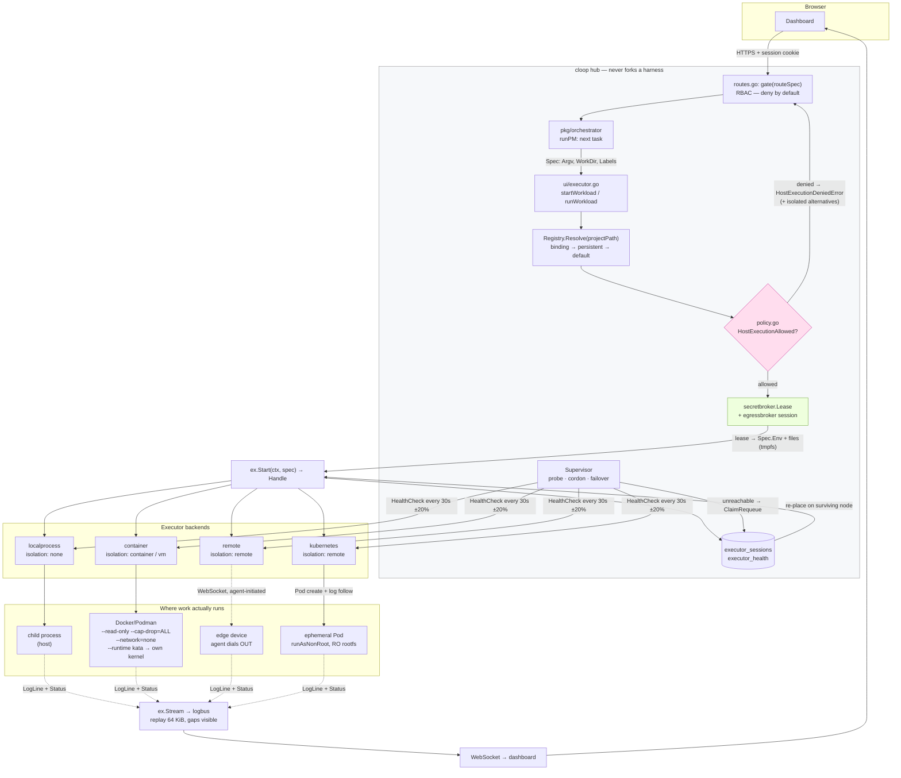
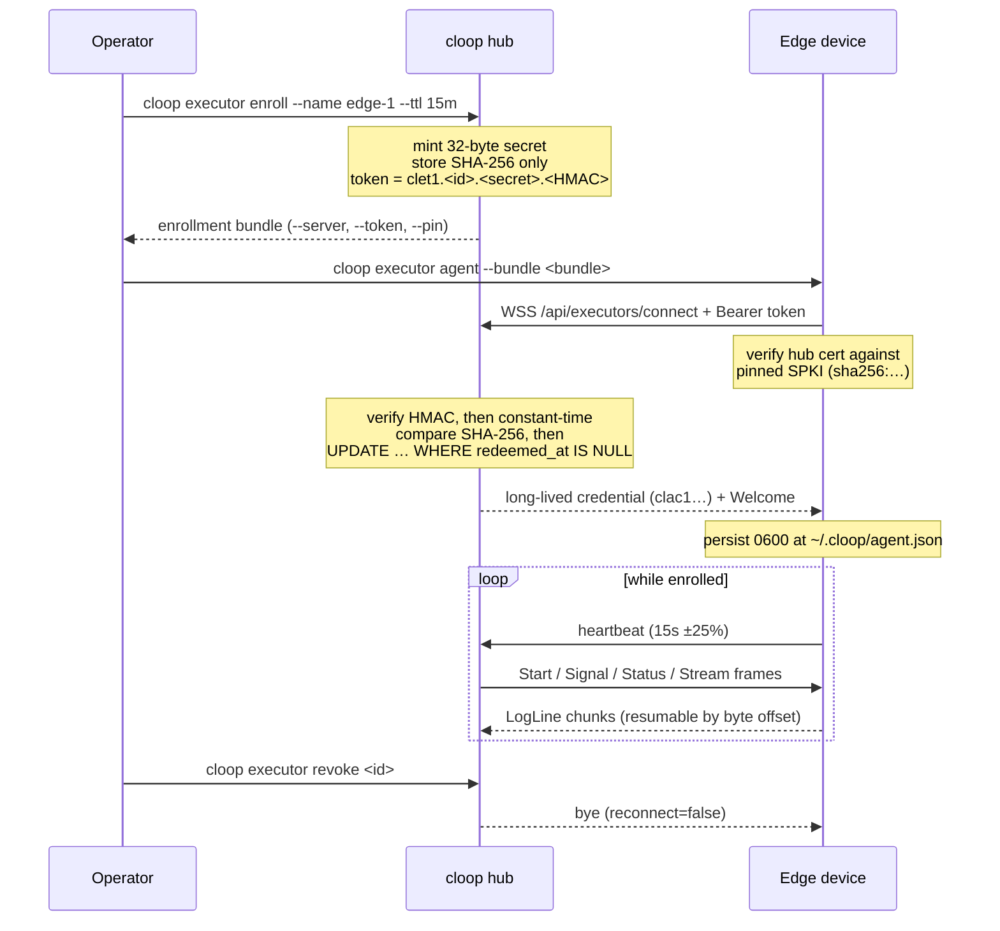

# Executor architecture

How a task travels from the orchestrator to a sandbox and back.

The central claim this architecture exists to make good on: **the hub never runs
a harness itself.** It resolves an executor, hands it a `Spec`, and reads back
lines. Everything below is the machinery that keeps that true across four very
different backends, a fleet that can lose nodes mid-task, and a control plane
that must not become the thing it is isolating.

- [The interface](#the-interface)
- [Backends](#backends)
- [Registry and binding](#registry-and-binding)
- [Placement](#placement)
- [Workspace provisioning](#workspace-provisioning)
- [Supervision, health and failover](#supervision-health-and-failover)
- [End to end](#end-to-end)
- [Remote agent enrollment](#remote-agent-enrollment)

---

## The interface

`pkg/executor/executor.go` defines one interface every backend implements:

```go
type Executor interface {
	ID() string                                                          // stable instance id
	Kind() string                                                        // driver name — a Kind* const
	Capabilities() Capabilities                                          // isolation, streaming, limits, platform
	Start(ctx context.Context, spec Spec) (Handle, error)                // launch; workload outlives ctx
	Signal(ctx context.Context, handleID string, sig Signal) error       // interrupt / terminate / kill
	Status(ctx context.Context, handleID string) (Status, error)         // point-in-time snapshot
	Stream(ctx context.Context, handleID string) (<-chan LogLine, error) // live output, replayed from start
	HealthCheck(ctx context.Context) error                               // can this node accept work?
}
```

Two properties of this interface are load-bearing and easy to get wrong:

**`ctx` governs the call, not the workload.** Cancelling the context passed to
`Start` aborts the act of starting; it does not kill what started. The Web UI
launches long-lived runs from short-lived HTTP handlers, so tying workload
lifetime to the request context would kill every run the moment its originating
request returned (`executor.go:311-319`). Callers that *do* want ctx-bound
lifetime use the `Run` helper, which wires cancellation to `SignalKill`.

**`Stream` replays.** Output produced between `Start` and `Stream` is buffered
and replayed (bounded, 64 KiB) so a subscriber cannot race the workload's first
writes. The channel never blocks the producer: when a subscriber's buffer fills,
chunks are dropped and the gap is visible as a jump in `LogLine.Seq`
(`internal/logbus`). Silent truncation would be worse than a visible gap.

### Spec, Handle, Status

| Type | Carries | Notes |
| --- | --- | --- |
| `Spec` | `WorkDir`, `Argv`, `Env`, `Labels`, `ResourceLimits`, `TimeoutMinutes` | `Argv` is never shell-quoted — there is no shell. `Env == nil` inherits the control plane's environment on `localprocess`, and means *empty* on `container`. |
| `Spec` (sandbox) | `Image`, `SetupCommands`, `Mounts`, `DisableNetwork`, `SandboxHash` | Derived from the project's [`.cloop/sandbox.yaml`](../reference/sandbox.md). `SandboxHash` records *which* spec produced this workload, so a run can be attributed to the file it was launched under. |
| `Spec` (credentials) | `Secrets`, `Workspace` | Neither holds material. `Secrets` is a `SecretBinding` list — which lease delivered which env names and file paths — so a `revoke` frame can take one credential back mid-run. `Workspace` names a *grant*, never a token. |
| `Handle` | `ID`, `ExecutorID`, `PID`, `StartedAt` | `PID` is 0 where the concept is meaningless (Pods, remote agents). |
| `Status` | `State`, `ExitCode`, `Error` | States: `pending`, `running`, `exited`, `failed`, `killed`, `unknown`. |
| `LogLine` | `HandleID`, `Stream`, `Text`, `Time`, `Seq` | `Seq` gaps mean dropped chunks, not reordering. |

The second and third rows share one property that is easy to lose in a refactor:
**a driver that cannot honour a field refuses the workload rather than dropping
it.** `Spec.SandboxRequirements()` is the single definition of what a given Spec
needs, and both entry points into "start a workload" — `Select` on the failover
path and `CheckSandboxSupport` on the binding path — run it through the same
matcher. A field added there is enforced in both places without anyone
remembering to add a second call.

A `Spec` is persisted by `pkg/executorstore` (so failover can re-dispatch it
verbatim), marshalled across the remote-agent boundary, and echoed into audit
rows. That is why credential material is structurally absent from it rather than
merely omitted by careful call sites: a token placed here would be durable in
three places before anything read it.

### Isolation

`Capabilities().Isolation` is what the host-execution policy reads, so it is a
security-relevant declaration, not a hint:

| Isolation | Meaning | Reported by |
| --- | --- | --- |
| `none` | shares the host's filesystem, network and user | `localprocess` |
| `container` | own filesystem and network namespace, **host kernel** | `container` on the CLI's default runtime (runc/crun) |
| `vm` | a virtual machine or microVM with **a kernel of its own** | `container` configured with a Kata `oci_runtime` |
| `remote` | a different machine entirely | `remote`, `kubernetes` |

### Virtualization is a second axis, not a fifth value

`Capabilities` carries a separate boolean, `Virtualized`, and the reason it is
not simply another `Isolation` value is the last row of that table. A Kata Pod
on a cluster is *both* remote — the machine is not the hub's — and virtualized —
the kernel is not the node's. `Isolation` is one enum field and can carry only
one of those two facts, and it is deliberately **not a total order** (a
container on this host and a process on a remote device are *differently*, not
more or less, isolated), so no single value could mean both without misstating
one of them. `Isolation` therefore keeps the fact a driver always has, and
`Virtualized` carries the one it sometimes adds:

| Driver | `Isolation` | `Virtualized` | Turned on by |
| --- | --- | --- | --- |
| `localprocess` | `none` | ❌ | — |
| `container`, default runtime | `container` | ❌ | — |
| `container`, Kata runtime | `vm` | ✅ | [`executors.container.oci_runtime`](../reference/configuration.md#vm-isolated-sandboxes-kata-containers) |
| `remote` | `remote` | ❌ | — |
| `kubernetes`, default class | `remote` | ❌ | — |
| `kubernetes`, Kata RuntimeClass | `remote` | ✅ | [`executors.kubernetes.runtime_class`](../reference/configuration.md#vm-isolated-sandboxes-kata-containers) |

Both drivers decide it from the configured runtime **name**, through one shared
matcher — `executor.IsVirtualizedRuntime` (`pkg/executor/virtualization.go`).
One definition rather than two because the two drivers are naming the same
technology in different vocabularies (an OCI runtime passed to `--runtime`, a
Kubernetes RuntimeClass), and a second copy would be a second chance for the
same sandbox to be described one way by the container driver and another by the
Kubernetes one.

The matcher is deliberately narrow: `kata`, `katacontainers`, any `kata-*` /
`kata.*` name, and the containerd shim spelling `io.containerd.kata.v2`.
Everything else is false. Being wrong here is asymmetric. A **false negative**
under-describes a sandbox — a Kata executor registered under an unrecognised
name is called a container, a project requiring virtualization is refused
placement on something that would have satisfied it, and the operator sees a
refusal they can fix by renaming. A **false positive** tells an operator a
workload runs behind a hypervisor when it shares the host kernel, and *places*
work that was required to be virtualized onto something that is not. So gVisor's
`runsc` reports false even though it is a genuinely stronger boundary than runc:
it is a userspace kernel, not a virtual machine, and calling it one would
misstate what an escape reaches.

The name is all either API exposes, which is a real limit — an operator can
register runc under the name `kata` and be believed. That is not a gap a name
matcher can close, and it is why the container driver's [preflight](#container--kind-container-isolation-container-or-vm)
separately proves the host can start a VM at all.

---

## Backends

### `localprocess` — Kind `localprocess`, isolation `none`

Spawns child processes of the hub with `os/exec` at `Spec.WorkDir`. No
isolation: same user, same filesystem, same network. It reports a real OS PID,
which the UI's stop path relies on. It does not create a new process group, so
Ctrl-C at a terminal still reaches children. `TimeoutMinutes` is enforced with a
`time.AfterFunc` that sends SIGKILL.

This is the backend that [strict mode](../security/model.md#the-no-host-execution-guarantee)
exists to forbid. It remains the default for single-user local development,
where the hub and the workload are the same trust domain by definition.

### `container` — Kind `container`, isolation `container` or `vm`

Shells out to the Docker or Podman CLI. The argv is built by a pure function,
`buildRunArgs` (`container/argv.go`), which is why the sandbox flags can be
[exhaustively tested](../security/model.md#the-guarantee-to-test-table) without a
runtime present. Forced on every invocation:

```
--pull=never  --cap-drop=ALL  --security-opt=no-new-privileges  --read-only
--tmpfs /tmp:rw,nosuid,nodev,exec,size=<N>m
--user <uid derived from the project directory owner>
--network=none              (unless an executor opts in)
--memory-swap == --memory   (swap pinned to the memory ceiling)
--workdir /cloop/work  --volume <project dir>:/cloop/work
```

Only the project directory is mounted. `--pull=never` means a cold image fails
immediately and loudly rather than pulling something unexpected at task time —
pre-pulling is the operator's job. Secrets are forwarded as bare `--env NAME`,
so the runtime reads the value from its own environment and it never appears in
the host process table. A denylist (`deniedExtraArgs` in `argv.go`) rejects operator-supplied
`ExtraArgs` that would undo any of this.

**Two runtime axes.** `executors.container.runtime` picks the *CLI* — podman or
docker. `executors.container.oci_runtime` picks what that CLI hands each
container to, emitted as `--runtime <name>` at the top of the Isolation section
of the argv. Empty means the CLI's own default (runc or crun) and no flag is
emitted at all, so the overwhelmingly common deployment produces a
byte-identical command line to before this field existed.

Naming a Kata runtime (`kata`, `kata-qemu`, `kata-clh`, `kata-runtime`) is what
makes this executor a **VM sandbox**: every container boots inside a lightweight
VM with its own kernel, so a kernel exploit reaches the guest and the host kernel
sits behind a hypervisor. It also changes what the flags *below* the `--runtime`
line are enforced by — under runc they are host-kernel features, under Kata they
are the guest's, applied inside a VM the host kernel never sees into. The
executor then reports `Isolation: vm` and `Virtualized: true`. Setup and
prerequisites: **[the Kata guide](../guides/kata.md)**.

The value is a **name and never a path**. A path here would be a path to a binary
that docker's daemon runs as root, so config that could name an arbitrary
executable would be config that executes arbitrary code as root — the same reason
the CLI itself is allow-listed. A bare name cannot do that: docker resolves it
only against `/etc/docker/daemon.json` and podman only against
`containers.conf`, both root-owned files the operator already controls, so the
name is an indirection through a trusted table rather than a target.
`ValidateOCIRuntime` therefore checks only the *shape* — no path separators, no
leading dash, letters/digits/`.`/`_`/`-`, at most 64 characters — because the set
of legitimate names is open (operators register Kata under whatever name they
like, and clusters do) and a fixed allow-list would reject working deployments.
The narrow judgement is reserved for the VM *claim*, above.

A malformed `oci_runtime` **disables the executor** rather than being cleared to
empty, and it is the only container key that behaves that way. Every other clamp
falls back to a driver default that confines at least as much as the rejected
setting; blanking a Kata runtime falls back to runc, which silently turns the VM
sandbox the operator asked for into a container one while the executor keeps
running and reporting success. A hub that comes up with one fewer executor is a
visible, diagnosable failure; a hub that comes up with a sandbox weaker than its
config describes is not (`clampContainerExecutor`, `pkg/config/executors.go`).

Preflight gains two checks when — and only when — an `oci_runtime` is set, since
a deployment on the CLI's default has nothing here to get wrong and an
always-green finding on every report buries the ones that matter:

| Check | Asks | On failure |
| --- | --- | --- |
| `oci-runtime` | is the name registered with the CLI that has to resolve it? | `fail` on docker, listing the runtimes it *does* have; `warn` on podman, which cannot be asked |
| `kvm` | does `/dev/kvm` exist **and open read-write**? (Kata runtimes only) | `fail`, pointing at nested virtualization or `kvm` group membership |

Only docker can answer the first: `docker info` carries the daemon's Runtimes
table, which is exactly the set `--runtime` resolves against. Podman resolves
against `containers.conf` and exposes only the *active* runtime, with no way to
enumerate the rest — so on podman the finding is a **warning** that the name is
unverified until the first run, never a failure. A probe that cannot distinguish
"absent" from "unenumerable" must not report "absent", because that turns a
working Kata deployment into a startup failure.

The KVM check opens the device rather than stat-ing it. `/dev/kvm` is mode 0660
`root:kvm` on most distributions, so a stat succeeds for a user who cannot use
it, and the failure that actually happens — a rootless podman user outside the
`kvm` group — is invisible to a stat and immediate on an open. Neither check can
prove a VM will boot; the smoke test that follows is what does, and it records
the `oci_runtime` it ran under in its result.

### `remote` — Kind `remote`, isolation `remote`

Runs on an enrolled edge device that dialled *out* to the hub over WebSocket, so
the device needs no inbound port and no static address. See
[Remote agent enrollment](#remote-agent-enrollment).

Handles are durable across disconnects: the hub names the handle, and after a
reconnect the agent resumes output at a byte offset rather than replaying from
zero. One `Executor` therefore spans many WebSocket sessions, and workloads
outlive the connection that started them. Agents heartbeat every 15 s (±25 %
jitter); three missed heartbeats mark the node unreachable (~45 s).

The device shares nothing with the hub, so it fetches the project's source tree
itself before starting the harness — see
[Workspace provisioning](#workspace-provisioning). That needs `git` on the
device and protocol v3; an agent below either is refused the *placement* rather
than trusted to notice.

### `kubernetes` — Kind `kubernetes`, isolation `remote`

One ephemeral Pod per workload: `generateName`, `restartPolicy: Never`, no
long-lived identity. `Start` creates the Pod and returns; a watcher goroutine
follows phase transitions and opens the log API with `follow=true` once the Pod
is Running. `Signal` is Pod deletion — which means `SignalInterrupt` arrives in
the container as SIGTERM, because kubelet only ever sends TERM then KILL.

The Pod spec forces `runAsNonRoot`, a read-only root filesystem, all
capabilities dropped, `seccompProfile: RuntimeDefault`, and
`automountServiceAccountToken: false`. The kubeconfig comes from a
[secret broker lease](../guides/secrets.md#kubeconfig), is held in memory for the
handle's lifetime, renewed while running, and released on a terminal state — it
is never written to the hub's disk.

There is no bind mount here, so `/workspace` starts empty and the source tree
arrives by way of a `workspace` init container — see
[Workspace provisioning](#workspace-provisioning). Anything that reads a
container status by name must therefore keep selecting `harness` rather than
"the only one".

`executors.kubernetes.runtime_class` sets `runtimeClassName` on every Pod, and
is how a **remote Kata sandbox** is requested: kube-scheduler places the Pod on
a node advertising that handler and the workload boots in a VM with a kernel of
its own, on a machine that is not the control plane's. Isolation stays `remote`
— that fact has not changed — and `Virtualized` becomes true alongside it. The
class must already exist in the cluster; cloop does not create one, and it is a
cluster-scoped object an operator installs with the Kata node pool. Because
those pools are conventionally tainted, this key normally appears with
`tolerations` and `node_selector`. The name is validated as an RFC 1123
subdomain at startup rather than at dispatch, so a typo is an error against the
config line that caused it instead of a 422 on somebody's first run
(`ValidateRuntimeClass`, `kubernetes/validate.go`).

Unlike the container driver there is **no preflight check** for it. A
RuntimeClass is a cluster-scoped object, and the hub holds a namespaced Role in
the workload namespace and nothing else — it cannot read one, by design. A
mis-set class therefore surfaces at dispatch, as a Pod that never runs and a
rejection naming the class it asked for.

---

## Sandbox network isolation

Two backends run workloads that have a network, and until recently neither
constrained what that network reached. The container driver's package comment
said *"it does not filter egress"* and meant it: `Network` was either `none` —
no interfaces at all — or a runtime network with unrestricted outbound access.
The Kubernetes driver set a `cloop.dev/egress` label and admitted beside it that
the label was documentation, because a Pod joins the pod network and no field in
a Pod spec takes that away. The
[egress broker](../reference/configuration.md#scoped-network-egress) bound a
workload that honoured `$HTTP_PROXY` and nothing else.

`pkg/netfilter` closes that with **one compiler and several renderers**.
`Compile` turns an authorisation into an ordered, first-match-wins `Policy`
ending in an implicit drop; the backends render that same `Policy` as an
`nft(8)` script or as a Kubernetes `NetworkPolicy`. `Evaluate` answers "what
would this policy do to that packet" with no backend at all, which is what lets
a test compare the filter against the proxy address-by-address rather than
trusting that two hand-written rule sets agree. The package depends on nothing
but the standard library, so every driver can reach it without dragging the
broker's storage and crypto along.

### `Capabilities.FilteredEgress`

```go
NetworkEgress  bool // can workloads reach the network at all?
FilteredEgress bool // is what they reach bounded by a policy cloop installs?
```

They are two fields because they answer two questions and conflating them loses
both. `NetworkEgress` says whether the workload has an interface, which is what
[placement](#placement) needs — `RequireNetworkEgress` and the `network_egress`
rejection reason read it. `FilteredEgress` says whether what it reaches through
that interface is constrained, which is what an operator auditing a fleet needs.
A sandbox can have the first without the second, and that combination is exactly
the thing worth being able to find.

`false` does not mean "nothing filters this". A cluster may run its own
`NetworkPolicy` and an operator may firewall the host; it means *cloop* is not
the thing doing it and will not claim credit for it. Both drivers report it from
their `egress_filter.enabled`.

What it does **not** report is whether the filter is effective. On Kubernetes a
`NetworkPolicy` is applied by the CNI, and whether the cluster runs one that
implements it is not something the API answers — so the field says what cloop
installed, and the preflight `egress` finding carries the caveat. Nothing in
placement requires the field; it is a report, not a constraint.

### The container driver: two mechanisms

Which one applies is decided by the *shape* of the authorisation rather than by
a separate switch. An `egress_filter` that names only `internal` gets the first;
one that names CIDRs, resolvers, a broker endpoint or the public Internet gets
both.

**An `--internal` runtime network.** The runtime installs no route off the
bridge, so nothing on it reaches the Internet at all. Put the egress broker on
the same network and it becomes the only way out — which is what turns the
broker's host allowlist from advisory into enforceable. This needs no
privileges, no `nft` and no `CAP_NET_ADMIN`, and it is the strongest option
because the layer-3 filter and the layer-7 allowlist then describe the same set.

**A host-side nftables ruleset scoped to the sandbox bridge**, for the case
where the authorisation names addresses the sandbox must dial directly — a
Kubernetes API server, an internal registry. The table is `inet` rather than a
separate `ip` and `ip6` pair, because two families mean two rulesets that can
drift and a v6 ruleset an operator forgot is the whole firewall bypassed by a
AAAA record. The script is fed to `nft -f -` on stdin, which nft commits as one
transaction: either the sandbox is filtered by the entire policy or the start
fails. `add table` / `delete table` / `table` makes a re-apply replace rather
than accumulate, which is the property a reconcile loop needs. Teardown of a
table that is already gone is success.

Two things about the bridge form are worth knowing before reading one:

- **Both the `forward` and the `input` hook carry the rules.** The routing
  decision picks the hook — destinations the host forwards on take `forward`,
  destinations belonging to the host itself take `input` — so a ruleset with
  only a `forward` chain filters the Internet and leaves the host wide open.
  See the [threat model](../security/threat-model.md#two-vulnerabilities-found-while-building-this).
- **The chain policy is `accept`, not `drop`.** Base chains on the same hook all
  run and a drop in any of them kills the packet, so a `policy drop` chain here
  would take down every other container on the host. Each chain instead returns
  immediately for traffic whose `iifname` is not this sandbox's bridge, and ends
  with an explicit `drop` that only packets from that bridge can reach.

**Why the filter is installed host-side rather than inside the namespace.** A
workload that starts before its filter exists has a window of unrestricted
egress. The obvious approach — start the container, find its PID, `nsenter` into
its namespace, install rules — has no ordering guarantee at all. Filtering on
the host side removes the window structurally: the bridge exists from the moment
the network is created, and network creation is strictly before any container
can join it, so the rules are always in place first. `installFirewall` runs
before the image is even resolved, and its failure fails the `Start` — producing
a working sandbox with none of the requested filtering, silently, is worse than
refusing to run.

The network is derived from the executor id (`cloop-sbx-<id>`), not accepted
from config, which stops two differently-filtered executors from pointing at one
bridge where the second apply would silently replace the first's rules. It also
means the policy is per executor: every sandbox that executor starts joins the
same bridge under the same ruleset. Enabling the filter makes the driver stop
using the configured `Network`, because an operator-named network could be
shared with workloads this executor does not manage and a default-deny ruleset
on their bridge would firewall them too.

### The Kubernetes driver: a NetworkPolicy per Pod

`RenderNetworkPolicy` translates the same compiled `Policy`, and the translation
is not mechanical, because the two models differ where it matters. A `Policy` is
ordered and has both verdicts; a `NetworkPolicy` is an unordered union of allows
with no deny rule at all. So the drops become `ipBlock.except` entries and the
ordering becomes set arithmetic: "allow the public Internet" becomes `0.0.0.0/0`
with every blocked prefix excepted, and "a granted CIDR waives the block that
covers it" becomes a second peer for that CIDR — peers are a union, so the
granted prefix is allowed even though the Internet peer excepts the range
containing it. Peers are grouped by port signature rather than emitted one per
rule, because within a single egress rule peers and ports form a cross product
and a granted CIDR on 6443 alongside the Internet on 443 would otherwise each
acquire the other's ports.

Three details follow from the object model rather than from the policy:

- The `podSelector` must match exactly the Pod it governs — an empty selector in
  Kubernetes means *every* Pod in the namespace — so the driver selects by the
  unique handle-id label and the renderer refuses an empty selector outright.
- `policyTypes` names `Ingress` with no ingress rules. Omitting the type would
  leave inbound ungoverned; naming it with no rules is what denies it.
- Cluster DNS is opened as a `namespaceSelector` on `kube-system`, not as an
  address. The Service ClusterIP is in private space and which side of the
  policy the CNI applies its DNAT on varies by CNI, so the selector is the form
  that works everywhere. It is on by default, because a default-deny egress
  policy without it breaks name resolution and that failure reads as "the
  network is broken" rather than "DNS is denied".

The namespace-local rules — the sandbox's own loopback — are dropped by this
renderer rather than emitted as a meaningless `127.0.0.0/8` peer, since a
`NetworkPolicy` never sees traffic that does not reach a wire.

What this renderer cannot promise is enforcement. A `NetworkPolicy` is inert
unless the cluster runs a CNI that implements it; flannel does not, and the API
server accepts the object regardless. That is a fact about the cluster which
cloop cannot read out of the API, so it is a standing `egress-enforcement`
preflight warning rather than a claim. Managing the objects also needs
`networkpolicies: [create delete list]` on the executor's Role, and preflight
lists them to prove the leased identity really has it — a `403` there is a
`fail`, because every `Start` will refuse rather than run a Pod with unfiltered
egress.

### Seeing what a policy compiles to

`cloop egress firewall` renders the policy without touching a host, in the same
text the driver installs — see
[the command reference](../reference/commands.md#cloop-egress-firewall). An
operator can diff it against `nft list table inet cloop_sbx_<id>` on the host or
`kubectl get netpol -o yaml` in a cluster, and `--check <addr:port>` answers the
one-address question with the verdict in the exit status.

---

## Registry and binding

`pkg/executor/registry.go` answers one question: *which executor runs work for
this project?*

```
Registry.Resolve(projectPath)
  → in-memory binding      (Bind, set from the UI/CLI)
  → persistent lookup      (SetBindingLookup → statedb, survives restart)
  → default executor       (the first one registered, or SetDefault)
  → policy check           (refuse isolation=none under strict mode)
```

Project paths are canonicalised — absolute and `filepath.Clean`ed — but symlinks
are deliberately *not* resolved, because the binding must match what the
operator typed in the config, not where the filesystem happens to point today
(`registry.go:302-311`).

`Resolve` fails closed in both directions: an unknown project with no default is
an error, and a resolved executor that offers no isolation under strict mode is
a `*HostExecutionDeniedError` carrying the list of isolated alternatives so the
UI can render a fix rather than a dead end.

---

## Placement

`Registry.Resolve` picks the executor for a *project*. `pkg/executor/placement.go`
picks one for a *workload* out of a fleet — used on failover, and by any caller
that expresses requirements rather than a binding.

`Select(candidates []Candidate, req Requirements) (Candidate, error)` is a pure
function: no I/O, no clock, no registry. That is what makes fleet behaviour
testable.

A `Candidate` carries the executor plus its scheduling context: `Health`,
operator `Labels`, detected `Harnesses`, `ContainerRuntimes`, `MemoryMB`, and
in-flight count. `Requirements` can pin `ExecutorID`, demand `Labels`,
`Harnesses`, `Platform`/`Arch`, `MinMemoryMB`, `RequireIsolation`,
`AllowedIsolations`, `RequireVirtualization`, and capability flags
(`RequireStream`, `RequireSignal`, `RequireContainerRuntime`,
`RequireNetworkEgress`, `RequireResourceLimits`, `RequireImageOverride`,
`RequireSandboxBuild`, `RequireSandboxMounts`, `RequireHostMounts`,
`RequireWorkspaceProvisioning`, `RequireHostFilesystemWorkspace`,
`RequireWriteBack`).

`RequireVirtualization` is separate from `AllowedIsolations` because it cuts
across it. Both a local Kata container (`vm`) and a Kata Pod on a cluster
(`remote`) satisfy it, and no set of `Isolation` values selects exactly those
two without also admitting every non-Kata remote executor that shares the second
one's value. It is checked against `Capabilities().Virtualized`, which is why
that field is false unless the driver is certain: a workload that must be behind
a hypervisor lands on one that is not the moment something claims otherwise.

`RequireImageOverride`, `RequireSandboxBuild` and `RequireSandboxMounts` come
from a project's
[`.cloop/sandbox.yaml`](../reference/sandbox.md). They exist so that a
per-project sandbox spec cannot be *silently* ignored: a project pinning
`image: rust:1.79` placed on a driver with no image concept would run against
whatever toolchain the host happens to have, produce a plausible-looking build
failure, and send its author hunting through their own code. Refusing placement
and naming the constraint points at the deployment instead. Every field a driver
can quietly drop has a flag that says whether it does.

`RequireHostMounts` is the same argument again, but the request comes from a
*grant* rather than from a repo-committed file: a
[`local_repo`](../guides/secrets.md#local-git-repositories) grant binds
directories from the control-plane host into the sandbox at `/repos`, and
`Capabilities().SupportsHostMounts` is whether this driver can do that at all.

| Driver | `SupportsHostMounts` | Why |
| --- | --- | --- |
| `container` | ✅ | it runs on the hub and has a mount namespace to bind into |
| `localprocess` | ❌ | shares the hub's filesystem, so there is nothing to bind — the granted repositories are already visible at their own paths |
| `kubernetes`, `remote` | ❌ | the workload runs on a machine that has never seen those files |

It is deliberately **not** implied by `SharesHostFilesystem`, and the middle row
is why the two are different answers rather than one: a driver needs both to run
here *and* to have a namespace to bind into, and `localprocess` has only the
first. A driver that ignored the field would start a harness whose `/repos` is
empty, which is the failure this constraint converts into a refusal that names
the grant and the binding.

`RequireWorkspaceProvisioning`, `RequireHostFilesystemWorkspace` and
`RequireWriteBack` are the same argument applied to the source tree, and the
first two pull in opposite directions: one demands a node that *can* fetch, the
other one that does not have to. `RequireWriteBack` asks whether the files the
task changed can be returned at all. See
[Workspace provisioning](#workspace-provisioning).

`CheckSandboxSupport(ex, req, projectPath)` runs the *bound* executor through
this same `reject()` as a candidate list of one, so a constraint added to
`Select` is enforced on the binding path for free rather than drifting from it.

Ranking, applied as a stable sort:

1. Ready before degraded
2. More free capacity first — fills the fleet evenly rather than hot-spotting
3. Isolated before un-isolated — prefer a sandbox when both would satisfy
4. Executor ID alphabetically — deterministic tie-break

**There is no fallback.** When nothing matches, `Select` returns a
`*PlacementError` carrying the headline `Constraint`, a per-candidate
`Rejection` list, and how many candidates were considered. Constraints are
named: `no_candidates`, `executor_id`, `health`, `host_execution_policy`,
`isolation`, `virtualization`, `labels`, `platform`, `arch`, `harness`,
`container_runtime`, `network_egress`, `resource_limits`, `stream`, `signal`,
`memory`, `capacity`, `image_override`, `sandbox_build`, `sandbox_mounts`,
`host_mounts`, `workspace`, `write_back`. An operator asking "why did nothing
schedule?" gets a per-node answer, not a shrug.

`virtualization` is the one whose message names the two config keys that fix it,
because the candidate is otherwise healthy and correct: it "shares the executing
machine's kernel", which is the normal state of a container or a plain Pod, and
the remedy is a line of hub configuration rather than anything about the node's
health, labels or capacity.

Two of those names describe the request rather than any node. `no_candidates`
means the registry was empty — nothing was rejected because there was nothing to
reject, which is a deployment problem and not a matching one. `executor_id`
means the workload was pinned to a specific executor and that executor was not
among the candidates; a pin is a statement about *where*, never a licence to run
on a node that is dead or that policy forbids, so a pinned workload is still
checked against every other constraint.

`workspace` is the one constraint `CheckSandboxSupport` deliberately does *not*
fold into a host-policy denial. Every other capability gap on an un-isolated
node reads as "bind this project to a sandbox"; here that advice is exactly
backwards, because the bound executor is already isolated and that is precisely
why it cannot see the tree.

One subtlety worth knowing: a node that advertises *no* harnesses passes the
harness requirement. Empty means "detection failed", not "has none" — treating
it as a hard rejection would strand every node whose probe hadn't run yet.

---

## Workspace provisioning

`Spec.WorkDir` names a directory. For a long time nothing said how the project's
source tree was supposed to get *into* it, and only one backend had an answer:
`container` bind-mounts the host path, so the tree was already there. Kubernetes
mounted an empty `emptyDir` — its own comment conceded the workload was
"expected to populate it" — and the remote agent `MkdirAll`'d a directory
beneath its root. Nothing populated either.

That is a bad failure because it does not look like one. The run starts cleanly,
the harness finds an empty directory, and the model writes a confident report
about a repository it never read. Nothing in the hub's view distinguishes it
from a real run — no error, no exit code, no missing artifact.

So every dispatched `Spec` now carries an explicit `Workspace`, and there are
exactly three answers to "where does the code come from":

| `Kind` | Meaning | Chosen when |
| --- | --- | --- |
| `bind` | the tree is already at `WorkDir`; the executor is looking at the same filesystem the hub is | `Capabilities().SharesHostFilesystem` |
| `git` | the executor fetches it before the harness starts | anything else, for a project-scoped workload |
| `none` | the workload genuinely wants an empty directory | the workload has no project at all (the voice handler runs `cloop listen --file …`) |

The zero value is `""` — *unspecified* — and leaves a driver's pre-existing
behaviour alone. It exists so a caller with no workspace concern (`cloop
executor test`, a smoke run) is not forced into a declaration it has no basis
for. `none` is not the same thing: it is a statement that an empty tree is
intended, which is what stops an empty tree being confused with the bug.

**A `bind` driver must never clone.** `WorkDir` on the container and host
drivers is the *operator's own checkout* — the working tree they have open in an
editor, with uncommitted changes in it. A provisioner that ran there would
`git init` over it, fetch, and check out a detached `FETCH_HEAD`, discarding
work that exists in exactly one place. This is why `SupportsWorkspaceProvisioning`
is `false` on those drivers as an *answer* rather than a gap, and why
`Workspace.Validate()` refuses a `bind` spec that also carries a `Repo`: a spec
with a harmless extra field and a spec whose author believes a clone will happen
are indistinguishable at the point where it matters.

### Per-driver matrix

| Driver | `SharesHostFilesystem` | `SupportsWorkspaceProvisioning` | Gets | How |
| --- | --- | --- | --- | --- |
| `localprocess` | ✅ | ❌ | `bind` | forks in the operator's own directory |
| `container` | ✅ | ❌ | `bind` | `--volume <project dir>:/cloop/work` |
| `kubernetes` | ❌ | ✅ | `git` | a `workspace` init container, before the harness container starts |
| `remote` | ❌ | ✅ *if* the device has `git` on `PATH` **and** speaks protocol ≥ 3 | `git` | a pre-step on the device, before it hands the Spec to its inner host driver |

Kubernetes reports `true` unconditionally, including when no secret broker is
wired in. What the capability advertises is that the driver *materialises the
tree* — which it does, with no broker at all, for a public repository. Gating it
on a credential source would refuse a public clone at placement time for want of
a credential it does not need; a missing grant deserves the typed error below,
not a message about a capability.

The remote row is the interesting one. An older agent would accept the start
frame, ignore the workspace, and run the harness in the empty directory it
created — the exact failure, on a machine the operator cannot see. So the hub
refuses the *dispatch* rather than trusting the device to complain, and the
refusal names the device and the upgrade.

### How the hub decides

`pkg/ui/workspace.go` is the single place a `Workspace` is chosen, and it runs
after the sandbox spec is applied and before dispatch. For a `git` workspace it
reads the project's own `.git/config` and `.git/HEAD` **without running git** —
`pkg/ui` may not spawn processes at all (a control plane that can fork can only
ever run work as itself), and `git remote get-url` would apply the *ambient*
configuration anyway: an `insteadOf` rewrite left on the hub by whoever last
touched it would silently choose a different clone URL.

- The origin remote is normalised to `https://`. The scp form every forge prints
  (`git@host:owner/name.git`) and `ssh://` URLs are rewritten; `http://`,
  `git://`, `file://` and bare local paths are refused by name. This is not a
  preference: the credential travels as an `Authorization` header, which over
  cleartext is a published token, and over ssh there is nothing the broker can
  lease at all.
- The ref is the branch `HEAD` points at. A detached `HEAD` yields an empty ref,
  which means the remote's default branch — the commit a hub happens to be
  parked on is not necessarily reachable by a fetch, and inventing a ref that
  then fails is a worse error than starting from the default.
- Userinfo in the URL is stripped rather than refused. The URL still names the
  right repository, and the grant is where the authority is supposed to come
  from.
- A project on a non-sharing executor with **no usable git remote** is refused,
  naming the project, the executor and both fixes (give the project an https
  remote, or bind it to an executor that shares the host filesystem). That
  refusal *is* the feature: the tree cannot be materialised, so the run must not
  start.

The grant is selected from broker *metadata* — `ListGrants` plus `ListSecrets` —
not by taking a lease. A lease unseals every matching payload and writes an
audit row per grant, and this decision needs one string: the grant's name. The
matching mirrors `LeaseFor` exactly (same requester shape, same active-grant
rule, same repository allowlist) because a grant chosen here that `LeaseFor`
would not produce is a Spec that fails at dispatch with a worse error. When
several grants admit the repository the newest wins, which is the one an
operator who has just created a grant expects.

Two cases fetch anonymously rather than refusing: a repository URL that is not
`owner/name` (a GitLab subgroup, say) cannot be matched against an allowlist at
all, so no grant could ever authorise it; and an install with no secret broker
configured has simply not adopted it yet. In both, a public repository works and
a private one fails inside the fetch with git's own authentication error —
neither outcome is a silent empty tree.

### The mechanism

Both drivers run the *same engine*, `pkg/executor/gitprovision`. Two
implementations of "how cloop clones a repo into a sandbox" would be two chances
to reintroduce the bug, and the second copy would drift silently — the symptom
of a drifted provisioner is a run that looks fine.

The plan is `git init` → `remote add` → `fetch` → `checkout --detach
FETCH_HEAD`, not `git clone`. `clone --branch` can only name a branch or a tag,
while a fetch can name any ref including a bare commit SHA; a provisioner that
worked for `main` and silently failed on a pinned commit is the sort of thing
discovered in production. `Workspace.GitPlan` renders that sequence as a pure
function — no I/O, no clock, no environment — which is what lets both callers
emit the same commands and lets a test assert on them without a git binary.

**Kubernetes** renders an init container named `workspace` whose argv is exactly
[`cloop workspace provision`](../reference/commands.md#cloop-workspace-provision).
Four choices there each had a plausible alternative:

- It uses the **harness image**, not a git image. A second image would need its
  own registry-allowlist entry, its own digest pin and its own trip through the
  [image trust policy](../reference/sandbox.md#image-trust-policy) — three places
  for the provenance of the thing that handles a credential to diverge from
  everything else.
- It provisions into `workDir`, not into `/workspace`. When a Spec puts the
  harness in a sub-directory of the workspace volume, cloning into the volume
  root would leave the harness's actual directory empty: the original bug, one
  level down.
- It does **not** inherit `Spec.Env`. The harness's environment carries brokered
  provider keys; a git fetch has no business with any of them, and the narrower
  the environment the fewer places a hostile repository's hooks can reach.
- Its `securityContext` is built by the same function as the harness's, so the
  two cannot drift. An init container with one capability more than the harness
  would be a way to do privileged work in a Pod that reads as hardened.

**The remote agent** runs the engine as a pre-step in `prepareWorkspace`, bounded
at 30 minutes (a first clone over an edge uplink is legitimately minutes; the
bound exists because a fetch stalled on a half-open connection would otherwise
hold a handle forever). Provisioning output goes into the workload's own
retained buffer, so it reaches the run's live log through the same
offset-acknowledged path as the harness's output — including across a reconnect.
Afterwards the agent rewrites the workspace to `bind` before handing the Spec to
its inner host driver, which is the literal truth at that point: the tree is now
on the machine that is about to run.

The engine also owns the parts a pure plan cannot express:

- **An existing checkout is reused, never re-initialised.** Same origin: fetch
  and check out, which is also much cheaper on a slow uplink. Different origin:
  a refusal naming both URLs, because re-cloning would discard whatever is
  there.
- **Rollback is asymmetric.** A failed provisioning removes the partial
  repository only if this machine created it; files that were in the directory
  beforehand are left alone, because deleting what we did not create is
  unrecoverable.
- **The size limit is enforced, not advertised.** `resources.disk` from
  [`.cloop/sandbox.yaml`](../reference/sandbox.md#resourcesdisk-and-the-workspace)
  is checked immediately after the fetch — the earliest point an oversized
  repository is visible — and again after the checkout. On a machine with no
  runtime quota there is nothing between the fetch and the filesystem except
  this check, and the disk being filled belongs to whoever owns the machine.
- **The environment is closed, not inherited.** A fetch that read the machine's
  `~/.gitconfig` could pick up a credential helper, an `insteadOf` rewrite
  pointing it at another host, or a proxy — all chosen by whoever last touched
  that box rather than by the grant. The one allowed exception is transport
  (`HTTPS_PROXY`, `NO_PROXY`, `SSL_CERT_FILE`, `GIT_SSL_CAINFO` and their
  siblings), because an edge device behind a corporate proxy with a private CA
  is precisely the machine that cannot otherwise clone, and none of those
  variables can name a repository or supply a credential. `GIT_SSL_NO_VERIFY` is
  pointedly absent.

Provisioning writes two audit rows of its own — `start` before the first byte
moves, `end` once, with the duration and the outcome — because it is the moment
a brokered credential is used against an external service, and the run's own
record cannot answer "which grant fetched which repository onto which executor".
Both rows name the grant and lease IDs; neither can carry material.

### The credential

Covered in full in [the security model](../security/model.md#workspace-provisioning).
The architectural shape: a `Spec` carries the *name* of a grant, the driver
dispatching the workload leases the material at the last possible moment, and it
reaches exactly one child process — the single `fetch` step, marked
`Authenticated` in the plan — as a URL-scoped `http.<base>.extraHeader` in its
environment.

A workspace whose fetch nobody can authorise fails with a typed
`*executor.WorkspaceGrantError` that names the repository, the grant and the
executor, and whose `Remediation()` prints the `cloop secret grant` command that
fixes it. The alternative — a bare "missing credential", or worse, a run against
an empty tree — is what this whole subsystem exists to remove. The Web UI
renders that remediation directly, as HTTP 409 `workspace_grant_missing`.

`Spec.Validate()` additionally refuses `Kind: git` together with
`DisableNetwork`. A tree that must be fetched and a workload forbidden from
reaching the network is a contradiction, and the failure it produces otherwise —
"could not resolve host", from a step nobody knew ran — points nowhere near the
two settings that caused it.

### Kubernetes RBAC consequence

The chart's executor Role gained two verbs: `create` and `delete` on `secrets`
in the workload namespace. Deliberately **not** `get`, `list` or `watch` — the
driver writes one Secret holding the brokered credential, points the init
container at it with a `secretKeyRef`, and deletes it as soon as that container
terminates. It never reads a Secret back, so it holds none of the read side.

It is worth being precise about why this does not widen the namespace's blast
radius, because it is the objection anyone reviewing the change will raise
first. With `pods: create` plus `pods/log: get` — both of which this identity
already had — any Secret in the namespace can already be read by mounting it
into a Pod and printing it. That is one `kubectl run` equivalent, and it was
true of every previous release of the chart. **The namespace has always been the
boundary**; `create` and `delete` on Secrets does not move it. What would move
it is a ClusterRole, or a rule in the release namespace where the hub's own
credentials live, and neither exists.

What the rule buys is that the credential never appears in a Pod spec. Without
it, the only ways to get a token into the init container are an `env` value or
an argv element, and both publish it to everyone with `get pods`, to every
`kubectl describe`, and to the API server's audit log. There is still no
`update` or `patch` on anything, so a compromised hub cannot rewrite a running
workload's spec or swap a credential under a Pod that has already started.

A hub without the rule fails at `Start` with a 403 that prints the exact YAML to
add. One honest gap: a control plane killed between creating the Secret and
observing the init container finish leaves the Secret behind, named
`cloop-ws-<handle>`. Nothing sweeps it, because sweeping needs `list secrets`.
The window is seconds and the material expires on the broker's own TTL
regardless, which is a better trade than holding read authority over every
Secret in the namespace forever.

---

## Supervision, health and failover

`pkg/executor/supervisor.go` runs the probe loop; `pkg/executor/health.go` holds
the state machine. The split matters: `ObserveProbe` is a pure fold of
(current health, probe result) → (new health, transition), so every timing rule
below is unit-testable without waiting for wall-clock time.

```
      probe ok                probe fails             probe fails
        │                    (DegradeAfter=1)       (UnreachableAfter=3)
        ▼                          ▼                       ▼
    ┌────────┐                ┌──────────┐           ┌──────────────┐
    │ ready  │ ─────────────▶ │ degraded │ ────────▶ │ unreachable  │
    └────────┘ ◀───────────── └──────────┘ ◀──────── └──────────────┘
        │  probe ok                                    │ in-flight work
        │                                              │ fails over
        │ operator                                     ▼
        ▼
   ┌──────────┐   drain    ┌──────────┐
   │ cordoned │ ─────────▶ │ draining │      uncordon → the state probes justify,
   └──────────┘            └──────────┘      not optimistically ready
```

| State | New work? | In-flight work? |
| --- | --- | --- |
| `ready` | yes | continues |
| `degraded` | yes, but ranked below ready | continues |
| `unreachable` | no | **failed over** |
| `cordoned` | no | continues untouched |
| `draining` | no | continues; the node is being retired |

Probes run every 30 s with ±20 % jitter, at most 8 concurrently, each bounded by
`ProbeTimeout`. A failing node backs off `5s × 2^(failures-1)`, capped at 5 min.
Probe results can move a node *into* an administrative state but never *out* of
one — only an operator's `uncordon` does that, and it lands the node in whatever
state the probes justify rather than assuming ready.

Operator commands: `cloop executor cordon|drain|uncordon|ls`. `drain` plus
`WaitForDrain` blocks until in-flight work reaches zero or the deadline expires,
returning the remaining count.

### Failover (Task 20162)

When a node transitions to `unreachable`, in-flight sessions move rather than
die. The tricky part is doing it exactly once: two supervisors, or one
supervisor racing its own retry, must not dispatch the same task twice.

```
transition → unreachable
  └─ SessionStore.RunningSessions(deadExecutorID)
       └─ for each session:
            ClaimRequeue(sessionID, claimToken, now)     ← atomic UPDATE … WHERE claim_token = ?
              │  token mismatch → ErrSessionClaimLost → return quietly (the guard worked)
              └─ placeReplacement: Select(pool minus dead node, requirementsFor(session))
                   │  no candidate → FailoverEvent.Err; task marked failed-with-retry
                   └─ FailoverHandler re-dispatches the persisted Spec verbatim
                        └─ EventSink.ExecutorFailover(ev)
```

The exactly-once latch is the **claim token**, rotated on every requeue. A
`Session` persists `ID`, `ExecutorID`, `HandleID`, `ProjectPath`, `TaskID`,
`ClaimToken`, `Attempt`, and the full `Spec`, which is why a replacement can be
dispatched verbatim to a different node. `ErrSessionClaimLost` is deliberately
not logged: it is the normal outcome of a race, and logging it would train
operators to ignore the log.

Sessions live in `executor_sessions`; health in `executor_health` (migrations
`0013`, `0014`), so both survive a hub restart.

---

## End to end



The call chain in code, for the common "start a run" path
(`pkg/ui/executor.go:216`):

```
startWorkload(workDir, argv, labels)
  registerBuiltinExecutors()
  executor.Resolve(workDir)              → Executor  |  *HostExecutionDeniedError
  acquireSecretLease(cpDir, workDir, id) → *secretLease        (pkg/ui/secrets.go:90)
  applyLease(uiSpec(...), lease)          → Spec with env + tmpfs file paths
  ex.Start(context.Background(), spec)    → Handle             (detached on purpose)
  openSessionFor(cpDir, ex, handle, spec) → session row        (makes failover possible)
  wipeLeaseOnExit(ex, handle, lease)      → waits for terminal state, then zeroes the lease dir
```

`runWorkload` (`executor.go:292`) is the synchronous sibling used for short
commands: it calls `executor.Run`, which ties workload lifetime to the caller's
context and collects combined output with a 4 MiB tail-heavy cap.

## Startup reconciliation

At boot, `bootstrapExecutors(dir)` runs in a fixed order that is itself a
safety property:

1. **apply the host-execution policy** — first, because registering before
   applying it would leave a window in which a host executor is schedulable;
2. **register the built-in host driver** — before the configured ones, so it
   stays the registry default on a permissive single-machine install. Under
   strict mode this registration is refused and the first isolating driver
   becomes the default instead;
3. **reconcile the configured drivers** — `reconcile.Bootstrap(dir, cfg, opts)`;
4. install the persistent binding lookup, sync the registry to the store, and
   only then start the supervisor.

Step 3 is `pkg/executor/reconcile`, and all three hosting entry points go
through it: `cloop ui`, `cloop serve`, and every CLI command via
`cmd/root.go`'s `PersistentPreRunE`. It cannot live in `pkg/executor` itself —
`pkg/config` imports the container and Kubernetes driver packages for their
`Options` types, so a `pkg/executor` that imported `pkg/config` would close an
import cycle.

Reconciliation reads `executors.container.*` and `executors.kubernetes.*`,
builds each enabled driver, runs its preflight, and records a **diagnostic**
per driver: `id`, `kind`, `status`, `registered`, `message`, `remediation`, and
the preflight checklist. Three statuses matter:

| Status | Registered? | Meaning |
| --- | --- | --- |
| `ok` | yes | built and preflight found nothing fatal |
| `degraded` | yes | built, but preflight found a fatal problem |
| `failed` | no | could not be built at all — no container runtime on PATH, no kubeconfig grant |

`degraded` staying registered is deliberate. Preflight is a point-in-time probe
of a remote system; a driver dropped because the cluster was restarting during
boot would stay gone until someone restarted the hub, which is worse than one
that reports the problem and lets the next dispatch retry.

`Bootstrap` registers synchronously and preflights in the background, because
the two halves have opposite latency budgets: registration must finish before
the listener opens (or `/readyz` would report a hub with no executors as ready
purely because bootstrap had not got there yet), while preflight is a runtime
round-trip that would make `cloop ui` look hung on a host with a wedged docker
daemon. Running both is safe because reconciliation is **idempotent** — a
driver already in the registry is reused rather than rebuilt, which matters
beyond tidiness for the Kubernetes driver, whose credential source opens a
state database it holds for the process's lifetime.

Diagnostics are surfaced in three places, so a failure cannot be silent:

- **startup logs**, one line per driver plus the remediation;
- **`GET /api/executors`**, as a `reconciliation` block and as per-card
  `reconcile_status` / `reconcile_remediation` fields. A `failed` driver has no
  registry entry and no `executors` row, so this is the *only* place it
  appears;
- **`/readyz`**, which reports `not_ready` with `"check": "executors"` when
  strict mode is on and no isolating executor is registered. That verdict is
  computed live rather than frozen at startup, so a hub becomes ready the
  moment an edge device enrolls.

---

## Remote agent enrollment

The inversion that makes edge devices practical: the hub never dials the device.
The device dials the hub, so it works behind NAT, behind a corporate firewall,
on a residential connection, with no inbound port and no static address.



Enrollment tokens are **single-use and time-bounded**: default TTL 15 min,
maximum 24 h, redeemed by an atomic `UPDATE … WHERE redeemed_at IS NULL` so that
two devices racing the same token cannot both end up with the identity
(`remote/enroll.go:273-336`). The token carries a truncated HMAC so a malformed
or tampered token is rejected by shape before it ever reaches the database. Only
SHA-256 hashes of the secret and of the subsequent credential are stored, so a
dump of the control plane's database does not yield a usable credential.

The agent reconnects with exponential backoff (1 s → 2 min, ±25 % jitter) and
never gives up on its own; only operator cancellation or a hub-side revocation
(`bye` with `reconnect=false`) ends the loop. Workloads confined beneath
`--workdir-root` survive reconnects.

**Paths do not cross the wire.** The hub's `Spec.WorkDir` is a directory on the
*hub*; an agent confines every workload beneath its own root and refuses an
absolute path from outside it, treating a workload's path as attacker-controlled
input from a control plane that might be compromised. So the caller that builds
the spec rewrites it — `executor.DeviceWorkDir` turns
`/var/lib/cloop/projects/api` into `api-9aef699b`, derived from the full path so
that two projects sharing a base name cannot collide on one device, and stable
across runs so the device keeps its clone instead of re-fetching every time. The
rewrite is on the hub side, next to the `SharesHostFilesystem` test that makes
the same judgement, and not in the driver: a driver that quietly remapped an
absolute path would also remap one a compromised hub aimed at `/etc`, turning
the agent's refusal into a silent redirect.

**Automated enrollment.** `cloop executor enroll --bundle-file <path>` writes the
bundle to a 0600 file instead of leaving it only in the printed command, for the
case where the same automation mints the token and starts the device — a compose
one-shot, cloud-init, an Ansible play. The agent reads it with `--token-file` and
deletes it once redeemed. `docker-compose.yml` does exactly this, and
`make e2e-stack` runs the result end to end: the hub comes up with nothing to
dispatch to and `/readyz` is red, the executor enrolls itself and it goes green,
then a real task runs on the device against a tree it fetched over HTTPS. See
[deploy/README.md](../../deploy/README.md).

Transport is covered in [the security model](../security/model.md#2-hub--remote-agent).

### Installing the agent as a service

`cloop executor agent --bundle …` runs in the foreground and installs nothing.
For a device you intend to keep, `cloop executor agent install` materialises the
whole deployment instead:

```bash
# On the device, as root. The bundle rides in the environment, not in argv.
CLOOP_ENROLL_BUNDLE='cloopenroll1.…' sudo -E cloop executor agent install

# Or fetch the bootstrap script from the hub (HTTPS only — see below).
CLOOP_ENROLL_BUNDLE='cloopenroll1.…' sh -c "$(curl -fsSL https://hub.example.com/install.sh)"
```

It writes two files and nothing else:

| Path | Mode | Contents |
| --- | --- | --- |
| `/etc/systemd/system/cloop-executor.service` | `0644` | the unit — **no credential** |
| `/var/lib/cloop-executor/enrollment` | `0600` | the enrollment bundle, owned by the service user |

The split is the point. A unit file is world-readable and `systemctl show`
prints `ExecStart` to any local user, so the token reaches the agent as a *path*
(`--token-file`) rather than as an argument. The agent deletes that file once
the token has been redeemed, after the long-lived credential is safely on disk —
a single-use secret should not survive into every later backup of the device.

The generated unit runs as a dedicated non-login system user with
`Restart=always`, `NoNewPrivileges=yes`, `ProtectSystem=strict`, `ProtectHome`,
`PrivateTmp`, `PrivateDevices`, `ProtectProc=invisible`, an empty
`CapabilityBoundingSet`, `RestrictAddressFamilies=AF_INET AF_INET6 AF_UNIX`,
`SystemCallFilter=@system-service` and `UMask=0077`, with the hub's SPKI pin
baked into `ExecStart`. `StateDirectory=` gives it exactly one writable
directory. A device that runs *container* workloads through the agent must drop
`PrivateDevices=` and `RestrictNamespaces=`; the unit says so in a comment where
the operator will find it.

Other outputs and flags:

| Flag | Effect |
| --- | --- |
| `--output docker` | a `podman run` command and a compose fragment with the equivalent confinement (`--cap-drop ALL`, `--read-only`, `--security-opt no-new-privileges`); the credential is a read-only bind mount, never `-e` |
| `--output shell` | a POSIX init script with a supervision loop, for devices with no systemd |
| `--dry-run` | prints the unit and the file list; writes nothing |
| `--uninstall` | reverses the install; idempotent, and verifies afterwards that no unit or credential survives |
| `--purge` | with `--uninstall`, also removes the agent's identity and workspaces |
| `--root <dir>` | stages the files for a golden image instead of installing them |
| `--no-start` | installs and enables without starting, for first-boot enrollment |

**`GET /install.sh`** serves the bootstrap script. It is gated on
`executor.manage` — the same permission as minting a token, since it discloses
the hub's URL and pin — and it **refuses to answer over plaintext HTTP** with a
`403`, no loopback exemption and no redirect. Its body is piped into a root
shell on a device that has not yet decided whom to trust, so anyone able to
rewrite it in flight owns the device. The URL and pin are rendered from the
request (honouring `X-Forwarded-Proto` / `X-Forwarded-Host`), because a hosted
hub's configured name is frequently not the one the operator reached. The script
carries no credential: it locates a `cloop` binary and hands off to
`cloop executor agent install`, where the hardening above actually lives.

---

## See also

- [Security model](../security/model.md) — what each boundary authenticates with
- [Threat model](../security/threat-model.md) — STRIDE per boundary
- [Secret and egress grants](../guides/secrets.md) — what a sandbox is given
- [Kata Containers](../guides/kata.md) — installing and verifying a VM sandbox
- [Operator runbook](../operations/runbook.md) — backup, rotation, upgrade
