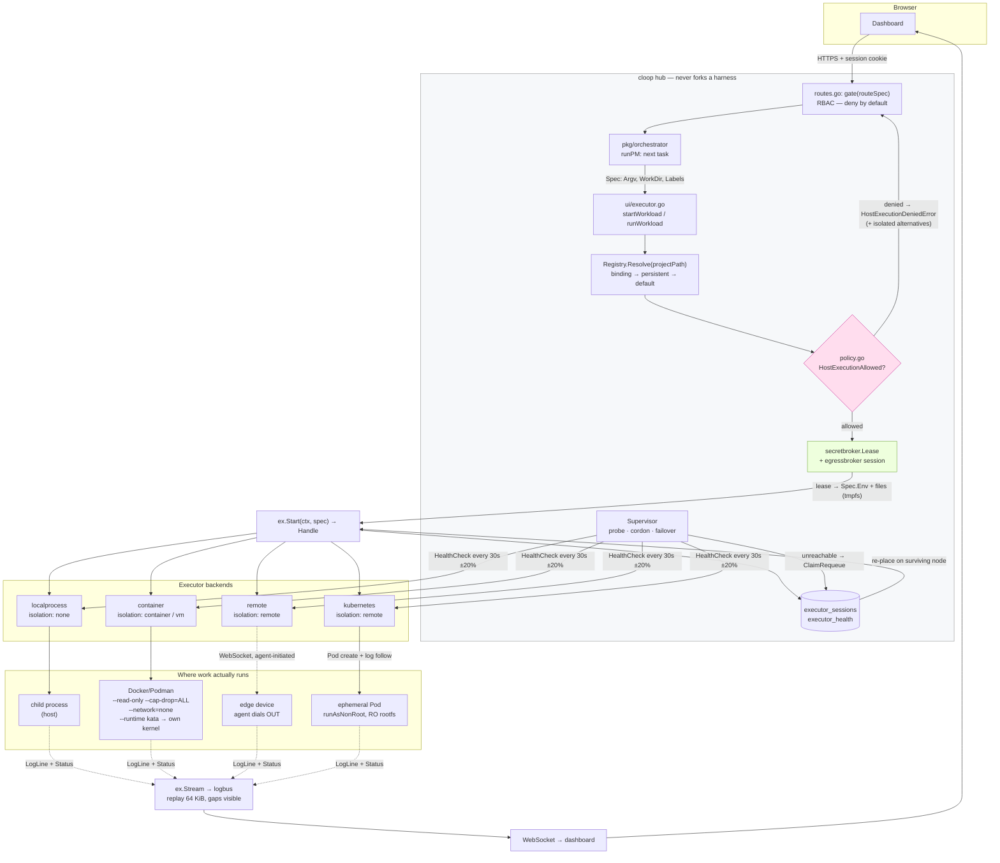
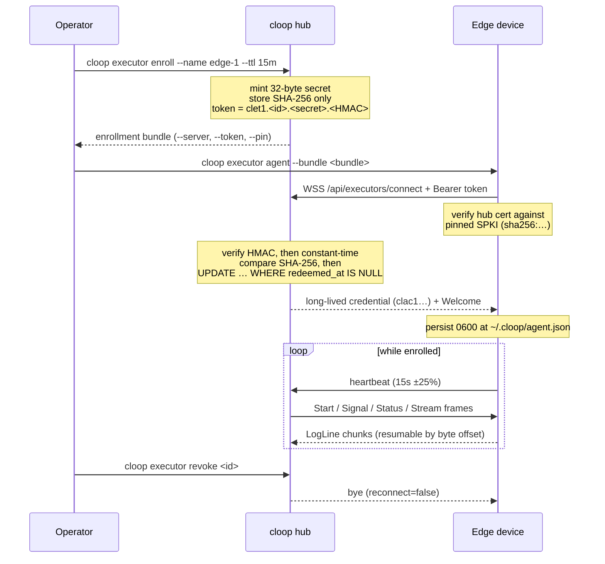

# Executor architecture

How a task travels from the orchestrator to a sandbox and back.

The central claim this architecture exists to make good on: **the hub never runs
a harness itself.** It resolves an executor, hands it a `Spec`, and reads back
lines. Everything below is the machinery that keeps that true across four very
different backends, a fleet that can lose nodes mid-task, and a control plane
that must not become the thing it is isolating.

- [The interface](#the-interface)
- [Backends](#backends)
- [Registry and binding](#registry-and-binding)
- [Placement](#placement)
- [Workspace provisioning](#workspace-provisioning)
- [Supervision, health and failover](#supervision-health-and-failover)
- [End to end](#end-to-end)
- [Remote agent enrollment](#remote-agent-enrollment)

---

## The interface

`pkg/executor/executor.go` defines one interface every backend implements:

```go
type Executor interface {
	ID() string                                                          // stable instance id
	Kind() string                                                        // driver name — a Kind* const
	Capabilities() Capabilities                                          // isolation, streaming, limits, platform
	Start(ctx context.Context, spec Spec) (Handle, error)                // launch; workload outlives ctx
	Signal(ctx context.Context, handleID string, sig Signal) error       // interrupt / terminate / kill
	Status(ctx context.Context, handleID string) (Status, error)         // point-in-time snapshot
	Stream(ctx context.Context, handleID string) (<-chan LogLine, error) // live output, replayed from start
	HealthCheck(ctx context.Context) error                               // can this node accept work?
}
```

Two properties of this interface are load-bearing and easy to get wrong:

**`ctx` governs the call, not the workload.** Cancelling the context passed to
`Start` aborts the act of starting; it does not kill what started. The Web UI
launches long-lived runs from short-lived HTTP handlers, so tying workload
lifetime to the request context would kill every run the moment its originating
request returned (`executor.go:311-319`). Callers that *do* want ctx-bound
lifetime use the `Run` helper, which wires cancellation to `SignalKill`.

**`Stream` replays.** Output produced between `Start` and `Stream` is buffered
and replayed (bounded, 64 KiB) so a subscriber cannot race the workload's first
writes. The channel never blocks the producer: when a subscriber's buffer fills,
chunks are dropped and the gap is visible as a jump in `LogLine.Seq`
(`internal/logbus`). Silent truncation would be worse than a visible gap.

### Spec, Handle, Status

| Type | Carries | Notes |
| --- | --- | --- |
| `Spec` | `WorkDir`, `Argv`, `Env`, `Labels`, `ResourceLimits`, `TimeoutMinutes` | `Argv` is never shell-quoted — there is no shell. `Env == nil` inherits the control plane's environment on `localprocess`, and means *empty* on `container`. |
| `Spec` (sandbox) | `Image`, `SetupCommands`, `Mounts`, `DisableNetwork`, `SandboxHash` | Derived from the project's [`.cloop/sandbox.yaml`](../reference/sandbox.md). `SandboxHash` records *which* spec produced this workload, so a run can be attributed to the file it was launched under. |
| `Spec` (credentials) | `Secrets`, `Workspace` | Neither holds material. `Secrets` is a `SecretBinding` list — which lease delivered which env names and file paths — so a `revoke` frame can take one credential back mid-run. `Workspace` names a *grant*, never a token. |
| `Handle` | `ID`, `ExecutorID`, `PID`, `StartedAt` | `PID` is 0 where the concept is meaningless (Pods, remote agents). |
| `Status` | `State`, `ExitCode`, `Error` | States: `pending`, `running`, `exited`, `failed`, `killed`, `unknown`. |
| `LogLine` | `HandleID`, `Stream`, `Text`, `Time`, `Seq` | `Seq` gaps mean dropped chunks, not reordering. |

The second and third rows share one property that is easy to lose in a refactor:
**a driver that cannot honour a field refuses the workload rather than dropping
it.** `Spec.SandboxRequirements()` is the single definition of what a given Spec
needs, and both entry points into "start a workload" — `Select` on the failover
path and `CheckSandboxSupport` on the binding path — run it through the same
matcher. A field added there is enforced in both places without anyone
remembering to add a second call.

A `Spec` is persisted by `pkg/executorstore` (so failover can re-dispatch it
verbatim), marshalled across the remote-agent boundary, and echoed into audit
rows. That is why credential material is structurally absent from it rather than
merely omitted by careful call sites: a token placed here would be durable in
three places before anything read it.

### Isolation

`Capabilities().Isolation` is what the host-execution policy reads, so it is a
security-relevant declaration, not a hint:

| Isolation | Meaning | Reported by |
| --- | --- | --- |
| `none` | shares the host's filesystem, network and user | `localprocess` |
| `container` | own filesystem and network namespace, **host kernel** | `container` on the CLI's default runtime (runc/crun) |
| `vm` | a virtual machine or microVM with **a kernel of its own** | `container` configured with a Kata `oci_runtime` |
| `remote` | a different machine entirely | `remote`, `kubernetes` |

### Virtualization is a second axis, not a fifth value

`Capabilities` carries a separate boolean, `Virtualized`, and the reason it is
not simply another `Isolation` value is the last row of that table. A Kata Pod
on a cluster is *both* remote — the machine is not the hub's — and virtualized —
the kernel is not the node's. `Isolation` is one enum field and can carry only
one of those two facts, and it is deliberately **not a total order** (a
container on this host and a process on a remote device are *differently*, not
more or less, isolated), so no single value could mean both without misstating
one of them. `Isolation` therefore keeps the fact a driver always has, and
`Virtualized` carries the one it sometimes adds:

| Driver | `Isolation` | `Virtualized` | `KernelIsolated` | Turned on by |
| --- | --- | --- | --- | --- |
| `localprocess` | `none` | ❌ | ❌ | — |
| `container`, default runtime | `container` | ❌ | ❌ | — |
| `container`, gVisor runtime | `container` | ❌ | ✅ | [`executors.container.oci_runtime`](../guides/enterprise-hosts.md#3-per-project-sandbox-with-gvisor) |
| `container`, Kata runtime | `vm` | ✅ | ✅ | [`executors.container.oci_runtime`](../reference/configuration.md#vm-isolated-sandboxes-kata-containers) |
| `remote` | `remote` | ❌ | ❌ | — |
| `kubernetes`, default class | `remote` | ❌ | ❌ | — |
| `kubernetes`, gVisor RuntimeClass | `remote` | ❌ | ✅ | [`executors.kubernetes.runtime_class`](../guides/enterprise-hosts.md#3-per-project-sandbox-with-gvisor) |
| `kubernetes`, Kata RuntimeClass | `remote` | ✅ | ✅ | [`executors.kubernetes.runtime_class`](../reference/configuration.md#vm-isolated-sandboxes-kata-containers) |

Both drivers decide it from the configured runtime **name**, through one shared
matcher — `executor.IsVirtualizedRuntime` (`pkg/executor/virtualization.go`).
One definition rather than two because the two drivers are naming the same
technology in different vocabularies (an OCI runtime passed to `--runtime`, a
Kubernetes RuntimeClass), and a second copy would be a second chance for the
same sandbox to be described one way by the container driver and another by the
Kubernetes one.

The matcher is deliberately narrow: `kata`, `katacontainers`, any `kata-*` /
`kata.*` name, and the containerd shim spelling `io.containerd.kata.v2`.
Everything else is false. Being wrong here is asymmetric. A **false negative**
under-describes a sandbox — a Kata executor registered under an unrecognised
name is called a container, a project requiring virtualization is refused
placement on something that would have satisfied it, and the operator sees a
refusal they can fix by renaming. A **false positive** tells an operator a
workload runs behind a hypervisor when it shares the host kernel, and *places*
work that was required to be virtualized onto something that is not. So gVisor's
`runsc` reports false even though it is a genuinely stronger boundary than runc:
it is a userspace kernel, not a virtual machine, and calling it one would
misstate what an escape reaches.

#### `KernelIsolated` is the third column, and the reason there is one

That last point used to end the discussion, and it left a gap. An operator running
gVisor got a sandbox described as a plain container — indistinguishable from runc —
so a project whose actual requirement was "my task's syscalls must not reach the
host kernel" had no way to ask for one, and `virtualized: true` *actively refused*
the gVisor executor that would have satisfied the intent. A refusal nobody needed
is still an outage.

Hence a second boolean and a second predicate, asking a deliberately different
question:

| Predicate | Question | True for |
| --- | --- | --- |
| `IsVirtualizedRuntime` | is there a hypervisor? | Kata |
| `IsKernelIsolatedRuntime` | are the workload's syscalls served by something other than the executing machine's kernel? | Kata **and** gVisor |

`Capabilities.KernelIsolated` is set from the second, so it is the **union** of
Kata and gVisor and a strict superset of `Virtualized`: virtualization implies
kernel isolation and not the reverse, and the gap between the two columns is
exactly gVisor. `runc` and `crun` are false in both, which is the case the field
exists to exclude — their boundary is namespaces, cgroups and seccomp, so a kernel
bug is a host bug.

It is a separate field rather than a widening of `Virtualized` because the two are
different promises and a project needs to be able to ask for the weaker one. A
`.cloop/sandbox.yaml` saying `capabilities: kernel_isolated: true` is satisfied by
either technology; `virtualized: true` demands a hypervisor and is checked against
the narrower field. Collapsing them in either direction breaks something: widening
`Virtualized` to include gVisor would tell an operator they have a VM when they do
not, and leaving `KernelIsolated` out forces every project with the weaker
requirement to over-ask and watch every `runsc` node in the fleet get rejected for
a property it had provided. The matching constraints are `virtualization` and
`kernel_isolation` — see [Placement](#placement).

Like `Virtualized`, `KernelIsolated` stays false unless the driver is certain,
because `RequireKernelIsolation` is checked against it and a false positive runs a
workload on the host kernel it was told to stay off. Both drivers read it from the
same configured runtime name through the same matcher, so the two claims are
consistent by construction: a name cannot be virtualized without also being
kernel-isolated. Note that `Isolation` stays `container` for gVisor even when
`KernelIsolated` is true, and the two do not conflict — gVisor is a container by
every structural measure that enum describes (namespaces, a cgroup, an image, no
VM). What it changes is *who executes the syscalls*, which is a different axis and
gets a field rather than a fifth enum value nothing else understands.

The name is all either API exposes, which is a real limit — an operator can
register runc under the name `kata` and be believed. That is not a gap a name
matcher can close, and it is why the container driver's [preflight](#container--kind-container-isolation-container-or-vm)
separately proves the host can start a VM at all.

---

## Backends

### `localprocess` — Kind `localprocess`, isolation `none`

Spawns child processes of the hub with `os/exec` at `Spec.WorkDir`. No
isolation: same user, same filesystem, same network. It reports a real OS PID,
which the UI's stop path relies on. It does not create a new process group, so
Ctrl-C at a terminal still reaches children. `TimeoutMinutes` is enforced with a
`time.AfterFunc` that sends SIGKILL.

This is the backend that [strict mode](../security/model.md#the-no-host-execution-guarantee)
exists to forbid. It remains the default for single-user local development,
where the hub and the workload are the same trust domain by definition.

### `container` — Kind `container`, isolation `container` or `vm`

Shells out to the Docker or Podman CLI. The argv is built by a pure function,
`buildRunArgs` (`container/argv.go`), which is why the sandbox flags can be
[exhaustively tested](../security/model.md#the-guarantee--test-table) without a
runtime present. Forced on every invocation:

```
--pull=never  --cap-drop=ALL  --security-opt=no-new-privileges  --read-only
--tmpfs /tmp:rw,nosuid,nodev,exec,size=<N>m
--user <uid derived from the project directory owner>
--network=none              (unless an executor opts in)
--memory-swap == --memory   (swap pinned to the memory ceiling)
--workdir /cloop/work  --volume <project dir>:/cloop/work
```

Only the project directory is mounted. `--pull=never` means a cold image fails
immediately and loudly rather than pulling something unexpected at task time —
pre-pulling is the operator's job. Secrets are forwarded as bare `--env NAME`,
so the runtime reads the value from its own environment and it never appears in
the host process table. A denylist (`deniedExtraArgs` in `argv.go`) rejects operator-supplied
`ExtraArgs` that would undo any of this.

**Two runtime axes.** `executors.container.runtime` picks the *CLI* — podman or
docker. `executors.container.oci_runtime` picks what that CLI hands each
container to, emitted as `--runtime <name>` at the top of the Isolation section
of the argv. Empty means the CLI's own default (runc or crun) and no flag is
emitted at all, so the overwhelmingly common deployment produces a
byte-identical command line to before this field existed.

Naming a Kata runtime (`kata`, `kata-qemu`, `kata-clh`, `kata-runtime`) is what
makes this executor a **VM sandbox**: every container boots inside a lightweight
VM with its own kernel, so a kernel exploit reaches the guest and the host kernel
sits behind a hypervisor. It also changes what the flags *below* the `--runtime`
line are enforced by — under runc they are host-kernel features, under Kata they
are the guest's, applied inside a VM the host kernel never sees into. The
executor then reports `Isolation: vm` and `Virtualized: true`. Setup and
prerequisites: **[the Kata guide](../guides/kata.md)**.

The value is a **name and never a path**. A path here would be a path to a binary
that docker's daemon runs as root, so config that could name an arbitrary
executable would be config that executes arbitrary code as root — the same reason
the CLI itself is allow-listed. A bare name cannot do that: docker resolves it
only against `/etc/docker/daemon.json` and podman only against
`containers.conf`, both root-owned files the operator already controls, so the
name is an indirection through a trusted table rather than a target.
`ValidateOCIRuntime` therefore checks only the *shape* — no path separators, no
leading dash, letters/digits/`.`/`_`/`-`, at most 64 characters — because the set
of legitimate names is open (operators register Kata under whatever name they
like, and clusters do) and a fixed allow-list would reject working deployments.
The narrow judgement is reserved for the VM *claim*, above.

A malformed `oci_runtime` **disables the executor** rather than being cleared to
empty, and it is the only container key that behaves that way. Every other clamp
falls back to a driver default that confines at least as much as the rejected
setting; blanking a Kata runtime falls back to runc, which silently turns the VM
sandbox the operator asked for into a container one while the executor keeps
running and reporting success. A hub that comes up with one fewer executor is a
visible, diagnosable failure; a hub that comes up with a sandbox weaker than its
config describes is not (`clampContainerExecutor`, `pkg/config/executors.go`).

Preflight gains two checks when — and only when — an `oci_runtime` is set, since
a deployment on the CLI's default has nothing here to get wrong and an
always-green finding on every report buries the ones that matter:

| Check | Asks | On failure |
| --- | --- | --- |
| `oci-runtime` | is the name registered with the CLI that has to resolve it? | `fail` on docker, listing the runtimes it *does* have; `warn` on podman, which cannot be asked |
| `kvm` | does `/dev/kvm` exist **and open read-write**? (Kata runtimes only) | `fail`, pointing at nested virtualization or `kvm` group membership |

Only docker can answer the first: `docker info` carries the daemon's Runtimes
table, which is exactly the set `--runtime` resolves against. Podman resolves
against `containers.conf` and exposes only the *active* runtime, with no way to
enumerate the rest — so on podman the finding is a **warning** that the name is
unverified until the first run, never a failure. A probe that cannot distinguish
"absent" from "unenumerable" must not report "absent", because that turns a
working Kata deployment into a startup failure.

The KVM check opens the device rather than stat-ing it. `/dev/kvm` is mode 0660
`root:kvm` on most distributions, so a stat succeeds for a user who cannot use
it, and the failure that actually happens — a rootless podman user outside the
`kvm` group — is invisible to a stat and immediate on an open. Neither check can
prove a VM will boot; the smoke test that follows is what does, and it records
the `oci_runtime` it ran under in its result.

### `remote` — Kind `remote`, isolation `remote`

Runs on an enrolled edge device that dialled *out* to the hub over WebSocket, so
the device needs no inbound port and no static address. See
[Remote agent enrollment](#remote-agent-enrollment).

Handles are durable across disconnects: the hub names the handle, and after a
reconnect the agent resumes output at a byte offset rather than replaying from
zero. One `Executor` therefore spans many WebSocket sessions, and workloads
outlive the connection that started them. Agents heartbeat every 15 s (±25 %
jitter); three missed heartbeats mark the node unreachable (~45 s).

The device shares nothing with the hub, so it fetches the project's source tree
itself before starting the harness — see
[Workspace provisioning](#workspace-provisioning). That needs `git` on the
device and protocol v3; an agent below either is refused the *placement* rather
than trusted to notice.

#### Where the payload runs on the device (Task 20307)

`isolation: remote` is a fact about the network, not about containment. It says
the workload is on another machine whose filesystem the hub cannot read — and it
says exactly that whether the device runs the harness in a container or as a
plain process with the agent's own privileges.

Until Task 20307 it was always the latter. The agent built one
`localprocess.Executor` and used it unconditionally, while its capability
detection reported the `docker`/`podman`/`nerdctl` binaries it had found on
`PATH` and the fleet card rendered them as chips. Nothing was lying on purpose;
there was simply no way for anyone to ask for a container, so "remote" was the
strongest true statement available.

It is now configurable per executor, by an admin, from the Executors panel
(**Sandbox** button) or `PUT /api/executors/{id}/sandbox`:

| Field | Meaning | Empty means |
| --- | --- | --- |
| `mode` | `host` or `container` | unset — the device behaves as it always did |
| `engine` | `docker`, `podman`, `nerdctl` | the device detects one |
| `runtime` | the `--runtime` name: `runc`, `crun`, `runsc`, `kata`… | the engine's default |
| `image` | the sandbox image | the executor's configured default |
| `network` | the container network: `none`, `bridge`, or one the operator created on the device | `none` |

`network` is the one field whose default is both correct and, for most real
projects, insufficient. Deny-by-default is right — a payload that cannot reach
the network cannot exfiltrate what it was given — but everything cloop brokers
is a *network service*: repositories arrive through the git interception proxy,
clusters through the Kubernetes access monitor, the Internet through the egress
broker, each addressed by URL. A container-mode executor left on `none` will be
granted credentials it has no way to spend, and the failure surfaces inside the
sandbox as `Could not resolve host` rather than at the hub as a refusal. Set it
to `bridge`, or to a network you created on the device that reaches the hub.

`host` is refused outright, along with `container:<id>`: both hand the payload
the network namespace the sandbox exists to take away, and with it every service
bound to that device's loopback.

The configuration lives in the control plane (`executor_sandbox`, migrations
0044 and 0047), not on the device, for the reason `project_executors` does: it is an
operator's policy *about* an executor rather than a fact belonging to it. A
device that stored its own containment setting could be asked by its own
operator to misreport it, and the hub would have no way to tell. Instead the hub
reads the row at dispatch and stamps it on every start frame
(`StartPayload.Sandbox`, protocol v8) — so an admin's change in the panel governs
the *next task*, with no agent restart and no window in which the device's idea
of its own containment differs from the control plane's.

Four refusals keep the setting a control rather than a hint. Each exists because
the failure it prevents is silent, useless, or both:

- **A pre-v8 agent is refused container-mode work.** It would not reject an
  unknown `sandbox` field; it would ignore it and run the harness on its host,
  reporting success. `ErrSandboxModeUnsupported`.
- **An unreadable configuration fails the dispatch.** "I could not read whether
  this executor is supposed to be contained" must not resolve to "run it on the
  host" — that is a containment decision made by a busy database, in the weaker
  direction, on a hub too unhealthy to notice. `ErrSandboxModeUnavailable`.
- **A device that cannot provide the configured containment fails the start.** No
  fallback to a host process. See `pkg/executor/agent/driver.go`, which extends
  the container driver's own rule — *an operator who configured a container
  executor and silently got host execution would believe they had an isolation
  boundary they do not have* — one machine further out.

- **A device that cannot start a VM is refused a Kata runtime.** Unlike the three
  above, this failure is loud — and useless with it. The payload arrives, Kata
  launches QEMU with `accel=kvm`, and roughly fifty seconds later the shim gives
  up with `timed out waiting for QMP ready: Connection refused`, naming neither
  KVM nor nested virtualization nor the executor. `ErrVirtualizationUnavailable`.

Only container mode is version-gated. Host and unset are what a pre-v8 agent does
anyway, so refusing those would strand a fleet mid-upgrade for nothing.

Capabilities follow the configuration *and* the device, which is what finally
makes a Kata edge device describable as one without making every other device
falsely describable as one. The runtime the hub names says what an admin asked
for; whether the machine can deliver it is a fact only the machine has, so since
protocol v9 the agent reports it (`AgentCapabilities.Virtualization`, an open of
`/dev/kvm`). `Virtualized` and `KernelIsolated` are reported only when the mode
is `container`, the live session can honour it, *and* — for a Kata runtime — the
device answered yes.

The three conditions fail in different directions on purpose. A runtime recorded
against host mode confines nothing. An executor must not advertise containment
its own `Start` would refuse. And a device with no `/dev/kvm` loses `Virtualized`
outright, because claiming a hypervisor that cannot exist is the false-positive
direction the runtime matcher is written to avoid; it loses `KernelIsolated` too
under Kata, whose isolation *is* the guest kernel, but keeps it under `runsc`,
whose Sentry never opens `/dev/kvm`. A pre-v9 agent is not demoted: absence of
the field is *unknown*, not *no*, and reading a zero value as a denial would
strand every Kata device already deployed.

Credential files follow the payload into the container. The agent writes a
lease's files into a directory it owns under `/dev/shm` and rewrites the
workload's environment onto that path; in container mode it additionally binds
that directory into the sandbox read-only, at the same path. Same path because
the broker baked it into `CLOOP_LEASE_DIR`, `GIT_CONFIG_GLOBAL` and `KUBECONFIG`
before the frame was sent, and the agent's own revocation index points at it —
remapping would break both. Without the bind the workload starts holding paths
that exist one namespace away, which git reports as `could not read Username`.

One operational note, because it is the first thing a container mode meets on a
small device: the driver refuses to run a workload as uid 0. Root inside a
container defeats `--cap-drop=ALL`, so a runtime escape becomes host root. The
sandbox user is derived from the workspace directory's owner, which means an agent
running as root with a root-owned `workdir_root` is refused with a message naming
the fix. The hardened service unit `cloop executor agent install` writes already
runs the agent as a dedicated unprivileged user, so a device onboarded that way
satisfies this without anyone thinking about it.

### `kubernetes` — Kind `kubernetes`, isolation `remote`

One ephemeral Pod per workload: `generateName`, `restartPolicy: Never`, no
long-lived identity. `Start` creates the Pod and returns; a watcher goroutine
follows phase transitions and opens the log API with `follow=true` once the Pod
is Running. `Signal` is Pod deletion — which means `SignalInterrupt` arrives in
the container as SIGTERM, because kubelet only ever sends TERM then KILL.

The Pod spec forces `runAsNonRoot`, a read-only root filesystem, all
capabilities dropped, `seccompProfile: RuntimeDefault`, and
`automountServiceAccountToken: false`. The kubeconfig comes from a
[secret broker lease](../guides/secrets.md#kubeconfig), is held in memory for the
handle's lifetime, renewed while running, and released on a terminal state — it
is never written to the hub's disk. This is the hub acting as itself, so it is
deliberately *not* routed through the
[Kubernetes access monitor](kubernetes-access.md): that monitor governs the
kubeconfigs delivered **into** a sandbox, and a read-only policy in front of this
one would stop the hub creating Pods at all.

There is no bind mount here, so `/workspace` starts empty and the source tree
arrives by way of a `workspace` init container — see
[Workspace provisioning](#workspace-provisioning). Anything that reads a
container status by name must therefore keep selecting `harness` rather than
"the only one".

`executors.kubernetes.runtime_class` sets `runtimeClassName` on every Pod, and
is how a **remote Kata sandbox** is requested: kube-scheduler places the Pod on
a node advertising that handler and the workload boots in a VM with a kernel of
its own, on a machine that is not the control plane's. Isolation stays `remote`
— that fact has not changed — and `Virtualized` becomes true alongside it. The
class must already exist in the cluster; cloop does not create one, and it is a
cluster-scoped object an operator installs with the Kata node pool. Because
those pools are conventionally tainted, this key normally appears with
`tolerations` and `node_selector`. The name is validated as an RFC 1123
subdomain at startup rather than at dispatch, so a typo is an error against the
config line that caused it instead of a 422 on somebody's first run
(`ValidateRuntimeClass`, `kubernetes/validate.go`).

Unlike the container driver there is **no preflight check** for it. A
RuntimeClass is a cluster-scoped object, and the hub holds a namespaced Role in
the workload namespace and nothing else — it cannot read one, by design. A
mis-set class therefore surfaces at dispatch, as a Pod that never runs and a
rejection naming the class it asked for.

---

## Sandbox network isolation

Two backends run workloads that have a network, and until recently neither
constrained what that network reached. The container driver's package comment
said *"it does not filter egress"* and meant it: `Network` was either `none` —
no interfaces at all — or a runtime network with unrestricted outbound access.
The Kubernetes driver set a `cloop.dev/egress` label and admitted beside it that
the label was documentation, because a Pod joins the pod network and no field in
a Pod spec takes that away. The
[egress broker](../reference/configuration.md#scoped-network-egress) bound a
workload that honoured `$HTTP_PROXY` and nothing else.

`pkg/netfilter` closes that with **one compiler and several renderers**.
`Compile` turns an authorisation into an ordered, first-match-wins `Policy`
ending in an implicit drop; the backends render that same `Policy` as an
`nft(8)` script or as a Kubernetes `NetworkPolicy`. `Evaluate` answers "what
would this policy do to that packet" with no backend at all, which is what lets
a test compare the filter against the proxy address-by-address rather than
trusting that two hand-written rule sets agree. The package depends on nothing
but the standard library, so every driver can reach it without dragging the
broker's storage and crypto along.

### `Capabilities.FilteredEgress`

```go
NetworkEgress  bool // can workloads reach the network at all?
FilteredEgress bool // is what they reach bounded by a policy cloop installs?
```

They are two fields because they answer two questions and conflating them loses
both. `NetworkEgress` says whether the workload has an interface, which is what
[placement](#placement) needs — `RequireNetworkEgress` and the `network_egress`
rejection reason read it. `FilteredEgress` says whether what it reaches through
that interface is constrained, which is what an operator auditing a fleet needs.
A sandbox can have the first without the second, and that combination is exactly
the thing worth being able to find.

`false` does not mean "nothing filters this". A cluster may run its own
`NetworkPolicy` and an operator may firewall the host; it means *cloop* is not
the thing doing it and will not claim credit for it. Both drivers report it from
their `egress_filter.enabled`.

What it does **not** report is whether the filter is effective. On Kubernetes a
`NetworkPolicy` is applied by the CNI, and whether the cluster runs one that
implements it is not something the API answers — so the field says what cloop
installed, and the preflight `egress` finding carries the caveat. Nothing in
placement requires the field; it is a report, not a constraint.

### The container driver: two mechanisms

Which one applies is decided by the *shape* of the authorisation rather than by
a separate switch. An `egress_filter` that names only `internal` gets the first;
one that names CIDRs, resolvers, a broker endpoint or the public Internet gets
both.

**An `--internal` runtime network.** The runtime installs no route off the
bridge, so nothing on it reaches the Internet at all. Put the egress broker on
the same network and it becomes the only way out — which is what turns the
broker's host allowlist from advisory into enforceable. This needs no
privileges, no `nft` and no `CAP_NET_ADMIN`, and it is the strongest option
because the layer-3 filter and the layer-7 allowlist then describe the same set.

**A host-side nftables ruleset scoped to the sandbox bridge**, for the case
where the authorisation names addresses the sandbox must dial directly — a
Kubernetes API server, an internal registry. The table is `inet` rather than a
separate `ip` and `ip6` pair, because two families mean two rulesets that can
drift and a v6 ruleset an operator forgot is the whole firewall bypassed by a
AAAA record. The script is fed to `nft -f -` on stdin, which nft commits as one
transaction: either the sandbox is filtered by the entire policy or the start
fails. `add table` / `delete table` / `table` makes a re-apply replace rather
than accumulate, which is the property a reconcile loop needs. Teardown of a
table that is already gone is success.

Two things about the bridge form are worth knowing before reading one:

- **Both the `forward` and the `input` hook carry the rules.** The routing
  decision picks the hook — destinations the host forwards on take `forward`,
  destinations belonging to the host itself take `input` — so a ruleset with
  only a `forward` chain filters the Internet and leaves the host wide open.
  See the [threat model](../security/threat-model.md#vulnerabilities-found-while-building-this).
- **The chain policy is `accept`, not `drop`.** Base chains on the same hook all
  run and a drop in any of them kills the packet, so a `policy drop` chain here
  would take down every other container on the host. Each chain instead returns
  immediately for traffic whose `iifname` is not this sandbox's bridge, and ends
  with an explicit `drop` that only packets from that bridge can reach.

**Why the filter is installed host-side rather than inside the namespace.** A
workload that starts before its filter exists has a window of unrestricted
egress. The obvious approach — start the container, find its PID, `nsenter` into
its namespace, install rules — has no ordering guarantee at all. Filtering on
the host side removes the window structurally: the bridge exists from the moment
the network is created, and network creation is strictly before any container
can join it, so the rules are always in place first. `installFirewall` runs
before the image is even resolved, and its failure fails the `Start` — producing
a working sandbox with none of the requested filtering, silently, is worse than
refusing to run.

The network is derived from the executor id (`cloop-sbx-<id>`), not accepted
from config, which stops two differently-filtered executors from pointing at one
bridge where the second apply would silently replace the first's rules. It also
means the policy is per executor: every sandbox that executor starts joins the
same bridge under the same ruleset. Enabling the filter makes the driver stop
using the configured `Network`, because an operator-named network could be
shared with workloads this executor does not manage and a default-deny ruleset
on their bridge would firewall them too.

### The Kubernetes driver: a NetworkPolicy per Pod

`RenderNetworkPolicy` translates the same compiled `Policy`, and the translation
is not mechanical, because the two models differ where it matters. A `Policy` is
ordered and has both verdicts; a `NetworkPolicy` is an unordered union of allows
with no deny rule at all. So the drops become `ipBlock.except` entries and the
ordering becomes set arithmetic: "allow the public Internet" becomes `0.0.0.0/0`
with every blocked prefix excepted, and "a granted CIDR waives the block that
covers it" becomes a second peer for that CIDR — peers are a union, so the
granted prefix is allowed even though the Internet peer excepts the range
containing it. Peers are grouped by port signature rather than emitted one per
rule, because within a single egress rule peers and ports form a cross product
and a granted CIDR on 6443 alongside the Internet on 443 would otherwise each
acquire the other's ports.

Three details follow from the object model rather than from the policy:

- The `podSelector` must match exactly the Pod it governs — an empty selector in
  Kubernetes means *every* Pod in the namespace — so the driver selects by the
  unique handle-id label and the renderer refuses an empty selector outright.
- `policyTypes` names `Ingress` with no ingress rules. Omitting the type would
  leave inbound ungoverned; naming it with no rules is what denies it.
- Cluster DNS is opened as a `namespaceSelector` on `kube-system`, not as an
  address. The Service ClusterIP is in private space and which side of the
  policy the CNI applies its DNAT on varies by CNI, so the selector is the form
  that works everywhere. It is on by default, because a default-deny egress
  policy without it breaks name resolution and that failure reads as "the
  network is broken" rather than "DNS is denied".

The namespace-local rules — the sandbox's own loopback — are dropped by this
renderer rather than emitted as a meaningless `127.0.0.0/8` peer, since a
`NetworkPolicy` never sees traffic that does not reach a wire.

What this renderer cannot promise is enforcement. A `NetworkPolicy` is inert
unless the cluster runs a CNI that implements it; flannel does not, and the API
server accepts the object regardless. That is a fact about the cluster which
cloop cannot read out of the API, so it is a standing `egress-enforcement`
preflight warning rather than a claim. Managing the objects also needs
`networkpolicies: [create delete list]` on the executor's Role, and preflight
lists them to prove the leased identity really has it — a `403` there is a
`fail`, because every `Start` will refuse rather than run a Pod with unfiltered
egress.

### Seeing what a policy compiles to

`cloop egress firewall` renders the policy without touching a host, in the same
text the driver installs — see
[the command reference](../reference/commands.md#cloop-egress-firewall). An
operator can diff it against `nft list table inet cloop_sbx_<id>` on the host or
`kubectl get netpol -o yaml` in a cluster, and `--check <addr:port>` answers the
one-address question with the verdict in the exit status.

---

## Registry and binding

`pkg/executor/registry.go` answers one question: *which executor runs work for
this project?*

```
Registry.Resolve(projectPath)
  → in-memory binding      (Bind, set from the UI/CLI)
  → persistent lookup      (SetBindingLookup → statedb, survives restart)
  → default executor       (the first one registered, or SetDefault)
  → policy check           (refuse isolation=none under strict mode)
```

Project paths are canonicalised — absolute and `filepath.Clean`ed — but symlinks
are deliberately *not* resolved, because the binding must match what the
operator typed in the config, not where the filesystem happens to point today
(`registry.go:302-311`).

`Resolve` fails closed in both directions: an unknown project with no default is
an error, and a resolved executor that offers no isolation under strict mode is
a `*HostExecutionDeniedError` carrying the list of isolated alternatives so the
UI can render a fix rather than a dead end.

### Who may use an executor

`Resolve` answers *which* executor, never *for whom* — it is handed a project
path and no identity, and it is called from contexts that legitimately have
none (the CLI, the failover supervisor, a scheduled run continuing after the
person who started it went home).

So an executor's access list is enforced one layer up, at the two HTTP requests
where a human actually chooses an executor:

| Request | Gate |
| --- | --- |
| `POST /api/projects/{idx}/executor` | refuses the binding |
| `POST /api/run` | refuses the run |

The run gate is the load-bearing one. An admin may narrow an access list after
a project was bound, and a binding made yesterday must not outlive the access
it was made under.

An executor with **no** access-list entries is unrestricted — which is every
executor until an admin adds the first one, and is what makes the feature a
no-op for existing deployments. Adding the first entry is the act that turns
the gate on, so the API refuses an add that would leave the calling admin
unable to use the executor they just restricted (`executor_audience_self_lockout`).

Entries are matched against OIDC claims by `pkg/authz`'s own binding matcher,
so a group path (`/platform-team`) and the bare name are interchangeable
exactly as they are in role bindings. Note that this is a *gate*, not a grant:
role bindings are additive and cannot express "everyone except", because the
permission being restricted is one the caller already holds fleet-wide.

Managing an executor and being allowed to use it are separate rights. An admin
can restrict a device they cannot themselves run work on; the panel says so
rather than letting them discover it at the next run.

### How much one workload may be given

Three ceilings compose, widest scope to narrowest, and each can only *lower*:

| Source | Set in | Answers |
| --- | --- | --- |
| `fleet` | `executors.limits` in config.yaml | what any workload on this hub may have |
| `executor` | `PUT /api/executors/{id}/limits` | what any workload **on this device** may have |
| `project` | per-project, operator-set | what this one project may have |

The executor ceiling exists because neither of the others can express it. The
fleet's applies everywhere, so writing the weakest device's capacity there holds
the whole fleet down to it; the project's is set before anyone knows which
executor the work will land on.

`BoundSpec(spec, projectPath, executorID)` applies all three and returns a
`Clamp` per reduction naming the source, so a developer told their run was
capped can tell whether to ask the hub admin, the device's admin, or nobody.
`pkg/executor/ceiling.go` documents why a ceiling never fills in a limit the
project left unset: doing so would convert "stated nothing" into "explicitly
requested the ceiling", which the drivers treat as more specific than their own
configured default — so the ceiling could *raise* an allowance.

---

## Placement

`Registry.Resolve` picks the executor for a *project*. `pkg/executor/placement.go`
picks one for a *workload* out of a fleet — used on failover, and by any caller
that expresses requirements rather than a binding.

`Select(candidates []Candidate, req Requirements) (Candidate, error)` is a pure
function: no I/O, no clock, no registry. That is what makes fleet behaviour
testable.

A `Candidate` carries the executor plus its scheduling context: `Health`,
operator `Labels`, detected `Harnesses`, `ContainerRuntimes`, `MemoryMB`, and
in-flight count. `Requirements` can pin `ExecutorID`, demand `Labels`,
`Harnesses`, `Platform`/`Arch`, `MinMemoryMB`, `RequireIsolation`,
`AllowedIsolations`, `RequireVirtualization`, `RequireKernelIsolation`, and
capability flags (`RequireStream`, `RequireSignal`, `RequireContainerRuntime`,
`RequireNetworkEgress`, `RequireResourceLimits`, `RequireImageOverride`,
`RequireSandboxBuild`, `RequireSandboxMounts`, `RequireHostMounts`,
`RequireDevices`, `RequireEgressScope`, `RequireWorkspaceProvisioning`,
`RequireHostFilesystemWorkspace`, `RequireWriteBack`).

`RequireVirtualization` is separate from `AllowedIsolations` because it cuts
across it. Both a local Kata container (`vm`) and a Kata Pod on a cluster
(`remote`) satisfy it, and no set of `Isolation` values selects exactly those
two without also admitting every non-Kata remote executor that shares the second
one's value. It is checked against `Capabilities().Virtualized`, which is why
that field is false unless the driver is certain: a workload that must be behind
a hypervisor lands on one that is not the moment something claims otherwise.

`RequireImageOverride`, `RequireSandboxBuild` and `RequireSandboxMounts` come
from a project's
[`.cloop/sandbox.yaml`](../reference/sandbox.md). They exist so that a
per-project sandbox spec cannot be *silently* ignored: a project pinning
`image: rust:1.79` placed on a driver with no image concept would run against
whatever toolchain the host happens to have, produce a plausible-looking build
failure, and send its author hunting through their own code. Refusing placement
and naming the constraint points at the deployment instead. Every field a driver
can quietly drop has a flag that says whether it does.

`RequireHostMounts` is the same argument again, but the request comes from a
*grant* rather than from a repo-committed file: a
[`local_repo`](../guides/secrets.md#local-git-repositories) grant binds
directories from the control-plane host into the sandbox at `/repos`, and
`Capabilities().SupportsHostMounts` is whether this driver can do that at all.

| Driver | `SupportsHostMounts` | Why |
| --- | --- | --- |
| `container` | ✅ | it runs on the hub and has a mount namespace to bind into |
| `localprocess` | ❌ | shares the hub's filesystem, so there is nothing to bind — the granted repositories are already visible at their own paths |
| `kubernetes`, `remote` | ❌ | the workload runs on a machine that has never seen those files |

It is deliberately **not** implied by `SharesHostFilesystem`, and the middle row
is why the two are different answers rather than one: a driver needs both to run
here *and* to have a namespace to bind into, and `localprocess` has only the
first. A driver that ignored the field would start a harness whose `/repos` is
empty, which is the failure this constraint converts into a refusal that names
the grant and the binding.

`RequireDevices` and `RequireEgressScope` are the same argument for the two
capabilities that are about what the *host* can do rather than what the transport
can carry. `Capabilities().SupportsDevices` is whether a driver can expose a host
device node inside the sandbox, which a
[`host_device`](../guides/secrets.md#host-devices) grant asks for;
`Capabilities().SupportsEgressScope` is whether it can confine one workload's
IP-layer egress *independently of the other workloads on the same executor*, which
`capabilities.egress` in a project's
[`.cloop/sandbox.yaml`](../reference/sandbox.md) asks for.

| Driver | `SupportsDevices` | `SupportsEgressScope` | Why |
| --- | --- | --- | --- |
| `container` | ✅ | ✅ | it runs on the machine with the hardware and the runtime takes `--device`; and a scope gets a bridge and an nftables table of its own, which this driver provisions |
| `kubernetes` | ❌ | ⚠️ once enforcement is proven | Kubernetes takes no device paths — a device plugin hands the container whichever unit it has free. Egress *is* confined per run, by a `NetworkPolicy` selecting one Pod by its unique handle-id label — but a `NetworkPolicy` is applied by the cluster's CNI, so the capability is advertised only once enforcement is [proven or asserted](#does-the-cluster-actually-enforce-a-networkpolicy) |
| `remote` | ❌ | ❌ | a device path names the *hub's* host, and the agent runs each workload as a plain process, so there is neither a sandbox to put a device into nor a per-workload network namespace to filter |
| `localprocess` | ❌ | ❌ | the workload is a process in the hub's own namespaces: every device the hub user can open is already open to it, and confining its egress would mean filtering the control plane's own traffic |

Two notes on why these are refusals rather than best-effort.

`SupportsDevices` is not implied by `SupportsHostMounts`, because a device is not
a file a driver can bind and be done with: a container runtime needs a cgroup rule
permitting the `major:minor` pair as well as the node itself, and the Kubernetes
driver needs the node to advertise the hardware at all. `HostDevice` carries a
`KubernetesResource` field for the extended-resource shape that driver would need;
it is deliberately unconsumed rather than approximated with a `hostPath`, since
mounting `/dev/nvidia0` from whatever node the scheduler picked would expose an
unrelated piece of *that* node's hardware — worse than refusing. A driver that
dropped the field would produce a sandbox whose `/dev` is missing exactly the
hardware the task exists to talk to.

`SupportsEgressScope` cannot be best-effort for a sharper reason: its absence is
silent *and* over-permissive. An executor that ignored a project's request to be
cut off from private address space would hand the harness the reach into the
operator's internal network the project had explicitly renounced, and report
success doing it. `container` advertises it unconditionally rather than gating on
`egress_filter.enabled`, because the whole point of a scope is that a project can
ask to be confined on an executor whose default is unfiltered; a host without
`nft(8)` fails at install time with a message naming it.

### Does the cluster actually enforce a NetworkPolicy?

The Kubernetes driver is the one case where cloop does everything right and the
result can still be nothing.

`pkg/executor/kubernetes/networkpolicy.go` compiles a `NetworkPolicy` per run
from the same `pkg/netfilter` policy the container driver's nftables ruleset is
compiled from, selecting that Pod alone by its unique `cloop.dev/handle-id`
label, and `Start` creates it *before* the Pod it governs — a Pod that started
first would have a window of unfiltered egress, and a window is all an
exfiltration needs.

None of that matters if the cluster's CNI does not implement `NetworkPolicy`.
flannel is the well-known case: the API server validates the object, persists
it, returns `201`, and nothing ever reads it. `kubectl get netpol` lists a
firewall that does not exist. **The Kubernetes API cannot be asked which case you
are in**, so cloop refuses to guess:

| Evidence | Status | `SupportsEgressScope` |
| --- | --- | --- |
| nothing | `unverified` | ❌ — placement refuses, naming the probe |
| `network_policy_enforced: true` | `asserted` | ✅ on the operator's word |
| a probe proved it | `proven` | ✅ |
| a probe refuted it | `refuted` | ❌ — and preflight reports a **fail** |
| `network_policy_enforced: false` | `denied` | ❌ |

Precedence is deliberate and is the security argument:

1. An explicit `false` wins outright. It is the restrictive direction, and it is
   the only control that takes effect *immediately* — the alternative would be
   editing config and then racing a recorded verdict still inside its expiry.
2. A fresh probe beats an assertion **in both directions**. An operator who
   asserted enforcement on a cluster that demonstrably ignores policies has made
   a mistake, and the measurement is what catches it.
3. An assertion beats nothing.
4. Nothing is `unverified`, and `unverified` fails closed.

A verdict expires after 30 days (`DefaultVerdictMaxAge`), because a CNI can be
replaced by a platform team that has never heard of cloop; an expired one is
treated as absent rather than as evidence against anything. A verdict recorded
for a *different* executor is ignored outright — executors differ in namespace
and in the credential they connect with, and a `NetworkPolicy` is namespaced.

#### The probe

```
cloop hub doctor --probe-network-policy [--executor k8s] [--probe-image …]
```

It is the only `hub doctor` check that writes to the cluster, which is why it is
opt-in. In the executor's own namespace it creates:

1. a **target** Pod serving one byte over HTTP;
2. a **control** client Pod that fetches it with no policy in place — this must
   **succeed**;
3. a **policed** client Pod carrying a label a default-deny egress policy
   selects, fetching the same address — this must **fail**.

Step 2 is what makes it a proof rather than a coincidence, and it is the step an
obvious implementation leaves out. Without it, "the client could not connect" is
indistinguishable from "the target never came up", "the image has no `wget`",
"the node is wedged", or "the namespace already denies everything" — and every
one of those would be recorded as *enforcement*, which is the exact false
confidence the mechanism exists to prevent. A control that does not succeed
yields `ErrProbeInconclusive` and **no verdict in either direction**.

The connection attempt is the Pod's command and the result is its exit code read
from Pod status, so the probe needs no `pods/exec` RBAC — exactly the `pods` and
`networkpolicies` verbs the egress filter already requires. Every object is
registered with a janitor *before* its create is attempted (a create that times
out may still have landed) and removed on a detached context from a deferred
call, so a probe interrupted by Ctrl-C, a timeout or a panic still cleans up. A
leftover default-deny policy in a shared namespace is an outage for whatever is
scheduled there next.

The verdict is stored in the hub's control-plane database and pushed onto the
live driver, so it takes effect without a restart *and* survives one. An
in-cluster `ConfigMap` was rejected: it would make this feature's bookkeeping
require `configmaps` RBAC the executor does not otherwise hold, and a security
capability that fails closed when its bookkeeping is unauthorised trains
operators to widen the Role until the warning goes away.

#### Sweeping what it leaves

Every per-run policy is deleted with its Pod, and `ReconcileOrphans` collects any
that a control-plane restart stranded — using the same label selector and grace
period as the Pod sweep. The grace period matters in the opposite direction here:
deleting a Pod too eagerly kills a run, while deleting a *policy* too eagerly
unfilters one that is still running.

The sweep runs whenever the executor `createsNetworkPolicies()`, which is true
for a configured `egress_filter` **or** a scope-capable executor. The second half
is not redundant: an executor with `egress_filter.enabled: false` and a proven
CNI still creates a policy for any project that asks for one, and a filter-only
guard would strand one per interrupted run. Probe objects carry the sweep's
labels for the same reason — a probe killed with `SIGKILL` runs no deferred
cleanup, its Pods carry `activeDeadlineSeconds`, and nothing in Kubernetes ever
expires a `NetworkPolicy`.

`RequireWorkspaceProvisioning`, `RequireHostFilesystemWorkspace` and
`RequireWriteBack` are the same argument applied to the source tree, and the
first two pull in opposite directions: one demands a node that *can* fetch, the
other one that does not have to. `RequireWriteBack` asks whether the files the
task changed can be returned at all. See
[Workspace provisioning](#workspace-provisioning).

`CheckSandboxSupport(ex, req, projectPath)` runs the *bound* executor through
this same `reject()` as a candidate list of one, so a constraint added to
`Select` is enforced on the binding path for free rather than drifting from it.

Ranking, applied as a stable sort:

1. Ready before degraded
2. More free capacity first — fills the fleet evenly rather than hot-spotting
3. Isolated before un-isolated — prefer a sandbox when both would satisfy
4. Executor ID alphabetically — deterministic tie-break

**There is no fallback.** When nothing matches, `Select` returns a
`*PlacementError` carrying the headline `Constraint`, a per-candidate
`Rejection` list, and how many candidates were considered. Constraints are
named: `no_candidates`, `executor_id`, `health`, `host_execution_policy`,
`isolation`, `virtualization`, `kernel_isolation`, `labels`, `platform`, `arch`,
`harness`, `container_runtime`, `network_egress`, `resource_limits`, `stream`,
`signal`, `memory`, `capacity`, `image_override`, `sandbox_build`,
`sandbox_mounts`, `host_mounts`, `devices`, `egress_scope`, `workspace`,
`write_back`, `secret_files`, `revocation`, `agent_build`. An operator asking
"why did nothing schedule?" gets a per-node answer, not a shrug.

`virtualization` is the one whose message names the two config keys that fix it,
because the candidate is otherwise healthy and correct: it "shares the executing
machine's kernel", which is the normal state of a container or a plain Pod, and
the remedy is a line of hub configuration rather than anything about the node's
health, labels or capacity.

`kernel_isolation` is its weaker sibling and exists because conflating the two
costs real placements. It asks only that the workload's syscalls are not served
by the executing machine's kernel, which gVisor's Sentry satisfies without a
hypervisor — so a project whose actual requirement is "a kernel bug in my task
must not be a kernel bug on the host" can say that, instead of demanding a VM and
watching every `runsc` node in the fleet get rejected for a property it had
provided. Every virtualized executor is also kernel-isolated; the reverse does
not hold, and the gap between them is exactly gVisor.

`devices` and `egress_scope` are the two whose refusal is about *where* rather
than about a missing feature. A `host_device` grant names hardware on one
machine, so a project holding one and bound to a Kubernetes or remote executor
has asked for something no retry will produce; `egress_scope` needs a driver that
can confine one project's egress independently of its neighbours, which means a
bridge and an nftables table of its own. Both name the alternative rather than
degrading: the first says which executor to bind to, the second says to enable
`executors.container.egress_filter` on a host with `nft(8)` or to drop the key
and inherit the executor's own policy. See
[critical hosts as executors](../guides/enterprise-hosts.md).

Two of those names describe the request rather than any node. `no_candidates`
means the registry was empty — nothing was rejected because there was nothing to
reject, which is a deployment problem and not a matching one. `executor_id`
means the workload was pinned to a specific executor and that executor was not
among the candidates; a pin is a statement about *where*, never a licence to run
on a node that is dead or that policy forbids, so a pinned workload is still
checked against every other constraint.

`workspace`, `write_back` and `secret_files` are the constraints
`CheckSandboxSupport` deliberately does *not* fold into a host-policy denial.
Every other capability gap on an un-isolated node reads as "bind this project to
a sandbox"; for these three that advice is exactly backwards, because the bound
executor is already isolated and that is precisely why it cannot see the tree,
return the diff, or open the hub's lease directory.

`secret_files` deserves its own note, because the failure it prevents is the
quietest one in the list. An executor that cannot receive a secret lease's
credential *files* still receives its environment — so the workload starts
holding `GIT_CONFIG_GLOBAL` and `CLOOP_LEASE_DIR` pointing at a directory that
does not exist on that machine, and, for a repository-scoped `github_pat`, no
token at all (see [Secret file delivery](#secret-file-delivery)). The run
succeeds in every observable way except the one that mattered. Refusing
placement is the only point at which anything can name the cause.

`revocation` is the same shape of failure one level up, and it is the reason
the constraint exists at all. A driver that cannot take a lease back still
starts the workload and still delivers the credential — it simply has no way to
withdraw it, so the lease TTL and the push revocation become advice on that
backend. Because nothing observable changes, the gap is invisible until an
operator revokes a credential during an incident and it keeps working.

The constraint is answered by the driver implementing `executor.Revoker`, not
by a capability flag. The two would drift, and the direction they would drift
in is a backend advertising a guarantee it does not implement. A new driver
therefore opts in by writing the code; until it does, every workload carrying a
brokered credential is refused there by name. See
[Revocation per backend](../security/model.md#revocation-per-backend).

`agent_build` is the only constraint that is not about a capability at all. Every
other entry asks whether a node *can* do something; this one asks whether the
cloop build it is running is recent enough to be trusted with the work.

It exists because the negotiated protocol version cannot express most of what
changes between builds. The protocol number moves only when a frame moves, so two
devices can both speak the current protocol and differ by a year of fixes to
things the wire never sees — a workspace cleaned up wrongly, a credential not
wiped, a signal not forwarded. An operator who has deployed such a fix had no way
to stop scheduling onto the devices that predate it, and found out which ones
those were from the failures.

The floor is set once, fleet-wide, with `executors.min_agent_build` (see
[configuration](../reference/configuration.md#execution-backends-executors)), and applied as a
ratchet: a hub reads many tenants' `config.yaml`, so a tenant-controlled file
must not be able to lower it. It is read inside the shared rejection path, which
means `Select` and `CheckSandboxSupport` honour it identically — a floor enforced
on only one of the two would be a floor with a bypass.

A device that *cannot prove* it meets the floor is refused along with one that is
genuinely older, and the message distinguishes them, because the fixes differ: a
device reporting no build at all predates build-version reporting, one reporting
the placeholder `1` is a build from before agents knew their own version, and one
reporting an unreleased `dev+g…` build carries nothing that can be ordered
against a release. Setting a floor is a request for devices that can substantiate
their build, not for devices that decline to answer.

Container, Kubernetes and local-process executors are never subject to it. They
run the control plane's own binary, so there is no separate build to compare, and
treating them as "build unknown" would take every sandbox out of the fleet the
moment a floor was configured.

Build currency is also a *ranking* input, below capacity and above the ID
tie-break: among otherwise-equal nodes, the newer build wins. Ranking it above
capacity would pile a fleet's whole workload onto whichever device was upgraded
most recently; leaving it out entirely means a stale device keeps taking work
because it happens to sort first alphabetically, and nothing ever surfaces that
it is stale.

The remedy named in the message is `cloop executor agent install --upgrade`, which
is safe to run against a critical host: it executes the staged binary before
replacing anything and restores the previous one if the service does not come
back. See [Upgrading a device](#upgrading-a-device).

One subtlety worth knowing: a node that advertises *no* harnesses passes the
harness requirement. Empty means "detection failed", not "has none" — treating
it as a hard rejection would strand every node whose probe hadn't run yet.

---

## Workspace provisioning

`Spec.WorkDir` names a directory. For a long time nothing said how the project's
source tree was supposed to get *into* it, and only one backend had an answer:
`container` bind-mounts the host path, so the tree was already there. Kubernetes
mounted an empty `emptyDir` — its own comment conceded the workload was
"expected to populate it" — and the remote agent `MkdirAll`'d a directory
beneath its root. Nothing populated either.

That is a bad failure because it does not look like one. The run starts cleanly,
the harness finds an empty directory, and the model writes a confident report
about a repository it never read. Nothing in the hub's view distinguishes it
from a real run — no error, no exit code, no missing artifact.

So every dispatched `Spec` now carries an explicit `Workspace`, and there are
exactly three answers to "where does the code come from":

| `Kind` | Meaning | Chosen when |
| --- | --- | --- |
| `bind` | the tree is already at `WorkDir`; the executor is looking at the same filesystem the hub is | `Capabilities().SharesHostFilesystem` |
| `git` | the executor fetches it before the harness starts | anything else, for a project-scoped workload |
| `none` | the workload genuinely wants an empty directory | the workload has no project at all (the voice handler runs `cloop listen --file …`) |

The zero value is `""` — *unspecified* — and leaves a driver's pre-existing
behaviour alone. It exists so a caller with no workspace concern (`cloop
executor test`, a smoke run) is not forced into a declaration it has no basis
for. `none` is not the same thing: it is a statement that an empty tree is
intended, which is what stops an empty tree being confused with the bug.

**A `bind` driver must never clone.** `WorkDir` on the container and host
drivers is the *operator's own checkout* — the working tree they have open in an
editor, with uncommitted changes in it. A provisioner that ran there would
`git init` over it, fetch, and check out a detached `FETCH_HEAD`, discarding
work that exists in exactly one place. This is why `SupportsWorkspaceProvisioning`
is `false` on those drivers as an *answer* rather than a gap, and why
`Workspace.Validate()` refuses a `bind` spec that also carries a `Repo`: a spec
with a harmless extra field and a spec whose author believes a clone will happen
are indistinguishable at the point where it matters.

### Per-driver matrix

| Driver | `SharesHostFilesystem` | `SupportsWorkspaceProvisioning` | Gets | How |
| --- | --- | --- | --- | --- |
| `localprocess` | ✅ | ❌ | `bind` | forks in the operator's own directory |
| `container` | ✅ | ❌ | `bind` | `--volume <project dir>:/cloop/work` |
| `kubernetes` | ❌ | ✅ | `git` | a `workspace` init container, before the harness container starts |
| `remote` | ❌ | ✅ *if* the device has `git` on `PATH` **and** speaks protocol ≥ 3 | `git` | a pre-step on the device, before it hands the Spec to its inner host driver |

Kubernetes reports `true` unconditionally, including when no secret broker is
wired in. What the capability advertises is that the driver *materialises the
tree* — which it does, with no broker at all, for a public repository. Gating it
on a credential source would refuse a public clone at placement time for want of
a credential it does not need; a missing grant deserves the typed error below,
not a message about a capability.

The remote row is the interesting one. An older agent would accept the start
frame, ignore the workspace, and run the harness in the empty directory it
created — the exact failure, on a machine the operator cannot see. So the hub
refuses the *dispatch* rather than trusting the device to complain, and the
refusal names the device and the upgrade.

### How the hub decides

`pkg/ui/workspace.go` is the single place a `Workspace` is chosen, and it runs
after the sandbox spec is applied and before dispatch. For a `git` workspace it
reads the project's own `.git/config` and `.git/HEAD` **without running git** —
`pkg/ui` may not spawn processes at all (a control plane that can fork can only
ever run work as itself), and `git remote get-url` would apply the *ambient*
configuration anyway: an `insteadOf` rewrite left on the hub by whoever last
touched it would silently choose a different clone URL.

- The origin remote is normalised to `https://`. The scp form every forge prints
  (`git@host:owner/name.git`) and `ssh://` URLs are rewritten; `http://`,
  `git://`, `file://` and bare local paths are refused by name. This is not a
  preference: the credential travels as an `Authorization` header, which over
  cleartext is a published token, and over ssh there is nothing the broker can
  lease at all.
- The ref is the branch `HEAD` points at. A detached `HEAD` yields an empty ref,
  which means the remote's default branch — the commit a hub happens to be
  parked on is not necessarily reachable by a fetch, and inventing a ref that
  then fails is a worse error than starting from the default.
- Userinfo in the URL is stripped rather than refused. The URL still names the
  right repository, and the grant is where the authority is supposed to come
  from.
- A project on a non-sharing executor with **no usable git remote** is refused,
  naming the project, the executor and both fixes (give the project an https
  remote, or bind it to an executor that shares the host filesystem). That
  refusal *is* the feature: the tree cannot be materialised, so the run must not
  start.

The grant is selected from broker *metadata* — `ListGrants` plus `ListSecrets` —
not by taking a lease. A lease unseals every matching payload and writes an
audit row per grant, and this decision needs one string: the grant's name. The
matching mirrors `LeaseFor` exactly (same requester shape, same active-grant
rule, same repository allowlist) because a grant chosen here that `LeaseFor`
would not produce is a Spec that fails at dispatch with a worse error. When
several grants admit the repository the newest wins, which is the one an
operator who has just created a grant expects.

Two cases fetch anonymously rather than refusing: a repository URL that is not
`owner/name` (a GitLab subgroup, say) cannot be matched against an allowlist at
all, so no grant could ever authorise it; and an install with no secret broker
configured has simply not adopted it yet. In both, a public repository works and
a private one fails inside the fetch with git's own authentication error —
neither outcome is a silent empty tree.

### The mechanism

Both drivers run the *same engine*, `pkg/executor/gitprovision`. Two
implementations of "how cloop clones a repo into a sandbox" would be two chances
to reintroduce the bug, and the second copy would drift silently — the symptom
of a drifted provisioner is a run that looks fine.

The plan is `git init` → `remote add` → `fetch` → `checkout --detach
FETCH_HEAD`, not `git clone`. `clone --branch` can only name a branch or a tag,
while a fetch can name any ref including a bare commit SHA; a provisioner that
worked for `main` and silently failed on a pinned commit is the sort of thing
discovered in production. `Workspace.GitPlan` renders that sequence as a pure
function — no I/O, no clock, no environment — which is what lets both callers
emit the same commands and lets a test assert on them without a git binary.

**Kubernetes** renders an init container named `workspace` whose argv is exactly
[`cloop workspace provision`](../reference/commands.md#cloop-workspace-provision).
Four choices there each had a plausible alternative:

- It uses the **harness image**, not a git image. A second image would need its
  own registry-allowlist entry, its own digest pin and its own trip through the
  [image trust policy](../reference/sandbox.md#image-trust-policy) — three places
  for the provenance of the thing that handles a credential to diverge from
  everything else.
- It provisions into `workDir`, not into `/workspace`. When a Spec puts the
  harness in a sub-directory of the workspace volume, cloning into the volume
  root would leave the harness's actual directory empty: the original bug, one
  level down.
- It does **not** inherit `Spec.Env`. The harness's environment carries brokered
  provider keys; a git fetch has no business with any of them, and the narrower
  the environment the fewer places a hostile repository's hooks can reach.
- Its `securityContext` is built by the same function as the harness's, so the
  two cannot drift. An init container with one capability more than the harness
  would be a way to do privileged work in a Pod that reads as hardened.

**The remote agent** runs the engine as a pre-step in `prepareWorkspace`, bounded
at 30 minutes (a first clone over an edge uplink is legitimately minutes; the
bound exists because a fetch stalled on a half-open connection would otherwise
hold a handle forever). Provisioning output goes into the workload's own
retained buffer, so it reaches the run's live log through the same
offset-acknowledged path as the harness's output — including across a reconnect.
Afterwards the agent rewrites the workspace to `bind` before handing the Spec to
its inner host driver, which is the literal truth at that point: the tree is now
on the machine that is about to run.

The engine also owns the parts a pure plan cannot express:

- **An existing checkout is reused, never re-initialised.** Same origin: fetch
  and check out, which is also much cheaper on a slow uplink. Different origin:
  a refusal naming both URLs, because re-cloning would discard whatever is
  there.
- **Rollback is asymmetric.** A failed provisioning removes the partial
  repository only if this machine created it; files that were in the directory
  beforehand are left alone, because deleting what we did not create is
  unrecoverable.
- **The size limit is enforced, not advertised.** `resources.disk` from
  [`.cloop/sandbox.yaml`](../reference/sandbox.md#resourcesdisk-and-the-workspace)
  is checked immediately after the fetch — the earliest point an oversized
  repository is visible — and again after the checkout. On a machine with no
  runtime quota there is nothing between the fetch and the filesystem except
  this check, and the disk being filled belongs to whoever owns the machine.
- **The environment is closed, not inherited.** A fetch that read the machine's
  `~/.gitconfig` could pick up a credential helper, an `insteadOf` rewrite
  pointing it at another host, or a proxy — all chosen by whoever last touched
  that box rather than by the grant. The one allowed exception is transport
  (`HTTPS_PROXY`, `NO_PROXY`, `SSL_CERT_FILE`, `GIT_SSL_CAINFO` and their
  siblings), because an edge device behind a corporate proxy with a private CA
  is precisely the machine that cannot otherwise clone, and none of those
  variables can name a repository or supply a credential. `GIT_SSL_NO_VERIFY` is
  pointedly absent.

Provisioning writes two audit rows of its own — `start` before the first byte
moves, `end` once, with the duration and the outcome — because it is the moment
a brokered credential is used against an external service, and the run's own
record cannot answer "which grant fetched which repository onto which executor".
Both rows name the grant and lease IDs; neither can carry material.

### The credential

Covered in full in [the security model](../security/model.md#workspace-provisioning).
The architectural shape: a `Spec` carries the *name* of a grant, the driver
dispatching the workload leases the material at the last possible moment, and it
reaches exactly one child process — the single `fetch` step, marked
`Authenticated` in the plan — as a URL-scoped `http.<base>.extraHeader` in its
environment.

What a driver leases is an `executor.WorkspaceAccess`: the credential **and** the
repository URL that credential is good against, which `Apply` writes onto the
workspace before anything is rendered. With no interception the URL is empty and
`Apply` changes nothing. With the
[git interception proxy](../git-interception-proxy.md) enabled the credential is
an ephemeral session token and the URL is the proxy's, so the fetch and the
write-back push both aim there and the forge PAT never leaves the hub. The two
travel together on purpose — a driver that took the credential and ignored the
URL would send the sandbox at the forge holding a token the forge has never heard
of, which fails immediately rather than quietly restoring the direct path.

Which copy of the workspace is rewritten differs by driver, and deliberately so.
The Kubernetes driver routes the workspace the Pod is built from, so the init
container's fetch, the checkout and the push all agree. The remote driver routes
only the *shipped* Spec: the persisted and audited copy keeps naming the real
repository, because an operator reading a run row wants `github.com/acme/tool`,
not a proxy URL whose session died with the run. `container` and `localprocess`
never reach this path at all — they bind the operator's own checkout and provision
nothing.

A workspace whose fetch nobody can authorise fails with a typed
`*executor.WorkspaceGrantError` that names the repository, the grant and the
executor, and whose `Remediation()` prints the `cloop secret grant` command that
fixes it. The alternative — a bare "missing credential", or worse, a run against
an empty tree — is what this whole subsystem exists to remove. The Web UI
renders that remediation directly, as HTTP 409 `workspace_grant_missing`.

`Spec.Validate()` additionally refuses `Kind: git` together with
`DisableNetwork`. A tree that must be fetched and a workload forbidden from
reaching the network is a contradiction, and the failure it produces otherwise —
"could not resolve host", from a step nobody knew ran — points nowhere near the
two settings that caused it.

### Kubernetes RBAC consequence

The chart's executor Role gained two verbs: `create` and `delete` on `secrets`
in the workload namespace. Deliberately **not** `get`, `list` or `watch` — the
driver writes one Secret holding the brokered credential, points the init
container at it with a `secretKeyRef`, and deletes it as soon as that container
terminates. It never reads a Secret back, so it holds none of the read side.

It is worth being precise about why this does not widen the namespace's blast
radius, because it is the objection anyone reviewing the change will raise
first. With `pods: create` plus `pods/log: get` — both of which this identity
already had — any Secret in the namespace can already be read by mounting it
into a Pod and printing it. That is one `kubectl run` equivalent, and it was
true of every previous release of the chart. **The namespace has always been the
boundary**; `create` and `delete` on Secrets does not move it. What would move
it is a ClusterRole, or a rule in the release namespace where the hub's own
credentials live, and neither exists.

What the rule buys is that the credential never appears in a Pod spec. Without
it, the only ways to get a token into the init container are an `env` value or
an argv element, and both publish it to everyone with `get pods`, to every
`kubectl describe`, and to the API server's audit log. There is still no
`update` or `patch` on anything, so a compromised hub cannot rewrite a running
workload's spec or swap a credential under a Pod that has already started.

A hub without the rule fails at `Start` with a 403 that prints the exact YAML to
add.

This used to carry an honest gap: a control plane killed between creating the
Secret and observing the init container finish left the Secret behind, named
`cloop-ws-<handle>`, and nothing swept it — sweeping needs `list secrets`, which
this driver deliberately does not hold.

Task 20281 closed it without taking that read access. Both per-run Secrets carry
an `ownerReferences` entry naming the Pod that consumes them, so the cluster's
own garbage collector deletes them when the Pod goes: deleted by the driver, by
the orphan sweep, by a node eviction, or by an operator with `kubectl`. Setting
an ownerReference on create needs no verb beyond the `create` already held, so
the Role is unchanged — and `blockOwnerDeletion` is deliberately left false,
because setting it true would make the `OwnerReferencesPermissionEnforcement`
admission plugin demand `update` on `pods/finalizers`.

That is why the Secrets are created *after* the Pod rather than before it. An
ownerReference needs the owner's UID, the API server assigns it, and a client
cannot choose one — so no ordering lets a Secret created first name the Pod that
comes second. The Pod is unscheduled in the gap and the kubelet cannot resolve a
`secretKeyRef` before the scheduler has bound it, so losing that race costs a
kubelet retry rather than a run.

The **NetworkPolicy is the exception, and stays unowned.** It has to exist
*before* the Pod — a Pod that starts before its policy has a window of
unfiltered egress — so there is no ordering that gives it both a UID to name and
a guarantee of preceding the workload. Attaching one afterwards would need
`patch` on `networkpolicies`, which is also the authority to widen a running
sandbox's firewall, and is the one verb this Role must never grant. It does not
need one: unlike a Secret, a policy *is* listable by this driver, so the orphan
sweep collects it — which is why the same task made that sweep periodic instead
of startup-only.

---

## Secret file delivery

A secret lease produces three shapes of material, and only two of them used to
reach every backend.

| Shape | Carried in | Reaches |
| --- | --- | --- |
| Environment variables | `Spec.Env` | every backend |
| Host paths to bind | `Spec.HostMounts` | backends with `SupportsHostMounts` |
| **Files** | **`Spec.SecretFiles`** | backends with `supports_secret_files` |

The third row is new. Before it, the hub wrote every lease's files into its own
`/dev/shm/cloop-lease-<hex>` and put the resulting paths into the workload's
environment — a delivery only for a workload running on the hub's filesystem.
The container driver forwarded `Spec.Env` and never mounted the directory; the
Kubernetes driver had no consumer for it; the remote protocol had no frame that
could carry a byte of it. Nothing failed. The sandbox started, the harness ran,
and the credential was absent.

It mattered most for the credential that is hardest to scope. GitHub cannot
narrow an already-issued PAT, so "this token may only touch `acme/*`" is
enforced at the moment git asks for it: the grant delivers a credential helper
that stays silent for every other repository, the token it reads, and a
gitconfig installed through `GIT_CONFIG_GLOBAL`. All three are files, and a
narrow grant deliberately exports **no** bare `GITHUB_TOKEN` — an environment
variable is unscoped by construction, so exporting one would hand every tool in
the sandbox a token good for every repository. A sandbox that lost the files
therefore received no credential at all, and failed to authenticate several
minutes later with an error naming none of this.

### Who materialises

Two capabilities, because they answer different questions:

- `SupportsSecretFiles` — do the files reach the workload at all? `false`
  refuses placement with the `secret_files` constraint.
- `SecretFilesFromHostPath` — does the workload read them off the *control
  plane's* filesystem?

Only `localprocess` says yes to the second, and that is the rule: **the hub
writes plaintext only for a backend that will genuinely read it from there.**
Anywhere else it would create a credential file on the control plane that
nothing ever opens. For every isolating backend the lease is rendered in memory
(`Lease.Deliver`, not `Lease.Materialize`) and the bytes travel on
`Spec.SecretFiles`, which is `json:"-"` — so they are absent from the Spec that
`pkg/executorstore` persists, from the audit trail that echoes it, and from the
reconcile loop that re-reads it after a restart.

| Driver | `supports_secret_files` | `SecretFilesFromHostPath` | How the files arrive |
| --- | --- | --- | --- |
| `localprocess` | ✅ | ✅ | the hub's tmpfs directory, opened directly |
| `container` | ✅ | ❌ | staged into a private per-run tmpfs owned by the sandbox UID, bind-mounted read-only at the spec'd directory |
| `kubernetes` | ✅ | ❌ | a per-run `Opaque` Secret, projected read-only, created before the Pod and deleted with it |
| `remote` | ✅ *if* the device speaks protocol ≥ 6 | ❌ | a `secret_files` field on the start frame; the agent writes them into a `cloop-lease-*` directory of its own |

The container driver is the interesting row: it reports `SharesHostFilesystem`
`true` and still cannot use a hub path, because it has a mount namespace of its
own *and* runs as an unprivileged UID taken from the project directory's owner,
while the hub's lease directory is `0700` owned by the control-plane user. Two
independent reasons, either one sufficient.

### Paths, and who may choose them

The directory in `Spec.SecretFiles[].Dir` is where the *workload* expects the
files, because the broker has already baked it into `GIT_CONFIG_GLOBAL`,
`KUBECONFIG` and `CLOOP_LEASE_DIR`. A driver that can honour it verbatim does:
the container binds at it, Kubernetes mounts at it.

The remote agent does not, and the difference is a threat-model boundary rather
than a convenience. The hub has no idea what is writable on an edge device, and
in this system's model the control plane is a party that can be compromised — so
honouring an absolute path from a frame would hand a compromised hub a
file-write primitive on every enrolled machine. The agent picks its own
directory under a tmpfs, names it with the `cloop-lease-` prefix its own
confinement rule recognises, and calls `Spec.RelocateSecrets` to move `Spec.Env`
and `Spec.Secrets[].Dir`/`.Files` onto it. That last step is load-bearing:
`vault.bind` indexes those paths for revocation, and a revoke naming a path the
agent never wrote is a revoke that reports success having deleted nothing.

### Modes, and read-only

Files are created with the mode the grant asked for — `0600` for a token,
`0700` for the credential helper git has to execute — and never with a group or
other bit. Kubernetes is the one exception in form only: the projected volume
asks for `0400` because the Pod sets `fsGroup` and the kubelet ORs group-read
into a volume it owns, so `0400` lands as an effective `0440`. Asking for `0600`
there would name a mode the kubelet does not preserve.

Every mount is read-only. That is not decoration: a credential helper the
workload could rewrite is a credential helper that answers for every
repository, which would undo the only enforcement point a repository-scoped PAT
has.

---

## Supervision, health and failover

`pkg/executor/supervisor.go` runs the probe loop; `pkg/executor/health.go` holds
the state machine. The split matters: `ObserveProbe` is a pure fold of
(current health, probe result) → (new health, transition), so every timing rule
below is unit-testable without waiting for wall-clock time.

```
      probe ok                probe fails             probe fails
        │                    (DegradeAfter=1)       (UnreachableAfter=3)
        ▼                          ▼                       ▼
    ┌────────┐                ┌──────────┐           ┌──────────────┐
    │ ready  │ ─────────────▶ │ degraded │ ────────▶ │ unreachable  │
    └────────┘ ◀───────────── └──────────┘ ◀──────── └──────────────┘
        │  probe ok                                    │ in-flight work
        │                                              │ fails over
        │ operator                                     ▼
        ▼
   ┌──────────┐   drain    ┌──────────┐
   │ cordoned │ ─────────▶ │ draining │      uncordon → the state probes justify,
   └──────────┘            └──────────┘      not optimistically ready
```

| State | New work? | In-flight work? |
| --- | --- | --- |
| `ready` | yes | continues |
| `degraded` | yes, but ranked below ready | continues |
| `unreachable` | no | **failed over** |
| `cordoned` | no | continues untouched |
| `draining` | no | continues; the node is being retired |

Probes run every 30 s with ±20 % jitter, at most 8 concurrently, each bounded by
`ProbeTimeout`. A failing node backs off `5s × 2^(failures-1)`, capped at 5 min.
Probe results can move a node *into* an administrative state but never *out* of
one — only an operator's `uncordon` does that, and it lands the node in whatever
state the probes justify rather than assuming ready.

Operator commands: `cloop executor cordon|drain|uncordon|ls`. `drain` plus
`WaitForDrain` blocks until in-flight work reaches zero or the deadline expires,
returning the remaining count.

### Failover (Task 20162)

When a node transitions to `unreachable`, in-flight sessions move rather than
die. The tricky part is doing it exactly once: two supervisors, or one
supervisor racing its own retry, must not dispatch the same task twice.

```
transition → unreachable
  └─ SessionStore.RunningSessions(deadExecutorID)
       └─ for each session:
            ClaimRequeue(sessionID, claimToken, now)     ← atomic UPDATE … WHERE claim_token = ?
              │  token mismatch → ErrSessionClaimLost → return quietly (the guard worked)
              └─ placeReplacement: Select(pool minus dead node, requirementsFor(session))
                   │  no candidate → FailoverEvent.Err; task marked failed-with-retry
                   └─ FailoverHandler re-dispatches the persisted Spec verbatim
                        └─ EventSink.ExecutorFailover(ev)
```

The exactly-once latch is the **claim token**, rotated on every requeue. A
`Session` persists `ID`, `ExecutorID`, `HandleID`, `ProjectPath`, `TaskID`,
`ClaimToken`, `Attempt`, and the full `Spec`, which is why a replacement can be
dispatched verbatim to a different node. `ErrSessionClaimLost` is deliberately
not logged: it is the normal outcome of a race, and logging it would train
operators to ignore the log.

Sessions live in `executor_sessions`; health in `executor_health` (migrations
`0013`, `0014`), so both survive a hub restart.

---

## End to end



The call chain in code, for the common "start a run" path
(`pkg/ui/executor.go:216`):

```
startWorkload(workDir, argv, labels)
  registerBuiltinExecutors()
  executor.Resolve(workDir)              → Executor  |  *HostExecutionDeniedError
  acquireSecretLease(cpDir, workDir, id) → *secretLease        (pkg/ui/secrets.go:90)
  applyLease(uiSpec(...), lease)          → Spec with env + tmpfs file paths
  ex.Start(context.Background(), spec)    → Handle             (detached on purpose)
  openSessionFor(cpDir, ex, handle, spec) → session row        (makes failover possible)
  wipeLeaseOnExit(ex, handle, lease)      → waits for terminal state, then zeroes the lease dir
```

`runWorkload` (`executor.go:292`) is the synchronous sibling used for short
commands: it calls `executor.Run`, which ties workload lifetime to the caller's
context and collects combined output with a 4 MiB tail-heavy cap.

## Startup reconciliation

At boot, `bootstrapExecutors(dir)` runs in a fixed order that is itself a
safety property:

1. **apply the host-execution policy** — first, because registering before
   applying it would leave a window in which a host executor is schedulable;
2. **register the built-in host driver** — before the configured ones, so it
   stays the registry default on a permissive single-machine install. Under
   strict mode this registration is refused and the first isolating driver
   becomes the default instead;
3. **reconcile the configured drivers** — `reconcile.Bootstrap(dir, cfg, opts)`;
4. install the persistent binding lookup, sync the registry to the store, and
   only then start the supervisor.

Step 3 is `pkg/executor/reconcile`, and all three hosting entry points go
through it: `cloop ui`, `cloop serve`, and every CLI command via
`cmd/root.go`'s `PersistentPreRunE`. It cannot live in `pkg/executor` itself —
`pkg/config` imports the container and Kubernetes driver packages for their
`Options` types, so a `pkg/executor` that imported `pkg/config` would close an
import cycle.

Reconciliation reads `executors.container.*` and `executors.kubernetes.*`,
builds each enabled driver, runs its preflight, and records a **diagnostic**
per driver: `id`, `kind`, `status`, `registered`, `message`, `remediation`, and
the preflight checklist. Three statuses matter:

| Status | Registered? | Meaning |
| --- | --- | --- |
| `ok` | yes | built and preflight found nothing fatal |
| `degraded` | yes | built, but preflight found a fatal problem |
| `failed` | no | could not be built at all — no container runtime on PATH, no kubeconfig grant |

`degraded` staying registered is deliberate. Preflight is a point-in-time probe
of a remote system; a driver dropped because the cluster was restarting during
boot would stay gone until someone restarted the hub, which is worse than one
that reports the problem and lets the next dispatch retry.

`Bootstrap` registers synchronously and preflights in the background, because
the two halves have opposite latency budgets: registration must finish before
the listener opens (or `/readyz` would report a hub with no executors as ready
purely because bootstrap had not got there yet), while preflight is a runtime
round-trip that would make `cloop ui` look hung on a host with a wedged docker
daemon. Running both is safe because reconciliation is **idempotent** — a
driver already in the registry is reused rather than rebuilt, which matters
beyond tidiness for the Kubernetes driver, whose credential source opens a
state database it holds for the process's lifetime.

Diagnostics are surfaced in three places, so a failure cannot be silent:

- **startup logs**, one line per driver plus the remediation;
- **`GET /api/executors`**, as a `reconciliation` block and as per-card
  `reconcile_status` / `reconcile_remediation` fields. A `failed` driver has no
  registry entry and no `executors` row, so this is the *only* place it
  appears;
- **`/readyz`**, which reports `not_ready` with `"check": "executors"` when
  strict mode is on and no isolating executor is registered. That verdict is
  computed live rather than frozen at startup, so a hub becomes ready the
  moment an edge device enrolls.

### Durable handle identity (Task 20191)

Reconciliation above brings the *drivers* back. The workloads they dispatched
are a separate problem, and until Task 20191 they were not solved at all.

Every driver keeps its handle map in memory. That is the right place for the
live bookkeeping — a log bus, a kill timer, a cancel func — but it also made
the map the only record that a workload existed. A control plane that restarted
came up believing it had dispatched nothing, while the containers, Pods and
edge-device processes it had dispatched kept running. `Stream`, `Status` and
`Signal` all answered `ErrHandleNotFound` for them, so the workload was
simultaneously alive and unreachable: no output, no status, no way to stop it.

The fix splits identity from liveness. A `HandleRecord` carries only what is
needed to *find* a workload again, and that survives the process; the live
bookkeeping is rebuilt from it on the next start ("rehydration"). This works
because the runtime, not cloop, owns the workload: `docker logs -f` and a Pod
log follow attach to something nobody in this process started just as happily
as to something it did.

Identity lives in `executor_handles` (migration `0021`):

| Column | Meaning |
| --- | --- |
| `handle_id` | the driver-side handle, and the key callers hold |
| `executor_id` | owning executor instance; rehydration is scoped by it, so two container executors on one runtime cannot adopt each other's containers |
| `driver` | the `Kind*` constant, so a sweep can reason about rows whose executor is no longer registered at all |
| `external_id` | the name the *runtime* knows the workload by — the whole point of the row |
| `project_path`, `task_id` | what the work was, so an operator reading the table can tell, and a sweep can scope itself to one project |
| `pid` | the OS pid where one is meaningful (`localprocess`), else 0 |
| `image` | the resolved image reference that actually ran — the digest the tag pointed to at dispatch, not the configured tag, which may have been repointed since. Empty for drivers with no image |
| `meta_json` | driver-specific extras, stored verbatim, never secrets |
| `secrets_json` | the workload's secret-lease bindings (migration `0031`) — lease ids, variable *names*, paths; never values. Three states, and the last two are not the same: `''` unrecorded, `'[]'` recorded-and-none, `'[…]'` the bindings. See below |
| `started_at` | dispatch time, not row-write time, because the orphan sweep ages against it |
| `deadline` | the instant `Spec.TimeoutMinutes` expires, or empty for an unbounded workload. Absolute rather than a duration, so a restart resumes the remaining time instead of restarting the clock |
| `updated_at` | last write, for operator forensics |

`external_id` is driver-specific and nothing outside the owning driver
interprets it:

| Driver | `external_id` |
| --- | --- |
| `localprocess` | the OS process ID, in decimal |
| `container` | the container name |
| `kubernetes` | `namespace/podname` |
| `remote` | the agent-side handle ID (the same string as `handle_id`; the agent offers it back on reconnect) |

**This is deliberately not `executor_sessions` (`0013`)**, even though the two
describe overlapping things. `executor_sessions` is the *control plane's*
ledger: the supervisor opens a row when it dispatches, failover requeues from
it, drain counts it, its key is a session ID the control plane minted, and it
retains the `Spec` so a session can be re-dispatched somewhere else.
`executor_handles` is the *driver's* ledger: the driver writes a row when the
runtime accepts a workload and drops it when the workload goes terminal, keyed
by the driver-side handle and carrying the external name. Collapsing them would
mean either drivers minting claim tokens they have no business minting, or the
control plane inventing external IDs it cannot know — and it would break the
case that motivated the split, since a driver used without the supervisor (the
CLI, an embedder) still needs to survive a restart and never gets a session row.

**There is no `spec_json` column, on purpose.** `Spec.Env` carries brokered
secret values, and a handle row outlives the lease those values came from.
Rehydration reattaches to a *running* workload and never re-dispatches one, so
it needs no `Spec`; `executor_sessions` keeps one where re-dispatch actually
happens. Widening the blast radius of a stolen state database to duplicate it
here would buy nothing.

**`secrets_json` is the one part of the `Spec` that does get stored**, and the
distinction is a property of the type rather than an exception to the rule
above. Identity alone turned out to be too little: a rehydrated handle could be
streamed, signalled and reaped, but the driver's lease→handle index stayed in
memory, so a workload that survived a restart answered `HoldsLease` with false
and a revocation aimed at it reported nothing-to-revoke — a success code for a
credential still in use. `SecretBinding` holds lease ids, environment variable
*names*, file paths and a TTL and no values, which is the same property that
already lets the control plane write bindings into `executor_sessions` and into
audit rows.

A row that predates the column cannot say what its workload holds, and `''` is
therefore **not** read as "held nothing": the adopting driver marks the handle
*unresolved*, `HoldsLease` answers true so the executor is still asked, and the
revocation reports a failure naming the handle instead of a success. The mark
clears when the workload exits. See [What it is worth after a hub
restart](../security/model.md#what-it-is-worth-after-a-hub-restart).

The one part of the `Spec` that had to survive anyway is the timeout, and it
does — as a `deadline` column of its own rather than as a persisted `Spec`.
It is stored as an **absolute instant, not a duration**, and the two disagree
in exactly the case it exists for: a hub down for twenty minutes must resume a
one-hour timeout with forty minutes left, not restart the hour. A duration
would silently extend every timeout by the length of the outage.

Re-arming is a correctness requirement rather than a nicety. An adopted
workload is *tracked*, so no orphan sweep will ever collect it; without the
deadline, a task with a one-hour cap that outlived a restart would run until
the host was rebooted — trading the bug this section describes for a quieter
version of it. A deadline that has already passed arms at zero and kills on the
next tick: the timeout expired, and nobody having been there to enforce it is
not a reprieve.

Only the drivers holding a `time.AfterFunc` in the hub's own process
(`localprocess`, `container`) write a deadline. The Kubernetes driver leaves it
zero, because it hands the API server `activeDeadlineSeconds`, which already
survives a control-plane restart — which is why a client-side timer was the
wrong mechanism there in the first place. A zero deadline arms no timer, so a
workload that was deliberately uncapped stays uncapped.

There is also no foreign key to `executors`, for the same reason
`executor_health` has none — in-process drivers never enroll, and they are
exactly the drivers whose orphans an operator most often has to clean up.

Persistence is **best-effort in both directions**. `RecordHandle`,
`ForgetHandle` and `LoadHandles` report failure to stderr and never propagate
it. A workload that started successfully must not be reported as failed because
the state database was momentarily locked: the caller would mark the task failed
and retry it, producing the double execution the whole scheduling layer exists
to prevent. A lost row degrades to exactly the pre-Task-20191 behaviour, which
is the floor rather than a new failure. A driver that cannot *read* its rows
still constructs, for the same reason: a hub that refuses to start over a stale
row leaves the operator with no hub at all.

Where the row is written differs by driver, and the asymmetry is the point.
`container` and `kubernetes` write it *after* the runtime has accepted the
workload and after the map insert, because a row written earlier would name
nothing, and a crash in between only loses a row for a container that is running
— which the orphan sweep already handles. `remote` writes it *before* the start
frame goes out, because the workload comes into existence on another machine on
the far side of a link that may be an LTE modem, and the whole round trip is a
window in which this process can die while the device is already running the
harness; `dropHandle` deletes the row on every failure path, and after a restart
an adopted handle the device never started is resolved by the first heartbeat
that does not list it.

The store is resolved once per reconciliation pass and threaded into both
configured drivers, so the two never open separate handles onto the same
database. `reconcile.Options.HandleStore` overrides it, `DisableHandleStore`
opts out entirely (tests reconciling into a temp directory, which should not
create a state database as a side effect), and drivers registered *outside*
reconciliation — the `localprocess` singleton, a remote executor whose device
dialled in — receive it through `AttachHandleStore`, matched structurally rather
than by a type switch so a driver added later cannot be silently skipped.

### What each driver can and cannot recover

| | `container` | `kubernetes` | `remote` | `localprocess` |
| --- | --- | --- | --- | --- |
| Status / liveness | yes | yes | yes, once the agent reconnects | yes, from `/proc` |
| Output stream | yes, re-read from the start | yes, re-read from the start | whatever the device still retains | **no** |
| Exit code | yes | yes | yes | **no** |
| Signal / stop | yes | yes | yes | yes, after re-verifying identity |
| Timeout | yes, re-armed from `deadline` | yes, the API server enforces it | yes, the agent's own timer never stopped | yes, re-armed from `deadline` |

**`container`.** Adoption is a map insert, a fresh log bus and a pump; every
runtime call happens on the pump's goroutine, so `New` keeps its promise of no
I/O. The record starts `Running`, which is a claim rather than an observation,
and the pump corrects it within milliseconds — a live container streams until it
exits, an already-exited one yields its backlog and recorded exit code, and one
that is gone entirely fails `wait`, which finishes the handle and *drops the
row*. That last case is what stops a stale row being re-adopted and re-failed on
every boot forever. `meta_json` records the runtime that started the container,
because podman and docker keep entirely separate container stores: a hub
reconfigured between restarts is reattaching against a namespace where its
containers do not exist, and the one legible warning it prints is the only hint
an operator gets that a live sandbox has been left behind under a runtime
nothing is watching.

**`kubernetes`.** `adopt` inserts into the handle map *synchronously*, before
`New` returns and before anything can call `ReconcileOrphans` — a tracked Pod is
never swept, and that ordering is what keeps the sweep safe to run on a hub
whose workloads are still going. Only then does the adopted handle's own
goroutine do cluster I/O. Three things cannot come out of a row and each is
handled by saying so rather than pretending: the **kubeconfig lease** is
re-acquired through the same `Options.Credentials` path `Start` uses, with the
same project ID, so a grant revoked while the hub was down is not silently
resumed on authority that no longer exists (failure to lease finishes the record
and hands the Pod to the orphan sweep); the **`Spec`**, so an adopted record does
not know a write-back was *asked for* and a run that produces no report reads as
"no write-back" rather than "a failed one"; and the **workspace provisioning
state**, which by restart time has either already done its job or is still
needed by a Pending Pod. The log is re-read from the beginning rather than
tailed, so the reattached stream is the whole run.

What the row *does* carry beyond identity is the one piece of cleanup state no
API query can reconstruct: the name of the egress NetworkPolicy created
alongside the Pod. The policy selects the Pod by label, so the Pod does not name
it back, and a rehydrated handle that had forgotten it would leave a firewall
object behind for the orphan sweep to find minutes later. `project_path` is
likewise the same string the original dispatch leased its kubeconfig with rather
than the Pod's project annotation, because a value that resolved to a different
grant would hand the reattached handle authority over a namespace this run was
never entitled to.

**`remote`.** Almost nothing has to be rebuilt — the device holds the process,
its output buffer and its exit code, and this side holds a name, a bus and a
status — so adoption is a map insert with no I/O, which is why it runs
synchronously inside `NewExecutor`: it must finish before the hub's listener can
accept the agent whose resume offer it exists to match. What a row cannot carry
is the log offset. Adding a durable counter would put a database write in the
path of every 32 KiB of output, so an adopted handle starts at offset 0 and asks
the device for everything it still has; the device's retain buffer is capped
(1 MiB, `agent.DefaultRetainBytes`) so the replay is bounded, and the handle is
flagged **gapped** regardless — a workload that produced output before the
restart and none after resends nothing at all, and between "this log may be
missing its start" and "here is the whole run", only the first is safe to be
wrong about.

**`localprocess` recovers least, and says so.** A forked child is not killed
when its parent dies: the kernel reparents it to init and it carries on holding
the CPU, the network and the project directory. What survives is only what the
kernel tracks independently of parentage.

- **Stream is not recoverable.** The child's stdout and stderr were an
  `os.Pipe` whose read end died with the previous process; the write end the
  child still holds now goes nowhere, and there is no way to re-open it. The
  adopted handle emits one `[cloop]` line saying exactly that, through the same
  path real output takes, so it lands in the replay buffer for every subscriber
  that attaches later.
- **Exit status is not recoverable.** `wait4` reports only to a parent. An
  adopted workload that exits is finished as `failed` with exit code `-1` and an
  error naming the reason, never as `exited(0)` — a caller reads the exit code
  to decide whether a task succeeded, and guessing zero there would mark failed
  work as done.
- **A bare pid is never treated as identity.** A pid is a small recycled
  integer: between the old control plane dying and the new one adopting the row,
  the child may have exited and its number been handed to a database, an ssh
  session, or the operator's shell. Acting on that would deliver SIGKILL to an
  unrelated process. Identity is instead a pair recorded at dispatch and
  compared exactly at adoption — `/proc/<pid>/stat` field 22 (start time in
  clock ticks, assigned at fork and never changed) and
  `/proc/sys/kernel/random/boot_id`, which closes the hole that tick counts
  restart from zero after a reboot. Anything that cannot be checked against that
  pair is treated as gone: the handle is finished as failed and its row deleted.
  The check is re-run immediately before **every** signal, not only at adoption,
  because the window reopens continuously.
- Liveness is polled once a second, because the exit of a process that is not
  our child produces no event to wait for — `wait4` answers only for our own
  children and SIGCHLD is never delivered for one init inherited. The netlink
  proc connector needs `CAP_NET_ADMIN` (so a hub running as an ordinary user
  would lose rehydration entirely rather than degrade) and `pidfd_open(2)`, the
  right primitive, needs a dependency change; the poll is the honest interim.

### The restart sweep

Rehydration lives in the drivers, because only a driver knows how to re-open
`docker logs -f`. `reconcile.Sweep` owns the three things left over afterwards,
none of which any single driver can see. It is requested by
`reconcile.Options.ReconcileOrphans`, which was Kubernetes-only before Task 20191
and is now the full sweep; the entry points that ask for it are the ones a
control plane actually restarts as (`cloop ui`, `cloop serve`, and `daemon`,
`run` and `agent` through `cmd/root.go`), because for a short CLI call it is
only latency and API traffic.

```
FromConfig
  ├─ reconcileContainer  → driver constructed → rehydrate()   ← adopt, synchronously
  │                      → go sweepContainerOrphans           ← only on the pass that registered it
  ├─ reconcileKubernetes → driver constructed → rehydrate()
  │                      → go sweepOrphans
  ├─ attachHandleStores  → the localprocess singleton, enrolled remote executors
  ├─ publish the report
  ├─ go Sweep(dir)
  │    ├─ sweepSessions   → close stale `running` rows; return the task IDs that survived
  │    └─ pruneWorktrees  → collect leaked worktrees, sparing those task IDs
  └─ StartPeriodicSweep   → and again every 15m, for the orphans a restart never sees
```

### The periodic sweep

Startup-only answered "what did the process I am replacing leave behind?", and
that is not the only way to orphan a workload. A node eviction, a cluster
upgrade that drains a node, or an operator deleting a Pod all strand an object
while the hub is perfectly healthy — and before Task 20281 those accumulated
until someone restarted it, which is the one operation a healthy deployment
never performs.

`reconcile.StartPeriodicSweep` re-runs the same per-driver reapers every
`executors.orphan_sweep_interval_minutes` (default 15, `0` disables). It is the
identical code path, deliberately, so there is no second implementation to
drift; repeating it is safe by construction, because a tracked workload is never
touched and an untracked one is only removed once it is past the grace period.

Exactly one sweeper runs per process — `StartPeriodicSweep` replaces rather than
adds, since `Bootstrap` reconciles twice by design — and both hub binaries stop
it from `Shutdown`. The last pass is published through `reconcile.LastSweep` and
surfaced on `GET /api/executors` as `sweep`, with the per-driver breakdown: a
driver whose sweep is *failing* is the condition an operator has to act on,
because a Role that lost its `list` rule leaves a namespace quietly filling with
Pods and nothing else in the UI would ever say why.

The ordering is not incidental. Rehydration must have happened first, because
the question the session sweep asks — "does this row's executor still own its
handle?" — is only answerable once the drivers have adopted what they own, and
because a Pod or container that has been adopted is in the tracked set before
the orphan sweep goroutine is spawned. Sessions are settled before worktrees,
because the set of task IDs still legitimately running is exactly the set of
sessions that survived; pruning first would delete the worktree of a task that
is still being worked on, which is unrecoverable.

The whole sweep is detached and bounded at two minutes, and every step is
independently recoverable. A git prune and a runtime listing must not sit
between a hub's start and its listener, and a hub whose state database is
momentarily locked must still come up — it just comes up with the mess still
there and sweeps it on the next restart. Nothing in here is fatal and nothing is
half-done: closed rows stay closed, reaped containers stay reaped, a pruned
worktree is gone.

**Stale sessions.** `openSessionFor` writes a `running` row that only an
in-memory goroutine closes, and a hub that dies takes that goroutine with it.
Nothing else ever touched those rows: `RunningSessions` is called from exactly
one place, inside `failOver`, reachable only from a live healthy→unreachable
transition — and a restarted hub sees its local and container executors as
healthy, so no transition fires. `WaitForDrain` polls until the in-flight count
reaches zero, so a single stale row made `cloop executor drain` and the UI drain
button fail with `ErrDrainTimeout` permanently on any executor that had a run in
flight during the restart. Every `running` row now gets a verdict:

| Situation | Verdict |
| --- | --- |
| executor registered, reports a live handle | left alone; its task ID is returned so the worktree sweep spares it |
| executor registered, does not know the handle | closed with the terminal state the driver reports, or `failed` when it reports nothing |
| executor not registered at all | closed as `failed` — the session is over either way, but we genuinely do not know how the work ended |
| session never obtained a handle | closed as `failed`: `Start` failed, or the hub died inside it |

`sessionOutcome` biases towards **live**, and the bias is the safe direction: a
driver that cannot answer — `Status` returned something that is not
`ErrHandleNotFound`, a cluster that is unreachable right now — is treated as
still running. Closing a session whose workload is actually alive would let the
scheduler re-place its task, producing two agents editing one repository.
Leaving it open costs a drain that waits, and the next restart re-evaluates it.

**Leaked worktrees.** `pkg/worktree` cleaned only the same task path on the next
`Create`, and `Remove` deliberately left the branch, so a parallel run killed
between `git worktree add` and its merge leaked both the directory and the
`cloop/task-N-*` branch permanently — and nothing ever looked at
`.cloop/worktrees` as a whole. `worktree.List` now reconciles two sources, `git
worktree list --porcelain` and the directory itself, because the interesting
cases are exactly where they disagree: a directory with no registration is what
a `git worktree prune` leaves, a registration with no directory is what an
`rm -rf` leaves, and a sweep looking at only one source is blind to one of them.
Only entries under `<repo>/.cloop/worktrees` are ever returned, which is what
keeps the operator's own checkout out of a sweep's reach even if it happens to
have a `cloop/task-N` branch checked out.

Two guards make it safe to run unattended, and they are not interchangeable.
`MinAge` (default 2 h) is the backstop that holds even when the caller's idea of
what is running is wrong or missing — a directory's mtime does not move when an
agent rewrites a file three levels down, so it can only ever be a heuristic. The
surviving sessions, passed as `Active`, are the precise answer: a task that has
been running for six hours is older than any sane `MinAge` and is exactly the
one whose worktree must not be touched. A `git worktree lock` is honoured
unconditionally, and a directory whose age cannot be read at all is kept.

**Branches are never deleted by the sweep.** `worktree.Prune` can delete merged
ones, but an unattended sweep would have to be certain what "merged" means for a
repository it did not configure, and the cost of being wrong is destroyed work
against a saved-disk-space figure of nearly zero. `cloop worktree prune
--delete-branches` is where an operator asks for it deliberately, and even there
the check is enforced twice — an explicit `for-each-ref --merged` query and then
`git branch -d` rather than `-D`, which is never used anywhere in the package —
so an error in the first still cannot destroy unmerged work. Squash-merged
branches are kept, because no ancestry test can see a squash and a stale ref is
cheaper than somebody's work.

### Orphan grace periods

Reaping is what happens when rehydration could not save the run. An executor
with a handle store adopts its own workloads at construction and therefore
tracks them, so the sweep only ever sees what a process with no durable store,
or one whose rows were lost, left behind.

Before Task 20191, `container.ReapOrphans` filtered `status=exited` only and was
called from nothing but the manual `cloop executor reap` CLI. A hub killed
mid-run therefore left a **running** sandbox container burning CPU indefinitely,
with nobody reading its output and no reaper anywhere. Both backends now collect
two populations, and they are deliberately not symmetric:

- **Terminated workloads are removed immediately.** An exited container holds a
  name and a writable layer and nothing else, so the worst case of removing a
  peer's is that peer losing a `docker logs` it had not read.
- **Running workloads are removed only after `OrphanGracePeriod`** (10 minutes
  by default for both drivers). For a container, all of these must hold: it
  carries `cloop.managed=true`, it carries this executor's own `cloop.executor`
  id (two container executors on one host must not reap each other's work), it
  carries a `cloop.handle` label at all (a hand-made container wearing the
  managed label is not ours to kill), this executor does not track it, and the
  *runtime* says it has been running longer than the grace period.

The grace period is a correctness condition rather than a courtesy. `ps` returns
a snapshot, and between that snapshot and the tracked-name check a container can
legitimately be both running and untracked: our own `start()` has had `run -d`
return but has not yet reached the map insert, or a second control plane sharing
the runtime is inside the same window. Both are microseconds to milliseconds
wide; anything older has a demonstrably absent owner. Ten minutes is far wider
than the race it guards, which is the correct direction to be wrong in — an
orphan reaped ten minutes late costs CPU, one reaped ten milliseconds early
costs somebody's run.

Every uncertain input resolves to "do not touch": a zero grace period (which is
what an un-normalised `Options` carries, so honouring it would make the
least-configured executor the most destructive), a container whose timestamp
cannot be parsed, and one that claims to have started in the future, which means
the runtime's clock and ours disagree. The comparison uses the *runtime's* start
time, never the local clock at listing time — that records when we looked, which
is the same instant for a container that started an hour ago and one that
started while the `ps` was in flight, precisely the two cases the check has to
tell apart.

A running container is collected with `rm --force`, which is SIGKILL plus
removal in one call. The Kubernetes driver offers a termination grace period
because a Pod's results live inside it; a sandbox container's workspace is a
bind mount whose writes are already on the host's disk, and this container has
by definition been running unobserved for longer than the grace period.

Configured as
[`executors.container.orphan_grace_period_seconds`](../reference/configuration.md#container-sandbox)
and `executors.kubernetes.orphan_grace_period_seconds`.

### Resume or terminate: protocol v5

The remote driver's failure was the worst of the four, because its reconnect
protocol made it permanent. The agent offers its surviving handles in the hello;
`reconcileResume` answered from the (empty) handle map and refused every one;
the agent read the refusal as "stop reporting" and dropped its bookkeeping
**without stopping the process**. The result was a harness running forever on an
edge device — output discarded, invisible to the UI, unstoppable, with no reaper
on either side. Nothing about it looked wrong from the control plane: the run had
simply vanished.

Rehydration makes the offer matchable again. The other half is that a refusal
now has to mean something, so `ProtocolVersion` went 4 → 5:

```go
type ResumeAck struct {
    HandleID   string
    FromOffset int64        // meaningless when Action is terminate
    Action     ResumeAction // "continue" | "terminate"; empty means continue
    Reason     string       // carried into the device's own log
}
```

Absence used to be the only way to say no, and absence cannot be distinguished
from an old hub, a truncated list, or a bug — so the agent's only safe reading of
it was the destructive one. Naming the verdict makes the destructive path
deliberate and lets it carry a reason the device can write in its own log, which
is where an operator looks when a workload dies moments after the hub came back.
`ResumeAck.Effective()` defaults an absent *or unrecognised* action to
`continue`, for the same reason `RevokePayload.Effective` defaults to scrub: an
agent meeting a control plane speaking a dialect it does not understand must
fail towards keeping the work, because the workload is hours of compute and the
ack is one field.

**Backward compatibility runs in both directions, and they are not symmetric.**

`MinResumeTerminateVersion` is 5, but unlike `MinRevocationVersion`,
`MinWorkspaceVersion` and `MinWriteBackVersion` it is **not a placement rule** —
there is nothing to refuse to place. It governs what the hub may *say* to an
agent that is already connected and already running work. An older agent does
not reject an unknown `Action`, it ignores it, and then reads the handle's mere
presence in `ResumeAccepted` as permission to keep streaming — which for a
handle the hub has forgotten means chunks answered with `unknown_handle`
forever. So the hub omits refusals entirely below v5, reproducing the pre-v5
wire byte for byte: the agent sees the handle missing and abandons it, which is
what it did before. That is the floor this change must not go below.

The leak is therefore closed on the **device** side. An upgraded agent's
`applyResume` stops a disowned workload whatever the hub's version, treating
both shapes of refusal the same way — an explicit `terminate`, and *no entry at
all*, which is the only refusal a pre-v5 hub can express and is still what one
sends. Since agents are upgraded independently of hubs, and most of a fleet is
un-upgraded for most of a rollout, the fix has to reach it through the half that
can actually stop a process. Stopping is ordered before forgetting, because the
terminate needs the workload still in the map to find its process, and `forget`
runs on every path — including the one where there was nothing to signal,
because for a workload still fetching its source tree `forget` is what cancels
the fetch.

One bound: `maxResumeRefusals` (256) caps how many terminate verdicts one
welcome may carry. Acceptances are bounded by what this hub dispatched, but a
refusal is emitted for anything the peer cares to list, so an unbounded list
would let a device offering a megabyte of invented handle IDs push the welcome
past `MaxFrameBytes` — an amplification costing the hub the work and the agent
its session. Offers past the cap fall through to omission, which an upgraded
agent still reads as "stop this", so the bound costs nothing but the reason text.

A hub configured with no handle store is still supported and behaves exactly as
it did before Task 20191, with one changed consequence worth stating: every
resume offer is refused, and a refusal now stops the workload. A storeless hub
trades a leaked process for a lost run.

---

## Remote agent enrollment

The inversion that makes edge devices practical: the hub never dials the device.
The device dials the hub, so it works behind NAT, behind a corporate firewall,
on a residential connection, with no inbound port and no static address.



Enrollment tokens are **single-use and time-bounded**: default TTL 15 min,
maximum 24 h, redeemed by an atomic `UPDATE … WHERE redeemed_at IS NULL` so that
two devices racing the same token cannot both end up with the identity
(`remote/enroll.go:273-336`). The token carries a truncated HMAC so a malformed
or tampered token is rejected by shape before it ever reaches the database. Only
SHA-256 hashes of the secret and of the subsequent credential are stored, so a
dump of the control plane's database does not yield a usable credential.

The agent reconnects with exponential backoff (1 s → 2 min, ±25 % jitter) and
never gives up on its own; only operator cancellation or a hub-side revocation
(`bye` with `reconnect=false`) ends the loop. Workloads confined beneath
`--workdir-root` survive reconnects.

**Paths do not cross the wire.** The hub's `Spec.WorkDir` is a directory on the
*hub*; an agent confines every workload beneath its own root and refuses an
absolute path from outside it, treating a workload's path as attacker-controlled
input from a control plane that might be compromised. So the caller that builds
the spec rewrites it — `executor.DeviceWorkDir` turns
`/var/lib/cloop/projects/api` into `api-9aef699b`, derived from the full path so
that two projects sharing a base name cannot collide on one device, and stable
across runs so the device keeps its clone instead of re-fetching every time. The
rewrite is on the hub side, next to the `SharesHostFilesystem` test that makes
the same judgement, and not in the driver: a driver that quietly remapped an
absolute path would also remap one a compromised hub aimed at `/etc`, turning
the agent's refusal into a silent redirect.

**Automated enrollment.** `cloop executor enroll --bundle-file <path>` writes the
bundle to a 0600 file instead of leaving it only in the printed command, for the
case where the same automation mints the token and starts the device — a compose
one-shot, cloud-init, an Ansible play. The agent reads it with `--token-file` and
deletes it once redeemed. `docker-compose.yml` does exactly this, and
`make e2e-stack` runs the result end to end: the hub comes up with nothing to
dispatch to and `/readyz` is red, the executor enrolls itself and it goes green,
then a real task runs on the device against a tree it fetched over HTTPS. See
[deploy/README.md](../../deploy/README.md).

Transport is covered in [the security model](../security/model.md#②-hub--remote-agent).

**Confirming a device actually works.** An agent that has connected shows as
`ready` in the Executors panel, which means its heartbeat arrives — not that it
can run anything. The difference is where the time goes when a fleet
misbehaves: a device whose harness image has no shell, whose workspace root is
not writable, or whose protocol is too old to accept a credential heartbeats
perfectly and fails every task.

```console
$ cloop hub doctor --smoke --executor edge-1
```

That dispatches a hermetic workload — no network, no repository, no model call
— through placement, workspace provisioning, a throwaway credential lease, log
streaming, teardown and write-back, and reports each leg separately. It leaves
nothing behind on the device or the hub, and its exit code distinguishes a
broken executor (4) from a misconfigured hub (1). Run it once per device after
enrolling, and on a timer against the whole fleet; see
[the runbook](../operations/runbook.md#dispatch-health-cloop-hub-doctor---smoke).

Two failures it catches that nothing else does, both specific to edge devices:

- **An expired or replayed enrollment token.** Both now carry a remediation
  rather than a bare error. They are not the same problem: an expired token
  means mint another and mind the `--ttl`, while a replayed one may mean
  somebody redeemed it before the device did — in which case revoking the agent
  it created matters more than enrolling again.
- **A harness image with an `ENTRYPOINT`.** The container driver will not
  override one (that would change what argv means), so the arguments are
  appended to it and something else runs. A harness image must leave
  `ENTRYPOINT` empty and let cloop supply argv.

### Installing the agent as a service

`cloop executor agent --bundle …` runs in the foreground and installs nothing.
For a device you intend to keep, `cloop executor agent install` materialises the
whole deployment instead:

```bash
# On the device, as root. The bundle rides in the environment, not in argv.
CLOOP_ENROLL_BUNDLE='cloopenroll1.…' sudo -E cloop executor agent install

# Or fetch the bootstrap script from the hub (HTTPS only — see below).
CLOOP_ENROLL_BUNDLE='cloopenroll1.…' sh -c "$(curl -fsSL https://hub.example.com/install.sh)"
```

It writes two files and nothing else:

| Path | Mode | Contents |
| --- | --- | --- |
| `/etc/systemd/system/cloop-executor.service` | `0644` | the unit — **no credential** |
| `/var/lib/cloop-executor/enrollment` | `0600` | the enrollment bundle, owned by the service user |

The split is the point. A unit file is world-readable and `systemctl show`
prints `ExecStart` to any local user, so the token reaches the agent as a *path*
(`--token-file`) rather than as an argument. The agent deletes that file once
the token has been redeemed, after the long-lived credential is safely on disk —
a single-use secret should not survive into every later backup of the device.

The generated unit runs as a dedicated non-login system user with
`Restart=always`, `NoNewPrivileges=yes`, `ProtectSystem=strict`, `ProtectHome`,
`PrivateTmp`, `PrivateDevices`, `ProtectProc=invisible`, an empty
`CapabilityBoundingSet`, `RestrictAddressFamilies=AF_INET AF_INET6 AF_UNIX`,
`SystemCallFilter=@system-service` and `UMask=0077`, with the hub's SPKI pin
baked into `ExecStart`. `StateDirectory=` gives it exactly one writable
directory. A device that runs *container* workloads through the agent must drop
`PrivateDevices=` and `RestrictNamespaces=`; the unit says so in a comment where
the operator will find it.

Other outputs and flags:

| Flag | Effect |
| --- | --- |
| `--output docker` | a `podman run` command and a compose fragment with the equivalent confinement (`--cap-drop ALL`, `--read-only`, `--security-opt no-new-privileges`); the credential is a read-only bind mount, never `-e` |
| `--output shell` | a POSIX init script with a supervision loop, for devices with no systemd |
| `--dry-run` | prints the unit and the file list; writes nothing |
| `--uninstall` | reverses the install; idempotent, and verifies afterwards that no unit or credential survives |
| `--purge` | with `--uninstall`, also removes the agent's identity and workspaces |
| `--root <dir>` | stages the files for a golden image instead of installing them |
| `--no-start` | installs and enables without starting, for first-boot enrollment |
| `--upgrade` | replaces the binary of an existing install and restarts it — see [Upgrading a device](#upgrading-a-device) |
| `--from <path>` | with `--upgrade`, the new binary (default: the running executable) |
| `--force` | with `--upgrade`, replace and restart even when the installed binary is already identical |

**`GET /install.sh`** serves the bootstrap script. It is gated on
`executor.manage` — the same permission as minting a token, since it discloses
the hub's URL and pin — and it **refuses to answer over plaintext HTTP** with a
`403`, no loopback exemption and no redirect. Its body is piped into a root
shell on a device that has not yet decided whom to trust, so anyone able to
rewrite it in flight owns the device. The URL and pin are rendered from the
request (honouring `X-Forwarded-Proto` / `X-Forwarded-Host`), because a hosted
hub's configured name is frequently not the one the operator reached. The script
carries no credential: it locates a `cloop` binary and hands off to
`cloop executor agent install`, where the hardening above actually lives.

It prefers a binary the device already has — `CLOOP_BIN`, then `cloop` on
`PATH`, then `/usr/local/bin/cloop`, then `/usr/bin/cloop` — so an operator who
pinned or built a version does not have it replaced behind their back. Only when
there is none does it download
`https://github.com/blechschmidt/cloop/releases/latest/download/cloop_<os>_<arch>.tar.gz`
(override the base with `CLOOP_RELEASES`), verify it against the release's
`checksums.txt`, and install it to `/usr/local/bin/cloop` at mode `0755`.

That verification fails closed: a mismatch, an unreachable `checksums.txt`, or
an artifact missing from it all abort the install rather than proceed
unverified. The archive is unpacked as root onto a machine that is about to be
handed credentials, so TLS authenticating the transport is not on its own
enough. An operator who wants to skip the download entirely already has
`CLOOP_BIN`.

The asset name carries no version, because `latest/download` resolves only a
fixed name — see [Installation](../getting-started/installation.md).

### Fleet inventory: which build is each device running?

Every agent reports its own build version and a hardware advertisement in its
`hello` frame. The hub records both on the device's executor row — refreshed on
**every connect**, not at enrollment — so the fleet can be inventoried from the
control plane without touching a device.

Refreshing on connect rather than at enrollment is the whole design. Enrollment
happens once in a device's life; an upgrade is precisely the event that changes
these facts. Recording them at enrollment would freeze each device's reported
build at its join date, so an upgraded device would go on being reported as the
build it arrived with.

| Column | From | Used for |
| --- | --- | --- |
| `agent_version` | `HelloPayload.AgentVersion` | version-skew detection |
| `agent_os`, `agent_arch` | `AgentCapabilities` | placement, "which arm64 devices trail" |
| `agent_cpus`, `agent_memory_mb` | `AgentCapabilities` | capacity, `MinMemoryMB` placement |
| `agent_harnesses` | `AgentCapabilities` | `Requirements.Harnesses` placement |
| `agent_runtimes` | `AgentCapabilities` | `RequireContainerRuntime` placement |
| `agent_workdir_root` | `AgentCapabilities` | the sandbox boundary, for isolation audits |

`capabilities_json` still holds the *full* advertisement alongside these. The
columns are a projection of the fields that have to be selectable and typed; the
blob is the forward-compatible copy, so a capability a newer agent advertises is
preserved even before it has a column of its own.

Read it from the Executors panel, or:

```bash
cloop executor agents              # BUILD column; "!" marks material skew
cloop executor agents --inventory  # hardware and installed harnesses per device
```

**Skew classification** lives in `pkg/version` and compares an agent's build
against the hub's. Only a *material* skew is surfaced as a warning — patch drift
across a fleet is normal, and a warning on every card would train operators to
ignore the one that matters.

| Class | Meaning | Material |
| --- | --- | --- |
| `none` | same build as the hub | no |
| `patch` | trails by a patch release | no |
| `behind` | trails by a minor or major release | **yes** |
| `ahead` | newer than the hub — it can speak frames the hub does not implement | **yes** |
| `legacy` | reported the placeholder that pre-inventory agents sent | **yes** |
| `unknown` | reported no version at all | no |
| `unversioned` | one side is an unstamped `dev` build, so the two cannot be ordered | **yes** |

`legacy` is recognised explicitly rather than compared, because it is actively
misleading: agents built before build-version reporting sent a hardcoded `1`,
and parsed as a version that is major 1 — which sorts *above* the hub's `v0.x`.
A naive comparison would report the devices most in need of upgrading as being
ahead of their control plane.

A build version only exists if the linker put one there. Release builds are
stamped with
`-ldflags "-X github.com/blechschmidt/cloop/pkg/version.Version=v1.2.3"`; a
`go build` with no stamp reports `dev` plus the short commit
(`dev+g4f7b5bc`, or `dev+g4f7b5bc.dirty` for an uncommitted tree), which is why
an unstamped agent is classified `unversioned` rather than silently assumed
current.

### Upgrading a device

```bash
# On the device, after copying the new binary onto it.
sudo cloop executor agent install --upgrade

# Or from an explicit path, without replacing the binary you are running.
sudo cloop executor agent install --upgrade --from /tmp/cloop-new

# See what it would do first. This runs the real checks, including executing
# the new binary — a dry run that only echoed the flags back would not be worth
# running before bouncing a service on a device you cannot easily reach.
cloop executor agent install --upgrade --dry-run
```

`--upgrade` replaces the binary atomically (write beside, `fsync`, rename — a
running executable cannot be opened for writing on Linux at all) and then asks
systemd to `try-restart` the unit. `try-restart` rather than `restart`, so a
service an operator deliberately stopped stays stopped.

#### The staged binary is executed before it is installed

Comparing checksums answers exactly one question — "are these the same bytes" —
and a truncated download, a binary built for another architecture, and a text
file all pass it. All three used to be renamed over a working agent's binary and
the service restarted, which on an unreachable edge device means a site visit.

So the new binary is run first, with a timeout, in a directory containing no
cloop project, against `cloop version --json`:

```json
{ "version": "v0.1.0", "go": "go1.25.9", "os": "linux", "arch": "amd64",
  "protocol": 6, "min_protocol": 1 }
```

A binary older than that flag exits non-zero on it, which is information rather
than failure: the probe falls back to plain `cloop version`, whose first line has
read `cloop <version>` since the command existed, and records the protocol
numbers as unknown rather than inventing them.

Four refusals come out of this, and they divide on whether `--force` can override
them:

| Refusal | `--force`? | Why |
| --- | --- | --- |
| will not execute here (`ENOEXEC`, timeout, non-zero exit) | **no** | a binary that will not run before the rename will not run after it |
| ran, but did not identify itself as cloop | **no** | the likely cause is a path typo pointing at another tool |
| older build than the one installed | yes | a deliberate rollback is a real operation |
| speaks a protocol below the hub's `MinProtocolVersion` | yes | installing it would take the device out of the fleet — the hub would refuse its hello frame |

`--force` has always meant "replace even though the bytes are identical". It is
deliberately not widened to mean "install something proven broken": that would
delete the only check standing between a bad download and an offline device. The
two downgrade cases are overridable because refusing them outright would send an
operator backing out a bad release to `cp` and `systemctl`, bypassing every other
check here.

An unreleased `dev+g…` build is *allowed*. It cannot be ordered against a
release, and a developer testing a fix on a device is legitimate — the binary has
already been shown to run, which is the check that matters.

#### A failed upgrade is reverted

Execution proves the binary runs *here*. It cannot prove it will stay up
*there* — a newer libc than the device has, a startup panic on its hardware —
and the only evidence of that is a service that will not stay running, by which
point the binary that worked is gone.

So the replaced binary is kept beside the new one at `<binary>.prev` (one
generation, not one per upgrade — a device with a small root filesystem must not
fill up from routine rollouts), and after the restart the upgrade waits up to 30
seconds, `--settle-timeout` to change, for the service to report itself active.
If it does not, the previous binary is restored and restarted, and the command
fails saying the device is still in the fleet.

Whether the service was running is sampled **before** the restart, not after.
`try-restart` succeeds whether or not it restarted anything, so afterwards a
service an operator had deliberately stopped is indistinguishable from one that
crashed on the new build — and rolling back on that would revert a good upgrade
every time it landed on a stopped agent, including every device installed with
`--no-start`.

If the restore itself fails, that is the one outcome needing a human on the
device, and it is reported as such rather than in the same register as an
ordinary failure.

It deliberately does **not** re-render the unit file and does not touch the
credential. The unit embeds the hub URL and the certificate pin, both of which
arrive in an enrollment bundle that an operator upgrading a device months later
does not have in hand; re-rendering from a bare spec would quietly write a unit
pointing at no server, turning "your agent is one version behind" into "your
agent no longer knows where its hub is". Changing the unit means re-running a
full install with the bundle.

Five properties, each covered by a test:

- **Idempotent.** An upgrade to a byte-identical binary copies nothing and
  restarts nothing, and says so. Pass `--force` to replace and restart anyway.
- **Refuses what it cannot do.** On a device that was never installed it fails
  with `ErrNotInstalled` and names the install command, rather than leaving a
  binary with no supervisor around it. With `--output docker` there is no binary
  on the filesystem to replace, so it refuses and prints the pull-and-recreate
  procedure instead.
- **Verified.** The staged binary is executed and made to identify itself before
  anything is replaced.
- **Reversible.** The replaced binary is kept, and restored if a service that
  was running does not come back on the new build.
- **Honest about the outcome.** "Nothing needed doing", "replaced and
  restarted", and "replaced but the service was not running" are three different
  successes, and the last one — where everything looks fine and the old build is
  still what would run — gets a warning. A skipped verification is printed as
  skipped, never omitted: output with no verification line would reasonably read
  as "checked and good".

The one mode where the binary is *not* executed is `--root`, which stages an
install tree for a different machine. That machine's binary may legitimately not
run on this one, which is the same reason `--root` never invokes `systemctl`.

---

## See also

- [Security model](../security/model.md) — what each boundary authenticates with
- [Threat model](../security/threat-model.md) — STRIDE per boundary
- [Secret and egress grants](../guides/secrets.md) — what a sandbox is given
- [Kata Containers](../guides/kata.md) — installing and verifying a VM sandbox
- [Operator runbook](../operations/runbook.md) — backup, rotation, upgrade
