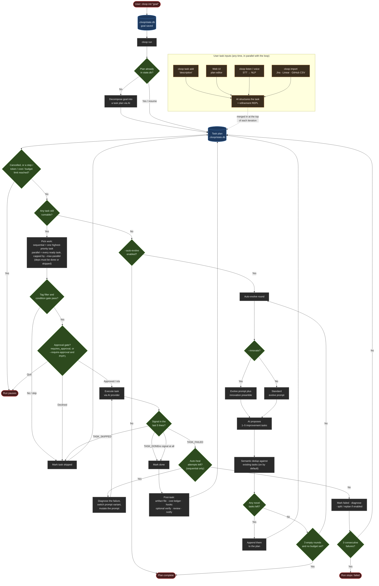

# How cloop works

You have run `cloop init` and `cloop run` once. Something decomposed your goal
into a numbered list, worked through it, and printed a lot of green ticks. This
page explains what that loop is, so the next time it stops, skips a task, or
invents work you did not ask for, you know which of its rules you are looking
at.

There is one execution model. Early versions had a "PM mode" flag that turned
the task pipeline on; it no longer exists, and neither does `--pm`. Every unit
of work cloop does is a task in a plan, and every plan lives in the project's
database.

- [The loop at a glance](#the-loop-at-a-glance)
- [The goal and the plan](#the-goal-and-the-plan)
- [A task](#a-task)
- [The execution loop](#the-execution-loop)
- [When a task fails](#when-a-task-fails)
- [Auto-evolve](#auto-evolve)
- [Parallel execution](#parallel-execution)
- [Where execution happens](#where-execution-happens)

---

## The loop at a glance



---

## The goal and the plan

`cloop init "…"` records a goal and plans nothing. The first `cloop run` calls
the provider with a decomposition prompt asking for a JSON list of concrete,
independently executable tasks — aiming for 5 to 15, each with a priority, an
optional role, an optional `depends_on` list and a time estimate
(`pm.DecomposePrompt`). If stdin is a terminal and `--skip-clarify` is not set,
a short clarification Q&A runs first and its answers are folded into that
prompt.

The parsed result is a `Plan` — the goal, a slice of tasks and a version number
— saved immediately, because **the plan is the durable state of the project**,
not a cache and not a log. A second `cloop run` does not re-plan; it sees a
non-empty plan and resumes it. `--replan` is the explicit way to discard it and
decompose again.

Everything lives in **`.cloop/state.db`**, a SQLite database (`pkg/state`,
`pkg/statedb`) holding the goal, the plan, the step history, token and cost
counters, the activity queue and the event journal. A legacy `.cloop/state.json`
from an older binary is migrated into it on first open and is no longer
written. Task artifacts — the full provider response for each attempt — are
separate Markdown files under `.cloop/tasks/`; plan snapshots go to
`.cloop/plan-history/`. Because the plan is durable and re-read from disk at
the top of every iteration, anything else that edits it is picked up mid-run:
`cloop task add`, the dashboard's plan editor, `cloop listen` and
`cloop import` all write to the same plan.

---

## A task

A task is a struct with a large optional surface and a small mandatory core
(`pm.Task` in `pkg/pm/pm.go`). The fields the loop itself reads are:

| Field | Meaning |
| --- | --- |
| `id` | integer, unique within the plan; renumbered on collision when new tasks are injected |
| `title`, `description` | what the executing agent is told to do |
| `priority` | **1 is highest**. Selection compares numerically, so P1 beats P2 |
| `status` | see below |
| `depends_on` | task IDs that must reach `done` or `skipped` first |
| `tags` | free-form labels; `--tags` restricts a run to matching tasks |
| `role` | one of `backend`, `frontend`, `testing`, `security`, `devops`, `data`, `docs`, `review` — prepends a specialist system prompt and can route the task to a different provider |
| `condition` | a gate evaluated before execution: `$cmd` runs a shell check, anything else is an AI yes/no question |
| `deadline` | an overdue task is auto-boosted to P1 at the top of each iteration |
| `on_success`, `on_failure` | task IDs to activate, or skip, depending on this task's outcome |

The rest is bookkeeping the loop writes as it goes — `result`, `started_at`,
`completed_at`, `actual_minutes`, `artifact_path`, `fail_count`,
`heal_attempts`, `failure_diagnosis`, and `annotations`, a timestamped audit
trail of every decision cloop made about this task — plus opt-in fields for
approval, recurrence, per-task time budgets, story points and links.

There are **six** statuses: `pending`, `in_progress`, `done`, `skipped`,
`failed`, and `timed_out` for a task that exceeded its wall-clock budget.
`in_progress` also means "left behind by a run that died", which is why a fresh
run reconciles those before scheduling anything. The two that decide what
happens next are `skipped` and `failed`: a `skipped` dependency counts as
**satisfied**, because a task that was not applicable should not strand the
work after it, while a `failed` or `timed_out` dependency leaves the dependant
*permanently blocked* — and the loop then marks it `skipped` with a reason
rather than leaving it forever unrunnable.

---

## The execution loop

Each iteration, before any provider call, the loop checks its **stop
conditions** — cancellation (Ctrl-C), `--steps`, `--token-budget`, the
project's `max_steps`, `--cost-limit`, the daily `budget` config, and on the
`claudecode` provider the project's share of the Anthropic subscription. Any of
them sets the run to `paused` and returns; `cloop run` resumes it. The loop
then **re-reads the plan from disk**, merging externally-added tasks and
resetting recurring tasks whose cron schedule has fired, and applies
**deadlines**: overdue tasks are boosted to P1, and with `--auto-promote` tasks
approaching a deadline are escalated too.

**Selection** is `Plan.NextTask()`: the pending task with the lowest `priority`
number whose dependencies are all `done` or `skipped`. Ties keep plan order,
and pinning affects how lists are displayed rather than what runs next. The
chosen task passes through the gates in the diagram — tag filter, condition,
optional risk check, optional approval — and is executed by building a prompt
with `pm.ExecuteTaskPrompt` and calling the provider. That prompt carries the
goal and constraints, this task, the completed tasks with short result
summaries, the upcoming tasks marked *do not work on these*, keyword-matched
snippets from your codebase, relevant knowledge-base entries, and — if this
task failed before — the previous diagnosis.

### The signal protocol

There is no structured output format. Completion is detected by asking the
agent to end its response with a bare token, and then looking for it:

```
TASK_DONE      the task is complete
TASK_SKIPPED   the task is not applicable, or was already done
TASK_FAILED    the task could not be completed
```

`pm.CheckTaskSignal` trims the output, splits it into lines, and examines
**only the last 5 lines**. A line matches only if, after trimming whitespace,
it equals the token exactly — `TASK_DONE.` or `Result: TASK_DONE` does not
count. The first match in those five lines wins.

**No signal at all is treated as success** — the task is marked `done` with an
annotation saying it was implicitly completed, so a chatty agent that ends on a
summary paragraph gets the benefit of the doubt. Unless it reads as a
*question*: an unsignalled output that looks like a request for clarification
is re-prompted (twice) to decide for itself, and failed if that does not
resolve, rather than laundered into "done". The parallel loop skips the
re-prompt and fails it immediately.

One rule overrides even an explicit `TASK_DONE`. If the agent left processes
running — a build, a test suite, a training job — cloop waits for them, and a
task whose background work never drained is **not** accepted as complete
regardless of what it printed, because its output describes work that had not
finished (`pkg/orchestrator/background.go`).

With `--verify`, a `done` task gets a second AI pass that inspects the real
files and answers `VERIFY_PASS` / `VERIFY_FAIL`, parsed by the same
last-5-lines rule; a failure re-queues the task as `pending` up to
`--max-verify-retries` times (default 2) before failing it.

---

## When a task fails

`TASK_FAILED` does not immediately mark the task failed. In the sequential
loop, **auto-heal** runs first: each attempt calls the provider for a diagnosis
of what went wrong, records it on the task as `failure_diagnosis` and as a
`[HEAL n/m]` annotation, switches to the next-best prompt variant if A/B
statistics suggest one, and re-executes the task with the diagnosis attached to
the prompt. The default is **2 attempts** (`--heal-retries`; `0` means the
default), and `--no-heal` turns the loop off. A provider error or an empty
response during a heal attempt is treated as a transient miss rather than a
verdict — the task stays failed and the next attempt runs.

When heal is exhausted the task is marked `failed`, `fail_count` is
incremented, and the opt-in recovery machinery gets its turn: `--diagnose`
stores a fresh root-cause analysis for the next retry, `--auto-split` asks the
AI to decompose a task that has now failed twice into 2–5 subtasks that replace
it, and `--adaptive-replan` re-thinks all remaining pending work around the
failure. A successful split or replan resets the failure counter, because the
plan has genuinely changed.

**The consecutive-failure stop.** The loop counts consecutive failures; any
success or skip resets it to zero, and reaching the limit — **3** by default,
`--max-failures` — sets the run's status to `failed` and returns an error. It
is consecutive rather than cumulative, so a plan can absorb many failures as
long as it is still making progress between them, and every failing path trips
it: signals, verification, shell verification, per-task timeouts and provider
errors alike. A timed-out task takes the same counter but a different status,
and gets a marker artifact carrying whatever partial output existed. There is
no default time budget; it is opt-in per task (`max_minutes`), per project, or
per process.

---

## Auto-evolve

When no task is runnable and the plan is complete, the run normally ends with
status `complete`. With `--auto-evolve` it does not: the queue draining is the
trigger for a new round of work. An evolve round calls the provider with
`pm.EvolveDiscoverPrompt`, which shows the completed tasks and their result
summaries and asks for **1 to 5 new improvement tasks** focused on features,
tests, documentation, performance, security, UX and refactoring. `--innovate`
does not change that focus list — it prepends a short instruction to think
creatively and unconventionally about novel capabilities.

The candidates are then filtered. Semantic deduplication is **on by default**:
a second provider call compares them against the existing plan and drops
anything already covered, even when the wording differs. It fails open — a
provider error keeps all candidates rather than silently dropping novel work —
and `--no-dedup` skips it. Survivors are renumbered to avoid ID collisions and
appended to the plan, at which point they are ordinary tasks: visible in
`cloop status`, editable, dependable, executed by the same loop. Discovered
work never happens invisibly.

Two things bound this. Every round increments `evolve_step` and is recorded in
the activity log even when it finds nothing; and if **three consecutive rounds
discover no new tasks** while no `--token-budget` or `--steps` limit is set,
the run stops on its own. When a budget *is* set, the budget is the abort
condition and evolving continues until it trips.

---

## Parallel execution

`--parallel` (or `--max-parallel N` / `-j N`, which implies it) switches the
dispatcher from `Plan.NextTask()` to `Plan.ReadyTasks()`: every pending task
whose dependencies are satisfied is launched at once, capped by the live
`max_parallel` value. That cap is re-read from state each round, so changing it
from the dashboard takes effect on the next batch; toggling parallelism mid-run
makes the loop hand control back and re-dispatch into the other mode without
restarting the process. Results are consumed as each worker finishes rather
than at the end of the batch, and a panic inside a provider becomes that one
task's failure instead of taking down its peers.

By default all workers share one working directory, which is fine for tasks
that touch different files and not fine otherwise. `--worktree-parallel` fixes
that when the project is a git repository:

- Each task gets its own worktree at `.cloop/worktrees/task-<id>/` on a branch
  named `cloop/task-<id>-<slug>` (`pkg/worktree`), and the provider is pointed
  at that directory, so concurrent edits cannot overwrite each other.
- On `done` the worktree is committed and its branch is submitted to a **merge
  queue** (`pkg/mergequeue`) — one goroutine draining requests in FIFO order,
  so each merge sees the previous one already on the base branch. The loop
  waits for its merge before starting the next round. A conflict is first
  offered to an AI resolver; if that declines, resolves too few files, or
  leaves conflict markers behind, the merge is aborted and the branch is left
  for manual resolution, with the reason annotated on the task.
- On `failed` or `skipped` nothing is merged. Either way the worktree directory
  is removed and **the branch is kept**, so the work is still inspectable.

A project that is not a git repository, or whose base branch cannot be
resolved, gets a printed notice and the shared directory instead of an error.

The parallel loop is deliberately leaner. Auto-heal, AI verification, script
verification, failure diagnosis, auto-split, adaptive replan, the approval
gate, interactive review, coaching, risk checks and the multi-agent pipeline
are all **sequential-only** — in parallel mode a `TASK_FAILED` is a failure on
the first attempt. Choose parallelism when the tasks are genuinely independent
and you want throughput; choose sequential when you want the recovery
machinery.

---

## Where execution happens

Everything above describes the orchestrator's decisions and says nothing about
*which machine* the agent runs on. That is a separate axis. A `cloop run` typed
at your own terminal is the orchestrator in your own shell, calling a provider
from that process. A run started from the hub or the Web dashboard is
different: the harness is never forked next to the control plane. `cloop run`
is itself the workload, handed to whichever **executor** the project is bound
to — a local process, a container, a Kata VM, an enrolled edge device, an
ephemeral Kubernetes Pod — along with a declaration of how the source tree gets
there and a short-lived lease carrying any credentials the task needs. When the
sandbox does not share the hub's filesystem, a completed task records
`write_back_branch` and `write_back_commit` so a reviewer can find the work.

That whole path — the `Executor` interface, the four backends, placement,
workspace provisioning, health and failover — is
[the executor architecture](../architecture/executors.md).

---

## See also

- [Your first project](first-project.md) — empty directory to finished plan
- [Providers](providers.md) — which backend runs the prompts, and how the model
  is chosen
- [Command reference](../reference/commands.md) — every flag named above
- [Executor architecture](../architecture/executors.md) — where a task really
  runs
