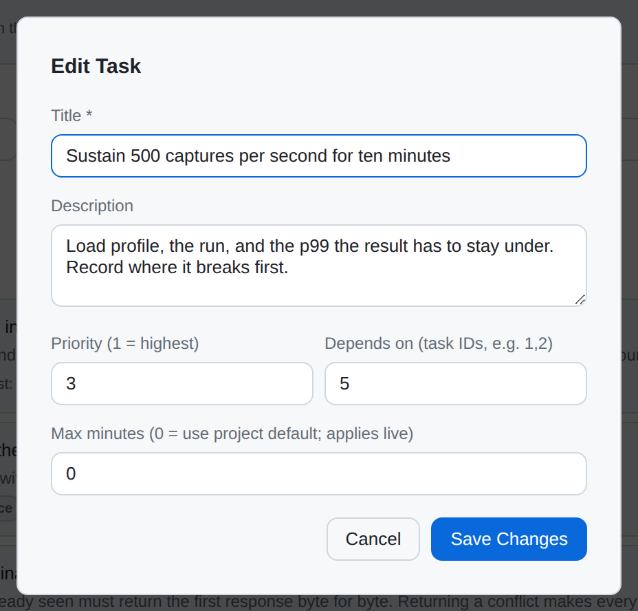
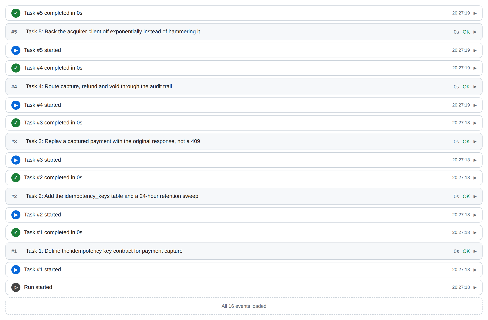

# A walkthrough of the dashboard

[Your first project](first-project.md) does the whole loop from a terminal.
This page does the same three things from a browser, in the order you actually
meet them: decide **where work is allowed to run**, create a **project** that
runs there, then fill it with **tasks** and start it.

That order is the one thing worth knowing before you begin. Executors are
global and projects point at them, so a project created before there is
anywhere good to run it lands on whatever the hub will accept — which, on a
default install, is a child process of the dashboard itself.

- [Before you start](#before-you-start)
- [1. The fleet view](#1-the-fleet-view)
- [2. Decide where work runs](#2-decide-where-work-runs)
- [3. Add a device](#3-add-a-device)
- [4. Create a project](#4-create-a-project)
- [5. The project's control panel](#5-the-projects-control-panel)
- [6. The plan](#6-the-plan)
- [7. Run it, and watch](#7-run-it-and-watch)
- [8. Settings](#8-settings)
- [Where to go next](#where-to-go-next)

The screenshots are of a throwaway hub with three invented projects, rebuilt
from scratch by `scripts/screenshots/capture.sh` — so what they show is a hub
that really ran, not a mock-up, and no real project of anyone's.

---

## Before you start

```bash
cd ~/Projects/checkout-api
cloop ui
```

The dashboard comes up on port 8080 and opens a browser. Two things about that
default are worth reading [the dashboard page](web-ui.md#what-it-authenticates-by-default)
for before you put it on a network: it listens on every interface, and with no
token and no SSO configured it authenticates nobody. On a laptop that is the
right default. Anywhere else, set up
[scoped tokens or OIDC](../security/model.md) first.

---

## 1. The fleet view


**Projects** is the hub's front page and the only tab that shows everything at
once. Counters across the top, then one row per registered project: its goal, a
status pill, a progress bar, `done/total` tasks, when it last did anything, and
the provider and model it will use on its next run.

Clicking a row opens that project in the **Project** tabs to the left of the
divider in the tab bar; everything right of the divider — Projects, Budget,
Executors, Settings — is hub-wide. The two groups are labelled because the
distinction matters: a setting changed on a Global tab changes it for every
project on the hub.

---

## 2. Decide where work runs


An **executor** is where a harness actually runs. The tab lists every one the
hub has, and the cards carry the two facts that decide whether a project should
use it: what it isolates, and whether it is reachable right now.

| Kind | What runs where | What a task can reach |
| --- | --- | --- |
| `localprocess` | a child process of the dashboard | this server's user, filesystem and network — no isolation |
| `container` | a Docker/Podman sandbox on this server | only what the sandbox spec and the egress rules allow |
| `remote` | an enrolled device that dialled out to the hub | that device, under the sandbox mode set on its card |
| `kubernetes` | a Pod in a cluster | its namespace, under a per-Pod NetworkPolicy |

**Read the banners.** The two amber lines in the screenshot are not decoration.
The first says host execution is enabled — `executors.allow_host_process: true`
— which is the default and the thing most of this documentation argues against
leaving on once you have somewhere better. The second says the container
executor is on network `none`, so sandboxed work has no route out at all; a
project that needs to reach a package registry needs
[egress configured](../reference/configuration.md#ip-layer-egress-filtering)
or a grant from the egress broker.

Each card's buttons are the executor's whole administration:

- **History** — in-flight work, recent completions, and whether anything ran on
  the host.
- **Sandbox** — enrolled devices only: whether payloads run on that device's
  host or in a container on it, and under which runtime. For a driver the hub
  builds itself, that answer is already in `config.yaml`, so the button is not
  offered rather than being offered and ignored.
- **Limits** — the most CPU, memory, disk and processes any one workload here
  may be given.
- **Access** — which users and groups may place work on this executor at all.
- **Cordon** stops new placements without disturbing what is running; **Drain**
  retires it and waits for in-flight work to finish.
- **Upgrade** / **Revoke** — enrolled devices only.

Cordon and Drain are the pair to reach for before anything destructive: a
cordoned executor keeps its running work and takes no more.

---

## 3. Add a device


**+ Enroll device** mints a single-use token and prints the command to run on
the machine you are adding:

```bash
cloop executor agent --server wss://hub.example.com/api/executors/connect \
                     --token <the token it printed>
```

The direction is the point. The device dials **out** to the hub, so a laptop, a
build box or a machine on a factory network behind NAT joins the fleet with no
inbound firewall rule and no port forwarded to it. The hub never connects to the
device.

The token is single-use and short-lived — 15 minutes by default — and the
dialog shows it exactly once. There is nothing to recover if you lose it;
minting another costs one click. Once the agent connects, the device appears as
a `remote` card reporting its build, its CPU and memory, the container runtimes
it found and the harnesses it has installed. Set its **Sandbox** mode and
**Limits** before you point a project at it.

Full detail, including the hardened systemd unit and certificate pinning, is in
[edge-device onboarding](../architecture/executors.md).

---

## 4. Create a project


**+ New Project** on the Projects tab needs two things — a directory and a goal
— and offers the rest.

**The goal is the input to everything else.** cloop decomposes it into the
plan, so a goal that names an outcome and its constraints produces a better plan
than one that names a technology. *"Ship an idempotent payment capture API with
end-to-end audit coverage"* gives the decomposer something to work with;
*"payments"* does not.

**Access** is the section to open. It is collapsed by default because an
ordinary single-user project needs neither half of it, and it is the half of
this dialog this walkthrough is about:

- **Executor** pins where this project's harness runs. Left on *Default (hub
  decides)*, the hub places it — which on a default install means the host.
- **Grants** lease stored secrets to the project: a GitHub repository, a
  personal access token, a kubeconfig, an allowance on the hub's own Internet
  connection. Each row narrows one credential to this project.

Both are applied as part of the creation, and if the executor or any grant is
refused the whole project is rolled back rather than left half-provisioned. A
mistyped secret name costs you nothing.

**A device does not get your Claude login.** Signing in to Claude Code from
Settings authenticates harnesses that run on the hub itself. A harness in a
container, a Pod or on an enrolled device receives credentials only through a
grant — [why](../security/claude-code-identity.md#isolating-executors-do-not-get-a-directory)
— so a `claudecode` project bound to one also needs an `env` secret holding
`CLAUDE_CODE_OAUTH_TOKEN` (from `claude setup-token`) or `ANTHROPIC_API_KEY`,
granted to it with that key. Without it the first task stops with *Not logged
in*. Repositories work the same way, with one default to watch: the project's
**Repositories** panel assigns *Read only* unless you pick *Read and write*,
which is enough to clone and not to push. The harness is told which
repositories it holds and whether it may push, and clones them itself.

Note what the Grants list says when it is empty: *"No grants — the project
starts able to reach nothing."* There is no allow-everything default anywhere in
this dialog. An empty allowlist is rejected as a mistake rather than read as
"unrestricted" — see [secrets and egress](../guides/secrets.md).

---

## 5. The project's control panel


Clicking a project opens its **Overview**: goal, instructions, stats, options,
controls, live output and event history, top to bottom.

Two of the stat cards are buttons. **Provider** opens a provider and model
picker whose choice is saved on the project and used by every run until you
change it. **Executor** is the one this walkthrough cares about:


The card under it reads **pinned** or **default**, and that word is the whole
answer to "is this project's isolation deliberate". A change here takes effect
on the **next** run: work already in flight stays on the executor that started
it, because moving a running task between machines is not a thing that can be
done safely.

**Active Options** is where the run flags live, and clicking a badge toggles it
— there is no options dialog on the Run button. Because the flags are stored on
the project rather than passed per click, the dashboard and the CLI agree: a
badge you turn on here is the flag `cloop run` will use. `Max Parallel`, `Step
Timeout` and `Task Timeout` sit in the same card, and Task Timeout applies to
tasks that are *already running* within a few seconds rather than only to the
next one.

---

## 6. The plan


The **Tasks** tab is the plan, and the plan is the product. Every row is a unit
of work with an identity, a status and — once it has run — a stored result,
which is why progress here survives a restart and a failure names the task it
belongs to.

**Adding** is the inline form: title, optional description, priority (`1` is
highest) and a comma-separated list of task IDs to depend on. **Add Task**
appends it immediately, to a running plan as readily as to an idle one.

**The list is the run queue.** Tasks run top to bottom, and dragging a row
rewrites the priorities the scheduler reads — while a run is in flight, too,
because the orchestrator re-reads the order on every iteration. Three things
bound that:

- **Dependencies win.** A task dragged to the top still waits for what it
  depends on. The queue orders what is *ready*; it does not override the graph.
- **Only pending tasks have a position.** Completed and running rows carry no
  drag handle — one is history, the other has already left the queue.
- **Pinned tasks lead**, and a drag across that divider is refused rather than
  half-applied.

**Show completed** is the toggle used for the screenshot above; the default
hides finished work and the header says how much it is hiding. Each done task
carries the summary the run produced, which is what makes the list readable
weeks later.



**Edit** opens the same fields plus a per-task **Max minutes** budget, where `0`
inherits the project default. The other per-row buttons set status directly, and
which of them a row carries depends on the status it already has: a pending task
offers **Done**, **Skip**, **Fail**, **Split**, **Edit** and **Remove**, while a
finished one offers **Reset** in place of Done and Split — there is nothing to
mark done or break up. **Reset** is the one to reach for after a failure; it
puts the task back in the queue. Setting a status on a task that is *currently
running* aborts it rather than quietly relabelling it.

The same plan is also **Kanban** (four draggable columns), **Timeline** (a Gantt
chart), **Dependencies** (a graph) and **Activity** (every execution, heal retry
and evolve cycle per task).

---

## 7. Run it, and watch

**Start run** sits at the top of the Tasks tab, so you can start the plan from
the page you just edited it on. The same button is on Overview and on every row
of the Projects tab; they all call the same thing.



**Event History** on Overview is the record of what happened — not just steps,
but task starts, completions, failures, skips, heal retries, evolve cycles and
manual status changes, in one stream. **Live Output** above it carries the
running step's output as it arrives. Both are pushed rather than polled, over a
WebSocket, so they are current without a refresh; behind a proxy that blocks the
upgrade the page falls back to server-sent events and keeps working.

**A run on a device reports back when it ends.** The plan on the dashboard is
the hub's own; a run on an enrolled device works on a copy sent with it, so while
it runs, Live Output streams from the device and the task list stays where it
was. When the run ends the device sends back what changed — the tasks it
finished or added, its steps, events and spend — and Event History gains a
*project_result* row saying what came back. A task you changed on the hub while
the run was out keeps your change, and the row says that too. An agent too old
to report back gets a row naming the upgrade; **Upgrade** on its card is the fix.

When every task is done, an idle plan stops there. With **Evolve Mode** on, the
agent proposes new work instead — and that work arrives as tasks you can read
and reject, not as more transcript. [How cloop works](concepts.md#auto-evolve)
covers what it looks at when deciding.

---

## 8. Settings


**Settings** is global, not per-project. The **Configuration** section edits the
same provider keys `cloop config set` writes: the default provider, and per
backend a model, a base URL and an API key. Each card saves independently, keys
are write-only — blank keeps the existing value — and a *no key* badge marks a
backend that has none. Which backend to pick is
[Choosing and configuring a provider](providers.md).

Further down the same tab: **Display glasses** (a personal, expiring link for
Meta Ray-Ban Display glasses), **Hidden Projects**, and a **Danger Zone** whose
*Reset Project State* clears step history while preserving the goal and
configuration.

**Hidden Projects** is worth one sentence about how it behaves, because it is
deliberate. Hiding removes a project from *your* dashboard only — it keeps
running and other users still see it — and the Settings tab shows only *how
many* you have hidden. The names appear in a dialog when you ask for them, so
landing on this tab for something else does not put them on screen.


The last panel is the one that turns a single-user hub into a shared one.
**Single sign-on (OIDC)** authenticates dashboard users against your identity
provider instead of a shared token; with it on, every browser request needs a
provider session, projects are owned by the user who created them, and roles
come from the claims your IdP releases.

Two defaults in it are chosen rather than inherited. The client secret is
optional — leave it blank and the hub signs in as a public client using PKCE,
so there is no secret to leak. And the default role is **none**, which denies
everything: a hub with no administrator cannot be administered, so at least one
admin email or a claim mapping granting `admin` is required before SSO can be
turned on at all. The full picture is in
[the security model](../security/model.md).

---

## Where to go next

- **[How cloop works](concepts.md)** — the loop behind the Tasks tab: how a
  task is picked, how completion is detected, what happens on failure.
- **[The web dashboard](web-ui.md)** — the same UI as a reference: every tab,
  every run option, and the glasses view.
- **[Executors](../architecture/executors.md)** — how a task travels from the
  orchestrator to a sandbox and back, and what enrollment actually establishes.
- **[Secrets and egress](../guides/secrets.md)** — what a grant is, what a lease
  expires, and how a sandbox gets a credential without being able to keep it.
- **[Enterprise hosts](../guides/enterprise-hosts.md)** — per-project
  repositories, firewall rules, gVisor and Kata runtimes, and passing hardware
  into a sandbox.

---

↩ [getting started](README.md) · [documentation map](../README.md)
