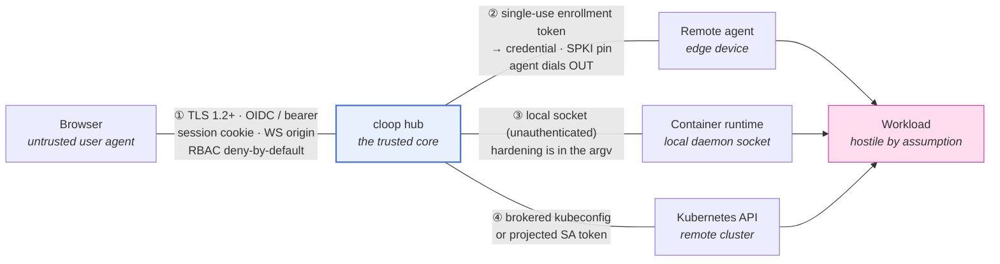

# Security model

What cloop's hub trusts, what it authenticates, and which test proves each claim.

cloop's security model is spread across packages that deliberately do not import
each other — `pkg/executor` (host-execution policy), `pkg/secretbroker` (scoped
credential grants), `pkg/egressbroker` (network leases), `pkg/authz` (RBAC),
`pkg/oidcauth` (SSO), `pkg/ui` and `pkg/apiserver` (the control plane). Nothing
in that arrangement fails loudly when a refactor quietly reconnects the UI to
`os/exec`, widens a container's privileges, or lets an expired lease redeem.
So every guarantee below ends in a row of the
[guarantee → test table](#the-guarantee--test-table), and that table is a CI gate.

- [Trust boundaries](#trust-boundaries)
- [The no-host-execution guarantee](#the-no-host-execution-guarantee)
- [Workspace provisioning](#workspace-provisioning)
- [Identity, roles and permissions](#identity-roles-and-permissions)
- [Session lifecycle and revocation](#session-lifecycle-and-revocation)
- [The guarantee → test table](#the-guarantee--test-table)
- [What is not mitigated](#what-is-not-mitigated)

---

## Trust boundaries



The hub is the only trusted component. Everything on the far side of a numbered
edge is assumed to be capable of lying: a browser session can be an attacker
with a stolen cookie, an enrolled device can be compromised, and a **workload is
hostile by assumption** — it runs code the hub did not write, chosen by an LLM.

### ① Browser ↔ hub

| Concern | Mechanism | Where |
| --- | --- | --- |
| Transport | TLS 1.2 minimum; ECDHE+AEAD cipher suites only — no CBC, no static RSA | `pkg/tlsconf/tlsconf.go:122-168` |
| Authentication | OIDC ID token validated against provider JWKS (RS256/ES256), **or** a static bearer token for headless deployments | `pkg/oidcauth/oidcauth.go:162-211,309-328` |
| Session | `cloop_session` cookie: `HttpOnly`, `Secure` (`auto`/`always`/`never`), `SameSite=Strict` under TLS and `Lax` on loopback plaintext | `pkg/oidcauth/oidcauth.go:495-507` |
| CSRF | `SameSite=Strict` is the primary defence; login flow handles the cross-site navigation case explicitly | `pkg/oidcauth/oidcauth.go:334-354` |
| WebSocket hijacking | `wsOriginAllowed`: absent `Origin` (CLI/agent), loopback, `Origin` host == request host, or an explicit `ui.allowed_ws_origins` entry | `pkg/ui/server.go` |
| Authorization | every route declares its `Perm` in `routeTable()`; `gate()` wraps each one; `require()` is the single enforcement point | `pkg/ui/routes.go:143,210`, `pkg/ui/authz.go:214` |
| Abuse | per-IP token-bucket rate limiting; bounded WebSocket connections per IP and in total | `pkg/ui` |

The route table is the design decision worth calling out. Permissions are not
checked inside handlers, where a new handler would simply forget; they are
declared *alongside the route* and applied by `gate()` at registration, and
`routeSpec.validate()` refuses a route that declares no permission at all.
Reaching an endpoint without a permission requires explicitly marking it
`public`.

### ② Hub ↔ remote agent

The agent dials out; the hub never dials in. Authentication is a two-phase
handoff (`pkg/executor/remote/enroll.go`):

1. **Enrollment token** — 32 random bytes, single-use, TTL 15 min by default and
   24 h maximum. Only the SHA-256 hash is stored. The wire format
   `clet1.<id>.<secret>.<HMAC>` carries a truncated HMAC-SHA256 (keyed by
   `pkg/security`'s signing key) so a tampered token is rejected on shape,
   before any database lookup. Redemption is `UPDATE … WHERE redeemed_at IS
   NULL`, so concurrent redemptions cannot both win.
2. **Long-lived credential** — issued on first connect, `clac1…`, stored
   0600 at `~/.cloop/agent.json`, again persisted hub-side as a SHA-256 hash
   only. Presented as `Authorization: Bearer` on every reconnect.

All secret comparisons use `crypto/subtle.ConstantTimeCompare`.

**Agent-side certificate pinning** closes the other direction. The device
verifies the hub's SPKI fingerprint (`sha256:<base64>`, comma-separate several
to stage a key rotation) rather than trusting the system store alone
(`pkg/executor/agent/transport.go:43-82`). `tlsconf.CheckEndpoint` refuses
plaintext `ws://` to a non-loopback host unless `--insecure-transport` is passed
explicitly. Pinning a plaintext URL is an error, not a silent no-op — there is
no certificate to pin against.

Revocation cascades: `cloop executor revoke <id>` marks both the enrollment
record and the derived agent credential revoked, and the hub sends `bye` with
`reconnect=false` so the agent stops rather than backing off and retrying.

**Protocol versioning.** Frames carry a version; the hub accepts
`[MinProtocolVersion, ProtocolVersion]` = `[1, 2]` and stamps every outbound
frame with the version the session negotiated, not with its own maximum — a v1
agent rejects a v2 envelope as out of range, so stamping the maximum would make
negotiation decorative (`TestSessionStampsNegotiatedVersionOnOutboundFrames`).
v2 added the `revoke` frame. A v1 agent still connects and still runs ordinary
work; what it cannot receive is a workload carrying revocable secret material,
because it has no frame with which to give it back. The hub refuses that
*placement* with a diagnostic naming the device, the credential and the upgrade
command, rather than refusing the device
(`TestOldAgentIsRefusedRevocableWorkload`).

### ③ Hub ↔ container runtime

The hub talks to a local Docker/Podman socket, which is **unauthenticated by
design** — anyone who can reach that socket is already root-equivalent on the
host. This boundary therefore protects the *host from the workload*, not the
socket from the hub. All of the enforcement lives in the argv the hub builds:

```
--pull=never  --cap-drop=ALL  --security-opt=no-new-privileges  --read-only
--user <non-root uid>  --network=none  --memory-swap == --memory
--volume <project dir>:/cloop/work    (the only host mount)
```

Because `buildRunArgs` is a pure function, these flags are checked exhaustively
against every option combination without needing a runtime present, and a
denylist rejects operator `ExtraArgs` such as `--privileged`, `--net=host`,
`--cap-add`, `--device`, `--pid=host` or a mounted runtime socket
(`pkg/executor/container/argv.go:371-393`).

### ④ Hub ↔ Kubernetes cluster

Credentials arrive as a [brokered kubeconfig lease](../guides/secrets.md#kubeconfig)
held in memory for the handle's lifetime — never written to the hub's disk — or,
in-cluster, as the Pod's own projected ServiceAccount token (rotated by kubelet).

The Pod spec forces `runAsNonRoot`, a read-only root filesystem, all
capabilities dropped, `seccompProfile: RuntimeDefault`, and
`automountServiceAccountToken: false`, so a workload Pod holds no cluster
credential of its own.

The chart's executor Role is deliberately narrow, and CI asserts it in both
directions: it **grants** `create/get/list/watch/delete` on Pods, `get` on
`pods/log`, and `create`/`delete` on Secrets in the workload namespace, and
**denies** `update`/`patch` on anything, *reading* Secrets, and anything at all
in the hub's own namespace.

The Secret rule is write-only on purpose. The driver creates one Secret holding
the credential a [workspace fetch](#workspace-provisioning) needs, points the
Pod's init container at it by reference, and deletes it when that container
terminates; it never reads a Secret back, so an executor that could enumerate
what else lives in the namespace — which is what would make the secret broker
decorative — still cannot. Nor does it widen the namespace's blast radius:
`pods: create` plus `pods/log: get`, which this identity already held, is enough
to read any Secret in the namespace by mounting it into a Pod and printing it.
The namespace has always been the boundary. Run workloads in one of their own.

---

## The no-host-execution guarantee

> With `executors.allow_host_process: false`, no request to the hub can cause a
> process to be forked on the hub's host. Not through a handler, not through a
> helper three packages away, not by resolving an executor that turns out to be
> the local one.

**Configuration** — `.cloop/config.yaml`:

```yaml
executors:
  allow_host_process: false   # `cloop hub bootstrap` writes this by default
```

Also settable with `cloop config set executors.allow_host_process false`.

**Enforcement** is layered, because any single check is one refactor away from
being bypassed (`pkg/executor/policy.go`):

| Layer | What refuses | Result |
| --- | --- | --- |
| Registration | `Registry.Register` rejects a driver reporting `IsolationNone` | the host driver is never in the fleet |
| Policy sweep | `ApplyHostExecutionPolicy(false)` evicts already-registered non-isolating drivers | tightening at runtime takes effect immediately |
| Resolution | `Registry.Resolve` refuses a resolved executor with no isolation | `*HostExecutionDeniedError` + isolated alternatives |
| Placement | `Select` rejects candidates on `ConstraintHostPolicy` | no failover lands on the host |
| Driver | `localprocess.Start` re-checks before spawning | backstop for direct callers |
| HTTP | five host-touching endpoints check `denyHostSideEffect` | HTTP 409 naming `allow_host_process` |

The policy is a **ratchet**: `ApplyHostExecutionPolicy` only ever tightens.
Passing `true` after `false` is a no-op, so a later config reload, a
partially-applied YAML edit, or a race between two goroutines cannot re-open
host execution for the process's lifetime.

Five endpoints legitimately touch the host — Claude Code auth (status, login
start, login code, logout) and replay-run creation. They are not exempt: they are
*gated*, and `tests/security/callgraph.go:39-48` names each one with the reason
it is allowed to exist. `TestGatedListsAgree` fails if that list and the list of
gated HTTP routes ever diverge, so a new gated handler cannot be added on one
side only.

---

## The lease-revocation guarantee

Secret grants are TTL-leased so that a compromised executor's window is bounded
by the lease rather than by the grant. That bound is only real if something can
take the material back mid-run — otherwise a fifteen-minute lease handed to a
three-hour task is a fifteen-minute *label* on three hours of access.

The `revoke` frame (protocol v2) is what makes it real. `POST
/api/leases/{id}/revoke` wipes the hub's own copy and pushes a scrub to every
executor holding the lease; a TTL janitor sweeps live agent sessions once a
minute; and cordon/drain scrubs everything the device is holding. All three go
through one path, so they cannot drift apart.

### What it is worth, per material

| Material | Scrub | Worth |
| --- | --- | --- |
| Credential **files** | zeroed, then unlinked on the device | **Strong.** The next read fails |
| **Egress** allowlist entries | dropped at the proxy and on the agent | **Strong.** The next connection is refused |
| Environment **variables** | dropped from the agent's retained copies (`exec.Cmd.Env` and the recorded `Spec`), so they are never re-injected on restart, resume or failover | **Weak.** The running child has its own copy |

The weak row is a property of POSIX, not of this implementation. A process
receives its environment from the kernel at `exec` time; no API takes it back.
This is why `github_pat` delivery ships a credential *helper* reading a token
*file* instead of exporting a bare `GITHUB_TOKEN` — it moves the PAT into the
row that can actually be revoked. When the credential itself is compromised,
`{"action":"kill"}` scrubs and then terminates every holder (`SIGTERM`, then
`SIGKILL` after five seconds), which is the only thing that stops a process
using what it already has.

Go strings are immutable, so the env scrub replaces the slice entry rather than
overwriting the bytes: the value becomes unreachable and is collected, but a
memory dump taken in that window can still contain it. Files, which are
mutable, *are* zeroed before being unlinked.

### What it is worth when the agent is unreachable

**Nothing, until the agent comes back.** The credential is on a machine the hub
cannot talk to, and no protocol fixes that. The system's obligation is therefore
to say so rather than to claim success:

- Per-lease ack state is tracked as `revoked` / `revoke_pending` / `unreachable`
  / `failed`, and the aggregate across holders is the **worst** of them. Three
  devices out of four is not a revocation.
- The revocation is retained and **replayed on reconnect**
  (`TestRevocationIsReplayedOnReconnect`), so a device unplugged mid-revocation
  does not return holding a credential that was already withdrawn. The action
  survives the queue: an escalation to `kill` does not quietly demote itself to
  a scrub because the device happened to be offline.
- An agent that reconnects *downgraded* below v2 fails the replay with a version
  diagnostic rather than silently succeeding
  (`TestReplayRefusedOnDowngradedAgent`).

If a holder is `unreachable` and the credential is compromised, rotate it at the
source. That is the only action that does not depend on a machine you cannot
reach.

### The frame is not a filesystem primitive

`revoke` names file paths, and the control plane is a party this model treats as
potentially compromised (see boundary ②). Honouring those paths literally would
be an arbitrary-unlink primitive on every enrolled device. The agent therefore
removes a path only when its containing directory is named `cloop-lease-*` —
the prefix `secretbroker.Materialize` uses — and never follows a symlink through
to its target. Refusals are reported in the ack rather than silently skipped,
because "I did not delete your credential file" is something the operator has to
be told (`TestVaultRefusesPathsOutsideALeaseDirectory`,
`TestVaultDoesNotFollowSymlinks`,
`TestLoopbackRevokeRefusesPathsOutsideALeaseDirectory`).

### Audit

`lease.revoke_sent` is written *before* the fan-out, so the trail records the
intent even if the process dies mid-revocation; `lease.revoke_acked` or
`lease.revoke_failed` follows per executor, with the lease and executor IDs and
how long the ack took. Env variable *names* appear; values never do.

---

## Workspace provisioning

> A `git` workspace is fetched with a short-lived brokered credential that
> reaches exactly one process, and a fetch nobody can authorise is a refusal —
> never a run against an empty directory.

Two halves, and both are failure modes that look like success from the outside.

A leaked token produces a run that works *perfectly*: the fetch succeeds, the
task completes, and a long-lived GitHub credential is sitting in a Pod object
that anyone with `get pods` in the namespace can read. Nothing surfaces until
somebody else uses it. An empty workspace is worse, because the harness
cooperates — it starts, finds no code, and produces a plausible report about a
repository it never saw. See
[Workspace provisioning](../architecture/executors.md#workspace-provisioning)
for the mechanism; this section is what it is worth.

### The credential's path

```
operator:  cloop secret mint … --kind github_pat
           cloop secret grant … --to executor:k8s-prod --repos acme/tool
                │
hub:       applyWorkspace records the grant's NAME in the Spec.  ← no material
                │                                                  ever, anywhere
driver:    lease from the broker at dispatch, for one fetch
                │
   ┌────────────┴─────────────┐
   │ kubernetes               │ remote
   │ → Secret cloop-ws-<h>    │ → one start frame
   │ → lease released         │ → lease released when the agent answers
   │ → secretKeyRef in the Pod│
   │ → Secret deleted when the│
   │   init container ends    │
   └────────────┬─────────────┘
                │
executor:  kubernetes → read out of CLOOP_WORKSPACE_TOKEN and unset
                        in the same breath, before anything is spawned
           remote     → held in the agent's memory for one call
                │
           both  → handed to ONE git child — the single `fetch` step —
                   as a URL-scoped http.<origin>.extraHeader
```

The lease is deliberately short-lived at each hop rather than held for the run.
On Kubernetes it is released as soon as the Secret exists, not when the fetch
finishes: by then the cluster holds the material and the broker's lease controls
nothing, so releasing later would only keep the broker believing a credential is
out on loan for hours. The Secret itself is dropped the moment the init
container terminates — the exposure is the length of a `git fetch`, not the
length of a run.

### The four absences

| Property | Why it holds |
| --- | --- |
| **Not in the Pod spec** | `CLOOP_WORKSPACE_TOKEN` is only ever set through `valueFrom.secretKeyRef`. A `value:` entry would put the token into an object readable by every identity with `get pods`, into every `kubectl describe`, and into the API server's audit log. |
| **Not in argv** | `/proc/<pid>/cmdline` is readable by every process under the same uid, and a container's argv is additionally in the Pod object and in `docker inspect`. The plan is built from a `Workspace` that structurally cannot hold a credential, and the material is applied only to an environment. |
| **Not on disk** | No credential file and no credential helper: the token is passed through git's `GIT_CONFIG_COUNT` protocol, `GIT_CONFIG_GLOBAL=/dev/null` and `GIT_CONFIG_NOSYSTEM=1` close the config files, and `credential.helper` is explicitly set empty. The provisioned checkout's own `.git/config` records the remote, not the authority. |
| **Not in output or logs** | Everything the provisioner emits or returns is passed through `executor.RedactSecrets` against *both* the raw token and its base64 form, because git will quote a header back in an error message and the base64 encoding is the one most likely to be echoed. |

A fifth, structural, sits underneath them: **not in the `Spec`.**
`executor.Workspace` has no field a token could be assigned to, so a future
caller cannot put one there even by trying. That matters because a Spec is
persisted for failover, marshalled across the remote boundary, and echoed into
audit rows — a credential placed there would be durable in three places before
anything used it.

### Scoping, and the helper that must not answer

The credential is delivered as `http.<https://host/>.extraHeader`, scoped to the
repository's own origin. An *unscoped* `http.extraHeader` is sent to every host
git contacts, including whatever a redirect points at — which turns a hostile or
merely misconfigured redirect into credential exfiltration. Scoped, a repository
that redirects elsewhere produces a fetch failure instead.

The empty `credential.helper` entry is not redundant. Without it, a helper
configured somewhere `GIT_CONFIG_GLOBAL` does not cover could still answer the
challenge with a *different* credential, and the fetch would succeed using
authority the grant never issued — the worst possible outcome, because it looks
like the grant working.

The base environment is closed for the same reason: an inherited `~/.gitconfig`
could contribute a credential helper, an `insteadOf` rewrite pointing the fetch
at another host, or a proxy, all decided by whoever last touched the machine.
The one allowlisted exception is transport (`HTTPS_PROXY`, `NO_PROXY`,
`SSL_CERT_FILE`, `GIT_SSL_CAINFO` and siblings) — none of which can name a
repository or supply a credential. `GIT_SSL_NO_VERIFY` is not on that list:
disabling certificate verification for a fetch carrying a brokered token is not
a transport preference, it is handing the token to whoever answers.

### Refusal is the other half

An executor that cannot materialise a tree is rejected at *placement* on
`ConstraintWorkspace`, before any credential is involved and whatever the
repository's visibility. A fetch no grant authorises fails with a typed
`*executor.WorkspaceGrantError` naming the repository, the grant and the
executor, whose `Remediation()` prints the `cloop secret grant` command — see
[Granting a PAT for workspace provisioning](../guides/secrets.md#granting-a-pat-for-workspace-provisioning).

The provisioning step itself runs attacker-adjacent input (a repository URL, a
ref, and then whatever the repository contains) inside the same Pod as the
harness, before the harness exists. It is therefore confined *identically* —
same `runAsNonRoot`, same read-only root filesystem, same dropped capabilities,
same seccomp profile, built by one function rather than two struct literals two
hundred lines apart. A less confined init container would be a way to obtain in
the sandbox exactly the privileges the sandbox exists to deny.

Every row above is asserted in
[`workspace_test.go`](#workspace-provisioning--workspace_testgo).

---

## Identity, roles and permissions

Deny by default: an identity that matches no binding gets `oidc.default_role`,
which `cloop hub bootstrap` writes as `none`.

**Roles**, in ascending order (`pkg/authz/authz.go:156-222`):

| Role | Adds |
| --- | --- |
| `none` | nothing — the default default |
| `viewer` | `project.read`, `executor.read` |
| `operator` | `run.start`, `run.stop`, `task.mutate` |
| `maintainer` | `project.write`, `config.write`, `secret.grant`, `secret.revoke` |
| `admin` | everything, including `executor.manage`, `audit.read`, `user.manage`, `token.admin`, `session.admin` |

**Permissions** (`AllPermissions`): `project.read`, `project.write`, `run.start`,
`run.stop`, `task.mutate`, `executor.read`, `executor.manage`, `secret.grant`,
`secret.revoke`, `config.write`, `audit.read`, `user.manage`, `token.admin`,
`session.admin`.
Plus `public`, an explicit escape hatch used only by unguarded routes (the
dashboard shell, the OIDC login endpoints, `/api/me`, `/api/session/logout-all`,
`/healthz`, `/readyz`).

Roles are granted by matching a claim from the ID token — `group`, `role`,
`email` or `sub` — optionally scoped to a project. A static bearer token
authenticates as `admin` with source `static_token`, which is why it belongs
only in deployments that have no SSO. Every privileged decision, allow or deny,
is written to the audit trail (`pkg/ui/authz.go:294`).

### Session lifecycle and revocation

A dashboard session is a `Secure` `HttpOnly` `SameSite=Strict` cookie holding
256 bits of CSPRNG output. The hub stores its SHA-256, never the value — a
stolen copy of `state.db` yields no usable cookie, the same property API tokens
have. That digest is also the session's public id, so it can appear in the
Active Sessions table and in `DELETE /api/sessions/{id}` without being a
credential.

Sessions live in the hub's own control-plane database and survive a restart or
a rolling upgrade. A read-through cache keeps authentication off the disk on
the hot path; entries are re-read at least every 30 seconds, which is what
bounds how long a session revoked on one replica keeps working on another.

**A session ends for exactly four reasons, and the audit trail distinguishes
them:**

| Cause | Audit event | Bound |
| --- | --- | --- |
| Absolute lifetime reached | `session.expired` (`absolute_ttl`) | `session_ttl_hours`, default 24h |
| Unused too long | `session.expired` (`idle_timeout`) | `idle_timeout_hours`, default 8h |
| Signed out, or terminated by an operator | `session.revoked` | immediate |
| The identity provider refused to renew it | `session.idp_revoked` | `refresh_interval_minutes`, default 15m |

Sign-in emits `session.created`. Every one of these is appended to the
hash-chained trail, so "why is this person signed out" and "who signed them
out" are answerable after the fact and cannot be edited away.

Both clocks are enforced **on the read path**, not only by the background
sweep: a session past either bound is refused by the very next request whether
or not anything has removed the row yet. A stopped janitor therefore costs
storage hygiene and revocation latency, never authorization. The idle clock is
refreshed by authenticated requests but persisted at most once per session per
minute, so an open dashboard does not turn every read into a write; a lost
write shortens the idle window by up to a minute, which is the safe direction.

**IdP-side revocation.** Disabling a user at the identity provider changes
nothing the hub can observe on its own: the cookie is still valid and the
claims in it were valid when issued. cloop closes that gap by keeping the
refresh token issued at sign-in — sealed with AES-256-GCM under
`CLOOP_SECRET_KEY`, exactly like a brokered credential — and redeeming it on an
interval. The failure taxonomy is the mechanism:

- `invalid_grant` (a disabled user, withdrawn consent, a forced sign-out, or a
  refresh token already rotated away) **terminates the session immediately** and
  writes `session.idp_revoked` with the provider's own error code.
- A network failure, timeout, or `5xx` **leaves the session alone** and retries
  on the next interval. Failing closed here would turn an IdP outage into a
  fleet-wide sign-out — a dependency problem escalated into an availability
  incident.
- `invalid_client` — the IdP rejecting *cloop's* credentials — also leaves the
  session alone. That is a misconfiguration on this side, and nobody's access
  should end because an operator rotated a client secret.

A rotated refresh token is stored before the next check, since failing to
persist the replacement would make the following check look like a revocation
and sign the user out for no reason.

**Without `CLOOP_SECRET_KEY` there is no IdP-side revocation.** Refresh tokens
are not retained rather than being written in plaintext, so disabling a user at
the provider does not end their cloop session until a timeout does, or until an
operator terminates it. This is stated at startup and in the Active Sessions
panel rather than left to be discovered during an incident.

**Operator and self-service controls.**

| Action | Route | Gate |
| --- | --- | --- |
| List every session | `GET /api/sessions` | `session.admin` |
| Terminate one | `DELETE /api/sessions/{id}` | `session.admin` |
| End my other sessions | `POST /api/session/logout-all` | authenticated, ungated |
| Sign out | `POST /auth/logout` | public |

`session.admin` is deliberately separate from `user.manage`. Terminating a
session is containment — the thing an on-call operator does when a laptop goes
missing — and it changes nobody's standing rights, so it should not require the
ability to rewrite role bindings. Reading the list is gated at the same level as
revoking, because who is signed in, from where, and on what is reconnaissance
for anyone who should not have it.

`logout-all` is ungated because ending one's own sessions can never be an
escalation. It takes no id and is scoped to the calling session's subject, so
there is no parameter that could reach anyone else's, and it spares the caller's
own session so an operator is not thrown out of the page they clicked it from.

Signing out also sends the browser to the provider's `end_session_endpoint`
when discovery advertises one. Without that second hop the provider's cookie
outlives cloop's, the next sign-in completes with no prompt, and the button
looks like it did nothing — worst precisely where it matters most, on a shared
machine. The request carries `client_id` and `post_logout_redirect_uri` rather
than `id_token_hint`, which would mean retaining a second credential at rest for
the life of the session.

The IP and User-Agent shown in the panel are labels for an operator to
recognise a session by. Neither is an input to any decision: both are
attacker-supplied, and pinning a session to either breaks users behind mobile
networks far more often than it stops a thief.

### API tokens for non-interactive callers

A CI job cannot complete an OIDC redirect. Scoped API tokens
(`pkg/apitoken`) are the credential for callers with no browser: CI, deploy
scripts, and edge devices.

```bash
cloop hub token create ci-payments --role operator --project payments --expires-in 30d
```

A token is minted as `cloop_pat_<id>_<secret>` — 64 bits of public id and 256
bits of secret. cloop stores only `<alg>$<salt>$<digest>` over the secret half
plus a display prefix, so a stolen database file yields no usable credential
and the value is shown exactly once. Verification is one indexed read and a
constant-time comparison; expired and revoked tokens are refused.

**A token is not a bypass.** Unlike `--token`, it resolves to an ordinary
`authz.Decision` built from the roles stamped into it, so every permission
check in the route table applies to it unchanged and deny-by-default is
inherited rather than reimplemented. This holds even on a hub with OIDC
disabled, where the RBAC layer would otherwise short-circuit — presenting a
token switches enforcement on for that request.

Three containment properties, each machine-checked:

1. **Roles cannot exceed the minter's.** Creating a token requires
   `token.admin`, and the handler additionally refuses to issue any role
   granting a permission the caller does not already hold. `token.admin`
   therefore confers the ability to *delegate* authority, never to invent it —
   and because each generation is bounded by the last, no chain of delegations
   ends up stronger than the human at the start of it.
2. **Project scope cannot be widened.** A token's `ProjectScope` filters
   `visibleProjectEntries`, which is the same list `resolveWorkDir` maps
   `?project_idx` through. An out-of-scope project has no index the token can
   name, and a direct hit resolves to a scope its decision denies — reported as
   `404`, not `403`, so the token cannot use error codes to learn the project
   exists. A scoped token also cannot mint an unscoped one.
3. **The plaintext exists once.** It is returned by the create call and never
   stored, logged, or re-derivable. Audit records carry the public prefix only.

`last_used_at` is written off the verification path and coalesced to at most
one write per token per minute, so an authenticated read never waits on a
write. Creation, revocation, and every failed authentication are appended to
the hash-chained trail; failures record *why* (expired, revoked, bad secret)
while the caller receives an identical `401` in every case.

### Migrating off the static token

`--token` / `CLOOP_UI_TOKEN` still works, and will keep working — a hub that
goes dark because its one credential was retired under it is a worse outcome
than a shared secret. But it is worse than a PAT in three ways:

| | static `--token` | API token |
| --- | --- | --- |
| Authorization | bypasses RBAC (`admin`, source `static_token`) | carries roles; every check applies |
| Project reach | every project on the hub | optionally pinned to specific projects |
| Expiry | never | optional, enforced at verification |
| Revocation | rotate the secret, break every caller | revoke one, others unaffected |
| Attribution | one identity for everyone | one per caller, named in the audit trail |

To migrate:

1. Mint one token per caller with the narrowest role that works:
   `cloop hub token create <name> --role <role> [--project <p>] --expires-in 90d`.
2. Replace the static value in each caller's configuration. The header is the
   same, so only the value changes.
3. Confirm from `cloop hub token list` that each token shows a recent
   **LAST USED** — that is how you know nothing is still on the old credential.
4. Remove `--token` and `CLOOP_UI_TOKEN` and restart the hub.

While the static token is configured, `cloop ui` warns at startup and the
Tokens panel shows a banner. Both disappear once it is gone.


### Configuring OIDC single sign-on

The dashboard can authenticate users against any OpenID Connect provider
(Keycloak, Dex, Authentik, Auth0, Okta, Google, Azure AD, …). It is
**disabled by default** — nothing changes unless you opt in via
`.cloop/config.yaml` in the directory `cloop ui` runs from:

```yaml
ui:
  oidc:
    enabled: true
    issuer: https://auth.example.com/realms/main
    client_id: cloop-dashboard
    client_secret: "..."
    redirect_url: https://cloop.example.com/auth/callback
    admin_emails: [ops@example.com]   # optional: these users see all projects
    # scopes: [openid, profile, email]  # default
    # session_ttl_hours: 24             # default; 1..720
    # idle_timeout_hours: 8             # default; 1..720, clamped to session_ttl_hours
    # refresh_interval_minutes: 15      # default; 1..1440, or -1 to disable IdP revalidation
    # cookie_secure: auto               # auto | always | never
```

Register cloop at your IdP as a **confidential client** with the
authorization-code flow and the redirect URL above (PKCE is used
automatically). All four required fields must be set or `cloop ui` refuses
to start — the server fails closed rather than silently serving without
authentication. The same keys are settable via `cloop config set
ui.oidc.<key> <value>`.

When enabled:

- Every browser request needs an IdP session; unauthenticated visitors are
  redirected to the sign-in flow at `/auth/login`. A signed-in user chip and
  sign-out button appear in the header.
- **Per-user projects**: projects created through the UI are owned by the
  creating user and are visible only to them (and to `admin_emails`).
  Pre-existing/CLI-registered projects have no owner and stay visible to
  every authenticated user. Ownership is recorded in the multi-project
  registry (`~/.cloop/projects.json`, `owner` field).
- The static bearer token (`--token` / `CLOOP_UI_TOKEN`) keeps working for
  API automation and sees all projects.
- Sessions are persisted in the hub's control-plane database and survive a
  restart. Set `CLOOP_SECRET_KEY` to arm IdP-side revocation — without it,
  refresh tokens are not retained. See
  [Session lifecycle and revocation](#session-lifecycle-and-revocation).

### Configuring role mappings

Map OIDC claims to roles under `ui.oidc.role_mappings`. Each mapping binds a
claim value to a role, optionally narrowed to one project or one executor:

```yaml
ui:
  oidc:
    enabled: true
    # ...
    default_role: none          # role for users matching no mapping
    role_mappings:
      - {claim: group, value: cloop-admins,  role: admin}
      - {claim: group, value: engineering,   role: operator}
      - {claim: role,  value: sre,           role: maintainer}
      # Narrower scopes override broader ones — in both directions:
      - {claim: group, value: engineering, role: maintainer, project: payments}
      - {claim: group, value: engineering, role: viewer,     project: infra}
      - {claim: email, value: dana@example.com, role: admin, executor: edge-1}
```

`claim` is `group`, `role`, `email`, or `sub`. Group and role values match
case-insensitively and ignore a leading `/`, so Keycloak's `/cloop-admins`
path form works as written. Group claims are read from `groups`; role claims
from `roles`, Keycloak's `realm_access.roles`, and this client's entry under
`resource_access`. `project` matches either a project's registry name or its
filesystem path.

**Precedence.** Only mappings whose scope the request satisfies apply. Those
are ranked by specificity — project+executor, then executor, then project,
then unscoped — and the most specific tier wins outright; within a tier the
strongest role wins. A more specific mapping therefore *overrides* a broader
one instead of merging with it, which is what lets you both promote a global
viewer on one project and hold a global maintainer down to viewer on a
sensitive one. `admin_emails` participates as an unscoped `admin` mapping, so
it keeps working and can still be narrowed per project.

Anything not granted is denied. Denials return `403` with the required
permission named; scopes you cannot read return `404` instead, so error codes
never reveal whether a project exists. Every denial and every privileged
action is appended to the audit log (`cloop events`) with the acting subject.
The dashboard hides or disables controls your role cannot use.

**Enabling RBAC is opt-in.** With no `role_mappings` and no `default_role`,
authorization behaves exactly as it did before — every authenticated user has
full access — so turning on SSO does not lock out a deployment that has not
written a policy yet. Writing a single mapping (or setting `default_role`,
including to `none`) switches the deployment to deny-by-default. An invalid
role or claim name aborts startup rather than silently never matching.

---

## The guarantee → test table

Every row is machine-checked by `tests/security/`, which runs as a **required**
CI job (`security-conformance`), separate from the main test job so that a
failure reads as *"a security guarantee broke"* rather than *"a test broke"*.

```bash
go test -race ./tests/security/                                    # the whole suite
go test ./tests/security/ -run TestNoHandlerReachesProcessExecution -v
go test ./tests/security/ -run XXX -fuzz FuzzFrameDecoding -fuzztime 5m
```

`-race` is not decoration: the single-use enrollment token check races eight
concurrent redemptions against each other, and a non-atomic guard is exactly
what it is looking for.

### No host execution — `callgraph_test.go`, `strictmode_test.go`

| Guarantee | Test |
| --- | --- |
| No HTTP handler in `pkg/ui` or `pkg/apiserver` reaches `exec.Command` / `syscall.Exec` except through the executor boundary | `TestNoHandlerReachesProcessExecution` |
| The call-graph analysis actually detects a violation (meta-test against a seeded one) | `TestAnalysisDetectsASeededViolation` |
| The executor boundary stops traversal as a boundary — it is not a blanket exemption for everything it calls | `TestExecutorBoundaryIsNotTraversed` |
| Under strict mode, registering a non-isolating driver fails | `TestStrictModeRefusesHostExecutorAtRegistration` |
| Under strict mode, calling `localprocess.Start` directly fails | `TestStrictModeRefusesHostExecutorAtStart` |
| Under strict mode, `Resolve` returns `*HostExecutionDeniedError` naming isolated alternatives | `TestStrictModeRefusesAtResolve` |
| Tightening the policy evicts drivers already registered | `TestApplyHostExecutionPolicyEvictsHostDrivers` |
| The policy ratchets — it can never be loosened back | `TestPolicyOnlyTightens` |
| Each of the five host-touching endpoints returns 409 naming `allow_host_process` | `TestGatedHandlersRefuseUnderStrictMode` |
| The gated-endpoint list and the gated-call-graph list cannot drift apart | `TestGatedListsAgree` |

### Secret non-disclosure — `secrets_test.go`, `audit_test.go`, `uiroutes_test.go`

| Guarantee | Test |
| --- | --- |
| The leak detector itself catches base64, hex and URL-encoded forms, not just literals | `TestLeakDetectorCatchesEncodedForms` |
| Brokered material never appears in list APIs, error messages or audit rows | `TestBrokeredMaterialIsNeverDisclosed` |
| Broker errors never echo the credential that caused them | `TestBrokerErrorsDoNotEchoCredentials` |
| Redaction recognises known credential shapes (`sk-ant-…`, PATs, …) | `TestRedactStringRemovesKnownCredentialShapes` |
| Redaction never emits a credential body, for arbitrary inputs | `FuzzRedactStringNeverEmitsACredentialBody` |
| The audit `reason` field — free text, the easiest place to leak — is scrubbed | `TestRedactEventScrubsTheReasonField` |
| `config.yaml` API keys never reach the audit trail | `TestConfigAPIKeysNeverReachTheAuditTrail` |
| Enrollment tokens never reach the audit trail | `TestExecutorEnrollmentTokenNeverReachesTheAuditTrail` |
| Secret-broker grant/revoke rows carry decisions, never material | `TestSecretBrokerDecisionsNeverCarryMaterial` |
| Redaction is stable under the hash chain — redacting does not break verification | `TestRedactionSurvivesTheHashChain` |
| *Every* audit row rendering is scanned for canary secrets, not a sampled subset | `TestEveryAuditRowIsScannedForSecrets` |
| The Secrets & Grants REST API never returns material, on any route, read path, write path or error path | `TestSecretsAPIRoutesNeverDiscloseMaterial` |
| Those responses emit a closed, reviewed set of JSON keys, so a new struct field cannot start being serialised by accident | `TestSecretsAPIViewStructsCarryNoMaterialField` |
| `GET /api/leases` renders a genuinely materialised lease without its credentials (in `pkg/ui`, which can issue one) | `TestSecretsAPINeverDisclosesLeaseMaterial` |

### Lease revocation — `revocation_test.go`

| Guarantee | Test |
| --- | --- |
| A dispatched spec never persists leased credentials into `executor_sessions`, where no revoke frame could reach them | `TestDispatchedSpecNeverPersistsLeasedCredentials` |
| Redaction is scoped to the lease's own keys, so failover still reproduces the operator's environment | `TestDispatchedSpecNeverPersistsLeasedCredentials` |
| `SecretBinding` — serialised into start frames, session rows and audit rows at once — emits a closed, reviewed set of JSON keys and no value-shaped field | `TestSecretBindingCarriesNoMaterial` |
| `revoked` / `revoke_pending` / `unreachable` / `failed` stay distinct, and only `revoked` is terminal | `TestRevocationStatesAreDistinct` |
| A binding that delivered nothing, or names no lease, does not count as revocable | `TestRevocableMaterialRequiresARevocableAgent` |
| An agent below `MinRevocationVersion` is refused placement for revocable material, with a diagnostic naming the device and the fix | `TestOldAgentIsRefusedRevocableWorkload` (`pkg/executor/remote`) |
| A revocation issued while an agent was offline is replayed on reconnect, action intact | `TestRevocationIsReplayedOnReconnect` (`pkg/executor/remote`) |
| A revoke mid-run really removes the credential: the running workload observes its token file disappear | `TestLoopbackRevokeScrubsMaterialMidRun` (`pkg/executor/remote`) |
| `action=kill` terminates every holder, escalating to `SIGKILL` | `TestLoopbackRevokeKillTerminatesHolder` (`pkg/executor/remote`) |
| The revoke frame is not an arbitrary-unlink primitive: paths outside a `cloop-lease-*` directory are refused and reported | `TestVaultRefusesPathsOutsideALeaseDirectory`, `TestLoopbackRevokeRefusesPathsOutsideALeaseDirectory` |
| A symlink planted in a lease directory does not redirect the wipe onto its target | `TestVaultDoesNotFollowSymlinks` (`pkg/executor/agent`) |
| Scrubbing is race-safe against a task concurrently reading the credential | `TestVaultConcurrentReadAndScrub`, `TestScrubEnvConcurrentWithStatusAndSignal` |

### Lease and token invariants — `leases_test.go`

| Guarantee | Test |
| --- | --- |
| An expired grant delivers zero material | `TestLeaseIsRefusedAfterGrantExpiry` |
| Renewal re-evaluates the grant's expiry mid-session, rather than blindly extending | `TestLeaseRenewalReevaluatesExpiryMidSession` |
| Revocation cuts off renewals immediately, not just future leases | `TestRevocationTakesEffectMidSession` |
| An enrollment token redeems exactly once | `TestEnrollmentTokenIsSingleUse` |
| Eight concurrent redemptions of one token produce exactly one winner | `TestEnrollmentTokenSurvivesOnlyOneOfManyConcurrentRedemptions` |
| A token past its TTL is rejected | `TestEnrollmentTokenExpires` |
| A token with a bad MAC is rejected before any storage access | `TestTamperedEnrollmentTokenIsRejected` |
| Secret comparisons are constant-time | `TestSecretComparisonsAreConstantTime` |
| *Statically*: every known secret-hash comparison goes through `crypto/subtle` | `TestKnownSecretComparisonsUseSubtle` |

### API tokens — `apitoken_test.go`

| Guarantee | Test |
| --- | --- |
| A token's permission set is exactly its roles' — checked for every role in the ladder | `TestTokenPermissionsAreExactlyItsRoles` |
| A token never inherits the allow-all decision a hub with RBAC inactive hands everyone else | `TestTokenNeverInheritsAllowAll` |
| A token cannot mint roles its holder lacks — every (minter, requested) pair, as a permission-subset check | `TestTokenCannotMintBeyondItsOwnRoles` |
| A forbidden role cannot be smuggled in alongside a permitted one | `TestTokenCannotSmuggleARoleInAMultiRoleRequest` |
| A project-scoped token cannot mint a wider one, however strong its roles | `TestTokenCannotWidenItsProjectScope` |
| A project-scoped token holds nothing on an out-of-scope project, at every role | `TestScopedTokenIsDeniedOutOfScopeProjectsRegardlessOfRole` |
| A revoked or expired token resolves to an empty permission set, not just a failed login | `TestRevokedOrExpiredTokenHoldsNothing` |
| `token.admin` is held by `admin` alone | `TestTokenAdminIsAdminOnly` |

### Sessions — `sessions_test.go` and the package suites

Session guarantees are asserted where the real thing lives rather than against
a reconstruction, so this row set spans three packages.

| Guarantee | Test |
| --- | --- |
| `session.admin` is held by `admin` alone | `tests/security: TestSessionAdminIsAdminOnly` |
| `session.admin` has not collapsed back into `user.manage` | `tests/security: TestSessionAdminIsDistinctFromUserManage` |
| The stored id cannot be replayed as a cookie | `pkg/oidcauth: TestOnlyTheHashIsStored` |
| The refresh token is not readable in the database file | `pkg/sessionstore: TestRefreshTokenIsEncryptedAtRest` |
| With no encryption key the token is dropped, never written in the clear | `pkg/sessionstore: TestNoKeyDropsRefreshToken` |
| A key rotation does not sign existing sessions out | `pkg/sessionstore: TestWrongKeyDoesNotBreakAuthentication` |
| Both clocks are enforced on the read path, with no sweep having run | `pkg/oidcauth: TestIdleTimeoutEndsSession`, `TestAbsoluteExpiryEndsSession` |
| A revoked session is refused on its next HTTP request, against a warm cache | `pkg/ui: TestRevokedSessionIsRefusedOnNextRequest` |
| Below `admin`, the session list and terminate are refused | `pkg/ui: TestSessionsListRequiresSessionAdmin` |
| `logout-all` ends only the caller's own other sessions | `pkg/ui: TestLogoutAllEndsOnlyTheCallersOtherSessions` |
| An IdP refusal ends the session; an IdP outage does not | `pkg/oidcauth: TestRefreshRejectionTerminatesSession`, `TestRefreshOutageKeepsSession` |
| A rotated refresh token is stored, so the next check is not a false revocation | `pkg/oidcauth: TestRefreshRotationStoresNewToken` |
| A session survives a process restart with its claims intact | `pkg/sessionstore: TestSessionSurvivesProcessRestart` |
| Concurrent requests cannot walk `last_seen` backwards or defeat the write throttle | `pkg/oidcauth: TestConcurrentRequestsDoNotCorruptLastSeen` |

### Container sandbox — `container_test.go`

| Guarantee | Test |
| --- | --- |
| No forbidden flag appears in the argv under any combination of options | `TestContainerArgvNeverBreaksItsOwnSandbox` |
| The driver refuses to run a workload as root | `TestContainerRefusesRootUser` |
| Every spelling of uid 0 is rejected, not just the literal `root` | `TestValidateNonRootUserRejectsRootSpellings` |
| Every spelling of host networking is rejected (`--net=host`, `--network=host`, …) | `TestContainerRejectsHostNetworkSpellings` |
| Operator `ExtraArgs` cannot re-open the sandbox | `TestContainerRejectsSandboxEscapingExtraArgs` |
| Secret values never enter the argv — they are forwarded as bare `--env NAME` | `TestContainerSecretsNeverEnterArgv` |

### Per-project sandbox specs — `sandbox_test.go`

[`.cloop/sandbox.yaml`](../reference/sandbox.md) is the input with the least
friction in front of it: a grant is issued by an operator and a config change is
made on the hub, but a sandbox spec arrives by `git pull`. Anyone who can open a
pull request can propose one, and it describes the *environment* a workload runs
in — precisely the set of knobs an attacker would want. The property is
therefore one-directional: a spec may make a run more confined and can never
make it less.

| Guarantee | Test |
| --- | --- |
| A spec with no egress grant loses the network even on a networked executor, and one naming a grant cannot exceed what the executor has | `TestSandboxSpecCannotWidenTheNetwork` |
| A spec naming a grant the project does not hold refuses the run rather than proceeding without it | `TestSandboxSpecCannotWidenTheNetwork/an_unheld_grant_refuses_the_run` |
| Mount sources cannot escape the workspace — `..`, absolute paths, `-v` option injection, and a symlink resolving outside are all refused | `TestSandboxSpecCannotEscapeTheWorkspace` |
| `env` carries names only; a `NAME=value` entry is rejected, and the allowlist can only remove | `TestSandboxSpecCannotSmuggleSecretValues` |
| No field of the schema renders into a sandbox-escaping runtime flag, checked against the rendered argv rather than the schema | `TestSandboxSpecCannotReachTheExtraArgsDenylist` |
| A spec cannot waive the process cap (`pids: -1`) | `TestSandboxSpecCannotWaiveTheProcessCap` |
| Strict no-host-execution mode is enforced on this path too, with remediation | `TestSandboxSpecIsRefusedUnderStrictMode` |
| A `setup:` image build inherits the run's network posture, so repo-authored commands cannot reach the Internet from a deployment that forbids it | `TestSandboxBuildInheritsTheRunsNetwork` |
| The parser never panics, and everything it accepts is genuinely confined (invariants re-derived independently of the validators) | `FuzzParse` in `pkg/sandbox` |

### Container image trust — `imagepolicy_test.go`

The sibling of the guarantee above, covering the one field "more confined" does
not apply to. `image:` is not a knob on the sandbox — it *is* the sandbox: its
entrypoint, libraries and PATH are the environment the harness runs in, and the
credentials the hub injects at start are handed to it. A pull request that
chooses the image has chosen what executes.

So the property is: for every reference a project can write, the run either uses
an image the operator's policy admits, or does not start.

| Guarantee | Test |
| --- | --- |
| A project cannot escape `allowed_registries` by registry confusion (`evil.example/ghcr.io/x`, `ghcr.io.evil.example/x`, `notghcr.io/x`), by a homograph, or by punycode | `TestProjectSpecCannotEscapeTheImageAllowlist` |
| A project cannot escape `allowed_repos` with a prefix-sharing org (`ghcr.io/acme-evil/x` against `ghcr.io/acme/*`) | `TestProjectSpecCannotEscapeTheRepositoryAllowlist` |
| Under `require_digest`, a tag-only or truncated-digest reference is refused, and every refusal carries a rule and a remediation | `TestProjectSpecCannotEscapeTheImageAllowlist` |
| An accepted tag is resolved to a digest and pinned, so a tag repointed between check and pull cannot change what runs (TOCTOU) | `TestAuthorizePinsAnAcceptedTag`, `TestSandboxImage_PinsTheOverride` |
| The pinned digest lands in the Kubernetes container spec, where a kubelet would otherwise resolve the tag itself | `TestPinnedDigestLandsInTheContainerSpec`, `TestPolicyReachesTheExecutorThatRunsTheImage` |
| `require_signature` with no `cosign` installed **refuses** rather than skipping verification | `TestSignatureRequirementNeverDegradesToASkip`, `TestCosignMissingFailsClosed` |
| An image that cannot be pinned cannot be signature-verified, and is refused rather than passed | `TestUnpinnableImageCannotBeSignatureVerified` |
| The shipped Helm chart default actually denies something | `TestChartDefaultPolicyIsRestrictive` |
| An unconfigured hub allows any image — asserted, so the day it changes in either direction is visible | `TestNoPolicyIsNotSilentlyAPolicy` |
| `Evaluate` is pure and deterministic, so the UI's preview and the executor's decision cannot disagree | `TestEvaluateIsPure` in `pkg/imagepolicy` |

### Workspace provisioning — `workspace_test.go`

The [guarantee above](#workspace-provisioning), asserted in both halves. The
assertions are deliberately about *absence* — the token is not in the Pod
object, not in an argv, not in the output, not on disk — and about refusal,
because both failure modes look like success from the outside.

The end-to-end rows drive the real provisioning engine against a real
`git http-backend` over a real TLS listener, so what they prove is a property of
how git itself carries the credential. A stub that accepted whatever the
provisioner sent would prove nothing about where the token ends up. They skip
where `git` or `git-http-backend` is not installed.

| Guarantee | Test |
| --- | --- |
| `executor.Workspace` has no field a credential could be assigned to, and a marshalled `Spec` carries the grant's *name* and nothing more | `TestWorkspaceStructurallyCannotCarryACredential` |
| The provisioning audit event — the artifact designed to outlive every credential in it — emits a closed, reviewed set of fields | `TestWorkspaceAuditEventCarriesNoCredential` |
| The Pod object contains neither the token nor its base64 form, and the credential reaches the init container by `secretKeyRef` rather than by value | `TestWorkspaceTokenIsNotInThePodSpec` |
| The workspace init container is confined *identically* to the harness — it runs untrusted repository input in the same Pod | `TestWorkspaceInitContainerIsAsConfinedAsTheHarness` |
| No step's argv holds the credential; exactly one step is authenticated; the `extraHeader` is scoped to the repository's own origin, so a redirect cannot carry it away | `TestWorkspaceTokenReachesNoCommandLine` |
| A successful fetch against a real authenticating remote leaves nothing on disk — including in the checkout's own git metadata — and nothing in the transcript, while the tree genuinely arrives | `TestWorkspaceProvisioningLeaksNothingOnSuccess` |
| A rejected fetch — where git is most likely to quote the request back — redacts its error and its transcript, and carries `ErrWorkspaceUnavailable` so callers can tell a missing tree from a failing harness | `TestWorkspaceProvisioningRedactsItsFailure` |
| A workspace no grant authorises is refused with a typed `*WorkspaceGrantError` naming the grant, the repository and a remediation naming both the repository and the executor | `TestMissingGrantIsRefusedByName` |
| An executor that cannot fetch is refused at placement on `ConstraintWorkspace`, and on the binding path too — no credential involved, whatever the repository's visibility | `TestExecutorThatCannotFetchIsRefusedAtPlacement` |

### Result write-back — `writeback_bundle_test.go`

The return leg of the guarantee above, and the only channel in cloop that runs
*from* a sandbox *into* the hub's own repository. A commit range carries more
than files: a git tree can name a path inside `.git`, where a blob is not data
but the configuration of the next checkout, and it can name a symlink, where the
escape is not the path that was written but every path written through it
afterwards. The failure is quiet — a write-back carrying
`.git/hooks/post-checkout` merges cleanly, reads as a one-file diff, and
executes on the control plane at the next checkout of the branch.

The rows split into the rules (a table over `ValidateWriteBackPath`,
`ValidateBundleEntry` and `InspectWriteBack`, which is the only way to cover
every case-folding and NTFS spelling at once) and the same rules reached through
real git — a real hostile commit built with `git mktree`, a real bundle, a real
fetch, a real `writeback.Apply`. A rule that is correct and never called is not a
defence. The end-to-end rows skip where `git` is not installed.

| Guarantee | Test |
| --- | --- |
| A write-back path cannot traverse out of the project root, be absolute, or arrive in a non-clean spelling (`a//b`, `a/./b`) that a later checker would not recognise | `TestWriteBackPathCannotEscapeTheProjectRoot` |
| A write-back cannot write into `.git` under any spelling a case-insensitive or NTFS filesystem folds back to it (`.GIT`, `.git.`, `.git `, `.git~1`, `git~1`), at any depth — and `.github` is not `.git` | `TestWriteBackPathCannotReachTheGitDirectory`, `TestWriteBackAcceptsOrdinaryContent` |
| A symlink whose target leaves the project root, or resolves into `.git`, is refused — while a contained relative link is still accepted, so the rule is a rule and not a blanket refusal | `TestWriteBackSymlinkCannotLeaveTheProjectRoot` |
| A submodule (gitlink) entry, which names a repository URL rather than content, is refused; so is any mode outside the closed set git trees can hold | `TestWriteBackRefusesSubmodulesAndUnknownModes` |
| A change set over `MaxWriteBackFiles` is refused before the inspection walks it, and exactly the limit is still admitted | `TestWriteBackRefusesAnOversizeChangeSet` |
| End-to-end: a real commit carrying `.git/hooks/post-checkout` never becomes a branch on the hub, over **both** transports — bundle and push | `TestWriteBackBundleCannotDeliverAGitHook` |
| End-to-end: a real symlink out of the tree round-trips into a bundle and is still refused on arrival, naming both the link and its target | `TestWriteBackBundleCannotDeliverAnEscapingSymlink` |
| A bundle over `MaxWriteBackBundleBytes` is refused before git is invoked | `TestWriteBackBundleCannotExceedTheHardByteCeiling` |
| The control: ordinary work — including a contained symlink — genuinely lands, so the rows above are not passing because everything is rejected | `TestWriteBackBundleDeliversOrdinaryWork`, `TestWriteBackAcceptsOrdinaryContent` |
| A rejection leaves nothing behind: no `refs/heads` branch, and no surviving quarantine ref for a later checkout to find | asserted in every refusal row above |

One asymmetry is pinned rather than smoothed over. Which layer refuses a `.git`
tree depends on the transport: git's `fetch.fsckObjects`/`hasDotgit` check runs
only when the objects arrive as a pack, so on the bundle path
`executor.InspectWriteBack` is the sole defence, while on the push path git
refuses first — and `pkg/writeback` reports git's refusal through
`ErrWriteBackUnavailable`, the sentinel meaning *"infrastructure problem"*,
rather than `ErrWriteBackRejected`. The commit does not land either way, but a
caller that retries on `ErrWriteBackUnavailable` would retry a hostile
write-back. See the note on `assertGitHookNeverLands`.

### Agent protocol and transport — `framing_test.go`, `transport_test.go`

The remote agent is the only boundary where the peer is not ours, so its
decoders are fuzzed rather than merely tested.

| Guarantee | Test |
| --- | --- |
| Arbitrary bytes off the wire never panic a decoder | `FuzzFrameDecoding` |
| Truncated frames never panic a decoder | `FuzzFrameTruncation` |
| An oversized frame is rejected rather than allocated | `TestOversizedFrameIsRejected` |
| The size cap is a sane value, not an accidental one | `TestFrameSizeCapIsSane` |
| Handle-scoped frames without a handle are rejected | `TestHandleScopedFramesRequireAHandle` |
| Unsupported protocol versions are rejected | `TestFrameVersionIsBounded` |
| *Statically*: the agent dial path never sets `InsecureSkipVerify` | `TestNoInsecureSkipVerifyOnAgentDial` |
| Any `InsecureSkipVerify` elsewhere is declared with a written justification | `TestInsecureSkipVerifyElsewhereIsDeclared` |
| With `--pin`, the dial installs a `VerifyPeerCertificate` hook checking the pin set | `TestAgentDialUsesPinnedTLSConfig` |
| A cross-origin browser WebSocket upgrade is refused with 403 | `TestHubRejectsCrossOriginUpgrade` |

### When a check fails

Read the failure as a claim about the system, not about the test. Three of these
checks (`TestNoHandlerReachesProcessExecution`, `TestKnownSecretComparisonsUseSubtle`,
`TestNoInsecureSkipVerifyOnAgentDial`) are static analyses over the whole
module, so they fail on code that no runtime test would ever execute — which is
the point. If a new gated handler genuinely needs host access, add it to *both*
lists in `tests/security/` with the reason; `TestGatedListsAgree` exists to make
that a deliberate act.

---

## What is not mitigated

Stated plainly, because a security document that only lists wins is marketing.

**A workload can disclose its own credentials.** The suite asserts non-disclosure
by *cloop's* surfaces. It cannot assert that a workload never prints its own
token to stdout — the workload holds the plaintext by design, and task output is
not redacted (`tests/security/secrets_test.go:13-20`). Scope grants so that the
blast radius of such a disclosure is a single repo for a few hours.

**`egress_proxy` constraints are enforced outside the broker.** For kubeconfig,
registry and env secrets the broker *rewrites the payload* before delivery, so a
narrower credential cannot be widened by its holder. `egress_proxy` is different:
the allowlist travels to the executor and the enforcement point is the network
policy there (`pkg/secretbroker/model.go`). The
[egress broker's proxy](../guides/secrets.md#egress-leases) does enforce it for
traffic that goes through it; a workload with an unrelated route out is not
covered by that grant.

**`github_pat` is enforced at the point of use, not by construction.** GitHub has
no API to narrow an already-issued PAT, so the broker ships a git credential
helper that releases the token only for allowlisted paths. That binds `git`. It
does not bind a workload that reads the token file and calls the REST API
directly. A bare `GITHUB_TOKEN` is exported only when the allowlist is explicitly
`*`.

**A revoked environment variable stays in the running process.** Scrubbing
removes the agent's copies; the child keeps its own, because nothing can reach
into another process's memory. Files and egress are genuinely revoked; env is
not. Use `action=kill`, and prefer credential delivery that lands in a file.

**A revocation cannot reach an offline agent.** It is queued and replayed on
reconnect, and reported as `unreachable` in the meantime — but the material is
on that machine until it returns. Rotate at the source when it matters.

**Pod environment is readable in-namespace.** `Spec.Env` lands in the Pod object,
so anyone with `get pods` in the workload namespace can read it. Run workloads in
a dedicated namespace with its own RBAC. The
[workspace credential](#workspace-provisioning) is the exception, and it is an
exception by construction rather than by care: it reaches the Pod as a
`secretKeyRef`, never as a value.

**A workspace Secret can be orphaned by a hub that dies mid-dispatch.** A control
plane killed between creating `cloop-ws-<handle>` and observing the init
container finish leaves it behind. Nothing sweeps it, because sweeping needs
`list secrets` and the executor Role deliberately has no read access to Secrets
at all. The window is seconds and the material inside expires on the broker's own
TTL regardless; `kubectl -n <ns> delete secret cloop-ws-<handle>` clears one by
hand.

**A workspace credential is scoped by the grant, not by GitHub.** The broker
refuses to lease a PAT whose repository allowlist excludes the repository being
fetched, so a run cannot clone what it was not granted. The *token* is still
whatever GitHub issued — see `github_pat` above. What bounds it here is that it
never enters the harness's environment: it is handed to one `git fetch` child and
to nothing else, so the workload that the model controls cannot spend it.

**No image signature verification.** `--pull=never` prevents surprise pulls at
task time, but cloop does not verify image signatures or digests. Pin by digest
and verify upstream.

**The container runtime socket is trusted implicitly.** Anyone who can reach the
Docker/Podman socket the hub uses is root-equivalent on that host. Isolation is
protecting the host from workloads, not the socket from the hub.

**Rotation is partly manual.** See [key rotation](../operations/runbook.md#key-rotation)
for what rotates automatically and what does not.

---

## See also

- [Threat model](threat-model.md) — STRIDE per boundary, with the honest column
- [Executor architecture](../architecture/executors.md) — how the boundaries connect
- [Secret and egress grants](../guides/secrets.md) — granting credentials safely
- [Operator runbook](../operations/runbook.md) — audit verification and rotation
