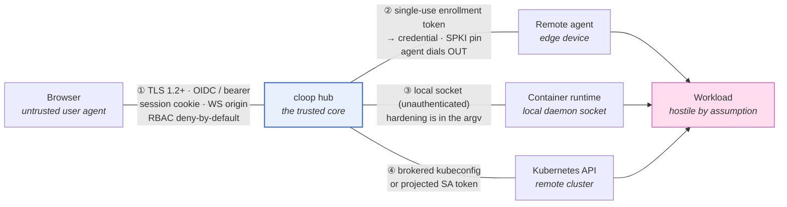

# Security model

What cloop's hub trusts, what it authenticates, and which test proves each claim.

cloop's security model is spread across packages that deliberately do not import
each other — `pkg/executor` (host-execution policy), `pkg/secretbroker` (scoped
credential grants), `pkg/egressbroker` (network leases), `pkg/authz` (RBAC),
`pkg/oidcauth` (SSO), `pkg/ui` and `pkg/apiserver` (the control plane). Nothing
in that arrangement fails loudly when a refactor quietly reconnects the UI to
`os/exec`, widens a container's privileges, or lets an expired lease redeem.
So every guarantee below ends in a row of the
[guarantee → test table](#the-guarantee--test-table), and that table is a CI gate.

- [Trust boundaries](#trust-boundaries)
- [The no-host-execution guarantee](#the-no-host-execution-guarantee)
- [Identity, roles and permissions](#identity-roles-and-permissions)
- [The guarantee → test table](#the-guarantee--test-table)
- [What is not mitigated](#what-is-not-mitigated)

---

## Trust boundaries



The hub is the only trusted component. Everything on the far side of a numbered
edge is assumed to be capable of lying: a browser session can be an attacker
with a stolen cookie, an enrolled device can be compromised, and a **workload is
hostile by assumption** — it runs code the hub did not write, chosen by an LLM.

### ① Browser ↔ hub

| Concern | Mechanism | Where |
| --- | --- | --- |
| Transport | TLS 1.2 minimum; ECDHE+AEAD cipher suites only — no CBC, no static RSA | `pkg/tlsconf/tlsconf.go:122-168` |
| Authentication | OIDC ID token validated against provider JWKS (RS256/ES256), **or** a static bearer token for headless deployments | `pkg/oidcauth/oidcauth.go:162-211,309-328` |
| Session | `cloop_session` cookie: `HttpOnly`, `Secure` (`auto`/`always`/`never`), `SameSite=Strict` under TLS and `Lax` on loopback plaintext | `pkg/oidcauth/oidcauth.go:495-507` |
| CSRF | `SameSite=Strict` is the primary defence; login flow handles the cross-site navigation case explicitly | `pkg/oidcauth/oidcauth.go:334-354` |
| WebSocket hijacking | `wsOriginAllowed`: absent `Origin` (CLI/agent), loopback, `Origin` host == request host, or an explicit `ui.allowed_ws_origins` entry | `pkg/ui/server.go` |
| Authorization | every route declares its `Perm` in `routeTable()`; `gate()` wraps each one; `require()` is the single enforcement point | `pkg/ui/routes.go:143,210`, `pkg/ui/authz.go:214` |
| Abuse | per-IP token-bucket rate limiting; bounded WebSocket connections per IP and in total | `pkg/ui` |

The route table is the design decision worth calling out. Permissions are not
checked inside handlers, where a new handler would simply forget; they are
declared *alongside the route* and applied by `gate()` at registration, and
`routeSpec.validate()` refuses a route that declares no permission at all.
Reaching an endpoint without a permission requires explicitly marking it
`public`.

### ② Hub ↔ remote agent

The agent dials out; the hub never dials in. Authentication is a two-phase
handoff (`pkg/executor/remote/enroll.go`):

1. **Enrollment token** — 32 random bytes, single-use, TTL 15 min by default and
   24 h maximum. Only the SHA-256 hash is stored. The wire format
   `clet1.<id>.<secret>.<HMAC>` carries a truncated HMAC-SHA256 (keyed by
   `pkg/security`'s signing key) so a tampered token is rejected on shape,
   before any database lookup. Redemption is `UPDATE … WHERE redeemed_at IS
   NULL`, so concurrent redemptions cannot both win.
2. **Long-lived credential** — issued on first connect, `clac1…`, stored
   0600 at `~/.cloop/agent.json`, again persisted hub-side as a SHA-256 hash
   only. Presented as `Authorization: Bearer` on every reconnect.

All secret comparisons use `crypto/subtle.ConstantTimeCompare`.

**Agent-side certificate pinning** closes the other direction. The device
verifies the hub's SPKI fingerprint (`sha256:<base64>`, comma-separate several
to stage a key rotation) rather than trusting the system store alone
(`pkg/executor/agent/transport.go:43-82`). `tlsconf.CheckEndpoint` refuses
plaintext `ws://` to a non-loopback host unless `--insecure-transport` is passed
explicitly. Pinning a plaintext URL is an error, not a silent no-op — there is
no certificate to pin against.

Revocation cascades: `cloop executor revoke <id>` marks both the enrollment
record and the derived agent credential revoked, and the hub sends `bye` with
`reconnect=false` so the agent stops rather than backing off and retrying.

### ③ Hub ↔ container runtime

The hub talks to a local Docker/Podman socket, which is **unauthenticated by
design** — anyone who can reach that socket is already root-equivalent on the
host. This boundary therefore protects the *host from the workload*, not the
socket from the hub. All of the enforcement lives in the argv the hub builds:

```
--pull=never  --cap-drop=ALL  --security-opt=no-new-privileges  --read-only
--user <non-root uid>  --network=none  --memory-swap == --memory
--volume <project dir>:/cloop/work    (the only host mount)
```

Because `buildRunArgs` is a pure function, these flags are checked exhaustively
against every option combination without needing a runtime present, and a
denylist rejects operator `ExtraArgs` such as `--privileged`, `--net=host`,
`--cap-add`, `--device`, `--pid=host` or a mounted runtime socket
(`pkg/executor/container/argv.go:371-393`).

### ④ Hub ↔ Kubernetes cluster

Credentials arrive as a [brokered kubeconfig lease](../guides/secrets.md#kubeconfig)
held in memory for the handle's lifetime — never written to the hub's disk — or,
in-cluster, as the Pod's own projected ServiceAccount token (rotated by kubelet).

The Pod spec forces `runAsNonRoot`, a read-only root filesystem, all
capabilities dropped, `seccompProfile: RuntimeDefault`, and
`automountServiceAccountToken: false`, so a workload Pod holds no cluster
credential of its own.

The chart's executor Role is deliberately narrow, and CI asserts it in both
directions: it **grants** `create/get/list/watch/delete` on Pods and `get` on
`pods/log` in the workload namespace, and **denies** `update`/`patch` on Pods,
any access to Secrets, and anything at all in the hub's own namespace. An
executor that could read Secrets would make the secret broker decorative.

---

## The no-host-execution guarantee

> With `executors.allow_host_process: false`, no request to the hub can cause a
> process to be forked on the hub's host. Not through a handler, not through a
> helper three packages away, not by resolving an executor that turns out to be
> the local one.

**Configuration** — `.cloop/config.yaml`:

```yaml
executors:
  allow_host_process: false   # `cloop hub bootstrap` writes this by default
```

Also settable with `cloop config set executors.allow_host_process false`.

**Enforcement** is layered, because any single check is one refactor away from
being bypassed (`pkg/executor/policy.go`):

| Layer | What refuses | Result |
| --- | --- | --- |
| Registration | `Registry.Register` rejects a driver reporting `IsolationNone` | the host driver is never in the fleet |
| Policy sweep | `ApplyHostExecutionPolicy(false)` evicts already-registered non-isolating drivers | tightening at runtime takes effect immediately |
| Resolution | `Registry.Resolve` refuses a resolved executor with no isolation | `*HostExecutionDeniedError` + isolated alternatives |
| Placement | `Select` rejects candidates on `ConstraintHostPolicy` | no failover lands on the host |
| Driver | `localprocess.Start` re-checks before spawning | backstop for direct callers |
| HTTP | five host-touching endpoints check `denyHostSideEffect` | HTTP 409 naming `allow_host_process` |

The policy is a **ratchet**: `ApplyHostExecutionPolicy` only ever tightens.
Passing `true` after `false` is a no-op, so a later config reload, a
partially-applied YAML edit, or a race between two goroutines cannot re-open
host execution for the process's lifetime.

Five endpoints legitimately touch the host — Claude Code auth (status, login
start, login code, logout) and replay-run creation. They are not exempt: they are
*gated*, and `tests/security/callgraph.go:39-48` names each one with the reason
it is allowed to exist. `TestGatedListsAgree` fails if that list and the list of
gated HTTP routes ever diverge, so a new gated handler cannot be added on one
side only.

---

## Identity, roles and permissions

Deny by default: an identity that matches no binding gets `oidc.default_role`,
which `cloop hub bootstrap` writes as `none`.

**Roles**, in ascending order (`pkg/authz/authz.go:156-222`):

| Role | Adds |
| --- | --- |
| `none` | nothing — the default default |
| `viewer` | `project.read`, `executor.read` |
| `operator` | `run.start`, `run.stop`, `task.mutate` |
| `maintainer` | `project.write`, `config.write`, `secret.grant`, `secret.revoke` |
| `admin` | everything, including `executor.manage`, `audit.read`, `user.manage` |

**Permissions** (`AllPermissions`): `project.read`, `project.write`, `run.start`,
`run.stop`, `task.mutate`, `executor.read`, `executor.manage`, `secret.grant`,
`secret.revoke`, `config.write`, `audit.read`, `user.manage`. Plus `public`, an
explicit escape hatch used only by unguarded routes (the dashboard shell, the
OIDC login endpoints, `/api/me`, `/healthz`, `/readyz`).

Roles are granted by matching a claim from the ID token — `group`, `role`,
`email` or `sub` — optionally scoped to a project. A static bearer token
authenticates as `admin` with source `static_token`, which is why it belongs
only in deployments that have no SSO. Every privileged decision, allow or deny,
is written to the audit trail (`pkg/ui/authz.go:294`).


### Configuring OIDC single sign-on

The dashboard can authenticate users against any OpenID Connect provider
(Keycloak, Dex, Authentik, Auth0, Okta, Google, Azure AD, …). It is
**disabled by default** — nothing changes unless you opt in via
`.cloop/config.yaml` in the directory `cloop ui` runs from:

```yaml
ui:
  oidc:
    enabled: true
    issuer: https://auth.example.com/realms/main
    client_id: cloop-dashboard
    client_secret: "..."
    redirect_url: https://cloop.example.com/auth/callback
    admin_emails: [ops@example.com]   # optional: these users see all projects
    # scopes: [openid, profile, email]  # default
    # session_ttl_hours: 24             # default; 1..720
    # cookie_secure: auto               # auto | always | never
```

Register cloop at your IdP as a **confidential client** with the
authorization-code flow and the redirect URL above (PKCE is used
automatically). All four required fields must be set or `cloop ui` refuses
to start — the server fails closed rather than silently serving without
authentication. The same keys are settable via `cloop config set
ui.oidc.<key> <value>`.

When enabled:

- Every browser request needs an IdP session; unauthenticated visitors are
  redirected to the sign-in flow at `/auth/login`. A signed-in user chip and
  sign-out button appear in the header.
- **Per-user projects**: projects created through the UI are owned by the
  creating user and are visible only to them (and to `admin_emails`).
  Pre-existing/CLI-registered projects have no owner and stay visible to
  every authenticated user. Ownership is recorded in the multi-project
  registry (`~/.cloop/projects.json`, `owner` field).
- The static bearer token (`--token` / `CLOOP_UI_TOKEN`) keeps working for
  API automation and sees all projects.
- Sessions live in memory: restarting the dashboard signs everyone out
  (they are silently re-authenticated by the IdP on the next navigation).

### Configuring role mappings

Map OIDC claims to roles under `ui.oidc.role_mappings`. Each mapping binds a
claim value to a role, optionally narrowed to one project or one executor:

```yaml
ui:
  oidc:
    enabled: true
    # ...
    default_role: none          # role for users matching no mapping
    role_mappings:
      - {claim: group, value: cloop-admins,  role: admin}
      - {claim: group, value: engineering,   role: operator}
      - {claim: role,  value: sre,           role: maintainer}
      # Narrower scopes override broader ones — in both directions:
      - {claim: group, value: engineering, role: maintainer, project: payments}
      - {claim: group, value: engineering, role: viewer,     project: infra}
      - {claim: email, value: dana@example.com, role: admin, executor: edge-1}
```

`claim` is `group`, `role`, `email`, or `sub`. Group and role values match
case-insensitively and ignore a leading `/`, so Keycloak's `/cloop-admins`
path form works as written. Group claims are read from `groups`; role claims
from `roles`, Keycloak's `realm_access.roles`, and this client's entry under
`resource_access`. `project` matches either a project's registry name or its
filesystem path.

**Precedence.** Only mappings whose scope the request satisfies apply. Those
are ranked by specificity — project+executor, then executor, then project,
then unscoped — and the most specific tier wins outright; within a tier the
strongest role wins. A more specific mapping therefore *overrides* a broader
one instead of merging with it, which is what lets you both promote a global
viewer on one project and hold a global maintainer down to viewer on a
sensitive one. `admin_emails` participates as an unscoped `admin` mapping, so
it keeps working and can still be narrowed per project.

Anything not granted is denied. Denials return `403` with the required
permission named; scopes you cannot read return `404` instead, so error codes
never reveal whether a project exists. Every denial and every privileged
action is appended to the audit log (`cloop events`) with the acting subject.
The dashboard hides or disables controls your role cannot use.

**Enabling RBAC is opt-in.** With no `role_mappings` and no `default_role`,
authorization behaves exactly as it did before — every authenticated user has
full access — so turning on SSO does not lock out a deployment that has not
written a policy yet. Writing a single mapping (or setting `default_role`,
including to `none`) switches the deployment to deny-by-default. An invalid
role or claim name aborts startup rather than silently never matching.

---

## The guarantee → test table

Every row is machine-checked by `tests/security/`, which runs as a **required**
CI job (`security-conformance`), separate from the main test job so that a
failure reads as *"a security guarantee broke"* rather than *"a test broke"*.

```bash
go test -race ./tests/security/                                    # the whole suite
go test ./tests/security/ -run TestNoHandlerReachesProcessExecution -v
go test ./tests/security/ -run XXX -fuzz FuzzFrameDecoding -fuzztime 5m
```

`-race` is not decoration: the single-use enrollment token check races eight
concurrent redemptions against each other, and a non-atomic guard is exactly
what it is looking for.

### No host execution — `callgraph_test.go`, `strictmode_test.go`

| Guarantee | Test |
| --- | --- |
| No HTTP handler in `pkg/ui` or `pkg/apiserver` reaches `exec.Command` / `syscall.Exec` except through the executor boundary | `TestNoHandlerReachesProcessExecution` |
| The call-graph analysis actually detects a violation (meta-test against a seeded one) | `TestAnalysisDetectsASeededViolation` |
| The executor boundary stops traversal as a boundary — it is not a blanket exemption for everything it calls | `TestExecutorBoundaryIsNotTraversed` |
| Under strict mode, registering a non-isolating driver fails | `TestStrictModeRefusesHostExecutorAtRegistration` |
| Under strict mode, calling `localprocess.Start` directly fails | `TestStrictModeRefusesHostExecutorAtStart` |
| Under strict mode, `Resolve` returns `*HostExecutionDeniedError` naming isolated alternatives | `TestStrictModeRefusesAtResolve` |
| Tightening the policy evicts drivers already registered | `TestApplyHostExecutionPolicyEvictsHostDrivers` |
| The policy ratchets — it can never be loosened back | `TestPolicyOnlyTightens` |
| Each of the five host-touching endpoints returns 409 naming `allow_host_process` | `TestGatedHandlersRefuseUnderStrictMode` |
| The gated-endpoint list and the gated-call-graph list cannot drift apart | `TestGatedListsAgree` |

### Secret non-disclosure — `secrets_test.go`, `audit_test.go`

| Guarantee | Test |
| --- | --- |
| The leak detector itself catches base64, hex and URL-encoded forms, not just literals | `TestLeakDetectorCatchesEncodedForms` |
| Brokered material never appears in list APIs, error messages or audit rows | `TestBrokeredMaterialIsNeverDisclosed` |
| Broker errors never echo the credential that caused them | `TestBrokerErrorsDoNotEchoCredentials` |
| Redaction recognises known credential shapes (`sk-ant-…`, PATs, …) | `TestRedactStringRemovesKnownCredentialShapes` |
| Redaction never emits a credential body, for arbitrary inputs | `FuzzRedactStringNeverEmitsACredentialBody` |
| The audit `reason` field — free text, the easiest place to leak — is scrubbed | `TestRedactEventScrubsTheReasonField` |
| `config.yaml` API keys never reach the audit trail | `TestConfigAPIKeysNeverReachTheAuditTrail` |
| Enrollment tokens never reach the audit trail | `TestExecutorEnrollmentTokenNeverReachesTheAuditTrail` |
| Secret-broker grant/revoke rows carry decisions, never material | `TestSecretBrokerDecisionsNeverCarryMaterial` |
| Redaction is stable under the hash chain — redacting does not break verification | `TestRedactionSurvivesTheHashChain` |
| *Every* audit row rendering is scanned for canary secrets, not a sampled subset | `TestEveryAuditRowIsScannedForSecrets` |

### Lease and token invariants — `leases_test.go`

| Guarantee | Test |
| --- | --- |
| An expired grant delivers zero material | `TestLeaseIsRefusedAfterGrantExpiry` |
| Renewal re-evaluates the grant's expiry mid-session, rather than blindly extending | `TestLeaseRenewalReevaluatesExpiryMidSession` |
| Revocation cuts off renewals immediately, not just future leases | `TestRevocationTakesEffectMidSession` |
| An enrollment token redeems exactly once | `TestEnrollmentTokenIsSingleUse` |
| Eight concurrent redemptions of one token produce exactly one winner | `TestEnrollmentTokenSurvivesOnlyOneOfManyConcurrentRedemptions` |
| A token past its TTL is rejected | `TestEnrollmentTokenExpires` |
| A token with a bad MAC is rejected before any storage access | `TestTamperedEnrollmentTokenIsRejected` |
| Secret comparisons are constant-time | `TestSecretComparisonsAreConstantTime` |
| *Statically*: every known secret-hash comparison goes through `crypto/subtle` | `TestKnownSecretComparisonsUseSubtle` |

### Container sandbox — `container_test.go`

| Guarantee | Test |
| --- | --- |
| No forbidden flag appears in the argv under any combination of options | `TestContainerArgvNeverBreaksItsOwnSandbox` |
| The driver refuses to run a workload as root | `TestContainerRefusesRootUser` |
| Every spelling of uid 0 is rejected, not just the literal `root` | `TestValidateNonRootUserRejectsRootSpellings` |
| Every spelling of host networking is rejected (`--net=host`, `--network=host`, …) | `TestContainerRejectsHostNetworkSpellings` |
| Operator `ExtraArgs` cannot re-open the sandbox | `TestContainerRejectsSandboxEscapingExtraArgs` |
| Secret values never enter the argv — they are forwarded as bare `--env NAME` | `TestContainerSecretsNeverEnterArgv` |

### Agent protocol and transport — `framing_test.go`, `transport_test.go`

The remote agent is the only boundary where the peer is not ours, so its
decoders are fuzzed rather than merely tested.

| Guarantee | Test |
| --- | --- |
| Arbitrary bytes off the wire never panic a decoder | `FuzzFrameDecoding` |
| Truncated frames never panic a decoder | `FuzzFrameTruncation` |
| An oversized frame is rejected rather than allocated | `TestOversizedFrameIsRejected` |
| The size cap is a sane value, not an accidental one | `TestFrameSizeCapIsSane` |
| Handle-scoped frames without a handle are rejected | `TestHandleScopedFramesRequireAHandle` |
| Unsupported protocol versions are rejected | `TestFrameVersionIsBounded` |
| *Statically*: the agent dial path never sets `InsecureSkipVerify` | `TestNoInsecureSkipVerifyOnAgentDial` |
| Any `InsecureSkipVerify` elsewhere is declared with a written justification | `TestInsecureSkipVerifyElsewhereIsDeclared` |
| With `--pin`, the dial installs a `VerifyPeerCertificate` hook checking the pin set | `TestAgentDialUsesPinnedTLSConfig` |
| A cross-origin browser WebSocket upgrade is refused with 403 | `TestHubRejectsCrossOriginUpgrade` |

### When a check fails

Read the failure as a claim about the system, not about the test. Three of these
checks (`TestNoHandlerReachesProcessExecution`, `TestKnownSecretComparisonsUseSubtle`,
`TestNoInsecureSkipVerifyOnAgentDial`) are static analyses over the whole
module, so they fail on code that no runtime test would ever execute — which is
the point. If a new gated handler genuinely needs host access, add it to *both*
lists in `tests/security/` with the reason; `TestGatedListsAgree` exists to make
that a deliberate act.

---

## What is not mitigated

Stated plainly, because a security document that only lists wins is marketing.

**A workload can disclose its own credentials.** The suite asserts non-disclosure
by *cloop's* surfaces. It cannot assert that a workload never prints its own
token to stdout — the workload holds the plaintext by design, and task output is
not redacted (`tests/security/secrets_test.go:13-20`). Scope grants so that the
blast radius of such a disclosure is a single repo for a few hours.

**`egress_proxy` constraints are enforced outside the broker.** For kubeconfig,
registry and env secrets the broker *rewrites the payload* before delivery, so a
narrower credential cannot be widened by its holder. `egress_proxy` is different:
the allowlist travels to the executor and the enforcement point is the network
policy there (`pkg/secretbroker/model.go`). The
[egress broker's proxy](../guides/secrets.md#egress-leases) does enforce it for
traffic that goes through it; a workload with an unrelated route out is not
covered by that grant.

**`github_pat` is enforced at the point of use, not by construction.** GitHub has
no API to narrow an already-issued PAT, so the broker ships a git credential
helper that releases the token only for allowlisted paths. That binds `git`. It
does not bind a workload that reads the token file and calls the REST API
directly. A bare `GITHUB_TOKEN` is exported only when the allowlist is explicitly
`*`.

**Pod environment is readable in-namespace.** `Spec.Env` lands in the Pod object,
so anyone with `get pods` in the workload namespace can read it. Run workloads in
a dedicated namespace with its own RBAC.

**No image signature verification.** `--pull=never` prevents surprise pulls at
task time, but cloop does not verify image signatures or digests. Pin by digest
and verify upstream.

**The container runtime socket is trusted implicitly.** Anyone who can reach the
Docker/Podman socket the hub uses is root-equivalent on that host. Isolation is
protecting the host from workloads, not the socket from the hub.

**Rotation is partly manual.** See [key rotation](../operations/runbook.md#key-rotation)
for what rotates automatically and what does not.

---

## See also

- [Threat model](threat-model.md) — STRIDE per boundary, with the honest column
- [Executor architecture](../architecture/executors.md) — how the boundaries connect
- [Secret and egress grants](../guides/secrets.md) — granting credentials safely
- [Operator runbook](../operations/runbook.md) — audit verification and rotation
