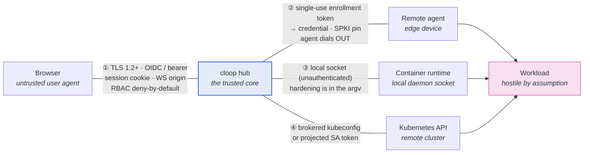

# Security model

What cloop's hub trusts, what it authenticates, and which test proves each claim.

cloop's security model is spread across packages that deliberately do not import
each other — `pkg/executor` (host-execution policy), `pkg/secretbroker` (scoped
credential grants), `pkg/egressbroker` (network leases), `pkg/authz` (RBAC),
`pkg/oidcauth` (SSO), `pkg/ui` and `pkg/apiserver` (the control plane). Nothing
in that arrangement fails loudly when a refactor quietly reconnects the UI to
`os/exec`, widens a container's privileges, or lets an expired lease redeem.
So every guarantee below ends in a row of the
[guarantee → test table](#the-guarantee--test-table), and that table is a CI gate.

- [Trust boundaries](#trust-boundaries)
- [The no-host-execution guarantee](#the-no-host-execution-guarantee)
- [Workspace provisioning](#workspace-provisioning)
- [Identity, roles and permissions](#identity-roles-and-permissions)
- [Session lifecycle and revocation](#session-lifecycle-and-revocation)
- [Release provenance and the trust root](#release-provenance-and-the-trust-root)
- [The guarantee → test table](#the-guarantee--test-table)
- [What is not mitigated](#what-is-not-mitigated)

---

## Trust boundaries


```mermaid
flowchart LR
    B["Browser<br/><i>untrusted user agent</i>"]
    H["cloop hub<br/><i>the trusted core</i>"]
    A["Remote agent<br/><i>edge device</i>"]
    C["Container runtime<br/><i>local daemon socket</i>"]
    K["Kubernetes API<br/><i>remote cluster</i>"]
    W["Workload<br/><i>hostile by assumption</i>"]

    B ---|"① TLS 1.2+ · OIDC / bearer<br/>session cookie · WS origin<br/>RBAC deny-by-default"| H
    H ---|"② single-use enrollment token<br/>→ credential · SPKI pin<br/>agent dials OUT"| A
    H ---|"③ local socket (unauthenticated)<br/>hardening is in the argv"| C
    H ---|"④ brokered kubeconfig<br/>or projected SA token"| K
    A --> W
    C --> W
    K --> W

    %% Tints, not opaque fills, and no text colour: see
    %% tests/docs/diagram_contrast_test.go.
    style H fill:#4674d126,stroke:#4674d1,stroke-width:2px
    style W fill:#cc339926,stroke:#c39
```

The hub is the only trusted component. Everything on the far side of a numbered
edge is assumed to be capable of lying: a browser session can be an attacker
with a stolen cookie, an enrolled device can be compromised, and a **workload is
hostile by assumption** — it runs code the hub did not write, chosen by an LLM.

### ① Browser ↔ hub

| Concern | Mechanism | Where |
| --- | --- | --- |
| Transport | TLS 1.2 minimum; ECDHE+AEAD cipher suites only — no CBC, no static RSA | `pkg/tlsconf/tlsconf.go:122-168` |
| Authentication | OIDC ID token validated against provider JWKS (RS256/ES256), **or** a static bearer token for headless deployments | `pkg/oidcauth/oidcauth.go:162-211,309-328` |
| Exposure | A hub with neither listens on `127.0.0.1` unless an address is named; one beyond loopback is refused unless `ui.allow_unauthenticated_network` acknowledges it. API tokens do not count: they restrict the callers that present one | `pkg/exposure`, `pkg/ui/listen.go`, `pkg/apiserver/listen.go` |
| Session | `cloop_session` cookie: `HttpOnly`, `Secure` (`auto`/`always`/`never`), `SameSite=Strict` under TLS and `Lax` on loopback plaintext | `pkg/oidcauth/oidcauth.go:495-507` |
| CSRF | A state-changing request must come from one of the hub's own pages — `Sec-Fetch-Site: same-origin`/`none`, or without it an `Origin` exactly the hub's own — unless it carries `Authorization: Bearer`, on every hub, cookie or none; its body must be JSON (multipart on the upload routes), and every handler decodes through one decoder that refuses the rest; no CORS header is sent to anyone. `SameSite=Strict` stays as depth: it does not tell origins of one site apart | `pkg/sameorigin`, `pkg/ui/originguard.go`, `pkg/jsonbody` |
| DNS rebinding | A hub without sign-in answers only to `localhost`, IP addresses, `ui.external_url`'s host, its cluster's advertise hosts and `ui.allowed_hosts`; any other `Host` is 421 | `pkg/ui/originguard.go` (`hostGuard`) |
| WebSocket hijacking | `wsOriginAllowed`: absent `Origin` (CLI/agent), or an `Origin` exactly — scheme, host, port — one of the hub's own: the one the request was addressed to, `ui.external_url`, `ui.allowed_origins`, `ui.allowed_ws_origins`. No loopback or other-port allowance | `pkg/ui/originguard.go`, `pkg/executor/remote/origin.go` |
| Forwarded headers | `X-Forwarded-Proto`/`-Host`/`-For` believed from loopback, `ui.trusted_proxies` and signed cluster forwards only; `X-Forwarded-For` walked from the right | `pkg/sameorigin/proxies.go` |
| Authorization | every route declares its `Perm` in `routeTable()`; `gate()` wraps each one; `require()` is the single enforcement point | `pkg/ui/routes.go:143,210`, `pkg/ui/authz.go:214` |
| Abuse | per-IP token-bucket rate limiting; bounded WebSocket connections per IP and in total | `pkg/ui` |

The route table is the design decision worth calling out. Permissions are not
checked inside handlers, where a new handler would simply forget; they are
declared *alongside the route* and applied by `gate()` at registration, and
`routeSpec.validate()` refuses a route that declares no permission at all.
Reaching an endpoint without a permission requires explicitly marking it
`public`.

### ② Hub ↔ remote agent

The agent dials out; the hub never dials in. Authentication is a two-phase
handoff (`pkg/executor/remote/enroll.go`):

1. **Enrollment token** — 32 random bytes, single-use, TTL 15 min by default and
   24 h maximum. Only the SHA-256 hash is stored. The wire format
   `clet1.<id>.<secret>.<HMAC>` carries a truncated HMAC-SHA256 (keyed by
   `pkg/security`'s signing key) so a tampered token is rejected on shape,
   before any database lookup. Redemption is `UPDATE … WHERE redeemed_at IS
   NULL`, so concurrent redemptions cannot both win.
2. **Long-lived credential** — issued on first connect, `clac1…`, stored
   0600 at `~/.cloop/agent.json`, again persisted hub-side as a SHA-256 hash
   only. Presented as `Authorization: Bearer` on every reconnect.

All secret comparisons use `crypto/subtle.ConstantTimeCompare`.

**Agent-side certificate pinning** closes the other direction. The device
verifies the hub's SPKI fingerprint (`sha256:<base64>`, comma-separate several
to stage a key rotation) rather than trusting the system store alone
(`pkg/executor/agent/transport.go:43-82`). `tlsconf.CheckEndpoint` refuses
plaintext `ws://` to a non-loopback host unless `--insecure-transport` is passed
explicitly. Pinning a plaintext URL is an error, not a silent no-op — there is
no certificate to pin against.

Revocation cascades: `cloop executor revoke <id>` marks both the enrollment
record and the derived agent credential revoked, and the hub sends `bye` with
`reconnect=false` so the agent stops rather than backing off and retrying.

**Protocol versioning.** Frames carry a version; the hub accepts
`[MinProtocolVersion, ProtocolVersion]` = `[1, 2]` and stamps every outbound
frame with the version the session negotiated, not with its own maximum — a v1
agent rejects a v2 envelope as out of range, so stamping the maximum would make
negotiation decorative (`TestSessionStampsNegotiatedVersionOnOutboundFrames`).
v2 added the `revoke` frame. A v1 agent still connects and still runs ordinary
work; what it cannot receive is a workload carrying revocable secret material,
because it has no frame with which to give it back. The hub refuses that
*placement* with a diagnostic naming the device, the credential and the upgrade
command, rather than refusing the device
(`TestOldAgentIsRefusedRevocableWorkload`).

**What a device sends back is bounded on the hub (Task 20399).** A run's
write-back bundle and a seeded run's project state are held in hub memory until
collected, and a device decides how much of either it sends. So a handle accepts
only the bundle its own dispatch asked for, up to that dispatch's cap — persisted
with the handle, so a restarted or adopting hub enforces it too — and a project
document only from a seeded run; nothing after the handle's final status or its
result frame; and everything an executor's handles hold counts against its own
budget (`executors.remote.max_pinned_writeback_bytes`, 256 MiB) under a ceiling
for the whole process (`max_pinned_writeback_total_bytes`, 1 GiB). Revoking or
removing a device lets go of everything its handles hold. See
[returned work held in hub memory](#returned-work-held-in-hub-memory--writeback_pinning_testgo-and-the-package-suites)
for the tests and
[what a device's returned work may hold](../architecture/executors.md#what-a-devices-returned-work-may-hold-on-the-hub-task-20399)
for the mechanism.

### ③ Hub ↔ container runtime

The hub talks to a local Docker/Podman socket, which is **unauthenticated by
design** — anyone who can reach that socket is already root-equivalent on the
host. This boundary therefore protects the *host from the workload*, not the
socket from the hub. All of the enforcement lives in the argv the hub builds:

```
--pull=never  --cap-drop=ALL  --security-opt=no-new-privileges  --read-only
--user <non-root uid>  --network=none  --memory-swap == --memory
--volume <project dir>:/cloop/work    (the only host mount)
```

Because `buildRunArgs` is a pure function, these flags are checked exhaustively
against every option combination without needing a runtime present, and a
denylist rejects operator `ExtraArgs` such as `--privileged`, `--net=host`,
`--cap-add`, `--device`, `--pid=host` or a mounted runtime socket
(`deniedExtraArgs` in `pkg/executor/container/argv.go`).

One control is not in the argv, because it cannot be: what a sandbox with a
network may *reach* is a kernel ruleset on the host, installed on the sandbox
bridge before any container can join it. See
[the network the sandbox sits on](#the-network-the-sandbox-sits-on).

### ④ Hub ↔ Kubernetes cluster

Credentials arrive as a [brokered kubeconfig lease](../guides/secrets.md#kubeconfig)
held in memory for the handle's lifetime — never written to the hub's disk — or,
in-cluster, as the Pod's own projected ServiceAccount token (rotated by kubelet).

The Pod spec forces `runAsNonRoot`, a read-only root filesystem, all
capabilities dropped, `seccompProfile: RuntimeDefault`, and
`automountServiceAccountToken: false`, so a workload Pod holds no cluster
credential of its own.

The chart's executor Role is deliberately narrow, and CI asserts it in both
directions: it **grants** `create/get/list/watch/delete` on Pods, `get` on
`pods/log`, and `create`/`delete` on Secrets in the workload namespace, and
**denies** `update`/`patch` on anything, *reading* Secrets, and anything at all
in the hub's own namespace.

The Secret rule is write-only on purpose. The driver creates one Secret holding
the credential a [workspace fetch](#workspace-provisioning) needs, points the
Pod's init container at it by reference, and deletes it when that container
terminates; it never reads a Secret back, so an executor that could enumerate
what else lives in the namespace — which is what would make the secret broker
decorative — still cannot. Nor does it widen the namespace's blast radius:
`pods: create` plus `pods/log: get`, which this identity already held, is enough
to read any Secret in the namespace by mounting it into a Pod and printing it.
The namespace has always been the boundary. Run workloads in one of their own.

### Between hub members

The trusted core may be several processes: `cloop ui` instances serving one
control plane as a [hub cluster](../architecture/hub-cluster.md). They are not a
numbered boundary, because they trust each other exactly as much as one hub
trusts itself — they share its database. What needs protecting is the channel
between them, which clients can reach too:

| Concern | Mechanism | Where |
| --- | --- | --- |
| A client posing as a member | HMAC over sender, recipient, time, nonce, method, URI and client address, keyed by a secret in the control-plane database; a failed claim is refused with `403`, never served as an ordinary request | `pkg/hubcluster/peer.go` |
| Replay | Single-use nonce at the recipient within a two-minute window; the signature names the recipient, so no other member accepts it | `pkg/hubcluster/peer.go` |
| Authorization on the forwarded request | Re-evaluated by the member that answers, from the caller's own cookie or token — forwarding moves a request, it does not vouch for it | `pkg/ui/cluster.go` |
| Confidentiality | `https://` advertise URLs where the traffic can be observed, verified against the system roots, the hub's certificate and `ui.cluster.peer_ca_file`; plain HTTP is for loopback and one node's Pod network | `cmd/ui_cluster.go` |

[Hub members](threat-model.md#cross-cutting-hub-members) in the threat model
lists what remains.

### The kernel underneath the sandbox

Boundaries ③ and ④ both end at a workload that shares the **executing machine's
kernel**: a container on the hub's host, a Pod on a node. The hardening above is
namespaces, cgroups, seccomp and capabilities, all of which are host-kernel
features enforced by the same kernel the workload is running on. A local
privilege escalation in that kernel is therefore a *host* compromise, not a
sandbox one, and it is the residual risk both boundaries carry.

Configuring a Kata runtime —
[`executors.container.oci_runtime`](../reference/configuration.md#vm-isolated-sandboxes-kata-containers)
locally, `executors.kubernetes.runtime_class` on a cluster — moves that
particular risk. Each workload boots in a lightweight VM with a kernel of its
own, so the same flags are now enforced by the *guest* kernel, inside a machine
the host kernel does not see into. What used to be one kernel bug becomes a
guest-kernel bug **plus** a hypervisor escape, and the executor advertises the
difference as `Capabilities().Virtualized`, which placement can require.

Four things it deliberately does not change, because a boundary that is
misdescribed is worse than one that is merely weaker:

- **The `Virtualized` claim is trusted, not verified.** It is derived from the
  configured runtime *name* (`kata`, `kata-qemu`, a `kata-*` RuntimeClass) and
  nothing else, because a name is all the OCI and RuntimeClass APIs expose to a
  client. Anyone who can write the hub's config can register runc under the name
  `kata` and be believed by every consumer of that flag, placement included.
  Preflight's `/dev/kvm` check is evidence, not a retraction: `Capabilities()` is
  computed from the name alone, so a container executor whose KVM check *failed*
  still advertises `Virtualized` and still takes work — it is `degraded`, and
  degraded nodes are schedulable. Only the smoke test ever boots a VM. Config is
  already trusted input here — `allow_host_process` sits in the same file — so
  this widens no boundary, but it does mean the flag describes an *intent* the
  operator expressed, and `cloop executor test` is what turns it into a fact.
- **Egress is unchanged.** A VM has the same network the container would have
  had. `network: none` and a `NetworkPolicy` remain the only things that
  constrain outbound traffic, and a Kata sandbox on a bridge network reaches the
  Internet exactly as a container on one does.
- **The workspace bind mount is still shared.** The container driver still
  mounts the project directory into the sandbox — through virtio-fs rather than
  a bind, but the host directory is the same directory. `SharesHostFilesystem`
  stays true, the workspace kind stays `bind`, and a workload that writes there
  writes to the operator's own checkout. A hypervisor between the two does not
  make a deliberately shared directory unshared.
- **Everything the workload was given, it still has.** Secrets arrive in the
  guest's environment and filesystem on the same terms as before, so the
  [revocation guarantee](#the-lease-revocation-guarantee) and its weak row are
  unchanged, and a workload can still disclose its own credentials.

There is no row for this in the [guarantee → test table](#the-guarantee--test-table)
and that is not an oversight: nothing in `tests/security/` proves a VM booted,
and a test that asserted the flag against the name it was derived from would
assert only that the matcher matches.

### The network the sandbox sits on

Boundaries ③ and ④ end at a network as well as at a kernel. Two things guard
it, they answer different questions, and neither substitutes for the other.

**The egress broker enforces layer 7.** `pkg/egressbroker` is an authenticated
forward proxy, and everything in the
[egress lease](../guides/secrets.md#egress-leases) is checked there: hosts,
ports, HTTP methods, per-session byte quotas, TTL mid-tunnel, resolve-once DNS
pinning, and an SSRF block set that refuses loopback, RFC1918, CGNAT,
link-local, the cloud metadata services (`pkg/cloudmeta` — `169.254.169.254`,
AWS's IPv6 `fd00:ec2::254`, Alibaba Cloud's `100.100.100.200` and the rest),
multicast and the unspecified address *even under `--hosts '*'`*. Every one of those checks is
real. Every one of them applies only to traffic the workload chose to hand the
proxy. `$HTTP_PROXY` is a convention, not a boundary: a harness that opens a
raw socket, runs `curl --noproxy '*'`, resolves over DoH, or speaks SSH, QUIC
or anything that is not HTTP was covered by none of it. The container driver's
own package comment used to say so — *"it does not filter egress"* — and the
Kubernetes driver said the same about its `cloop.dev/egress` label.

**The IP-layer filter enforces layer 3.** `pkg/netfilter` compiles the same
authorisation into an ordered, first-match-wins rule list ending in an implicit
drop, and renders that one policy as an nftables ruleset on the sandbox bridge
(container driver) or as a `NetworkPolicy` (Kubernetes driver). The default
verdict is not a field: there is no authorisation the compiler can be handed
that would justify a firewall an operator could misconfigure into allowing
everything. It binds a workload that does not cooperate, because it is the
kernel rather than an environment variable, and it covers ICMP and everything
else that is neither TCP nor UDP, because an exfiltration channel over ICMP is
still an exfiltration channel. Drops are silent rather than rejected: a sandbox
probing for reachable networks learns nothing from a timeout, whereas an ICMP
unreachable confirms something is listening.

The filter reproduces the proxy's block set prefix for prefix, and reproduces
its waiver rule as *ordering* — the allow for an explicitly granted CIDR is
emitted ahead of the drop that would otherwise cover it, so a grant buys that
prefix on those ports and nothing else. The two implementations have to be
separate code (one produces prefixes for a packet filter, the other evaluates
predicates against one address), so they are checked against each other
address by address, in both directions, by
[`pkg/netfilter/agreement_test.go`](../../pkg/netfilter/agreement_test.go).

| Question a grant answers | Broker (L7) | IP filter (L3) |
| --- | --- | --- |
| Which hosts? | enforced | **not expressible** — becomes every public address |
| Which ports? | enforced | enforced |
| Which address ranges? | enforced | enforced |
| Which HTTP methods? | enforced, for plain HTTP | not expressible |
| How many bytes, for how long? | enforced mid-stream | not expressible |
| SSH, QUIC, DNS, a raw socket | invisible to it | enforced |
| A workload that ignores `$HTTP_PROXY` | not bound by it | bound |

**A hostname allowlist cannot be enforced at layer 3.** This is the caveat that
matters most, so it comes before the good news rather than after it.
`*.github.com` is a name; names do not exist at layer 3, where a packet carries
an address. A policy compiled for *direct* egress from a host-pattern grant is
therefore **"every public address on these ports"**, and no arrangement of
rules makes it narrower. What the compiler can do is refuse to arrive there
quietly, and it does: opening direct egress for a host-pattern grant requires
the caller to set `AllowPublicInternet` explicitly, and the compiled policy
carries a warning naming the patterns and what they became. That warning is
rendered into the nft script as a comment, into the NetworkPolicy as an
annotation, into `cloop egress firewall` output, and into `cloop executor test`
as a separate `egress-scope` finding — separate because burying it inside an
`ok` line would hide the finding an operator most needs to see.

**So the brokered posture is the recommended one**, and not for tidiness: it is
the single configuration where the two layers describe the same set. With
[`egress_filter`](../reference/configuration.md#ip-layer-egress-filtering)
in `internal` mode the sandbox joins a runtime network the runtime installs no
route off, the egress proxy answers at that network's gateway, and the proxy is
the only address off the sandbox it can reach. The host allowlist is then
enforced by the only reachable destination. It needs no `nft`, no
`CAP_NET_ADMIN` and no host privileges at all, and
`TestBrokeredPolicyIsNarrowerThanAnyGrant` is the argument stated as a test:
whatever the grant's hosts say, a brokered policy opens one endpoint.
`TestE2EEgressProxyInAContainer` runs the posture for real: a hub hosting the
proxy, a container on an `--internal` bridge, a granted origin fetched and an
ungranted one refused.

**The hub hosts the proxy, and a session is a run's** (Task 20378). Until then
the broker existed and the hub never bound it, so a grant gave a real run
nothing. Now `cloop ui` binds `executors.egress.listen_addr` at startup — each
cluster member its own, because a session lives in the memory of the broker that
issued it — and every run whose project holds a grant is redeemed one session at
dispatch. What holds the boundary there:

- **The credential reaches the workload and nothing else.** It travels in the
  proxy variables of the run's environment, declared sensitive, so the
  executor scrubs it from the output it captures, the workload scrubs it from
  its own transcript, artifacts and provider-call log, and the hub leaves it
  out of the dispatch record it stores. No journal or audit row has a field that
  could carry it. Building this found the provider-call log storing leased
  values verbatim — the audit decorator sat outside the scrubber — which is
  fixed for every lent credential, not only this one.
- **A session never outlives its run or its grant.** It is renewed only while
  its run's workload is still running, never past the grant's expiry, and
  closed when the run ends, is stopped, or the hub stops. The grant is re-read
  every minute of the run, so a revocation made anywhere — the dashboard, the
  CLI, another hub member — closes the session, and cuts its open tunnels,
  within a minute; through the dashboard of the hub holding it, at once.
- **Opening the proxy in a firewall opens the proxy and nothing beside it.**
  When a ruleset is installed for the sandbox the driver adds the proxy's
  address and port, TCP only, and proves with the compiled policy's own
  `Evaluate` that the sandbox reaches it before installing anything; an
  operator deny list that covers it wins and the run is refused. A device needs
  protocol v18 to do the same, and is issued no session behind a firewall
  until it speaks it. On Kubernetes nothing is added: the Pod's policy must
  already allow the proxy, and the hub proves that it does before redeeming.
- **Nothing is granted by a repository.** `capabilities.network` in
  `.cloop/sandbox.yaml` selects a grant the project already holds; one the hub
  cannot serve is refused with a `409`, never quietly downgraded.

**One deliberate disagreement with the proxy.** The proxy normalises the IPv6
encodings that carry an IPv4 address and judges the address inside. A packet
filter cannot do arithmetic on an embedded address, so the filter drops those
prefixes whole — NAT64 (`64:ff9b::/96`, `64:ff9b:1::/48`), 6to4 (`2002::/16`),
IPv4-translatable (`::ffff:0:0:0/96`) and the deprecated IPv4-compatible
(`::/96`). That is *stricter* than the proxy: `64:ff9b::8.8.8.8` is a public
address the proxy allows and the filter drops. Strictness is the safe direction
here, and no sandbox needs to address a translation prefix itself — that is a
gateway's job. The agreement test permits exactly this class of disagreement
and fails on any other, in either direction. (The v4-*mapped* form,
`::ffff:127.0.0.1`, is a different thing: both layers unwrap it and judge
`127.0.0.1`.)

**One address a containing range never buys: a cloud metadata service.** The
services are one table (`pkg/cloudmeta`) that the proxy, the packet filter and
the `NetworkPolicy` compiler all read — `169.254.169.254`, AWS's IPv6
`fd00:ec2::254` inside `fc00::/7`, Alibaba Cloud's `100.100.100.200` inside
`100.64.0.0/10`, and the others each cloud publishes. An explicit CIDR waives
the block set for the range it names, but a metadata service is reached only
through its own `/32` or `/128`: a prefix that merely contains one opens
everything in the range *except* the service. Every surface that writes an
allowlist refuses the containing form — config load (`cloop ui` will not start,
`cloop hub doctor` fails), the dashboard's device, virtual-executor and project
firewalls (`400`, naming the service and both explicit alternatives), and
egress grants — so the compiler never sees one from a live configuration. When
it does, from a rule set stored before the rule, it fails safe: `Compile` drops
the service ahead of the allow that contains it, the `NetworkPolicy` carries a
matching `except`, and the hub ships a device's firewall with the service in its
denylist, so an agent too old to know the rule closes it too. Azure's WireServer
(`168.63.129.16`) is in the table because it is a *public* address, reached by
`allow_public_internet`; a deny for it is the only thing that closes it, and
`except` keeps it out of the `0.0.0.0/0` peer in a `NetworkPolicy`. One resolver
exception: a metadata address that is also the VM's DNS server (Google Cloud,
Azure) stays reachable on port 53, because a resolver allow opens one port and
the carve sits after it.

Two limits of the layer-3 filter, stated rather than discovered:

- **The container driver's filtered network is per executor, not per task.**
  The network name is derived from the executor id, so every sandbox that
  executor starts joins the same bridge under the same ruleset. Deriving it
  rather than accepting one is deliberate — it stops two differently-filtered
  executors from sharing a bridge, where the second apply would silently
  replace the first's rules — but it does mean the policy is executor-wide.
- **A `NetworkPolicy` is enforced by the cluster's CNI, not by cloop.** flannel
  does not implement one and the API server stores the object regardless, so a
  cluster with the wrong CNI looks identical to a working one from the hub's
  side. cloop does not claim an enforcement it cannot check: preflight reports
  an `egress-enforcement` finding whose severity is the *state of the evidence*
  — a warning while nothing has established it, a **fail** once a probe has
  refuted it — and a project asking for a per-project egress scope
  (`capabilities.egress`) is refused on that executor until enforcement is
  proven by `cloop hub doctor --probe-network-policy` or asserted with
  `executors.kubernetes.network_policy_enforced: true`. The probe is evidence
  rather than testimony: it creates two throwaway Pods and a default-deny
  policy, requires the connection to work *before* the policy and fail after,
  and reports nothing at all when it cannot establish that control. A verdict
  outranks an assertion in both directions. See
  [Executors →](../architecture/executors.md#does-the-cluster-actually-enforce-a-networkpolicy).

---

## The no-host-execution guarantee

> With `executors.allow_host_process: false`, no request to the hub can cause a
> process to be forked on the hub's host. Not through a handler, not through a
> helper three packages away, not by resolving an executor that turns out to be
> the local one.

**Configuration** — `.cloop/config.yaml`:

```yaml
executors:
  allow_host_process: false   # `cloop hub bootstrap` writes this by default
```

Also settable with `cloop config set executors.allow_host_process false`.

**Enforcement** is layered, because any single check is one refactor away from
being bypassed (`pkg/executor/policy.go`):

| Layer | What refuses | Result |
| --- | --- | --- |
| Registration | `Registry.Register` rejects a driver reporting `IsolationNone` | the host driver is never in the fleet |
| Policy sweep | `ApplyHostExecutionPolicy(false)` evicts already-registered non-isolating drivers | tightening at runtime takes effect immediately |
| Resolution | `Registry.Resolve` refuses a resolved executor with no isolation | `*HostExecutionDeniedError` + isolated alternatives |
| Placement | `Select` rejects candidates on `ConstraintHostPolicy` | no failover lands on the host |
| Driver | `localprocess.Start` re-checks before spawning | backstop for direct callers |
| HTTP | five host-touching endpoints check `denyHostSideEffect` | HTTP 409 naming `allow_host_process` |

The policy is a **ratchet**: `ApplyHostExecutionPolicy` only ever tightens.
Passing `true` after `false` is a no-op, so a later config reload, a
partially-applied YAML edit, or a race between two goroutines cannot re-open
host execution for the process's lifetime.

Five endpoints legitimately touch the host — Claude Code auth (status, login
start, login code, logout) and replay-run creation. They are not exempt: they are
*gated*, and `tests/security/callgraph.go:39-48` names each one with the reason
it is allowed to exist. `TestGatedListsAgree` fails if that list and the list of
gated HTTP routes ever diverge, so a new gated handler cannot be added on one
side only.

### Git the hub runs for a feature

A [feature](../guides/features.md) is a git worktree on the hub, and under strict
mode it runs on an executor that cannot see it (Task 20367). Something has to
turn the feature's branch into a bundle before the run and land the returned
work on it afterwards, and only something that can read the hub's filesystem
can — so the hub runs `git` for it. That is process execution on the hub's host,
and it is sanctioned the way every driver is: it lives in
`pkg/executor/featurehub`, inside the executor boundary the call-graph test
stops at, and it runs nothing but `git`, with fixed subcommands, in the
project's own repository.

The repository is not trusted for it. A project bound to a container executor
gets its tree mounted into the sandbox, `.git` included, so a workload can leave
a hook, an `fsmonitor` command or a filter driver there, and the next git
command on the hub would run it. Every invocation from `featurehub` therefore
reads no system or global configuration and carries
`executor.HardenedGitConfig` in its environment, which outranks the
repository's: hooks point at `/dev/null`, `fsmonitor` is off, every filter
driver the repository names has empty commands, signing and automatic
maintenance are off. The same set is applied when a device commits and bundles
a workload's work (`gitprovision.SandboxedRepoEnv`, which also refuses a `.git`
that is a file or a link and drops `alternates`/`commondir`), because there the
tree was the workload's to write.

The returned work is the [write-back](#result-write-back--writeback_bundle_testgo)
path's: vetted into a quarantine ref, then fast-forwarded into the feature's
worktree only when that worktree is clean, on its branch, the work builds on its
HEAD and touches nothing under `.cloop/`. Anything else is kept on a new
`cloop/returned/…` branch, created only if the name is free, and reported as a
conflict; it is never forced. The parent's `.git` is never mounted into a
sandbox to make the feature's pointer resolve.

### No sandbox is reused across tasks

Every task gets a container, or a Pod, that did not exist before it and does not
survive it. There is no warm pool.

This is worth stating explicitly because it is the obvious thing to reach for
when someone measures the cold start. A sandboxed dispatch costs roughly 250 ms
before `run -d` returns and ~430 ms before the task's first byte of output
(`BenchmarkDispatchRuntime`, Docker on a 4-core host, `alpine`). A pool would
remove nearly all of it, and that is exactly why the argument has to be made
here rather than in a performance change.

**What a pool would cost.** A reused sandbox carries everything the previous
task left in it: files written outside the workspace, a poisoned `~/.gitconfig`
or credential helper, a process still running in the namespace, a resolver cache,
anything under `/tmp`. Across *tenants* that is a direct breach of the isolation
the [lease-revocation guarantee](#the-lease-revocation-guarantee) and the secret
non-disclosure suite exist to enforce: credentials are staged into the sandbox
per task and wiped when it ends, and a container that outlives the wipe is a
container the next tenant inherits. The guarantee that a leased credential's
blast radius is one task depends on the sandbox's lifetime being one task.

**If it is ever proposed**, the bar is:

- **per project, never per executor.** Two tasks sharing a sandbox must belong to
  the same project, which is cloop's tenancy unit (see
  [Identity, roles and permissions](#identity-roles-and-permissions)). Sharing
  across projects is not a tunable, it is a different product.
- **argued in this document**, with the reuse window, what is reset between
  tasks, and which of the guarantees below changes shape — not introduced as an
  optimisation in a driver.
- **covered by `tests/security`**, which is what makes the claim checkable rather
  than asserted.

The cheap wins were taken instead, and they are additive rather than in tension
with any of this: the independent setup steps in `container.Start` run
concurrently (~71 ms off a dispatch with the egress filter on), the sandbox image
is pulled at hub startup rather than inside the first task's latency budget, and
a fetched workspace is shallow by default. None of them shortens a sandbox's
lifetime or widens what it can see.

---

## The lease-revocation guarantee

Secret grants are TTL-leased so that a compromised executor's window is bounded
by the lease rather than by the grant. That bound is only real if something can
take the material back mid-run — otherwise a fifteen-minute lease handed to a
three-hour task is a fifteen-minute *label* on three hours of access.

`POST /api/leases/{id}/revoke` wipes the hub's own copy and pushes a scrub to
every executor holding the lease; a TTL janitor sweeps live sessions once a
minute — on the cluster leader, also the leases a stopped hub process left
behind (Task 20382); and cordon/drain scrubs everything a device is holding.
All three go through one path, so they cannot drift apart.

Revocation is a capability of the *executor*, expressed as the optional
`executor.Revoker` interface. A driver that does not implement it is refused
any workload carrying revocable bindings — see
[Revocation per backend](#revocation-per-backend) — so the guarantee is a
property of the system rather than of which backend a project happens to be
bound to.

### Revocation per backend

Each driver can take back what it can actually reach, and the report says which
strength was delivered rather than flattening them into "revoked".

| Backend | How the material is taken back | Does a scrub kill the workload? |
| --- | --- | --- |
| `remote` | `revoke` frame (protocol ≥ 2); the agent wipes files, drops allowlist entries and scrubs its own env copies | No — unless `action=kill` |
| `container` | the staged lease directory is wiped through `pkg/securewipe`; it is bind-mounted into the sandbox, so the container sees the same inode | **Yes, for env-borne material only** |
| `kubernetes` | the backing `cloop-lease-*` and `cloop-ws-*` Secrets are deleted | **Yes, whenever the Pod is still running** |
| `localprocess` | env scrubbed from the driver's retained copies; the lease's files wiped | No — unless `action=kill` |

The two escalations are the interesting rows, and both are forced by the
backend rather than chosen.

A **container** keeps a second copy of the environment in the runtime's own
container config on disk, which `podman inspect` prints for as long as the
container exists. Killing the process would leave that copy, so env-borne
material is revoked with `rm --force`, which removes the config with the
process. File-backed material needs none of this: unlinking on the host is what
makes the next read inside the sandbox fail, and the workload keeps running.

A **Kubernetes** Pod cannot have a projected volume un-projected. The kubelet
serves the last content it synchronised and does not blank the tmpfs when the
source Secret disappears, and a `secretKeyRef` value was copied into the
container's environment when it started. Deleting the Secret is therefore
necessary and not sufficient, and the Pod is deleted too.

In both cases the operator asked for the gentler action, the gentler action is
not available for that material, and the kill is **reported** — `Ack.Killed`
names the handle. Doing nothing and reporting success is the only worse answer
than escalating.

This is also why `github_pat` delivery ships a credential *helper* reading a
token *file* rather than exporting a bare `GITHUB_TOKEN`: on every backend, the
file is the copy that can be revoked without destroying the run.

### What it is worth, per material

| Material | Scrub | Worth |
| --- | --- | --- |
| Credential **files** | zeroed, then unlinked on the device | **Strong.** The next read fails |
| **Egress** allowlist entries | dropped at the proxy and on the agent | **Strong.** The next connection is refused |
| Environment **variables** | dropped from the agent's retained copies (`exec.Cmd.Env` and the recorded `Spec`), so they are never re-injected on restart, resume or failover | **Weak.** The running child has its own copy |

The weak row is a property of POSIX, not of this implementation. A process
receives its environment from the kernel at `exec` time; no API takes it back.
This is why `github_pat` delivery ships a credential *helper* reading a token
*file* instead of exporting a bare `GITHUB_TOKEN` — it moves the PAT into the
row that can actually be revoked. When the credential itself is compromised,
`{"action":"kill"}` scrubs and then terminates every holder (`SIGTERM`, then
`SIGKILL` after five seconds), which is the only thing that stops a process
using what it already has.

Go strings are immutable, so the env scrub replaces the slice entry rather than
overwriting the bytes: the value becomes unreachable and is collected, but a
memory dump taken in that window can still contain it. Files, which are
mutable, *are* zeroed before being unlinked.

### `github_pat` versus `github_app`

Both kinds authenticate to the same GitHub and, absent a git proxy, both are
delivered through the same credential helper. They differ in what the *sandbox*
ends up holding, and that difference decides how much a leak costs.

| | `github_pat` | `github_app` |
| --- | --- | --- |
| What the hub stores | the token itself | an App ID, an installation ID and an RS256 **private key** |
| What the sandbox receives, no git proxy | that same token | an installation token minted for this lease |
| What the sandbox receives, git proxy configured | a proxy session credential | a proxy session credential |
| Who enforces the repository allowlist | cloop's credential helper, at `git`'s request | **GitHub**, on every call |
| Lifetime in the sandbox | the PAT's own, typically months | each token ~1 hour; while the run is live the hub replaces it before it expires, at the same scope, and destroys the one it replaced |
| Revocation | wipe the file; the token itself is untouched | wipe the file **and** `DELETE /installation/token` |
| If the workload reads the file and calls the REST API directly | unconstrained — the PAT is whatever GitHub issued | constrained — GitHub refuses anything outside the grant |

**Under a git proxy neither token reaches the workload at all.** When a proxy is
configured the hub keeps custody of the credential and the sandbox is handed a
session that is worth nothing anywhere else. Both GitHub kinds take that path;
until Task 20306 only `github_pat` did, so the App kind — the narrower of the
two, and the one this section recommends — was the one that still wrote a usable
GitHub token into the sandbox's filesystem. The installation token's hour and
its repository scope bounded that, but "bounded" is not the claim a guarded
grant makes.

**A refresh is never wider than the dispatch.** A long run is handed a new
installation token before each hour runs out (Task 20375) — by the proxy session
presenting it, or, without a proxy, by rewriting the sandbox's token file — and
each one is minted from the scope GitHub was asked for at dispatch: the same
installation, the same repository IDs (not the grant's globs re-resolved), the
same permissions, held to what GitHub granted the first token. The grant is
re-read before every mint, so a revoked or expired grant ends the run's access at
the next refresh rather than at the end of the run, and its tokens are destroyed
at GitHub then. A leaked token is still worth at most its own hour — and less,
since a superseded token is destroyed shortly after its replacement reaches the
workload. See
[keeping the token past GitHub's hour](../guides/secrets.md#keeping-the-token-past-githubs-hour).

**Prefer `github_app`.** It is the only kind where the constraint an operator
writes becomes a constraint GitHub enforces. `--repos 'acme/tool'` on a PAT is a
rule the credential helper applies to `git`; on an App it is the
`repository_ids` field of the mint request, and a `curl` against
`api.github.com/repos/acme/other` from inside the sandbox gets a 404 regardless
of what the workload intended. `--permissions contents:read` is the same story:
on an App it becomes `{"contents":"read"}` in the mint request, so a push fails
at GitHub rather than being a rule nothing checks.

**The private key never leaves the hub.** This is the property that makes the
above worth anything, and it is not a free consequence of the design — before
[Task 20254](#the-guarantee--test-table) the broker delivered the App payload
verbatim, which handed sandboxes a credential with *no* expiry that could mint
tokens for *every* repository in the installation. That is strictly worse than a
PAT. The hub now signs a JWT valid for nine minutes, exchanges it for a scoped
installation token, and delivers only the token;
`tests/security/githubapp_test.go` sweeps every executor-visible surface for the
key in raw, base64, hex and URL-encoded forms.

**Choose `github_pat` when you cannot install an App.** A personal fork, a
repository in an organisation you do not administer, or a GitHub Enterprise
Server without App support leaves the PAT as the only option. It is a real
control — the helper genuinely withholds the token for repositories outside the
allowlist, and `tests/security` proves it against `git` itself — it is simply a
control cloop enforces rather than one GitHub does. Scope the PAT as narrowly as
GitHub's fine-grained tokens allow and treat the allowlist as defence in depth,
not as the boundary.

**What the App costs.** Three things, all of them real:

- **The hub needs reach to `api.github.com`.** A mint that fails denies the
  grant; there is deliberately no fallback to delivering the key, because the
  fallback *is* the vulnerability. An air-gapped hub must use `github_pat`.
- **A grant naming a repository the App is not installed on is refused**, rather
  than producing a token that 404s at the first clone. The refusal names the
  repository and says to add it to the installation.
- **Resolving a glob costs an extra round trip.** `--repos 'acme/*'` is not
  something GitHub can be told, so the broker enumerates the installation with a
  throwaway `metadata:read` token — destroyed before the call returns, and
  unable to read a line of code — and mints against the resulting IDs. The
  inventory is cached for ten minutes, so a renewing lease does not re-enumerate.
  A concrete `--repos 'acme/tool'` pays the same round trip and gets a precise
  error when the repository is absent.

### What it is worth after a hub restart

**Undiminished, on every backend.** A revocation issued after a restart reaches
a workload started before it.

This was not always true, and the shape of the old failure is worth keeping in
view because it was a *silent* one. Durable handle identity gave a restarted hub
enough to stream, signal and reap a workload it had forgotten it started, but
each driver's lease→handle index was still built in `Start` and nowhere else. A
surviving workload therefore answered `HoldsLease` with false, and the fan-out
in `pkg/ui/secrets_revoke.go` skips a non-holder — so the driver was never
asked, nothing was wiped, and no replay was queued for when it could be.

What the operator saw instead was an aggregate computed over an empty set:
`revoked` where the hub still held a live lease of its own to wipe, `pending`
where it did not. Neither is a lie the code tells on purpose, and that is the
point — nothing logged, nothing failed, and the one component that could have
answered was the one component not consulted. `liveLeases` is in-memory and
does not survive a restart either; the startup sweep *wipes* the previous
incarnation's lease directories rather than re-adopting them (see [Credential
destruction](#credential-destruction--destruction_testgo)). So after a restart
the executors' own copies are the only copies left, and the drivers' answers are
the whole of the aggregate.

What closes it is one column. `executor_handles.secrets_json`
(`migrations/0031_executor_handle_secrets.sql`) stores the workload's
`SecretBinding` set beside its identity, and all four drivers restore it through
the same `executor.LeaseIndex.Adopt`. That the bindings are safe to persist is a
property of the type rather than a promise made by the table: `SecretBinding`
carries lease ids, environment **variable names**, file paths and a TTL, and no
values — which is what already lets the control plane write it into
`executor_sessions` and into audit rows, and is machine-checked by
`TestSecretBindingCarriesNoMaterial`. `Spec.Env` holds the credentials
themselves and stays out of the table, as it always has.

One rule is shared rather than written per driver, because it is a security
decision and not bookkeeping: **what an unrecorded binding means.** A row
written before that column existed — an upgrade catches workloads mid-flight —
says nothing about what its workload holds, and "no bindings recorded" and "no
leases held" are the same empty set. Reading the first as the second is the
original bug with extra steps. So such a handle is marked *unresolved*, and:

- `HoldsLease` answers **true**, for any lease, so the executor is asked rather
  than skipped — there is no honest way to say which lease it might hold;
- `RevokeLease` reports **`failed`**, naming the handle and telling the operator
  to rotate at the source. The aggregate takes the worst across holders, so one
  unaccounted workload cannot be averaged away by three clean acks;
- `Leases()` still lists only what is *known*, because inventing a lease id
  would be a different lie;
- the Secrets panel lists that executor among a lease's holders, which is the
  consistent answer rather than an over-report: it *is* asked and it *does*
  report a failure, so calling it a non-holder would contradict the outcome the
  same operator is about to read;
- the doubt clears when that workload exits. One pre-upgrade row does not poison
  an executor for the life of the process.

The `remote` driver is the one deliberate asymmetry, and it is asymmetric
because the authority is: the device keeps a lease index of its own, in a
process the hub's restart did not touch, so the frame reaches the material
either way and the agent's ack is a *better* answer than anything the hub could
reconstruct. What the unresolved mark buys there is the ask, not the verdict.

| After a restart, the hub… | Answer | Reported as |
| --- | --- | --- |
| rebuilt the binding | the revocation reaches the workload | `revoked`, with files removed / killed handles |
| rebuilt it, agent offline | queued and replayed on reconnect | `unreachable` |
| cannot rebuild it | it cannot say whether the credential is in use | `failed`, naming the handle |

An unresolved handle is a narrow case — a workload that outlived the hub *and*
whose row predates the column, so at most one upgrade's worth — but it is the
case in which the system has to admit it does not know. Rotation at the source
remains the only action that does not depend on machinery, and the lease TTL
still expires the grant.

**The lease itself (Task 20382).** Reaching the workload is half of it; the
other half is that something still holds the lease — keeps it alive while the
run is, sweeps it when it lapses, releases it when the run ends. That used to
live only in the memory of the process that issued it, so after a restart a
device's run kept its credentials and no hub held them. A lease is now recorded
in `secret_leases` (`migrations/0057_secret_leases.sql`) — lease, grant and
executor ids, the requester, the kinds; never a value — under the hub process
holding it, and the run's owner row names it. The process that adopts the run
takes the lease over with a conditional write, so two adopters cannot both hold
it: from then on it extends the lease, lists it, scrubs the run's output of it
and releases it, and the process that lost it can neither extend nor release it
(`ErrLeaseMoved`). A lease that lapsed, or whose grant was revoked, while no hub
held it is scrubbed from the device instead of taken over, and the leader's
janitor sweeps one whose holder never came back once it lapses — the TTL binds
across a restart as it does within one process. A host-process run's lease
directory is still wiped by the startup sweep, and its lease is ended rather
than taken over.

**What the lease feeds (Task 20383).** A lease delivered through the git proxy
or the Kubernetes monitor is spent as proxy sessions, and an App grant as
installation tokens the hub keeps renewing; both lived only in the issuing
process too. They are now recorded — `proxy_sessions` and `app_token_slots`
(`migrations/0058_proxy_sessions.sql`) — with the token's SHA-256, the session's
scope, the App token's mint scope, and the holder, and never a token or an
upstream credential. The process that takes the lease over restores them: each
session moves to it by a conditional write on its holder; its recorded scope is
held to what the grant and the hub's proxy policy allow *now* (refused, not
widened, when it cannot be proven within them); its upstream credential is
re-derived from the lease's grants — a PAT or kubeconfig opened from the secret,
an App token minted afresh at the recorded scope and never wider. A session
whose grant was revoked or expired while no process held it is never restored:
the lease is refused, and its sessions are closed with the reason and scrubbed
from the device. A request presenting a session whose holder stopped is not
served by a process that does not hold its lease — it waits, bounded, for the
adoption, then gets a 401. An egress session resumes its byte counters, so its
quota binds across the restart. `tests/security/sessionrecords_test.go` scans
both tables after a realistic run for every credential it involved.

The records are not signed: they carry the trust of the rest of the
control-plane database, whose writer can already impersonate an enrolled device
(its credential is stored as a hash). What the restore guarantees instead is that
a record can only narrow a session, never send a credential somewhere new or
widen what it reaches. Where a git credential is presented is this hub's
configured upstream, never the record's (`TestARecordNamingAnotherUpstreamIsRefused`);
an App token's installation and GitHub host come from the sealed secret, which a
re-mint refuses to leave; its recorded repository ids are held to what the
grant's allowlist admits in the installation before the first token is minted
for them (`TestRestoredSlotIsHeldToItsGrantsRepositories`); a Kubernetes session
stays pinned to the cluster its grant's kubeconfig names; deadlines are held to
the configured session TTLs and quotas to the tighter of recorded and current.

**A workspace's pinned session and a CI relay session (Task 20390).** The pinned
session a device's provisioning fetch and write-back push use stands on a
workspace lease of its own. That lease is now kept alive for as long as the
session lives and recorded like any other, the session is recorded beside the
lease path's, and the run's owner row names both when the device keeps the
credential for a push write-back; the adopting process restores them under the
same rules — and the one repository the session reaches, and where its
credential is presented, come from the project's own git origin as the hub reads
it then, never from the record (`TestAWorkspaceSessionIsHeldToTheProjectAndTheGrant`).
A CI relay session is recorded in `ci_sessions` (`migrations/0060_ci_sessions.sql`):
its token's SHA-256, its rule, the verified claims of the OIDC token it was
minted for — the job's identity, not the signed token — its policy and its spend.
It stands on no lease, so the hub process that receives a call presenting it
after its holder stopped restores it on the spot — but only for a caller that
presents the token (`TestCI_RestoreNeedsTheSessionsToken`), only after taking the
record over by a conditional write, and only under its rule as the rule stands
then: a rule deleted, disabled or no longer admitting the recorded claims, or an
issuer or audience the hub no longer federates, closes the session with a 401;
models, budget, output cap and TTL are the tighter of recorded and current, never
wider (`TestCI_RestoredSessionIsHeldToItsRuleAsItStandsNow`, `TestNarrow`,
`TestIntersectModelsIsNeverWider`). The hub's Anthropic credential is
configuration and never part of the record. Operator actions reach a session no
process serves: deleting or editing its rule, revoking it, or switching
federation off ends its record (`TestCI_OperatorChangesReachSuspendedSessions`).
Federation is switched per hub instance, and each record names the instance
it is held to. An instance ends what it serves when its own configuration
turns federation off, however that happened
(`TestCI_AHubProcessEnforcesItsOwnSwitch`). Its suspended records are ended
by the leader whether or not the instance is running
(`TestCI_TheJanitorHoldsEachRecordToItsInstancesSwitch`), and no other
instance restores one (`TestCI_ARestoreIsHeldToItsInstancesSwitch`). A switch
on one instance does not end what a live peer or another instance holds
(`TestCI_SwitchingFederationOffLeavesALivePeersSessions`). A
configuration read once in a changed form ends nothing until a second read
agrees (`TestCI_ATornReadSwitchesNothingOff`,
`TestCI_ATornConfigurationReadEndsNothing`). Disabling or deleting a rule
ends its sessions wherever they are held.
`tests/security/sessionrecords_test.go` scans `ci_sessions` and the workspace
sessions' rows as well.

A `ci_sessions` row is not signed either, and is worth noting because it is an
authenticator: a row with a token hash of the writer's choosing, under an
enabled rule and claims that rule admits, restores into a session that relays
with the hub's Anthropic key — skipping the forge's signature and the jti
guard. That gives a writer of the control-plane database nothing it lacked: it
can already store an API token or a session for an admin (both are kept there
as hashes), or an allowlist rule. The restore leaves a `ci.session.restored`
row naming the session either way.

### What it is worth when the agent is unreachable

**Nothing, until the agent comes back.** The credential is on a machine the hub
cannot talk to, and no protocol fixes that. The system's obligation is therefore
to say so rather than to claim success:

- Per-lease ack state is tracked as `revoked` / `revoke_pending` / `unreachable`
  / `failed`, and the aggregate across holders is the **worst** of them. Three
  devices out of four is not a revocation.
- The revocation is retained and **replayed on reconnect**
  (`TestRevocationIsReplayedOnReconnect`), so a device unplugged mid-revocation
  does not return holding a credential that was already withdrawn. The action
  survives the queue: an escalation to `kill` does not quietly demote itself to
  a scrub because the device happened to be offline.
- An agent that reconnects *downgraded* below v2 fails the replay with a version
  diagnostic rather than silently succeeding
  (`TestReplayRefusedOnDowngradedAgent`).

If a holder is `unreachable` and the credential is compromised, rotate it at the
source. That is the only action that does not depend on a machine you cannot
reach.

### The frame is not a filesystem primitive

`revoke` names file paths, and the control plane is a party this model treats as
potentially compromised (see boundary ②). Honouring those paths literally would
be an arbitrary-unlink primitive on every enrolled device. The agent therefore
removes a path only when its containing directory is named `cloop-lease-*` —
the prefix `secretbroker.Materialize` uses — and never follows a symlink through
to its target. Refusals are reported in the ack rather than silently skipped,
because "I did not delete your credential file" is something the operator has to
be told (`TestVaultRefusesPathsOutsideALeaseDirectory`,
`TestVaultDoesNotFollowSymlinks`,
`TestLoopbackRevokeRefusesPathsOutsideALeaseDirectory`).

### Audit

`lease.revoke_sent` is written *before* the fan-out, so the trail records the
intent even if the process dies mid-revocation; `lease.revoke_acked` or
`lease.revoke_failed` follows per executor, with the lease and executor IDs and
how long the ack took. Env variable *names* appear; values never do.

Every backend is recorded, not only the remote fleet. Each driver also keeps an
in-memory revocation log, which the Secrets panel reads — but that is live
state, for replaying what an offline agent still owes. The hash-chained audit
rows are the record: a process restart must not be able to erase the evidence
that a credential was withdrawn.

### The harness echoing its own credential

Revocation bounds how long a credential is *usable*. It does nothing about how
long the value is *readable*, and the workload itself is the likeliest place for
it to escape: a `set -x` in a build script, a debug flag, an HTTP client dumping
its request headers, a panic whose stack carries an argv. None of that is a
compromise — it happens on a working system — but the places the value comes to
rest all outlive the lease by a wide margin:

| Sink | Lifetime |
| --- | --- |
| `.cloop/tasks/<id>-<slug>.md`, the task artifact | permanent |
| `.cloop/artifacts/<id>_output.txt`, tailed by `cloop task watch` | until compaction |
| `.cloop/artifacts/<id>_verdict.json`, the orchestrator's verdict on a task, carrying its result summary | a week after the task leaves in-progress |
| the step log in `state.db` | until retention prunes it |
| live-log frames | broadcast to every browser attached to the project |

So the plaintext would survive its own revocation, in files nobody treats as a
secret store. `cloop audit` scans for exactly this, which is the tell: the leak
was expected and reported, never prevented.

It is now removed at the two points where output is captured, on either side of
the sandbox boundary — neither of which subsumes the other, because each sees
output the other does not:

| Where | What it covers | Built from |
| --- | --- | --- |
| `provider.Build`'s decorator, inside the sandbox | the provider result and the streamed tokens, before the orchestrator writes the artifact, the step log and the replay log | `redact.FromEnviron` — this process's own lease |
| the executor driver's emit path, on the hub | `LogLine.Text` and `RunResult.Output`, before a frame is broadcast or persisted | `executor.Spec.Redactor` — what the hub injected |

Matching is against **known values only** — the material a lease actually
delivered. On this path there is no entropy heuristic and no "looks like a
token" regex: both would cost on every streamed token, and both would mangle a
legitimate base64 blob in a diff. A value shorter than `redact.MinLen` (8) is
never matched, for the same reason. Credential *shapes* are recognised
elsewhere, by the scanners that handle text whose values nobody can know in
advance — see [What is scrubbed where](#what-is-scrubbed-where).

The distinction that makes this usable is that a lease injects credentials *and*
the constraints they were narrowed to — `GITHUB_TOKEN` beside
`CLOOP_GITHUB_REPO_ALLOWLIST`, `KUBECONFIG` beside `CLOOP_K8S_NAMESPACE`.
Redacting the second kind would replace every mention of a repository or a
namespace with a marker, and operators would learn to distrust the marker. So
the broker declares which is which when it mints the lease, through
`CLOOP_REDACT_ENV` — **names only**, exactly like `SecretBinding.EnvKeys`, since
a value there would be one more durable copy of the secret in the variable meant
to protect it.

A credential split across two chunks is still caught: both paths withhold a
trailing fragment that could begin a known value, and only such a fragment, so
ordinary output reaches the live panel with no added latency.

---

## What is scrubbed where

> A credential a lease delivered is removed by value wherever task output is
> captured. A credential nobody told cloop about is recognised by its shape,
> by one registry that every pattern scanner shares — so a shape is caught
> everywhere or nowhere.

Two mechanisms, in different places, for different text.

**Exact values** are the defence. The material a lease delivered is matched
byte for byte where task output is captured, inside the sandbox and on the hub
— [the section above](#the-harness-echoing-its-own-credential). Nothing about
it depends on what the credential looks like.

**Shapes** are the backstop, for four places that handle text whose secrets
they cannot know in advance: an error message wrapped three packages down, a
browser's stack trace, a commit made last year. All four ask
[`pkg/redact`'s registry](../reference/credential-patterns.md); what stays
their own is what they do with a match.

| Scanner | Runs | Sees | On a match |
| --- | --- | --- | --- |
| `cloop audit` (`pkg/audit`) | on demand, in a project checkout | `git log --all -p` over `.cloop/`, streamed; every file in `.cloop/tasks/` and `.cloop/artifacts/` | reports the detector's label — never the value — as **Credentials in git history** or **Credentials in task artifacts** (FAIL) |
| Provider-call audit (`pkg/provideraudit`) | every failed provider call, before its row is stored | the error message | keeps the credential's public lead: `sk-ant-api03-[REDACTED]`, `ghs_[REDACTED]`, `Bearer [REDACTED]` |
| Secret broker (`pkg/secretbroker`) | every audit event, at emission and again on the way into the store; the egress proxy's error replies | the free-text `reason`, cut to 8 KiB | `[redacted]` |
| Browser telemetry (`pkg/telemetry`) | ingest, before anything reaches `telemetry_events` | message, stack, URL and detail | `[redacted]` |

Each also keeps one rule of its own, because it is about the scanner's input
rather than about credentials. `cloop audit` matches the API keys in
`config.yaml` and the secret variables in `.cloop/env.yaml` verbatim, since a
key with no recognisable shape is still a leak if it is the key. Telemetry
redacts the value of any sensitive query parameter (`token`, `code`,
`id_token`, `key`, …), because the display-glasses link carries its bearer
token in the page URL — after the registry, because run first it took the
`Bearer` of `authorization=Bearer <token>` and left the token behind it. The
broker cuts a reason to 8 KiB, after scrubbing a margin past the cut: a reason
quotes text a stranger chose — a secret reference from a request body, a URI
the egress proxy refused — and is scrubbed twice on its way to the store.

`cloop audit` reads the history through git, in a checkout whose `.git/config`
and committed `.gitattributes` it does not control — an agent working in the
tree can write both. So the scan asks git for what was committed and nothing
else: no external diff drivers or text conversion (`--no-ext-diff`,
`--no-textconv`); no signature checks, which hand every signed commit to
`gpg.program` (`--no-show-signature`); no lazy fetch in a partial clone, which
runs the remote's `upload-pack` (`GIT_NO_LAZY_FETCH`, `protocol.allow=never`;
a history it cannot read whole is a warning, not a pass); no replace refs, one
of which is enough to show git a clean commit in place of the one that leaked
(`--no-replace-objects`). And it has git show what git would otherwise hide: a
file marked binary by `-diff` or by a NUL byte (`--text`), a merge's own
changes (`--cc`), a file moved and changed in one commit (`--no-renames`).
Artifacts are read at any depth below `.cloop/tasks/` and `.cloop/artifacts/`,
regular files only, opened without following a symlink or waiting on a FIFO.

The registry recognises GitHub tokens in both forms and for all five prefixes
(`ghp_`, `gho_`, `ghu_`, `ghs_`, `ghr_`) plus `github_pat_`; Anthropic API and
OAuth tokens; OpenAI keys; AWS access key IDs and secret access keys; Google API
keys; Slack tokens; JWTs; PEM private-key blocks; kubeconfig `client-key-data`
and token fields; Authorization headers and bearer values; credentials in URL
userinfo; and cloop's own minted credentials — `cloop_pat_`, `cloop_ci_`,
`clet1.`, `cloopenroll1.` and `clac1.` (and `cloop_glasses_`, which no build has
minted). [The reference page](../reference/credential-patterns.md) is generated
from the registry and says what each detector matches.

The long form is the one that made the registry. GitHub has issued
installation tokens since September 2026 as 390 characters —
`ghs_<7 digits>_<36>.<254>.<86>`, the last segment base64url, so it may contain
and end in `-` or `_`. The audit's old `ghs_[A-Za-z0-9]{30,}` stopped at the
underscore seven characters in and matched nothing, and `cloop audit` reported
a clean history over a real leak; telemetry knew only `cloop_pat_` and
`cloop_glasses_`; the broker's prefix list knew none of cloop's own prefixes,
turned `risk-free` into `ri[redacted]` on its bare `sk-`, and removed only the
`-----BEGIN` of a private key while the key went into the log.

### Precision is part of the guarantee

A marker over a commit hash teaches a reader to ignore markers, so every shape
is anchored on something a credential has and prose does not: a distinctive
prefix, a fixed length, a header keyword. The looser ones must also look
generated — a digit, an interior capital, or 32 characters — and not be a
placeholder (`$TOKEN`, `YOUR_API_TOKEN`, `%s`, a marker). The shared corpus
holds every scanner to a negative set as well as a positive one: base64 in a
diff, go.sum hashes, commit SHAs, UUIDs, image digests, public keys and
certificates, kubeconfig CA data, metric names, prose about token formats, and
the scanners' own output.

Precision is not bought with recall. Where a shape needs a boundary — `sk-`
must not end a word, as it does in `task-…` — the byte in front of it is read
as what it encodes: the `\n` of a quoted string is a newline and the `%3D` of a
URL carried inside another is an `=`, so a key after either is still a key,
and a field whose `=` is percent-encoded is still a field. A field's value is
removed to the next delimiter, punctuation and percent escapes included, and a
field detector leaves a value alone only when it runs into a redaction marker —
the lead a scanner kept, `sk-ant-oat01-[REDACTED]` — or into `(`, which makes
it a call in code.

The review that landed the registry found ordinary text it matched, and each is
now a negative fixture: a private-key header with no key after it, a field
whose value is on the next line, a name in code where a value would be
(`Token: cfg.APIToken`, `the Bearer TokenSource`), an `Authorization:` with no
scheme and a word after it (`authorization: forbidden`), documentation's
placeholders (`ghp_xxxx…`, AWS's `…EXAMPLE` keys), and URL templates
(`${DB_PASSWORD}`, `$PASSWORD`, `%s`).

Deliberately not matched:

- **Public halves** — certificates, public keys, `certificate-authority-data`,
  `client-certificate-data`. They are what makes a diagnostic readable.
- **`cloop_sbx_`.** It looks like one of cloop's prefixes and is an nftables
  table and NetworkPolicy name (`cloop_sbx_<executor>`), printed by
  `cloop egress firewall preview` and by `nft list table`. Matching it would
  redact firewall diagnostics and protect nothing.
- **Shapeless credentials.** Git-proxy and kubeguard session tokens are opaque
  base64url, a registry `auth` blob is plain base64, an AWS secret key has no
  prefix outside a named field. No shape can tell these from a hash; the lease
  that carries them is redacted by value, and nothing else can be.
- **Encoded forms.** A credential base64-encoded into a Basic header is caught
  as a header value; base64 of a token in free text is not. Exact-value
  redaction adds the base64 form where a provisioner knows it will be used.
  Percent-encoding is read through where it decides whether something is a
  credential — the byte before a key, a field's `=` — and a value's own
  escapes are removed with it, but a credential percent-encoded from its first
  byte is not recognised.
- **The tail of a broken token.** A long-form GitHub token broken across lines
  loses its first line, lead included — the digits and the underscore after
  them are distinctive on their own. What is left on the next lines is no
  credential without that lead, and is not matched. A break inside the first
  dozen characters leaves both halves.
- **Chance shapes in base64url.** The GitHub and Google detectors read a
  prefix with no boundary, which the long form's recall is not traded for, so
  random base64url holds a GitHub-shaped run a few times in ten mebibytes.
  Standard base64 and hex, measured over 16 MiB each, held none.

The registry is not on the streaming path. A live log runs through a `Set` and
nothing else: a shape scan per streamed token would cost on every chunk of
every run, for credentials that — having been leased — are already matched by
value.

Its cost is linear in its input. A candidate rejected for its value is not
read again from inside, and the three detectors whose body can hold their own
prefix resume past a rejected candidate rather than one byte into it, which
the registry's first version did — quadratic time, which a 2 MiB telemetry
field turned into hours of CPU. The scanners that read text a stranger chose
also bound it: provider errors at 64 KiB, broker reasons at 8 KiB plus a
margin, telemetry at its 2 MiB request.

Adding a shape is three steps: a detector in `pkg/redact/patterns.go`, at least
one positive fixture (with the context around it that must survive) and any
new near-miss as a negative in `pkg/redact/redacttest`, and `make
docs-credentials` to regenerate the reference page.
`TestEveryDetectorIsHeldToTheCorpus` fails until the fixture exists.

---

## Workspace provisioning

> A `git` workspace is fetched with a short-lived brokered credential that
> reaches exactly one process, and a fetch nobody can authorise is a refusal —
> never a run against an empty directory.

Two halves, and both are failure modes that look like success from the outside.

A leaked token produces a run that works *perfectly*: the fetch succeeds, the
task completes, and a long-lived GitHub credential is sitting in a Pod object
that anyone with `get pods` in the namespace can read. Nothing surfaces until
somebody else uses it. An empty workspace is worse, because the harness
cooperates — it starts, finds no code, and produces a plausible report about a
repository it never saw. See
[Workspace provisioning](../architecture/executors.md#workspace-provisioning)
for the mechanism; this section is what it is worth.

### The credential's path

```
operator:  cloop secret mint … --kind github_pat
           cloop secret grant … --to executor:k8s-prod --repos acme/tool
                │
hub:       applyWorkspace records the grant's NAME in the Spec.  ← no material
                │                                                  ever, anywhere
driver:    lease from the broker at dispatch, for one fetch
                │
   ┌────────────┴─────────────┐
   │ kubernetes               │ remote
   │ → Secret cloop-ws-<h>    │ → one start frame
   │ → lease released         │ → lease released when the agent answers
   │ → secretKeyRef in the Pod│
   │ → Secret deleted when the│
   │   init container ends    │
   └────────────┬─────────────┘
                │
executor:  kubernetes → read out of CLOOP_WORKSPACE_TOKEN and unset
                        in the same breath, before anything is spawned
           remote     → held in the agent's memory for one call
                │
           both  → handed to ONE git child — the single `fetch` step —
                   as a URL-scoped http.<origin>.extraHeader
```

The lease is deliberately short-lived at each hop rather than held for the run.
On Kubernetes it is released as soon as the Secret exists, not when the fetch
finishes: by then the cluster holds the material and the broker's lease controls
nothing, so releasing later would only keep the broker believing a credential is
out on loan for hours. The Secret itself is dropped the moment the init
container terminates — the exposure is the length of a `git fetch`, not the
length of a run.

### With the git interception proxy on, the forge token never leaves the hub

Everything above describes a hub with no proxy configured, which is the default
and what an install gets until someone decides otherwise. What it cannot offer is
a fetch the sandbox is not trusted with a forge credential for, and that is what
[`executors.git_proxy`](../git-interception-proxy.md) adds.

With `enabled: true`, `pkg/executor/gitproxycreds` decorates the credential
source every git-provisioning driver already uses. The inner source leases the
PAT exactly as before; the PAT then **stays on the hub**, and what travels the
path above is an ephemeral session token for a proxy the hub runs, bound to one
repository, one policy and one TTL:

```
driver:    lease from the broker at dispatch
                │
hub:       mint a gitproxy session against the leased PAT   ← the PAT stops here
                │
   the sandbox receives:  Session.ID + token, and Minted.RepoURL as its remote
                │
sandbox:   git fetch / git push ──▶ hub's proxy ──PAT──▶ github.com
                                       │
                                  policy per ref update
```

Three properties make this a boundary rather than a redirection:

- **The credential and the URL it is good against travel together.** A driver
  receives an `executor.WorkspaceAccess`, not a bare credential, and applies it
  to the workspace for the fetch and the push at once. A driver that ignored the
  URL would aim the sandbox at the forge holding a token the forge has never
  heard of — a loud failure, rather than a quiet restoration of the direct path.
- **It fails closed.** If the session cannot be minted the dispatch fails and
  the inner lease is released. There is no fallback to handing over the PAT,
  because a fallback would deliver the credential precisely when the boundary is
  broken.
- **The expiry the sandbox is bound by becomes the session's**, not the lease's.
  A leased PAT the sandbox holds is usable until the forge revokes it, whatever
  the lease record says; a session token stops working at its TTL, at the hub.

What does *not* change: the four absences below, the origin-scoped delivery, the
`owner/name` shape a grant is matched against (`Minted.RepoURL` preserves it, so
`Workspace.RepoPath` returns the same string), and every audit row that names a
repository or a grant. The proxy is off by default, so an un-configured hub is
described by the paragraphs above, not by this one.

### The four absences

| Property | Why it holds |
| --- | --- |
| **Not in the Pod spec** | `CLOOP_WORKSPACE_TOKEN` is only ever set through `valueFrom.secretKeyRef`. A `value:` entry would put the token into an object readable by every identity with `get pods`, into every `kubectl describe`, and into the API server's audit log. |
| **Not in argv** | `/proc/<pid>/cmdline` is readable by every process under the same uid, and a container's argv is additionally in the Pod object and in `docker inspect`. The plan is built from a `Workspace` that structurally cannot hold a credential, and the material is applied only to an environment. |
| **Not on disk** | No credential file and no credential helper: the token is passed through git's `GIT_CONFIG_COUNT` protocol, `GIT_CONFIG_GLOBAL=/dev/null` and `GIT_CONFIG_NOSYSTEM=1` close the config files, and `credential.helper` is explicitly set empty. The provisioned checkout's own `.git/config` records the remote, not the authority. |
| **Not in output or logs** | Everything the provisioner emits or returns is passed through `executor.RedactSecrets` against *both* the raw token and its base64 form, because git will quote a header back in an error message and the base64 encoding is the one most likely to be echoed. |

A fifth, structural, sits underneath them: **not in the `Spec`.**
`executor.Workspace` has no field a token could be assigned to, so a future
caller cannot put one there even by trying. That matters because a Spec is
persisted for failover, marshalled across the remote boundary, and echoed into
audit rows — a credential placed there would be durable in three places before
anything used it.

### Scoping, and the helper that must not answer

The credential is delivered as `http.<https://host/>.extraHeader`, scoped to the
repository's own origin. An *unscoped* `http.extraHeader` is sent to every host
git contacts, including whatever a redirect points at — which turns a hostile or
merely misconfigured redirect into credential exfiltration.

Scoping alone does not close that hole, and it is worth being precise about why,
because the gap is invisible from the configuration. git's default
`http.followRedirects` is `initial`: it follows a redirect on the first request
and **re-bases the remote URL to the new host**, then keeps sending the
`extraHeader` that was resolved for the *original* origin. Measured against a
real git client, the redirected `info/refs` reaches the third party with no
`Authorization` header — which is what makes this so easy to mistake for working
scoping — and the `git-upload-pack` POST immediately after it carries the
brokered token in full. The fetch then succeeds, so nothing fails and nothing is
logged.

So the closed environment sets `http.followRedirects=false` for every git child,
credential or not, and that is what actually produces the fetch failure. A
leased credential is good against exactly one origin; a remote asking to move
the fetch elsewhere is asking for authority the grant did not issue, and the
answer is `unable to access …: The requested URL returned error: 301` — a
failure naming the URL to correct. The cost is that a repository which has
genuinely moved needs its URL updated in the spec. The git interception proxy
(`pkg/gitproxy`) already refuses redirects on its upstream leg for the same
reason; this is the client leg of the same circuit.

The empty `credential.helper` entry is not redundant. Without it, a helper
configured somewhere `GIT_CONFIG_GLOBAL` does not cover could still answer the
challenge with a *different* credential, and the fetch would succeed using
authority the grant never issued — the worst possible outcome, because it looks
like the grant working.

The base environment is closed for the same reason: an inherited `~/.gitconfig`
could contribute a credential helper, an `insteadOf` rewrite pointing the fetch
at another host, or a proxy, all decided by whoever last touched the machine.
The one allowlisted exception is transport (`HTTPS_PROXY`, `NO_PROXY`,
`SSL_CERT_FILE`, `GIT_SSL_CAINFO` and siblings) — none of which can name a
repository or supply a credential. `GIT_SSL_NO_VERIFY` is not on that list:
disabling certificate verification for a fetch carrying a brokered token is not
a transport preference, it is handing the token to whoever answers.

### Refusal is the other half

An executor that cannot materialise a tree is rejected at *placement* on
`ConstraintWorkspace`, before any credential is involved and whatever the
repository's visibility. A fetch no grant authorises fails with a typed
`*executor.WorkspaceGrantError` naming the repository, the grant and the
executor, whose `Remediation()` prints the `cloop secret grant` command — see
[Granting a PAT for workspace provisioning](../guides/secrets.md#granting-a-pat-for-workspace-provisioning).

The provisioning step itself runs attacker-adjacent input (a repository URL, a
ref, and then whatever the repository contains) inside the same Pod as the
harness, before the harness exists. It is therefore confined *identically* —
same `runAsNonRoot`, same read-only root filesystem, same dropped capabilities,
same seccomp profile, built by one function rather than two struct literals two
hundred lines apart. A less confined init container would be a way to obtain in
the sandbox exactly the privileges the sandbox exists to deny.

Every row above is asserted in
[`workspace_test.go`](#workspace-provisioning--workspace_testgo).

---

## Identity, roles and permissions

Deny by default, once a policy is in force: an identity that matches no binding
gets `oidc.default_role`, which `cloop hub bootstrap` writes as `none`. A hub
with single sign-on and no policy at all runs with RBAC **off** — see
[when RBAC is in force](#when-rbac-is-in-force).

**Roles**, in ascending order (`pkg/authz/authz.go:156-222`):

| Role | Adds |
| --- | --- |
| `none` | nothing — the default default |
| `viewer` | `project.read`, `executor.read`, `view.prefs` |
| `operator` | `run.start`, `run.stop`, `task.mutate`, `secret.request`, `secret.own` |
| `maintainer` | `project.write`, `project.share`, `config.write`, `secret.grant`, `secret.revoke` |
| `admin` | everything, including `executor.manage`, `audit.read`, `user.manage`, `token.admin`, `session.admin` |

**Permissions** (`AllPermissions`): `project.read`, `project.write`, `run.start`,
`run.stop`, `task.mutate`, `executor.read`, `executor.manage`, `secret.grant`,
`secret.revoke`, `config.write`, `audit.read`, `user.manage`, `token.admin`,
`session.admin`, `view.prefs`, `sandbox.attach`, `sandbox.attach.write`,
`secret.request`, `secret.own`, `project.share`.
`project.share` is the right to change who else may reach a project — its
[members](#project-members) — and sits with `maintainer`. It is its own
permission rather than a reuse of `project.write`, which is on the same rung:
every other project permission is about the work, this one is about who can
reach it.
`secret.request` and `secret.own` are the two permissions in the secret family
below `maintainer`, and the asymmetry is deliberate in both cases.
`secret.request` authorizes *asking* for one of the organisation's credentials,
which confers nothing on its own — see
[Asking for access](#asking-for-access-the-request-path) below. `secret.own`
authorizes keeping credentials **of your own**: it creates secrets stamped with
the caller's identity, which no other user can list, grant or delete, so holding
it widens nobody's access to anything that already exists. See
[Personal secrets](#personal-secrets) below.
`view.prefs` sits at the bottom of the ladder and authorizes nothing about a
project: it records the caller's own dashboard preferences — currently which
projects to hide from their project list — under their own viewer key, against
a project they can already see. Hiding is decluttering, not concealment: a
hidden project is still delivered to that caller and still reachable by index,
so it must never be relied on to keep a project away from someone. `project.read`
is what governs that.
Plus `public`, an explicit escape hatch used only by unguarded routes (the
dashboard shell, the OIDC login endpoints, `/api/me`, `/api/session/logout-all`,
`/healthz`, `/readyz`).

Roles are granted by matching a claim from the ID token — `group`, `role`,
`email` or `sub` — optionally scoped to a project. A static bearer token
authenticates as `admin` with source `static_token`, which is why it belongs
only in deployments that have no SSO. Every privileged decision, allow or deny,
is written to the audit trail as [`authz.granted`](../reference/audit-events.md#authz) or
[`authz.denied`](../reference/audit-events.md#authz) (`pkg/ui/authz.go:294`). Every action name the
hub can write is listed in the
[audit event reference](../reference/audit-events.md), which is generated from the registry the
emitters reference — so a name cited anywhere in this document is a name the
code still emits.

### Asking for access: the request path

Until Task 20271 the broker ran in one direction. `Mint` and `Grant` required
`secret.grant`, and there was no other door — so a developer who needed a
repository or a cluster asked in a chat window and waited for somebody to
hand-mint a grant.

That is not merely slow, and the reason it matters here rather than in a UX
document is that **it is the mechanism by which over-broad standing grants get
created.** The person minting is reconstructing a scope from a sentence, under
interruption, against a credential they cannot see the contents of. A wider guess
costs nothing and works; a narrow one that is wrong costs another round trip. The
pressure is entirely in one direction, and it is not a discipline problem.

An **access request** makes the ask a record: who, which stored secret, scoped to
which project or executor, under which constraints, for how long, and why.

```
cloop hub grant request prod-kube --to project:/srv/app \
      --contexts prod --namespaces app --ttl 8h \
      --why "debugging the failed rollout in INC-2291"

cloop hub grant list --state pending
cloop hub grant approve req_1a2b3c4d --ttl 2h --reason "one namespace, ok"
```

Four properties carry the security argument, and each is a property of the code
rather than of the workflow around it:

**An approval cannot widen the ask.** The minted grant carries the request's own
subject and constraints verbatim. `DecideInput` has no field that could
substitute a different repository list or a different project — an approver who
wants something narrower denies and says so, or mints directly with
`cloop secret grant`, which is a different act with its own audit row.

**An approval mints through the same path as everything else.**
`Broker.ApproveRequest` calls `Broker.Grant`, the function the CLI and
`POST /api/grants` already use. That is where constraints are validated against
the secret's kind and where the creation audit row is written, so there is no
second place for either to be missing.

**Nobody approves their own request.** Refused by comparing the decider against
the requester, not left to the surrounding role check — because on a small team
the requester frequently *does* hold `secret.grant`, and a two-person rule that
evaporates exactly then is not a rule. Withdrawal is the requester's own verb for
the same reason in reverse: an approver who wants a request gone says no to it,
on the record.

**An approval cannot exceed what the approver may delegate.** The minted lifetime
is the minimum of the ask, the approver's typed value, and their ceiling
(`maintainer`: 7 days; `admin`: 90 days, which is also the product-wide maximum).
A request aimed at `project:*`, `executor:*`, `any`, or a label selector is
refused outright unless the approver is entitled to delegate fleet-wide — such a
grant reaches every tenant for as long as it lasts, and it must not be creatable
by approving somebody else's ask without reading it. From a shell that
entitlement is the explicit `--fleet-wide` flag.

**Requests expire.** Undecided ones lapse after 72 hours by default (30 days
maximum) and the hourly retention sweep moves them, emitting one
`secret.request_expire` event each. A request that sits pending forever is the
one approved in a batch six weeks later by somebody who no longer remembers the
incident it was filed for — by which point the justification has silently stopped
being true. The broker additionally refuses to decide a request past its deadline
whether or not the sweep has run, so the answer does not depend on janitor
timing.

**What the approval did.** `secret_grant_request_uses` records each lease that
redeemed the grant, with the executor, the project, and — where the dispatch was
task-scoped — the task. `GET /api/grant-requests/{id}/uses` and
`cloop hub grant list --uses` report it. This is the question `broker_grants`
cannot answer: a grant nothing ever redeemed and a grant feeding a workload
around the clock look identical from the grant table alone. A lease is issued
*before* the workload that holds it is dispatched, so the task is reconciled
afterwards from the executor handle; a use with no task is a run-scoped lease,
which is reported as such rather than as a missing value.

Five audit actions cover the lifecycle — [`secret.request`](../reference/audit-events.md#secret),
`secret.request_approve`, `secret.request_deny`, `secret.request_withdraw`,
`secret.request_expire` — all on the same hash chain as the grant and lease
events. Expiry is its own action rather than a flavour of denial because denied
is an answer and expired is the absence of one, and a trail that conflated them
would hide a queue nobody is working.

### Personal secrets

The request path above brokers the *organisation's* credentials: a maintainer
holds them, and a developer asks. It is the wrong shape for the other half of a
multi-user hub — the credential a developer already owns. Their own GitHub PAT,
their own kubeconfig, their own registry login. Before Task 20275 there was
nowhere to put one: every secret in the store was visible, grantable and
deletable by anybody holding `secret.grant`, so "store my token on the hub"
meant "hand a working copy to every maintainer", and the practical alternative
was to paste it into a project config where it was worse off.

A secret may now carry an **owner** — an identity in the same `OwnerKey`
namespace the rest of the hub uses for people (a lowercased email, or
`sub:<issuer subject>` when the IdP releases no email). Empty means shared,
which is what every pre-existing secret is and what the whole model was.

| Act | Shared secret | Personal secret |
| --- | --- | --- |
| See that it exists | `secret.grant` | its owner, or `user.manage` |
| Grant it to an executor | `secret.grant` | **its owner only** |
| Delete it | `secret.revoke` | its owner, or `user.manage` |
| Appear in `GET /api/secrets/catalog` | everyone with `secret.request` | its owner only |

The row that carries the weight is the second. `user.manage` — admin — confers
visibility and deletion but **never** use, and that asymmetry is deliberate on
both sides. Deletion has to reach a personal secret, or a hub could never
complete an offboarding: when someone leaves, their credentials must go with
them, and an account that no longer exists cannot come back to press the button.
Spending one must not, because an admin reaching into a colleague's private
credential to hand it to a workload is the single thing ownership exists to
prevent. Hiding the *existence* of the row from an admin would be theatre — the
material is sealed under a key the hub operator already holds — so the model
says plainly what an admin can and cannot do rather than pretending.

Two further rules keep a personal secret personal:

- **No wildcard subjects.** A grant over a personal secret must name one project
  or one executor. `any`, `project:*` and `executor:*` are refused
  (`ErrPersonalWildcard`), because a credential granted to every project is
  redeemed by whoever runs next, which is exactly the outcome ownership is for.
- **Absence, not refusal.** A secret you do not own reports `ErrSecretNotFound`
  rather than a permission error, on every path that takes a name or an ID.
  Secret names are chosen by people and are guessable, so an error that
  distinguished "no such secret" from "not yours" would answer the
  reconnaissance question directly. This is the same choice `require()` makes
  for projects a caller cannot reach, which answer 404 rather than 403.

Enforcement lives in `pkg/secretbroker` rather than in the HTTP handlers, so the
CLI goes through it too and a future handler cannot skip it by forgetting a
filter. The hub adds the one thing the broker deliberately does not know: whether
the caller also holds organisation-level authority over the *shared* secrets. The
six secret and grant routes are declared at `secret.own` and narrowed inside
their handlers (`pkg/ui/secrets_owner.go`), which is why an operator now reaches
`GET /api/secrets` and still sees none of the fleet's credentials there.

`GET /api/leases` and lease revocation stayed at `secret.grant`/`secret.revoke`.
A lease is live fleet state — which executor is holding which credential right
now — and has no owner to scope it by.

### Session lifecycle and revocation

A dashboard session is a `Secure` `HttpOnly` `SameSite=Strict` cookie holding
256 bits of CSPRNG output. The hub stores its SHA-256, never the value — a
stolen copy of `state.db` yields no usable cookie, the same property API tokens
have. That digest is also the session's public id, so it can appear in the
Active Sessions table and in `DELETE /api/sessions/{id}` without being a
credential.

Sessions live in the hub's own control-plane database and survive a restart or
a rolling upgrade. A read-through cache keeps authentication off the disk on
the hot path; entries are re-read at least every 30 seconds, which is what
bounds how long a session revoked on one replica keeps working on another.

**A session ends for exactly four reasons, and the audit trail distinguishes
them:**

| Cause | Audit event | Bound |
| --- | --- | --- |
| Absolute lifetime reached | [`session.expired`](../reference/audit-events.md#session) (`absolute_ttl`) | `session_ttl_hours`, default 24h |
| Unused too long | [`session.expired`](../reference/audit-events.md#session) (`idle_timeout`) | `idle_timeout_hours`, default 8h |
| Signed out, or terminated by an operator | [`session.revoked`](../reference/audit-events.md#session) | immediate |
| The identity provider refused to renew it | [`session.idp_revoked`](../reference/audit-events.md#session) | `refresh_interval_minutes`, default 15m |

A session ending is not the only way a user's authority changes, and the other
way needs its own bound — see
[Claim freshness for privileged actions](#claim-freshness-for-privileged-actions).

Sign-in emits `session.created`. Every one of these is appended to the
hash-chained trail, so "why is this person signed out" and "who signed them
out" are answerable after the fact and cannot be edited away.

Both clocks are enforced **on the read path**, not only by the background
sweep: a session past either bound is refused by the very next request whether
or not anything has removed the row yet. A stopped janitor therefore costs
storage hygiene and revocation latency, never authorization. The idle clock is
refreshed by authenticated requests but persisted at most once per session per
minute, so an open dashboard does not turn every read into a write; a lost
write shortens the idle window by up to a minute, which is the safe direction.

**A session that ends takes its streams with it.** A request is authenticated
once and is over; a dashboard WebSocket, an SSE stream and a
[sandbox terminal](../operations/attach.md) are authenticated once and stay open
for hours. Each records, when it opens, which credential admitted it — the
session by its hash, an [API token](#api-tokens-for-non-interactive-callers) by
its id, or the static token, which only the authentication middleware can mark,
at the moment it matched — and from then on asks about that credential and no
other:

- **At once, when the hub is told.** Every way a session ends here — an
  operator's revocation, `logout-all`, sign-out, either clock found on the read
  path, the janitor's sweep, a refusal from the identity provider — announces
  the session once its row is gone, and the hub re-checks every stream and
  terminal opened with it. So does a token revoked through the hub. Other hub
  members hear both on the [cluster bus](../architecture/hub-cluster.md#events)
  within a quarter of a second, and so do they when `cloop hub session revoke`,
  `cloop hub token revoke` or `cloop hub user offboard` writes the tables
  directly from a shell.
- **On its 30-second keepalive otherwise**, beside the runtime-deny check: the
  fallback for an ending nobody announces, such as an expiry.

The re-check is the request path's own verdict — the same session cache, the
same two clocks, the token row re-read — so a stream ends exactly when a request
carrying its credential would be refused. It does not count as use: an
unattended tab's open stream does not keep its session from going idle. A
WebSocket is sent `credential_ended`, naming `session_ended` or `token_revoked`,
and closed with `1008` and the same reason; an SSE stream gets a terminal
`credential_ended` event; a terminal gets a closed frame and a `1008`, and the
reason is in its `sandbox.attach.close` audit event. The client is taken out of
its room first, so nothing broadcast after the ending reaches it. A claim
refresh is announced exactly as a revocation is, which is why the announcement
triggers a re-check rather than a close: the session is found alive and the
stream stays.

Nothing concludes "static token" from a session that is missing. A terminal used
to: its re-check re-ran the authorization of its original request, which once
the session row was gone carried no session — read as a request admitted on
the static token — and so re-authorized a revoked session's shell as the
deployment's allow-all, beyond the reach of deny bindings, membership removal
and offboarding. It now resolves its authority from the credential it recorded,
as that credential stands now, and fails closed when it has ended. A stream
opened with the static token is the static token's, and nothing that ends a
session or a token reaches it.

**IdP-side revocation.** Disabling a user at the identity provider changes
nothing the hub can observe on its own: the cookie is still valid and the
claims in it were valid when issued. cloop closes that gap by keeping the
refresh token issued at sign-in — sealed with AES-256-GCM under its own data
key, exactly like a brokered credential, and bound to its session row so a
transplanted token decrypts for nobody — and redeeming it on an interval. The failure taxonomy is the mechanism:

- `invalid_grant` (a disabled user, withdrawn consent, a forced sign-out, or a
  refresh token already rotated away) **terminates the session immediately** and
  writes `session.idp_revoked` with the provider's own error code.
- A network failure, timeout, or `5xx` **leaves the session alone** and retries
  on the next interval. Failing closed here would turn an IdP outage into a
  fleet-wide sign-out — a dependency problem escalated into an availability
  incident.
- `invalid_client` — the IdP rejecting *cloop's* credentials — also leaves the
  session alone. That is a misconfiguration on this side, and nobody's access
  should end because an operator rotated a client secret.

**Deprivileging mid-session.** Ending a session is the blunt outcome; the
common one is a user who keeps their account and loses an entitlement. When the
refresh response carries an `id_token`, cloop verifies it and writes the
**groups and roles it asserts back onto the session**, so removing somebody
from the admin group at the IdP costs them admin here within one refresh
interval rather than at the 24-hour ceiling. The cached copy is dropped in the
same step, so the next request re-resolves RBAC from the new claims.

Only the group and role claims are replaced. Email and name stay as captured at
sign-in: project ownership is recorded under the email, so rewriting it
mid-session would cut a user off from their own projects — re-keying an
identity is a migration, not something a background refresh does. An `id_token`
for a *different* subject is not a claim update at all; it terminates the
session (`idp_subject_mismatch`) rather than transplanting someone else's
authority onto it.

**When there is no `id_token`, cloop asks `userinfo`.** Most providers only
issue an `id_token` on the initial code exchange, so for most deployments the
paragraph above would never apply. The access token the refresh just returned is
exactly the credential that authorises reading the issuer's `userinfo`
endpoint, so that is the second source of current claims, and groups and roles
are re-asserted from it under the same rules.

The response is bound to the session three ways before it is allowed to change
anything: it comes from the endpoint named by the issuer's own discovery
document over TLS; it is authorised by an access token the IdP minted seconds
earlier for this session's refresh token; and its `sub` is compared against the
session's, which ends the session outright on a mismatch rather than applying
somebody else's groups. A signed response (`application/jwt`, OIDC Core 5.3.2)
is signature-verified against the same JWKS as an `id_token` and its issuer
checked, so a validly-signed body from another tenant of a shared IdP is
refused.

A `userinfo` endpoint that is absent or unreachable is **not** treated as a
revocation. The grant itself succeeded, so the session survives with its
previous claims — an outage there would otherwise sign out every user on the
hub, which is a far worse failure than stale claims.

A `userinfo` endpoint that **refuses the access token** — `401`, or `403` naming
`invalid_token` in `WWW-Authenticate` — is a third case, and it is not a
revocation either. The competing readings are a provider that does not accept
its own access token at `userinfo` and one that wants a scope this deployment
did not request; both are misconfigurations rather than statements about the
user, so terminating over them would turn a claim-freshness feature into a
fleet-wide logout bug.

What it *is* no longer is nothing at all. The session's claims are marked
expired as of that instant: reads keep working, and every action above operator
is refused until a later check succeeds. The refusal is written as
`session.claims_rejected`. So the one response in which the provider explicitly
declines to vouch for a session now costs something — which is what gets a
misconfigured scope noticed and fixed, rather than silently believed to be
working.

| Outcome of a refresh | Audit event |
| --- | --- |
| The user lost a group or role, or dropped a rung on the role ladder | `session.role_narrowed`, naming the prior and new role and the dropped claims |
| Neither an `id_token` nor `userinfo` could re-assert the claims | `session.claims_unverified`, once per process |
| `userinfo` refused the access token | `session.claims_rejected` |
| A privileged action was refused because claims could not be brought current | `session.claims_stale`, with the reason |

`session.role_narrowed` marks the transition, not the state: once the narrowed
claims are stored, later refreshes agree with them and stay silent. A pure
widening is applied but not audited here — gaining authority is the ordinary
outcome of a grant, and recording every one would bury the narrowings.

A provider that offers neither source is not a failure — the grant being
renewed at all is what proves it is still alive, which is what the revocation
taxonomy above depends on — but on such a deployment a session's roles *are*
the ones it was created with, until it ends. `session.claims_unverified` and the
counters behind it exist so an operator can tell the two deployments apart
instead of assuming the stronger one.

A rotated refresh token is stored before the next check, since failing to
persist the replacement would make the following check look like a revocation
and sign the user out for no reason.

**Without `CLOOP_SECRET_KEY` there is no IdP-side revocation.** Refresh tokens
are not retained rather than being written in plaintext, so disabling a user at
the provider does not end their cloop session until a timeout does, or until an
operator terminates it. This is stated at startup and in the Active Sessions
panel rather than left to be discovered during an incident.

### Claim freshness for privileged actions

Everything above moves a session's claims *eventually*, on a background cadence.
That is the right shape for revocation — an unreachable provider must make the
hub slow to revoke, never slow to serve — and it is the wrong shape for the
moment somebody exercises authority. Between the IdP narrowing an account and
the next background pass, this hub would still grant admin: for up to
`refresh_interval_minutes`, and indefinitely on a hub that set it to `-1`.

The window is only intolerable for a small set of operations, so the
enforcement is proportional:

| | Bound | IdP contact |
| --- | --- | --- |
| Reads, and everything the operator tier holds | `refresh_interval_minutes` (background) | never on the request |
| Anything **above** operator | `max_claim_age_minutes`, default 5m | synchronous, when the bound has lapsed |

The second row covers `secret.grant`, `secret.revoke`, `user.manage`,
`token.admin`, `session.admin`, `executor.manage`, `config.write`,
`project.write`, `project.share`, `audit.read` and `sandbox.attach`. The set is
**derived from the role ladder** rather than listed — it is exactly the
permissions an operator does not hold — so a permission added above that tier is
covered the day it is added, instead of being omitted until an incident reveals
it.

**The bound is independent of `refresh_interval_minutes` on purpose.** That knob
sets a background cadence and may be switched off; this one is a property the
privileged path holds regardless, because "never re-check before granting a
credential" should not be expressible by turning off a periodic task.

**Two deadlines, whichever falls first.** `max_claim_age_minutes` is cloop's;
the access token's `expires_in` is the provider's, and honouring it means an IdP
configured for short-lived tokens gets the tighter re-check it asked for without
an operator mirroring the number here. It can only tighten — a provider issuing
day-long tokens is still held to the configured bound.

**A demotion cannot be outrun.** Concurrent privileged requests for one session
share a single round trip and all see its result, so an administrator being
narrowed at that instant cannot keep their old authority by having several
requests in flight. The same mechanism is what keeps a dashboard panel that
fires six admin calls from becoming six calls to the provider.

**Only where claims decide.** On a hub whose RBAC is off — single sign-on
with no role policy — privileged
actions are granted by the deployment, not by claims, so there is nothing for
re-asserting them to narrow and the check does not run — unless runtime role
bindings exist, since a deny binding may match a group. Sharing a project does
not change that: a membership names an email or a subject, which re-asserting
the claims does not move.

**A provider that cannot be asked costs privileged actions, not sessions.** The
refusal is a `403` naming the cause and the remedy — not a `503`, which invites
a retry loop against a provider that is already the problem — and it is audited
as `session.claims_stale`. Reads continue throughout.

Running without `CLOOP_SECRET_KEY` — or against a provider that issues no
refresh token — leaves the hub with nothing to re-assert claims with. Once the
bound lapses it can only refuse, and the dashboard then re-asserts them from the
user's browser instead; see
[Silent renewal from the browser](#silent-renewal-from-the-browser). API-token
callers are unaffected, since a token carries no IdP claims. A deployment whose
users' browsers cannot complete that renewal — every privileged action then
costs a visible sign-in once per bound — can still set
`max_claim_age_minutes: -1`, which makes acting on sign-in-time claims an
explicit recorded choice rather than an accident.

Per-session claim age is shown in the Active Sessions panel and in
`cloop hub session list`, beside the grant check. The gap between the two
columns is the answer to "we removed them from the group, why do they still
have admin" — on a provider that renews grants without restating claims, the
first column moves every interval and the second does not.

**Operator and self-service controls.**

| Action | Route | Gate |
| --- | --- | --- |
| List every session | `GET /api/sessions` | `session.admin` |
| Terminate one | `DELETE /api/sessions/{id}` | `session.admin` |
| End my other sessions | `POST /api/session/logout-all` | authenticated, ungated |
| Sign out | `POST /auth/logout` | public |

`session.admin` is deliberately separate from `user.manage`. Terminating a
session is containment — the thing an on-call operator does when a laptop goes
missing — and it changes nobody's standing rights, so it should not require the
ability to rewrite role bindings. Reading the list is gated at the same level as
revoking, because who is signed in, from where, and on what is reconnaissance
for anyone who should not have it.

`logout-all` is ungated because ending one's own sessions can never be an
escalation. It takes no id and is scoped to the calling session's subject, so
there is no parameter that could reach anyone else's, and it spares the caller's
own session so an operator is not thrown out of the page they clicked it from.

Signing out also sends the browser to the provider's `end_session_endpoint`
when discovery advertises one. Without that second hop the provider's cookie
outlives cloop's, the next sign-in completes with no prompt, and the button
looks like it did nothing — worst precisely where it matters most, on a shared
machine. The request carries `client_id` and `post_logout_redirect_uri` rather
than `id_token_hint`, which would mean retaining a second credential at rest for
the life of the session.

The IP and User-Agent shown in the panel are labels for an operator to
recognise a session by. Neither is an input to any decision: both are
attacker-supplied, and pinning a session to either breaks users behind mobile
networks far more often than it stops a thief.

### Silent renewal from the browser

The hub's own refresh is the first layer and stays the first layer: holding a
refresh token, it re-asserts a session's claims on the request that needs them,
with nothing asked of the browser. Without one, the browser can settle the
question the hub cannot, because the user is still signed in at the identity
provider. The dashboard does so in three layers:

| Layer | When | What happens |
| --- | --- | --- |
| Scheduled | `/api/me` reports `renew_in_seconds` — only for a session the hub holds no refresh token for | a hidden frame loads `GET /auth/renew` shortly before the claims would go stale |
| Reactive | a privileged call is refused `403` with `details.renewable: true` (reason `no_refresh_token` or `idp_unreachable`) | one renewal, then one replay of the refused call |
| Visible | the provider will not answer without the user — `login_required`, `interaction_required`, or a frame it cannot run in | a banner offers a sign-in that returns to the same tab, project and view |

`/auth/renew` checks the session cookie, records the session it is for in a
one-shot pending login — the same `state`, `nonce` and PKCE `S256` binding as a
sign-in, so it works unchanged for a public client — and redirects the frame to
the provider with `prompt=none` and the session's email as `login_hint`. The
provider's answer comes back to the callback, which then:

- **applies to the session that asked and no other.** The callback leg is a
  cross-site navigation into a frame, so it carries no cookie; the pending
  login named the session, and the callback acts on that alone.
- **sets no cookie and moves no clock but the claims'.** It cannot create a
  session, extend the absolute lifetime, or advance the idle clock — a tab left
  open and renewing still idles out — and it leaves `RefreshCheckedAt`, which
  bounds IdP-side revocation, where it was.
- **refuses another subject.** An `id_token` for anyone else is applied to
  nothing and audited as
  [`session.renewal_mismatch`](../reference/audit-events.md#session): either the
  user switched accounts at the provider, or somebody signed the browser into
  their own account there hoping the renewal would adopt it. A narrowing it
  does apply is audited exactly as a server-side one is,
  [`session.role_narrowed`](../reference/audit-events.md#session), with
  `via: browser_renewal`.
- **takes the cluster refresh lock** before writing, re-reads the row under it,
  and announces the change, so on a hub cluster no member races another's
  refresh-token redemption and none keeps serving its cached copy. The `state`
  names the member that began the renewal, and the callback is forwarded there
  whichever member the load balancer picked, exactly as for a sign-in.
- **answers in the frame's language.** Every outcome — `prompt=none` refusals
  included — is a `200` document whose script posts
  `{type: "cloop.oidc.renew", outcome, renew_in, changed}` to `"/"`, the
  sending document's own origin, so the browser delivers it to a same-origin
  parent and nowhere else. The dashboard accepts it only from its own frame and
  its own origin. `renew_in` re-arms the schedule without a request to
  `/api/me`, which would count as activity.

**Framing.** Everything the hub serves is `frame-ancestors 'none'` and
`X-Frame-Options: DENY` except the two documents the renewal frame loads —
`/auth/renew` and the OIDC callback — which are `frame-ancestors 'self'` and
`SAMEORIGIN`: only a page already on this origin may frame them. The
dashboard's `frame-src` is `'self'` plus the issuer's and authorization
endpoint's origins and nothing else; without the provider named there the
browser blocks the frame's hop to it.

**A lapsed session is sent to the provider, not to the token prompt.** Every
`401` an SSO hub sends carries `X-Cloop-Sign-In`, because on such a hub
`/api/me` needs a session too and cannot be asked once it is gone. The dashboard
keeps "this hub uses single sign-on" (sticky once learned) apart from "this
session is alive", and answers a `401` on an SSO hub with a top-level trip
through `/auth/login?return=<path>`. `return` is narrowed to a path on this
origin — anything with a scheme, an authority, a leading `//` or `/\`, or a
control character is dropped — so the public login route is not an open
redirector. An automatic trip that comes back without a working session is not
repeated; the banner explains instead, and its button is the person's choice.

**Where it cannot work.** A browser that keeps the provider's cookies out of
frames — Safari, Firefox's partitioning, a hardened Chrome — gives the provider
no session to answer from, and a provider that refuses to be framed answers
nothing. Both end at the banner, and a visible sign-in (where the provider's
cookie is first-party) fixes them for one bound. The durable remedy for such a
fleet is the first layer: `CLOOP_SECRET_KEY` and `offline_access`, so the hub
renews and the browser never has to. `cloop_oidc_renewal_total` counts the
verdicts that reach the hub; see [Metrics](../operations/metrics.md).

### API tokens for non-interactive callers

A CI job cannot complete an OIDC redirect. Scoped API tokens
(`pkg/apitoken`) are the credential for callers with no browser: CI, deploy
scripts, and edge devices.

```bash
cloop hub token create ci-payments --role operator --project payments --expires-in 30d
```

A token is minted as `cloop_pat_<id>_<secret>` — 64 bits of public id and 256
bits of secret. cloop stores only `<alg>$<salt>$<digest>` over the secret half
plus a display prefix, so a stolen database file yields no usable credential
and the value is shown exactly once. Verification is one indexed read and a
constant-time comparison; expired and revoked tokens are refused.

**A token is not a bypass.** Unlike `--token`, it resolves to an ordinary
`authz.Decision` built from the roles stamped into it, so every permission
check in the route table applies to it unchanged and deny-by-default is
inherited rather than reimplemented. This holds even on a hub with OIDC
disabled, where the RBAC layer would otherwise short-circuit — presenting a
token switches enforcement on for that request.

Three containment properties, each machine-checked:

1. **Roles cannot exceed the minter's.** Creating a token requires
   `token.admin`, and the handler additionally refuses to issue any role
   granting a permission the caller does not already hold. `token.admin`
   therefore confers the ability to *delegate* authority, never to invent it —
   and because each generation is bounded by the last, no chain of delegations
   ends up stronger than the human at the start of it.
2. **Project scope cannot be widened.** A token's `ProjectScope` filters
   `visibleProjectEntries`, which is the same list `resolveWorkDir` maps
   `?project_idx` through. An out-of-scope project has no index the token can
   name, and a direct hit resolves to a scope its decision denies — reported as
   `404`, not `403`, so the token cannot use error codes to learn the project
   exists. A scoped token also cannot mint an unscoped one.
3. **The plaintext exists once.** It is returned by the create call and never
   stored, logged, or re-derivable. Audit records carry the public prefix only.

`last_used_at` is written off the verification path and coalesced to at most
one write per token per minute, so an authenticated read never waits on a
write. Creation, revocation, and every failed authentication are appended to
the hash-chained trail; failures record *why* (expired, revoked, bad secret)
while the caller receives an identical `401` in every case.

Revocation and expiry reach a token's open connections too: a WebSocket, SSE
stream or sandbox terminal it opened re-reads the token's row and closes with
`token_revoked` — at once when the revocation is made through a hub or
announced by `cloop hub token revoke` or `cloop hub user offboard`, and within
30 seconds otherwise, as
[for a session](#session-lifecycle-and-revocation).

### Delegated links: display glasses

Meta Ray-Ban Display glasses — and heads-up displays generally — add a web app
by URL and nothing else. There is no keyboard to type a password into, no
browser chrome to complete an OIDC redirect in, and nowhere to paste a bearer
token. Whatever authenticates the wearer has to already be inside the URL they
saved.

So cloop issues one, from **Settings → Display glasses**:

```
https://cloop.example.com/glasses?token=cloop_pat_…
```

A credential in a URL is a credential in browser history, in the phone app that
stored it, and in the access log of every proxy in front of the hub. The device
leaves no alternative, so the design question is not whether to avoid it but
how little that URL may be able to do. Five answers, none of which live in the
glasses code:

1. **A fixed role, and a small *reachable* one.** The token carries a role
   chosen at mint time, never the generating user's — so what the URL can do
   never depends on who was signed in when it was made.

   A link generated with **Read-only** carries `viewer` and only `viewer`:
   every gate asking for `run.start`, `task.mutate`, `config.write`,
   `secret.grant`, `audit.read` or `token.admin` refuses it. Links minted
   before cloop supported dictation are all of this kind, and stay that way
   until their holder regenerates them.

   The default carries `operator`, so a wearer can add a task by speaking it
   (see [Dictation](#dictation) below). `operator` also names `run.start`, and
   that is tolerable only because of property 2: the link is pinned to
   `/api/glasses/`, where the only `task.mutate` routes are transcription and
   task creation, and no run, secret or config route exists. The *reachable*
   grant is therefore exactly "read, plus add a task".

   That makes the path pin load-bearing rather than defence in depth. A new
   endpoint under `/api/glasses/` would widen every link already sitting in a
   wearer's phone, so `TestGlassesSurface_GrantsNoMoreThanTaskMutate` fails the
   build if one appears needing more than `project.read` or `task.mutate`.
2. **Confined to the glasses surface.** `viewer` is not a small permission: it
   carries `project.read`, which is also what `GET /api/provider-calls/{id}`
   declares — an endpoint that returns an agent call's prompt and response
   verbatim, and those transcripts routinely contain the file contents, tokens
   and keys the agent was handed. A credential that lives in a proxy access log
   must not reach them, and no role in the ladder means "may read task titles
   but not agent transcripts". So a glasses token is pinned by *path* to
   `/glasses` and `/api/glasses/`; presenting it anywhere else is a `403`.
3. **Never more than its owner.** The token records the minting identity's
   claims (`apitoken.Owner`) and its roles act as a *ceiling*: on every request
   the hub re-resolves that identity against the **current policy** and
   intersects the two (`authz.Intersect`). Narrow a user's role mapping and
   every link they hold narrows with it, immediately. A link owned by someone
   who matches no binding reads nothing, even though the token says `viewer`.

   The *claims* are a mint-time snapshot, though, and that limit is worth
   stating plainly: cloop re-resolves the policy, not the identity. If your
   bindings key on `group` and the IdP removes someone from that group, their
   browser session dies at the next revalidation but their link keeps working
   until it expires. **Offboarding must revoke the link**, not only the group —
   `cloop hub token list` shows them, and an admin can revoke any of them.
4. **Only their projects.** Project visibility resolves an owner-bound token to
   its owner, so the link's `?project_idx` namespace is that user's — the same
   list their dashboard shows, and no index names anyone else's project. A link
   minted before sign-on was configured carries no owner and is refused
   outright once OIDC is on, rather than being treated as unscoped.
5. **One per user, expiring.** Generating rotates: *every* live link the user
   holds is revoked in the same call, so "regenerate" also means "revoke what I
   handed out" even if a racing request left an extra one behind. Links expire
   after 30 days.
6. **It cannot mint.** A caller authenticating *with* a token is refused by the
   link endpoints entirely. Without this, a leaked URL could issue its own
   successor with a fresh expiry before anyone noticed, and revocation would be
   advisory.

The page sends the token in an `Authorization` header after reading it out of
the query string once, so it appears in one request line rather than in every
one. `Referrer-Policy: no-referrer` is set on every response, so it does not
leak sideways. It is still a URL: treat it like a password, and revoke it from
the same panel if the device is lost.

The wearable reads three endpoints — `/api/glasses/projects`,
`/api/glasses/tasks`, `/api/glasses/tasks/{id}` — which project each record
down to the handful of fields a stamp-sized display draws. They are both a
payload bound and, per property 2, most of what the link may reach.

#### Dictation

Three more endpoints exist for adding a task by speaking it:
`GET /api/glasses/dictate` reports whether a speech backend is configured and
whether *this* link may add tasks; `POST /api/glasses/transcribe` turns audio
into text and creates nothing; `POST /api/glasses/tasks` appends one pending
task. The last reuses the dashboard's own task-creation handler rather than a
parallel one, so the wearable cannot drift into a second ID-assignment path.

Transcription is gated on `task.mutate` rather than `project.read` because it
spends the operator's speech-API quota and is the first half of creating a
task. A read-only link is refused by both, and the status endpoint says so up
front so the page never draws a control the credential cannot use.

**The glasses themselves cannot record.** Meta's build guide for Ray-Ban
Display web apps lists camera, microphone and `getUserMedia` as unsupported,
along with text input; a web app there gets the display, the Neural Band and
captouch as arrow keys, the IMU, location and local storage. So dictation runs
on the paired phone, where the same link opens with a working microphone, and
on the glasses the page prints one line saying so instead of offering a control
that cannot work. Audio never touches the wearable's storage in either case:
the hub spools the upload to a temp file, transcribes it, and deletes it.

`/glasses` itself is served *before* authentication, like `/assets/`: it is a
static document with no project data, and a wearable with no keyboard, console
or address bar has to be able to load the page that says "this link is no
longer valid" rather than render a raw `401` JSON body. The page stops polling
once it sees one, so a forgotten pair in a drawer cannot retry the hub into a
per-IP auth-failure lockout that other callers share.

On a hub with no OIDC configured there is one operator, so there is one link,
and the panel says so rather than implying an isolation the deployment does not
have.

### Migrating off the static token

`--token` / `CLOOP_UI_TOKEN` still works, and will keep working — a hub that
goes dark because its one credential was retired under it is a worse outcome
than a shared secret. But it is worse than a PAT in three ways:

| | static `--token` | API token |
| --- | --- | --- |
| Authorization | bypasses RBAC (`admin`, source `static_token`) | carries roles; every check applies |
| Project reach | every project on the hub | optionally pinned to specific projects |
| Expiry | never | optional, enforced at verification |
| Revocation | rotate the secret, break every caller | revoke one, others unaffected |
| Attribution | one identity for everyone | one per caller, named in the audit trail |

To migrate:

1. Mint one token per caller with the narrowest role that works:
   `cloop hub token create <name> --role <role> [--project <p>] --expires-in 90d`.
2. Replace the static value in each caller's configuration. The header is the
   same, so only the value changes.
3. Confirm from `cloop hub token list` that each token shows a recent
   **LAST USED** — that is how you know nothing is still on the old credential.
4. Remove `--token` and `CLOOP_UI_TOKEN` and restart the hub.

Without `ui.oidc`, step 4 leaves the hub with no sign-in: API tokens restrict
the callers that present one, and a request presenting none is still served.
Such a hub listens on `127.0.0.1` only, and refuses an address beyond loopback
(`ui.listen`, `--listen`) at startup ([Network exposure](#network-exposure--exposure_testgo-and-the-package-suites)).
A hub that must stay reachable from the network needs SSO configured before
the static token goes.

While the static token is configured, `cloop ui` warns at startup and the
Tokens panel shows a banner. Both disappear once it is gone.


### Configuring OIDC single sign-on

The dashboard can authenticate users against any OpenID Connect provider
(Keycloak, Dex, Authentik, Auth0, Okta, Google, Azure AD, …). It is
**disabled by default** — nothing changes unless you opt in via
`.cloop/config.yaml` in the directory `cloop ui` runs from:

```yaml
ui:
  oidc:
    enabled: true
    issuer: https://auth.example.com/realms/main
    client_id: cloop-dashboard
    redirect_url: https://cloop.example.com/auth/callback
    # client_secret: "..."             # optional; see below. Prefer CLOOP_OIDC_CLIENT_SECRET
    admin_emails: [ops@example.com]   # these users administer the hub and see all projects
    default_role: none                # deny by default; with no role policy, RBAC is off
    # scopes: [openid, profile, email]  # default
    # session_ttl_hours: 24             # default; 1..720
    # idle_timeout_hours: 8             # default; 1..720, clamped to session_ttl_hours
    # refresh_interval_minutes: 15      # default; 1..1440, or -1 to disable IdP revalidation
    # cookie_secure: auto               # auto | always | never
```

Register cloop at your IdP for the authorization-code flow with the redirect
URL above. **PKCE (S256) is unconditional** — cloop sends a challenge on every
authorization request and the verifier never leaves the hub process — and a
**client secret is optional**.

Left unset, cloop registers as a *public client*: it presents only its
`client_id` at the token endpoint, and the PKCE binding is what makes an
intercepted authorization code useless to whoever intercepted it. That is the
default the [Entra ID Terraform module](../../deploy/terraform/azure-entra-id/README.md)
provisions, and it removes the credential that is otherwise the most expensive
part of running a hub: one that must reach every replica, be rotated before it
expires, and be revoked the day it leaks.

Set it to authenticate the client as well. The choice must match the
registration at the IdP — a hub with no secret against a confidential
registration fails the code exchange, and only the IdP can see the mismatch.
Whichever you choose, `issuer`, `client_id` and `redirect_url` must be set or
`cloop ui` refuses to start — the server fails closed rather than silently
serving without authentication. Every key is also settable via `cloop config set
ui.oidc.<key> <value>`, except `role_mappings`, which is a list of records that
a flat key/value setter cannot express.

**`redirect_url` decides the route, not just the registration.** cloop serves
the callback at whatever path this URL names, so a registration created by hand
with `/auth/oidc` needs no other change. The path must be under `/auth/` —
that subtree is the one an unauthenticated request is allowed through, and the
constraint also stops a stray value shadowing the dashboard or an API route.
`cloop ui` refuses a redirect URL it could not serve rather than starting and
404ing after a successful sign-in.

#### Microsoft Entra ID

Three of its behaviours surprise a first deployment, and cloop accommodates all
three — they are listed here because each one used to present as something
else entirely.

- **The issuer you configure is not the issuer it declares.** Addressing a
  tenant by domain — `https://login.microsoftonline.com/contoso.onmicrosoft.com/v2.0`
  — returns a discovery document declaring the *tenant GUID* form, and ID
  tokens carry the GUID. cloop accepts a declared issuer that differs from the
  configured one only in path, at the same origin, and validates tokens against
  the declared value. A document naming a *different origin* is still refused:
  that is metadata for some other provider, not an alias.
- **An SPA-platform redirect URI may only be redeemed cross-origin.** Entra
  refuses a server-side code exchange for such a registration with
  `AADSTS9002327`. cloop retries once with an `Origin` header set to the
  redirect URI's own origin, which satisfies it. The header is never sent on a
  first attempt, because a Web or desktop registration is refused *with* one
  (`AADSTS9002326`) — and it is never sent at all by a hub configured with a
  client secret, because Entra rejects credentials and `Origin` together. Note
  that SPA-issued refresh tokens expire after 24 hours and cannot be extended,
  so a session on such a registration ends in a re-login sooner than
  `session_ttl_hours` suggests. Register the callback on the **Web** platform
  to avoid both effects.
- **`email` is often absent.** Entra emits it only when the account has a mail
  attribute; the address a person signs in with arrives as
  `preferred_username`. cloop falls back to that claim when it is
  address-shaped, which is what lets an `admin_emails` entry or a `claim:
  email` mapping match at all. On a provider where users can edit their own
  `preferred_username`, bind on `claim: sub` instead — OIDC Core does not
  promise that claim is stable or unique.

#### Editing it from the dashboard

**Settings → Single sign-on** edits the same block, for operators who should not
need a shell on the hub to change who can sign in. It is gated on `user.manage`
— admin only, not `config.write` — because writing this block is equivalent to
granting a role, and a maintainer must not be able to promote themselves by
adding a role mapping. The panel edits `role_mappings` too, as a table.

Three properties follow from `ui.oidc` being read at startup rather than per
request, and are worth knowing before using it:

- **It refuses rather than warns.** A block that would abort the next startup is
  rejected with the offending field named, because saving one would produce a
  hub that will not boot — repairable only from a shell, which is the situation
  the panel exists to avoid. The check is the real one: the panel hands the
  prospective block to the same constructors `cloop ui` runs, so it cannot drift
  from what startup accepts.
- **It refuses two things startup does not check.** Enabling SSO with no
  administrator — no `admin_emails`, no mapping granting `admin`, and
  `default_role` not `admin` — is valid configuration that, under a policy,
  denies every signed-in user everything, including this panel; without one it
  leaves nobody able to manage executors or ever enforce deny-by-default. And a
  change that would strip the *caller's own* admin access is refused, since the
  surface that would tell them is the one they just lost — a block that leaves
  RBAC off strips nobody, so it is not. Both are answered by building the
  prospective policy and asking it, so a mapping granting admin through a group
  claim counts exactly as much as an entry in `admin_emails`.
- **It never switches RBAC as a side effect.** The default-role select shows
  the saved value, unset included. A save that would put a policy in force on a
  hub that ran SSO without one — or leave SSO without one, from a block that had
  a policy or had SSO off — is refused with `409` and the consequence spelled
  out (`rbac_change`: `rbac_turns_on` or `rbac_off`); the panel asks, and resends
  with `confirm_rbac` only on yes. Until Task 20395 the select pre-selected
  `none` for an unset role, so saving any field of such a hub's form wrote
  `default_role: none` and, at the next restart, locked out every identity
  without a mapping (`TestOIDCSave_DoesNotSwitchRBACAsASideEffect`,
  `TestDashboard_OIDCPanelShowsTheHubsRBACVerdict`).
- **It says whether RBAC is in force** — the hub's verdict, never one the page
  works out — and on an SSO hub without a policy offers **Enforce
  deny-by-default** (see [when RBAC is in force](#when-rbac-is-in-force)).
- **A save is not live until the hub restarts.** The authenticator is built once
  at startup, so the panel shows the running configuration beside the saved one
  and says when they differ. Turning SSO on and reloading the page does not
  produce a login prompt; restarting the hub does.

The client secret is never sent to the browser. The panel reports whether one is
set — and says outright that an unset one is a public client using PKCE, rather
than leaving a blank that reads as an unfinished form — and whether it came
from the file or from `CLOOP_OIDC_CLIENT_SECRET`; an
empty field on save keeps the stored value, so the issuer can be edited without
re-typing a credential the page cannot display. Clearing it is a separate
button. On a hub where the environment supplies the secret the panel says so,
rather than accepting a value that would be overridden on the next load.

**Test connection** runs the same discovery and JWKS round trips startup runs,
against whatever issuer is in the box, without saving anything. Reachability is
the one thing static validation cannot answer and the most common thing to get
wrong — a mistyped tenant id is a perfectly valid `https` URL that fails every
sign-in.

Every change is audited as `oidc.config.updated` in the hub's own trail, naming
which fields moved. The client secret appears in that list when it changes and
nowhere else — not its value, not its length.

When enabled:

- Every browser request needs an IdP session; unauthenticated visitors are
  redirected to the sign-in flow at `/auth/login`. A signed-in user chip and
  sign-out button appear in the header.
- **Per-user projects**: projects created through the UI are owned by the
  creating user and are visible only to them, to `admin_emails`, and to the
  identities they are shared with ([project members](#project-members)).
  Pre-existing/CLI-registered projects have no owner and stay visible to
  every authenticated user. Ownership is recorded in the multi-project
  registry (`~/.cloop/projects.json`, `owner` field).
- **Project members**: a project's maintainers can share it with named
  identities at a role, from the Members card on its Overview or with
  `cloop project members`. See [Project members](#project-members).
- **Per-user hiding**: a user can hide any project they can see from their own
  project list, and restore it under Settings → Hidden Projects. The
  preference is recorded per viewer (`hidden_for` in the same registry), so
  one user decluttering a shared project does not blank it out of anyone
  else's dashboard. It is presentation only — a hidden project keeps running
  and stays reachable by index — so it is not a substitute for ownership.
- **Per-user Claude Code logins**: each signed-in user gets their own Claude
  CLI configuration directory, so login, logout, session history and
  subscription usage stop being hub-wide. Automatic — there is no key for it.
  The caveat that decides whether it is real is an ambient
  `CLAUDE_CODE_OAUTH_TOKEN`, which outranks the directory; see
  [per-user Claude Code logins](claude-code-identity.md).
- The static bearer token (`--token` / `CLOOP_UI_TOKEN`) keeps working for
  API automation and sees all projects. It carries no owner binding, so the
  Claude Code auth and usage endpoints refuse it with `403` rather than
  falling back to the host's account.
- Sessions are persisted in the hub's control-plane database and survive a
  restart. Set `CLOOP_SECRET_KEY` to arm IdP-side revocation — without it,
  refresh tokens are not retained. See
  [Session lifecycle and revocation](#session-lifecycle-and-revocation).

### Project members

An owned project is visible to its owner and the hub's admins, and nobody else.
Before Task 20366 the only way to let a colleague near one was to leave it
unowned, which shares it with every signed-in user. A **membership** is the
named alternative: one identity admitted to one project at one role
(`pkg/projectmember`, stored in the control plane's `project_members` table).

**It only adds.** The hub unions the membership's role with whatever the
identity already holds (`authz.Union`), so sharing a project at `viewer` with
someone who is an `operator` everywhere leaves them an operator there, and an
admin named as a member stays an admin. That is why a membership is not a
runtime role binding: a project-scoped binding wins its tier outright even when
it grants less, which for sharing would be a demotion nobody asked for.

What the role means depends on whether role mappings are configured:

| Hub | A member's authority on the project |
| --- | --- |
| Role mappings configured (RBAC) | the role policy's answer for them, unioned with the membership's role |
| `admin_emails` alone | the membership's role. Everyone else who can see the project — its owner, the admins, every user for an unowned project — keeps the allow-all such a hub gives them, which is why a grant to any of them is refused as one that would add nothing |

**Visibility follows it.** A member sees the project in their list, in the
broadcasts pushed to their dashboard (the per-recipient filter of Task 20189),
on their glasses link, and through any token minted on their behalf — a
delegated token is bounded by its owner's authority, memberships included. A
**feature** is shared with its project: a member of the project reaches its
features, and the roster is edited on the project. A caller who holds
`project.read` nowhere but on shared projects — a member on a hub whose
`default_role` is `none` — reaches the project list through the `project-list`
scope and is listed only the projects they can read, never the unowned ones
their role does not cover. A signed-in caller who can read no project at all
is answered with an empty list rather than refused — there is nothing in it to
withhold. The refusal behind it is still audited as `authz.denied`, and the hub
does no work to produce the list, so an identity with no role cannot make it
reload every project. The dashboard's live stream, which also carries hub-wide
event notices, still needs a project they can read. On the projects page such
a member is pushed their project list and nobody's name: who else has the page
open is hub-wide knowledge, so the presence list is withheld from them.

**The ceiling.** Changing the roster takes `project.share` on that project, and
nobody grants a role above their own there, or changes or removes a member
whose role is above their own. A maintainer therefore cannot mint an admin and
act through them. The caller's role is the one the gate decided on — after
re-asserting their claims at the provider, which `project.share` demands — so
someone just moved out of an admin group is held to the role they hold now,
not the one their session arrived with. The checks against the member are made
again inside the write's transaction, against the row the table holds then
rather than the cached one, so a change made against a cache that another hub
or the CLI has moved past cannot re-admit someone removed meanwhile, overwrite
a membership added meanwhile, or reach a member raised above the caller
meanwhile. Nobody edits their own membership except to leave it
(`DELETE /api/projects/{idx}/members/self`, at `view.prefs`).

**Revocation is immediate and reaches open streams.** Reads go through a cache
refreshed every 10 seconds, but a write through a hub is in force on that hub
when the request returns, every other hub member reloads on the cluster bus,
`cloop project members` announces its writes on the same bus, and every hub
re-reads the table every 5 seconds regardless. Each reload that finds a change
re-checks every live WebSocket and SSE stream and closes the ones whose identity
can no longer read the project they are attached to. The client is taken out
of the project's room first, so nothing broadcast afterwards reaches it, and a
WebSocket is sent an `access_withdrawn` message before its `1008` close; the
dashboard answers that message by returning to the projects that remain. The
message is what a browser reliably sees: the WebSocket library answers the
browser's reply to a server-initiated close with a second close frame, which a
browser treats as a protocol error and reports as `1006`. A stream authorized
just before a revocation, and not yet in its room when the reload looked, asks
again once it has joined, so no stream slips between the two. Removing a
project closes every stream attached to it or to its features, its owner's
included, because rooms are keyed by path too.

**It leaves evidence.** Every change commits in the same transaction as its
audit row: [`project.member.grant`](../reference/audit-events.md#projectmember),
[`project.member.change`](../reference/audit-events.md#projectmember),
[`project.member.revoke`](../reference/audit-events.md#projectmember) and
[`project.member.leave`](../reference/audit-events.md#projectmember), with `via`
saying whether the API or the CLI made it. A project removed from the hub drops
its roster with it, because memberships are keyed by path and a roster that
outlived its project would admit those people to whatever is registered there
next. Offboarding removes every membership of the departing identity under each
of its spellings, in the credential transaction
([`user.offboard_membership`](../reference/audit-events.md#user)).

```bash
cloop project members list payments
cloop project members add payments bob@example.com --role operator --reason "pairing on the ledger"
cloop project members remove payments bob@example.com --reason "moved teams"
```

### Configuring role mappings

Map OIDC claims to roles under `ui.oidc.role_mappings`. Each mapping binds a
claim value to a role, optionally narrowed to one project or one executor:

```yaml
ui:
  oidc:
    enabled: true
    # ...
    default_role: none          # role for users matching no mapping
    role_mappings:
      - {claim: group, value: cloop-admins,  role: admin}
      - {claim: group, value: engineering,   role: operator}
      - {claim: role,  value: sre,           role: maintainer}
      # Narrower scopes override broader ones — in both directions:
      - {claim: group, value: engineering, role: maintainer, project: payments}
      - {claim: group, value: engineering, role: viewer,     project: infra}
      - {claim: email, value: dana@example.com, role: admin, executor: edge-1}
```

`claim` is `group`, `role`, `email`, or `sub`. Group and role values match
case-insensitively and ignore a leading `/`, so Keycloak's `/cloop-admins`
path form works as written. Group claims are read from `groups`; role claims
from `roles`, Keycloak's `realm_access.roles`, and this client's entry under
`resource_access`. `project` matches either a project's registry name or its
filesystem path.

**Precedence.** Only mappings whose scope the request satisfies apply. Those
are ranked by specificity — project+executor, then executor, then project,
then unscoped — and the most specific tier wins outright; within a tier the
strongest role wins. A more specific mapping therefore *overrides* a broader
one instead of merging with it, which is what lets you both promote a global
viewer on one project and hold a global maintainer down to viewer on a
sensitive one. `admin_emails` participates as an unscoped `admin` mapping, so
it keeps working and can still be narrowed per project.

Anything not granted is denied. Denials return `403` with the required
permission named; scopes you cannot read return `404` instead, so error codes
never reveal whether a project exists. Every denial and every privileged
action is appended to the audit log (`cloop events`) with the acting subject.
The dashboard hides or disables controls your role cannot use.

**Enabling RBAC is opt-in**, and the state without it is loud — see
[when RBAC is in force](#when-rbac-is-in-force). Writing a single mapping (or a
`default_role`, including `none`) switches the deployment to deny-by-default.
An invalid role or claim name aborts startup rather than silently never
matching.

**A mapping the provider cannot satisfy is reported once.** Startup validation
covers the half of the contract cloop can see — the role names and claim kinds
are well-formed. It cannot see the other half: whether the identity provider
actually releases the claim a mapping reads. A `group` mapping on a deployment
whose `groups` scope was never granted on the client, or whose provider
publishes membership under a different claim, is accepted without complaint and
then matches nobody; every user falls through to `default_role`, and nothing in
the request path says why, because from resolution's point of view nothing went
wrong.

So after the first identity the hub authenticates, it logs one warning per
mapping whose claim the token did not carry, naming the claims that *were*
present and the released group and role values:

```
WARN  role mapping can never match: the identity provider released no group
      claim, so this binding is inert and its users fall back to default_role
      claim=group value=cloop-admins role=admin
      claims_present=[role sub email] roles_released=[platform]
      default_role=viewer
```

The diagnosis is deliberately narrow — a mapping whose *value* did not match
this user is the ordinary case, since most mappings belong to somebody else,
and reporting those would drown the one that is genuinely dead. It fires once
per hub, not once per request: this is a configuration fact, and repeating it
is how a warning becomes something people filter out.

### When RBAC is in force

RBAC is in force when single sign-on is on **and** an operator wrote a policy:
at least one `role_mappings` entry, or a `default_role` — `none` included.
`admin_emails` alone is not a policy, and neither are the runtime bindings
`cloop hub role` writes. That rule is `authz.Enforced`, and it is stated once:
the request gate, `cloop hub doctor`, Settings → Single sign-on, `/api/me`
(`rbac_enforced`) and the startup banner all ask it, and `tests/arch` fails a
second copy in `pkg/ui`, `pkg/hubdoctor` or `cmd`, an unclassified read of a
default role there, or a reporter that stops asking
(`TestRBACEnforcementHasOneDefinition`, `TestEveryRBACReporterAsksThePredicate`).

**Single sign-on without a policy runs with RBAC off.** That is the upgrade
rule: a deployment that turned SSO on before RBAC existed is not locked out by
upgrading. It is also the widest configuration cloop has — every identity the
issuer authenticates, for a corporate tenant the whole company, holds every
permission except executor administration (which `admin_emails` gates): they
create projects, start agent runs, mint API tokens and edit `ui.oidc`, and
quotas never count them. So the state is impossible to miss:

- `cloop ui` prints `RBAC: off` on its banner and, on stderr, *"RBAC is off:
  everyone who can sign in through ‹issuer› has full access"* with the remedy
  (`TestReportRBACAcrossTheMatrix`, `TestE2ESSOHubWithoutAPolicyWarnsOnStderr`).
- `cloop hub doctor` fails `rbac.enforced` with the same sentence, and reports
  `rbac.default_role` only where a policy makes it mean something
  (`TestRBACEnforcementAcrossTheMatrix`).
- Settings → Single sign-on says it, shows the default role as saved — unset —
  and offers **Enforce deny-by-default**; `/api/me` reports
  `rbac_enforced: false` (`TestRBACReportersAcrossTheMatrix`).
- `cloop config set ui.oidc.*` warns when the block it leaves is in that state.

And easy to leave. **Enforce deny-by-default** (`POST
/api/config/oidc/enforce`, `user.manage`) writes `default_role: none` and a
hub-wide admin mapping for the acting admin — on their `sub`, which the provider
promises is stable, and only if `admin_emails` does not already make them one —
keeps `admin_emails`, and runs the save path's own check that the result still
has an administrator, so a caller with no session on a hub with no
`admin_emails` is refused. Every current admin stays one
(`TestOIDCEnforce_KeepsEveryCurrentAdminAnAdmin`). It is audited as
[`oidc.rbac.enforced`](../reference/audit-events.md#oidc) under the signed-in
user's name — on such a hub every row used to name the actor `local` — and,
like every save of this block, takes effect at the next restart. Afterwards,
review the API tokens minted while RBAC was off (`cloop hub token list`):
every signed-in identity held `token.admin` then, and a service-account token
keeps the roles it was minted with.

`ui.oidc.require_rbac: true` makes `cloop ui` refuse to start in that state,
before it serves anything, so a later edit that drops the policy fails loudly
instead of opening the hub (`TestE2ERequireRBACRefusesToStart`). It is off by
default, for the upgrade rule's sake; the Settings panel refuses to save a block
it would refuse (`TestOIDCSave_RefusesRequireRBACWithoutAPolicy`), and `cloop
hub doctor` says the start will fail.

### Quotas: how much, not whether

Roles answer *may this identity act?* Quotas answer *how much?* Without them a
single tenant on a shared hub can hold every executor slot, open projects
without bound, and burn the organisation's whole token budget from one
compromised account before anyone looks. `pkg/globalbudget` predates this and
is keyed by **project**, which is the wrong axis under multi-tenancy: a user
who can create projects can create budget headroom.

Seven resources are capped per identity (`pkg/quota/quota.go`):

| Resource | Caps | Enforced at |
| --- | --- | --- |
| `max_projects` | projects owned at once | `POST /api/projects/new` |
| `max_concurrent_tasks` | runs executing at once | `POST /api/run` |
| `max_concurrent_reproductions` | reproductions executing at once | `POST /api/tasks/{id}/reproduce` |
| `max_executors` | executors enrolled | `POST /api/executors/enroll` |
| `max_sessions` | concurrent signed-in sessions | session creation |
| `daily_token_budget` | input+output tokens per UTC day | `POST /api/run`, and between tasks |
| `daily_cost_usd` | estimated USD per UTC day | `POST /api/run`, and between tasks |

```yaml
ui:
  quotas:
    defaults:
      max_projects: 3
      max_concurrent_tasks: 1
      daily_token_budget: 500000
    bindings:
      - claim: group
        value: engineering
        limits: {max_projects: 25, max_concurrent_tasks: 4}
      - claim: email
        value: sre@example.com
        limits: {max_executors: 50}
```

`max_concurrent_reproductions` is a gauge of its own rather than a share of
`max_concurrent_tasks`, because a reproduction (see
[Proving a commit reproduces](../guides/reproduce.md)) costs about what the run
it reproduces cost: a full sandbox, a full model call, and the project's test
suite on two trees. An auditor sweeping a quarter of commits would otherwise
drain the pool the tenant's real work draws from. Counting them apart means a
reproduction storm slows reproductions and nothing else.

Unlike the other gauges, it is not rebuilt from live state on restart. A
reproduction is a synchronous dispatch held by the hub process that started it,
so none survives a restart and reconciliation zeroes the counter.

**Precedence** is per-resource and most-specific-wins: `sub` > `email` >
`role` > `group` > `defaults`. A binding that sets only `max_projects` does
not blank out the `max_concurrent_tasks` a broader binding granted. Within one
tier — a user in several groups — the **smallest** ceiling wins. That is the
opposite of how roles resolve, and deliberately so: a role is a grant, so
unioning is safe, but a quota is a ceiling, and unioning ceilings would make
joining one more group a privilege-escalation primitive. The minimum is also
order-independent, so a security property does not depend on YAML line order.

A resource absent from every binding is **unlimited**. A negative value also
means unlimited, because `-1` means that in almost every system that has ever
had a quota and reading it as a ceiling of −1 would deny a tenant everything
with no visible cause. `0` means *none allowed*, which is a real setting.

**Enforcement is at admission**, before the resource is committed — before the
project directory is created, before the enrolment token is minted, before the
run is dispatched — never only in the browser. Check-and-increment is one
critical section, so concurrent requests cannot both observe headroom only one
of them can have.

Refusals are a typed `QUOTA_EXCEEDED` (`pkg/apierror`). One stable code, two
statuses: **429 with `Retry-After`** where waiting alone clears the denial (a
run finishes; a UTC day rolls over), **403 with no `Retry-After`** where it
does not (projects, executors and sessions stay held until somebody removes
one or raises the cap). Sending a `Retry-After` that will never come true
trains clients to poll a wall. Every denial is written to the audit trail as
`quota.denied`.

**Sessions are the exception**: the cap is enforced by evicting the identity's
least recently used sessions, not by refusing the login. Refusing would leave
the user with no session — and the self-service remedy,
`POST /api/session/logout-all`, requires one, so a capped user could be locked
out of their own account with no way back in.

**API tokens spend their minter's quota**, not their own. A PAT resolves to
`CreatedBy`, so *"hit your concurrency cap, mint a token, keep going"* is not
a bypass.

**Counters are reconciled from live state at startup**, not trusted. A hub
killed mid-run comes back believing that tenant still holds the slot, and
nothing decrements a counter for a process that no longer exists — left alone,
one crash permanently narrows the tenant it happened to. So the four gauges
are rebuilt from what actually exists: the project registry, the enrolment
records, the session table, and the projects whose persisted state says a run
is in progress. Daily spend is deliberately *not* rebuilt, because re-deriving
it would hand a compromised account a fresh budget on every crash.

**Editing a quota is `user.manage`** — admin-only in the default ladder.
Anything weaker would make the cap advisory: a tenant who can raise their own
limit does not have one. The Quotas panel, `GET /api/quotas`,
`PUT /api/quotas/{identity}` and `DELETE /api/quotas/{identity}` all require
it. `GET /api/quota/me` is ungated but read-only and scoped by construction —
the handler takes no identity and reads the one on the request.

Live limits and usage are exported as Prometheus gauges on the hub's
`/metrics` (`cloop_quota_limit`, `cloop_quota_usage`,
`cloop_quota_denials_total`), gated on `audit.read` because the payload names
every identity and its spend.

### Who spent it: per-identity attribution

The two daily budgets above only bite if something counts against them, and for
a while nothing did — `POST /api/run` was gated on a counter no code path ever
incremented, so a `daily_token_budget` could be configured, shown in the Quotas
panel, and never once exceeded. Closing that needs two separate things: knowing
who spent a dollar, and charging it to them.

**Resolving the payer.** The hub decides at dispatch, in descending order of
what it actually knows:

1. The authenticated caller — the same subject the quota gate admitted, so a run
   is charged to exactly the identity whose budget let it start. This is an
   `oidcauth.Identity.OwnerKey()`: a lowercased email, or `sub:<subject>` when
   the provider releases no email claim.
2. The project's registered owner, for a caller the hub cannot name — a
   deployment credential or a static token against an owned project.
3. `local`, for a run nobody authenticated: a bare `cloop run`, or a hub with
   OIDC off.

One namespace for all three, shared with the project registry's `Owner` and with
the quota counters' keys, so a spend figure lines up with a ceiling without a
translation table that could disagree with itself. `local` cannot collide with a
real identity, which either contains `@` or begins `sub:`.

The result is never empty. A cost row that *is* empty predates attribution
(migration `0035_cost_identity`) and reports as `(unattributed)` — spend cloop
genuinely cannot place, kept visibly apart rather than folded into somebody's
total.

**Reading it back**, per project, from the CLI:

```console
$ cloop cost report --by-identity

cloop cost report
Total entries : 5
Total spend   : $2.33

Identity                        Tasks    In-tok    Out-tok        Cost
----------------------------------------------------------------------
alice@example.com                   2    280460      59980       $1.74
sub:8f2a11c4                        1     51200      12640       $0.34
(unattributed)                      1     30000       8000       $0.21
local                               1     20480       5120       $0.04
```

Identities are never truncated the way task titles are: they are keys, and two
clipped addresses on the same domain read as one person. `--by-identity` is
shorthand for `--by identity` and wins when both are given.

Fleet-wide, aggregated across every project the hub knows about:

```console
$ curl -s -H "Authorization: Bearer $CLOOP_PAT" \
    'https://hub.example.com/api/cost/identities?window=today'
{
  "window": "today",
  "scope": "fleet",
  "identities": [
    {"identity": "alice@example.com", "input_tokens": 280460, "output_tokens": 59980,
     "thinking_tokens": 0, "total_tokens": 340440, "estimated_usd": 1.741,
     "entries": 2, "projects": 1}
  ]
}
```

`window` is `today` (the default), `7d`, `30d` or `all`; an unrecognised value
reads as `today` rather than widening on a typo. Each is anchored to UTC
midnight, the same boundary the enforcer's daily counters roll over on, so the
report's *today* and the budget's *today* cannot disagree. Rows are ordered by
spend, biggest first.

**Who may read whose.** The route requires `project.read`, not `user.manage`,
because the person most entitled to a spend figure is the person who spent it: a
tenant refused at their cap should not have to ask an administrator to read their
own number back. The restriction is carried by the *rows* instead — a caller
holding `user.manage` gets the fleet (`"scope": "fleet"`), everyone else gets
exactly one row, their own (`"scope": "self"`), whatever they ask for. There is
no identity parameter to tamper with; the handler takes the subject off the
request. Deny-by-default still holds at the route, so an identity the IdP
authenticated but no mapping binds is refused before the handler runs and sees
nothing at all, not even its own figure.

**Charging it.** The numbers are produced by the orchestrator, which is not the
hub's process: it writes one cost row per finished task into the *project's*
`state.db`. So the hub reads what the run wrote and books it into the enforcer
every 30 seconds while a run is live, tracking how far it has got in
`project_spend_cursor` (migration `0036_spend_cursor`) — a durable position held
in the control plane, seeded at dispatch from the ledger's current end so that
adopting a project with a year of history does not bill today's tenant for all
of it.

A batch is *claimed* before it is booked, by a compare-and-swap on the cursor,
and booked only by whoever won the claim. Two hubs can share one control plane —
as the two on this deployment do — and both can read the same cursor before
either moves it; a merely monotonic "only move forward" rule would reject the
second write long after both had already charged the rows. Claiming first also
bounds the failure when the control plane is briefly unwritable: a process that
dies between the claim and the booking loses one batch once, rather than
re-charging the same batch every 30 seconds until the budget is gone and the run
is killed on arithmetic that never happened.

Seeding a cursor for a new run settles the outgoing one's bill first. Reseeding
jumps the position to the ledger's end, so anything the previous run left
unbooked would otherwise be skipped for good — which a dispatch racing the
previous run's final drain, a run whose output could not be streamed, and a hub
restart with a container run still going all reach. Draining first does not make
that spend timely, only certain: it lands at the next dispatch rather than when
it happened.

When the paying identity's daily budget is gone, **the run is stopped at the
first task boundary after that** — not merely at the next start, which on its own
would let one long run spend without limit inside itself. The stop is a SIGINT
delivered through the executor, so the orchestrator returns its in-flight task
to pending and persists its plan; a budget overrun is not a reason to corrupt
the work of the tenant who hit it. Host PIDs are signalled only as a fallback, because a
container or an edge agent has none locally and those are the runs a hosted
deployment most wants stopped. The reason is written to the project's live log,
where the person watching actually finds out, and to the audit trail as
`quota.spend_refused` with the identity, resource, limit, usage, the binding the
limit came from, and the project.

One case deliberately books but does not stop: an identity over the *default*
budget whose real ceiling the hub cannot resolve. Group- and role-derived limits
need the claims that arrived with a request, and the hub remembers those per
process — so after a restart, with a run still going, a tenant who has not
signed in since would resolve to the default rather than the binding they were
admitted under. Stopping work for exceeding a limit that does not apply is the
worst thing this path can do, so it logs and leaves the run alone; the next
start gates against the real subject anyway.

**What the hub trusts here.** A cost row carries an identity too, and enforcement
deliberately ignores it. That column is written by the orchestrator, inside the
sandbox, into a database in the sandbox's own workspace — if the hub charged the
name in the row, a workload could empty a colleague's daily budget by writing
their address into its own ledger. Enforcement charges
`project_spend_cursor.identity`, which only the hub writes and which it resolved
from the authenticated request that asked for the run. The row's identity is for
reporting and forensics.

Read the consequence for the report honestly: `cloop cost report --by-identity`
and `/api/cost/identities` group by the row's column, so a workload that writes
somebody else's address into its own ledger moves its spend on the *report*
while still being charged correctly against its own budget. The enforcement is
sound; the report is workload-reported and should be read as such when the
question is adversarial rather than operational. Negative amounts are clamped at
zero on the way into a counter, so a single row cannot cancel out the honest
ones beside it.

What remains self-reported either way is the *amount*: see
[what is not mitigated](#what-is-not-mitigated).

---

## Release provenance and the trust root

Every guarantee above describes a running hub. This one is about how the code
implementing them arrives on a machine in the first place — because an attacker
who can choose the binary does not need to defeat any of the rest.

It matters more here than in most projects. The artifact being installed is the
**executor agent**: the component an enterprise deliberately places on
high-value hosts, enrolls against the control plane, and then leases repository
credentials, kubeconfigs and egress to. It is also self-upgrading
(`cloop executor agent install --upgrade`), so a binary accepted once replaces
the one that will evaluate the next upgrade.

### What the trust root is

Releases are signed with [Sigstore][sigstore] keyless signing. The release
workflow proves its identity to Fulcio with GitHub's ambient OIDC token and
receives a short-lived certificate naming the workflow, repository and ref that
requested it. Two values are pinned, and are the whole of what is trusted:

| Pinned | Value | Declared in |
| --- | --- | --- |
| OIDC issuer | `https://token.actions.githubusercontent.com` | `provenance.DefaultIssuer` |
| Signing identity | `^https://github\.com/blechschmidt/cloop/\.github/workflows/release\.yml@refs/tags/v[^/]+$` | `provenance.DefaultIdentityRegexp` |

There is no long-lived signing key anywhere in the project — nothing to leak,
rotate, or store as a repository secret. The signing identity *is* the workflow
file, and a signature satisfying the pin could only have been produced by that
workflow running on a tag in this repository.

The identity is a regexp because it embeds the tag, and it is anchored at both
ends with `[^/]+` for the tag specifically. Each rejection below is a signature
someone could plausibly obtain:

- `…/release.yml@refs/heads/main` — a branch build, available to anyone who can
  push a branch but not cut a release.
- `…/ci.yml@refs/tags/v1.0.0` — another workflow in this repository. CI runs on
  every pull request, so an unanchored-to-`release.yml` pin would make it a
  signing oracle for anyone who opens one.
- `github.com/attacker/cloop/…` — a fork, whose release workflow an attacker
  controls outright.
- `…@refs/tags/v1/../../heads/main` — path traversal past the tag, which `.*`
  in place of `[^/]+` would admit.

An unusual-but-real tag (`v2024.01.02.build7`) is accepted deliberately: anyone
who can create a tag in this repository can already cut a release, so
constraining the tag's *shape* buys nothing. The boundary is the repository and
the workflow, not the version grammar.

### The edge channel: a second, narrower pin

A hub that deploys `main` speaks a newer executor protocol than any release, so
its devices need a signed build of `main` (Task 20376). `.github/workflows/edge.yml`
produces one after CI passes on a push to `main`, and it is trusted by a pin of
its own:

| Pinned | Value | Declared in |
| --- | --- | --- |
| Edge signing identity | `^https://github\.com/blechschmidt/cloop/\.github/workflows/edge\.yml@refs/heads/main$` | `provenance.EdgeIdentityRegexp` |

It is a **separate pin, not a widening of the release one**, and the separation
is the property:

- A release target is verified against the release identity only; an edge
  signature does not make anything a release, so `cloop upgrade`, the installer
  and every stable-channel device are exactly as before.
- An edge target (`edge:<commit>`) is verified against the edge identity only:
  not a release signature, not `edge.yml` from another branch, a tag or a pull
  request's merge ref, not another workflow on `main`, not a fork. There is no
  wildcard in it at all.
- The device decides which pin applies, from the kind of target it resolved,
  and accepts an edge target only if **an operator on the device** put it on
  the edge channel — a drop-in (`20-update-channel.conf`) that the hub can read
  in the hello and has no way to write. The upgrade frame still names a version
  and nothing else.
- A signature says `edge.yml` built *a* commit; the signed manifest says which,
  each archive must hash to what it lists, and the installed binary must report
  the manifest's version, commit and sequence. A genuine build renamed to another
  commit fails one of the three.
- A signature cannot say a build is *newer*: every retained edge build is
  genuinely signed. Every build is stamped with its commit's first-parent
  position on `main` — its sequence — and the installer refuses one earlier than
  the installed binary, read from both binaries, overridable only by `--force` on
  an operator's own command as root on the device; the request file and the
  hub's frame cannot (Task 20380, [rollback
  protection](../guides/edge-channel.md#rollback-protection)).

What the pin vouches for is weaker than a release, and it is stated, not
implied: *a commit on `main` that passed CI*. Anyone who can push to `main` can
change what `edge.yml` builds, so the pin cannot protect against them — it
protects against everyone who cannot. The hub reads an edge build's manifest
**unverified**, to decide what to offer and to keep its promise never to lower a
device's protocol; the device verifies everything itself and refuses a lower
protocol on its own. `CLOOP_PROVENANCE_EDGE_IDENTITY` repoints this pin for a
fork, and is deliberately a different variable from `CLOOP_PROVENANCE_IDENTITY`.
See the [edge channel guide](../guides/edge-channel.md) for the channel's limits.

### Upgrades the hub asks for, and the privilege they need

The agent runs unprivileged (`NoNewPrivileges`, `ProtectSystem=strict`), so it
cannot replace its own root-owned binary. An upgrade the hub asks for is carried
out by a **root helper** (`<service>-upgrade.service`, started by a `.path` unit
when the agent writes `upgrade-request.json` in its state directory). The
request carries what the frame carries — version, force, settle time, reason —
and the helper re-derives everything that matters on its own: the device's
channel from systemd's view of the agent's unit, the bytes from the pinned
repository, the signer from the pin for that channel. A workload running as the
agent's user can therefore file a request, and gains nothing by it the hub could
not already ask for. Granting the agent write access to its binary instead would
have let such a workload replace the binary that holds `CAP_NET_ADMIN`.

### Why the checksum was never enough

`checksums.txt` is published beside the archives and both the installer and
`cloop upgrade` check against it. It is worth keeping and it is not provenance.

The file is served from the same GitHub release as the artifact it vouches for.
Whoever can replace the asset can replace the checksum alongside it, and both
sides of the comparison move together — the check passes and has asserted
nothing about origin. `checksums.txt` is itself signed for the same reason: an
installer that verified the archive against an unauthenticated list would have
reintroduced the problem one level down.

The distinction is the property under test in
`TestContainerInstallerRefusesAValidChecksumWithABadSignature`, which
substitutes the archive, rewrites the checksum to match, re-signs the checksum
list, and requires the install to fail anyway.

### Where it is enforced

Three paths write a cloop binary to disk, and all three verify before writing:

| Path | Verifies | Escape hatch |
| --- | --- | --- |
| `GET /install.sh` bootstrap installer | archive + `checksums.txt` | `--insecure-skip-verify`, `CLOOP_INSECURE_SKIP_VERIFY=1` |
| `cloop upgrade` | release archive | `--insecure-skip-verify` |
| `cloop executor agent install --upgrade` | the source binary | `--insecure-skip-verify` |
| `… --upgrade --to <target>`, the remote-upgrade helper, a root agent | the release archive, or an edge build's manifest and archive against the edge pin | `--insecure-skip-verify` for a release only; none for an edge build |

Two ordering properties are load-bearing:

- **Nothing reaches the destination before the verdict.** `cloop upgrade` holds
  the download in memory and stages it to a private temp directory (mode
  `0600`, removed on every exit path) purely because cosign reads files. The
  running binary is never the staging location.
- **Nothing is executed before the verdict.** The agent upgrade's existing
  safety check works by *running* the candidate to ask what it is — the right
  way to catch a truncated or wrong-architecture download, and the wrong thing
  to do first to a binary that might be hostile. `verifyProvenance` therefore
  runs before `verifyUpgrade`, and
  `TestUpgradeVerifiesProvenanceBeforeExecutingTheBinary` fails if that order
  is reversed.

A staged install (`--root`, for image builds) skips the *executability* check,
because the binary is legitimately for another architecture. It does **not**
skip provenance: verifying a signature only reads bytes, and an image build is
precisely where an unverified binary propagates to every device made from it.

### Fail closed, including when cosign is absent

Verification shells out to `cosign` — the same decision, for the same reasons,
that `pkg/imagepolicy` made for container image signatures: sigstore's Go
verification path pulls Fulcio, Rekor, TUF and a certificate chain
implementation into a process that here is replacing its own binary.

The consequence is that cosign can be missing, and the handling of that case is
the most important line in `pkg/provenance`. A missing verifier is a **refusal
with an install hint**, never a warning and never a skip. The alternative is
the worst failure available: every install reports success while verifying
nothing, and the misconfiguration is invisible precisely because it looks like
it worked. `TestContainerInstallerRefusesWhenCosignIsAbsent` runs the real
script on an Alpine container that genuinely has no cosign.

A missing *bundle* fails closed for the same reason. "Verify if a signature is
present" would let an attacker bypass the check by deleting a file.

### The escape hatch, and the better alternative

`--insecure-skip-verify` exists for air-gapped mirrors that cannot reach
Sigstore. It disables the signature check only — the checksum still runs — and
every path that uses it prints `provenance verification is DISABLED`
(`provenance.SkipNotice`, one constant so a provisioning log is greppable for
unverified installs regardless of which entry point performed one).

A fork that builds and signs cloop itself should **not** use it. Setting
`CLOOP_PROVENANCE_ISSUER` and `CLOOP_PROVENANCE_IDENTITY` repoints the trust
root instead, which keeps a signature required and changes only whose signature
satisfies it. That option exists deliberately: an all-or-nothing pin is one an
organisation eventually turns off wholesale.

[sigstore]: https://www.sigstore.dev/

---

## The guarantee → test table

Every row is machine-checked by `tests/security/`, which runs as a **required**
CI job (`security-conformance`), separate from the main test job so that a
failure reads as *"a security guarantee broke"* rather than *"a test broke"*.

```bash
go test -race ./tests/security/                                    # the whole suite
go test ./tests/security/ -run TestNoHandlerReachesProcessExecution -v
go test ./tests/security/ -run XXX -fuzz FuzzFrameDecoding -fuzztime 5m
```

`-race` is not decoration: the single-use enrollment token check races eight
concurrent redemptions against each other, and a non-atomic guard is exactly
what it is looking for.

### No host execution — `callgraph_test.go`, `strictmode_test.go`

| Guarantee | Test |
| --- | --- |
| No HTTP handler in `pkg/ui` or `pkg/apiserver` reaches `exec.Command` / `syscall.Exec` except through the executor boundary | `TestNoHandlerReachesProcessExecution` |
| The call-graph analysis actually detects a violation (meta-test against a seeded one) | `TestAnalysisDetectsASeededViolation` |
| The executor boundary stops traversal as a boundary — it is not a blanket exemption for everything it calls | `TestExecutorBoundaryIsNotTraversed` |
| Under strict mode, registering a non-isolating driver fails | `TestStrictModeRefusesHostExecutorAtRegistration` |
| Under strict mode, calling `localprocess.Start` directly fails | `TestStrictModeRefusesHostExecutorAtStart` |
| Under strict mode, `Resolve` returns `*HostExecutionDeniedError` naming isolated alternatives | `TestStrictModeRefusesAtResolve` |
| Tightening the policy evicts drivers already registered | `TestApplyHostExecutionPolicyEvictsHostDrivers` |
| The policy ratchets — it can never be loosened back | `TestPolicyOnlyTightens` |
| Each of the five host-touching endpoints returns 409 naming `allow_host_process` | `TestGatedHandlersRefuseUnderStrictMode` |
| The gated-endpoint list and the gated-call-graph list cannot drift apart | `TestGatedListsAgree` |

### Release provenance — `pkg/provenance`, `pkg/upgrade`, `pkg/executor/install`

These live with the code they gate rather than in `tests/security/`: the
container rows need a real Docker daemon and a cross-build, which the
conformance suite deliberately does not require. Run them with
`CLOOP_INSTALL_E2E=1 go test ./pkg/executor/install/ -run Container`.

| Guarantee | Test |
| --- | --- |
| Verification pins both the OIDC issuer and the signing identity — without either, any valid Sigstore signature would pass | `pkg/provenance`: `TestVerifyPinsIssuerAndIdentity` |
| The pinned identity admits a genuine tagged release and rejects a branch build, another workflow in this repo, a fork, and traversal past the tag | `pkg/provenance`: `TestIdentityRegexpIsAnchoredToTaggedReleases` |
| A missing cosign is a refusal, not a silently skipped check | `pkg/provenance`: `TestMissingCosignIsARefusalNotASkip`; `pkg/upgrade`: `TestUpgradeFailsClosedWithoutCosign`; `pkg/executor/install`: `TestContainerInstallerRefusesWhenCosignIsAbsent` |
| A real signature over real bytes stops verifying the moment those bytes change (round trip against the genuine cosign) | `pkg/provenance`: `TestRealCosignRejectsATamperedBlob` |
| The installer refuses an archive whose **checksum is valid** and whose signature is not — the substitution a co-located checksum cannot detect | `pkg/executor/install`: `TestContainerInstallerRefusesAValidChecksumWithABadSignature` |
| The installer refuses a valid signature made by an **unexpected identity** | `pkg/executor/install`: `TestContainerInstallerRefusesASignatureFromAnUnexpectedIdentity` |
| The installer verifies `checksums.txt` itself, so the checksum comparison is not made against an unauthenticated list | `pkg/executor/install`: `TestContainerInstallerFetchesAndInstalls` |
| An unsigned binary cannot be installed by simply omitting the bundle | `pkg/executor/install`: `TestUpgradeRefusesAnUnsignedBinary`; `pkg/upgrade`: `TestUpgradeRefusesAReleaseWithNoBundle` |
| The agent upgrade refuses a binary whose signature does not verify, leaving the device untouched and the service unbounced | `pkg/executor/install`: `TestUpgradeRefusesABinaryWhoseSignatureDoesNotVerify` |
| The agent upgrade pins the identity, asserted on the argv cosign actually received | `pkg/executor/install`: `TestUpgradeRefusesASignatureFromAnUnexpectedIdentity` |
| Provenance is settled **before** the candidate binary is executed for verification | `pkg/executor/install`: `TestUpgradeVerifiesProvenanceBeforeExecutingTheBinary` |
| A staged install still verifies provenance, though it legitimately cannot execute the candidate | `pkg/executor/install`: `TestStagedInstallStillVerifiesProvenance` |
| `cloop upgrade` stages outside the destination and cleans up, so unverified bytes never sit at the path the operator runs | `pkg/upgrade`: `TestUpgradeVerificationStagesOutsideTheDestination` |
| Verification is the default — the zero `Options` does not skip it | `pkg/upgrade`: `TestSkipVerifyIsOptIn` |
| `--insecure-skip-verify` installs on a device with no cosign, reports that it did, and does not also disable the checksum | `pkg/executor/install`: `TestContainerInstallerSkipVerifyInstallsWithoutCosign`, `TestUpgradeSkipVerifyIsAnExplicitDecision` |
| The trust root is overridable for a fork, and a blank override falls back to the pin rather than becoming "match anything" | `pkg/provenance`: `TestTrustRootIsOverridableForForks` |
| The edge pin accepts only `edge.yml` on `main`, the release pin only `release.yml` on a tag: each refuses the other's signer, another branch, a tag or merge ref, another workflow, a fork and a lookalike | `pkg/provenance`: `TestEdgeAndReleasePinsMatrix`, `TestChannelVerificationMatrix` |
| Repointing either pin never moves the other, and an edge verification ignores a release identity it was configured with | `pkg/provenance`: `TestForChannelKeepsTheTwoPinsApart` |
| `edge.yml` signs only main's commits that passed CI, verifies against the same literal pin before publishing, is never latest and moves no tag | `pkg/provenance`: `TestEdgeWorkflowPinsTheSameIdentity`, `TestEdgeWorkflowOnlyEverSignsMain` |
| An edge build signed by anything but `edge.yml` on `main` is refused, and a release signed by `edge.yml` is refused | `pkg/upgrade`: `TestStageEdgeRefusesEveryOtherSigner`, `TestStageReleaseRefusesAnEdgeSignature` |
| A genuine manifest or archive of another commit, renamed, is refused | `pkg/upgrade`: `TestStageEdgeRefusesAManifestForAnotherCommit`, `TestStageEdgeRefusesASwappedArchive` |
| The installed binary must report the version its signed manifest names — not overridable by `--force` | `pkg/executor/install`: `TestExpectVersionBindsTheBinaryToItsSignature` |
| …and the commit and sequence it names: a signed manifest for one commit paired with a binary of another is refused | `pkg/executor/install`: `TestManifestStampBindsTheBinaryToItsManifest`; `pkg/executor/agent`: `TestApplyUpgradeRequestRefusesAManifestForAnotherBinary` |
| A build earlier on `main` than the installed one is refused; only a local root `--force` overrides it, never the request file's or the hub's `force` | `pkg/executor/install`: `TestCheckUpgradeSafetyOrdersBuildsByTheirPlaceOnMain`, `TestUpgradeForceDoesNotRollBackAndAllowRollbackDoes`, `TestInstalledIdentityFallsBackToThisProcess`; `pkg/executor/agent`: `TestApplyUpgradeRequestCannotForceARollback` |
| The hub never offers or sends a build earlier on `main` than the device's, force or not | `pkg/executor`: `TestEdgeUpgradeOfferNeverOffersAnEarlierBuild`; `pkg/executor/remote`: `TestRequestUpgradeNeverAsksForARollback`; `pkg/ui`: `TestExecutorUpgrade_RefusesARollback` |
| Every build is stamped with its place on `main` and the signed manifest names it; the schema-1 manifest stays for devices that read nothing else | `pkg/provenance`: `TestEdgeManifestNamesTheBuildsPlaceOnMain`; `pkg/version`: `TestBuildScriptsStampTheSequence`; `pkg/upgrade`: `TestTheSchema1ManifestIsWhatAnOlderReaderAccepts` |
| A device not on the edge channel refuses an edge target, and the hub refuses to send one | `pkg/executor/agent`: `TestAgentRefusesEdgeTargetsWithoutOptIn`; `pkg/executor/remote`: `TestRequestUpgradeLeavesTheChannelToTheDevice`, `TestLoopbackNeverSendsMainToAStableDevice` |
| The root helper takes the channel from the unit, not the request, and refuses another signer | `pkg/executor/agent`: `TestApplyUpgradeRequestUsesTheDevicesChannel`, `TestApplyUpgradeRequestRefusesAnotherSigner` |
| The request file is read defensively by root: no symlink, no oversized or stale request, deleted before it is acted on | `pkg/executor/install`: `TestUpgradeRequestRoundTrip` |
| Hub, agent, request file, helper, verification and install, end to end | `pkg/executor/remote`: `TestLoopbackUpgradesAnEdgeDeviceToTheHubsBuild` |

### Secret non-disclosure — `secrets_test.go`, `audit_test.go`, `uiroutes_test.go`

| Guarantee | Test |
| --- | --- |
| The leak detector itself catches base64, hex and URL-encoded forms, not just literals | `TestLeakDetectorCatchesEncodedForms` |
| Brokered material never appears in list APIs, error messages or audit rows | `TestBrokeredMaterialIsNeverDisclosed` |
| Broker errors never echo the credential that caused them | `TestBrokerErrorsDoNotEchoCredentials` |
| Redaction recognises known credential shapes (`sk-ant-…`, PATs, …) | `TestRedactStringRemovesKnownCredentialShapes` |
| Redaction never emits a credential body, for arbitrary inputs | `FuzzRedactStringNeverEmitsACredentialBody` |
| The audit `reason` field — free text, the easiest place to leak — is scrubbed | `TestRedactEventScrubsTheReasonField` |
| `config.yaml` API keys never reach the audit trail | `TestConfigAPIKeysNeverReachTheAuditTrail` |
| Enrollment tokens never reach the audit trail | `TestExecutorEnrollmentTokenNeverReachesTheAuditTrail` |
| Secret-broker grant/revoke rows carry decisions, never material | `TestSecretBrokerDecisionsNeverCarryMaterial` |
| Redaction is stable under the hash chain — redacting does not break verification | `TestRedactionSurvivesTheHashChain` |
| *Every* audit row rendering is scanned for canary secrets, not a sampled subset | `TestEveryAuditRowIsScannedForSecrets` |
| The Secrets & Grants REST API never returns material, on any route, read path, write path or error path | `TestSecretsAPIRoutesNeverDiscloseMaterial` |
| Those responses emit a closed, reviewed set of JSON keys, so a new struct field cannot start being serialised by accident | `TestSecretsAPIViewStructsCarryNoMaterialField` |
| `GET /api/leases` renders a genuinely materialised lease without its credentials (in `pkg/ui`, which can issue one) | `TestSecretsAPINeverDisclosesLeaseMaterial` |

### Personal secret tenancy — `ownership_test.go`

The rows above keep a credential inside the broker. These keep one user's
credential away from another user — see [Personal secrets](#personal-secrets).

| Guarantee | Test |
| --- | --- |
| A personal secret is unreachable by another user through every read path: listing, resolve-by-id, resolve-by-guessable-name, and grant listing | `TestPersonalSecretIsNotReachableByAnotherTenant` |
| Being able to *see* a personal secret is not being able to *use* it — an admin may list and delete one for offboarding, never grant it | `TestSeeingAPersonalSecretIsNotUsingIt` |
| A personal credential never materialises into another tenant's lease, across env values, file bodies and the audit summary | `TestPersonalCredentialNeverLeasesToAnotherTenantsWork` |
| A personal secret cannot be granted to `any`, `project:*` or `executor:*`, while a shared one still can | `TestAPersonalSecretCannotBeGrantedToEveryone` |
| Pre-existing unowned secrets keep behaving exactly as before, for every viewer | `TestUnownedSecretsBehaveExactlyAsBefore` |
| Two signed-in users get two different answers from `GET /api/secrets` (in `pkg/ui`, which has sessions) | `TestPersonalSecretsAreInvisibleToOtherUsersOverHTTP` |
| An operator admitted by `secret.own` still cannot enumerate the organisation's shared secrets | `TestOperatorAdmittedBySecretOwnStillCannotSeeSharedSecrets` |
| An operator cannot mint into the shared namespace | `TestOperatorCannotMintASharedSecret` |
| The request catalogue never names another user's personal secret, not even to an admin | `TestSecretCatalogHidesOtherUsersPersonalSecrets` |
| The six routes lowered to `secret.own` are exactly the six intended, and leases stayed above them | `TestSecretsRoutesNarrowOperatorsToTheirOwn` |

### Harness output redaction — `redaction_test.go`

The rows above keep a credential out of cloop's *own* surfaces. These keep it
out of the **workload's** output — see
[the harness echoing its own credential](#the-harness-echoing-its-own-credential).

| Guarantee | Test |
| --- | --- |
| A task that echoes its leased credential produces a task artifact, a persisted step log and a streamed live artifact that all carry the marker and none the value — asserted through the real writers, not the decorator alone | `TestLeakedCredentialNeverReachesTheRunRecord` |
| The constraint echo beside the credential (the repository allowlist) is left readable, so the marker stays meaningful | `TestRedactionLeavesTheConstraintEchoAlone` |
| The broker declares which lease variables are credentials, by name and never by value — without which a real run would leak while the tests above still passed | `TestBrokerDeclaresWhichLeaseVariablesAreCredentials` |
| `LogLine.Text` and `RunResult.Output` are scrubbed by the driver before the hub broadcasts a frame or persists them, driven by a real child process echoing its own environment | `TestExecutorScrubsTheFramesItBroadcasts` |
| A credential split across two writes is still matched, and a trailing fragment that never becomes one is released rather than swallowed | `pkg/redact`: `TestWriter_CatchesASecretSplitAcrossWrites`, `TestWriter_FlushReleasesATrailingPartial` |
| Delivery of a credential file into a container and onto an edge device is now proven *by* the marker — the same run asserts the sandbox read the file and that the value did not come back out | `pkg/executor/container`: `TestSecretFilesReachTheContainer`; `pkg/executor/remote`: `TestLoopbackWorkloadReadsItsPlacedCredential` |

### Credential shapes — `credentialpatterns_test.go` and the package suites

The rows above remove a credential by value. These hold the four pattern
scanners to one registry and one corpus — see
[What is scrubbed where](#what-is-scrubbed-where).

| Guarantee | Test |
| --- | --- |
| Every pattern scanner — `cloop audit`, the provider-call audit, the broker's audit reasons, browser telemetry — reports or removes every credential in the shared corpus, keeps the context around it, and is stable under a second pass | `TestEveryScannerCoversEveryCredential` |
| No scanner reports or rewrites ordinary output: base64 in a diff, commit SHAs, UUIDs, digests, public keys, metric and nftables names, prose about token formats, placeholders, the scanners' own markers | `TestNoScannerTouchesOrdinaryOutput` |
| A detector cannot join the registry without a fixture, and a fixture cannot name a secret its own text lacks | `TestEveryDetectorIsHeldToTheCorpus`; `pkg/redact`: `TestCorpusIsWellFormed` |
| Telemetry ingest stores no corpus credential in any field — not whole, and not as the prefix a clamp would leave | `TestTelemetryIngestStoresNoCorpusCredential` |
| `cloop audit` reports a long-form installation token committed to `.cloop/` history and later removed, and passes a history of ordinary output | `TestCloopAuditFindsALongFormInstallationTokenInHistory` |
| Long-form GitHub tokens of every prefix are matched exactly — not a character short, not one long — whatever punctuation surrounds them | `pkg/redact`: `TestGitHubLongFormTokensOfEveryShape` |
| A planted corpus credential never survives arbitrary surrounding text | `pkg/redact`: `FuzzScrubNeverEmitsAPlantedCredential` |
| A long history is scanned in bounded windows, and a credential cut by a window boundary is still found | `pkg/audit`: `TestLeakScanCatchesWhatAChunkBoundaryCuts` |
| The provider-call audit stores the redacted error and returns the original, through the real wrapper and database | `pkg/provideraudit`: `TestWithAuditStoresOnlyTheRedactedError` |
| Audit reasons keep words that end in `sk-`, lose a private key's body and not only its header, and recognise cloop's own credentials | `pkg/secretbroker`: `TestRedactStringLeavesWordsEndingInSkAlone`, `TestRedactStringRemovesThePrivateKeyNotJustItsHeader`, `TestRedactStringKnowsCloopsOwnCredentials` |
| Scanning is linear in its input: a candidate the registry rejects is not rescanned to a far end, so a 2 MiB telemetry field is scrubbed in well under a second | `pkg/redact`: `TestScrubTimeIsLinearInRejectedCandidates`; `pkg/telemetry`: `TestNormalizeScrubsAFullBodyInLinearTime` |
| Fields as programs print them — behind a prefix (`GITHUB_TOKEN=`), as escaped JSON, as Go headers — are recognised; a value is removed whole, to its delimiter; and a key after an escape (`%3D`, `\n`) or running into a bracket other than a redaction marker is still a key | `pkg/redact`: `TestTokenFieldForms`, `TestAValueIsRemovedWhole`, `TestShapesThatEndAWordAreNotCredentials`, `TestAValueRunningIntoABracketIsStillACredential`; the corpus fixtures under `TestEveryScannerCoversEveryCredential` |
| A URL's password is one unless it is a template; a long-form token cut by a line break loses its lead; a credential glued to another is removed by the same call | `pkg/redact`: `TestAURLPasswordIsAPasswordUnlessItIsATemplate`, `TestALongFormTokenCutByALineBreakLosesItsLead`, `TestOneScrubRemovesACredentialGluedToAnother` |
| Telemetry runs the registry before its own parameter pass, which would take the `Bearer` the registry reads | `pkg/telemetry`: `TestScrub_RegistryRunsBeforeTheParameterPass` |
| A broker reason is cut to 8 KiB after a scrub that reads past the cut, and the store's second pass leaves it alone | `pkg/secretbroker`: `TestRedactStringBoundsWhatItReads` |
| `cloop audit`'s history scan runs no program a repository's own config names, reads what was committed rather than a replace ref's substitute, reads a merge's own changes, files marked binary and moved files, and warns on a history it could not read whole | `pkg/audit`: `TestGitHistoryScanRunsNoProgramTheRepositoryNames`, `TestGitHistoryScanFetchesNothing`, `TestGitHistoryScanSeesThroughReplaceRefs`, `TestGitHistoryScanReadsAMergesOwnChanges`, `TestGitHistoryScanReadsFilesMarkedBinary`, `TestGitHistoryScanFollowsAMovedFile` |
| `cloop audit`'s artifact scan reaches subdirectories, and at open refuses — without blocking — what is no longer a regular file | `pkg/audit`: `TestArtifactScanReachesSubdirectories`, `TestOpenArtifactRefusesWhatIsNotARegularFile` |

### Lease revocation — `revocation_test.go`

| Guarantee | Test |
| --- | --- |
| A dispatched spec never persists leased credentials into `executor_sessions`, where no revoke frame could reach them | `TestDispatchedSpecNeverPersistsLeasedCredentials` |
| Redaction is scoped to the lease's own keys, so failover still reproduces the operator's environment | `TestDispatchedSpecNeverPersistsLeasedCredentials` |
| `SecretBinding` — serialised into start frames, session rows and audit rows at once — emits a closed, reviewed set of JSON keys and no value-shaped field | `TestSecretBindingCarriesNoMaterial` |
| `revoked` / `revoke_pending` / `unreachable` / `failed` stay distinct, and only `revoked` is terminal | `TestRevocationStatesAreDistinct` |
| A binding that delivered nothing, or names no lease, does not count as revocable | `TestRevocableMaterialRequiresARevocableAgent` |
| **Every** executor driver implements `executor.Revoker`, so the guarantee does not depend on which backend a project is bound to | `TestEveryExecutorDriverImplementsRevoker` |
| A **new** driver cannot opt out silently: the tree is scanned, and any package implementing `Executor` without `Revoker` fails the suite | `TestNoDriverEscapesTheRevocationGate` |
| A driver that cannot revoke is refused revocable material, with a diagnostic naming the driver and the credential — and a spec carrying none is unaffected | `TestRevocableMaterialIsRefusedOnADriverThatCannotRevoke` |
| The refusal also holds on the failover path, which places through `executor.Select` rather than `Resolve` | `TestPlacementRefusesADriverThatCannotRevoke` |
| A container revocation wipes exactly the named lease's staged files and leaves every other lease readable | `TestRevokeWipesOnlyTheNamedLease` (`pkg/executor/container`) |
| A grant-scoped revocation narrows within a lease, and a shared lease directory survives while a live grant still uses it | `TestRevokeByGrantNarrowsWithinALease` (`pkg/executor/container`) |
| Revoking twice is not an error, and teardown after a revocation still wipes the rest | `TestRevokeIsIdempotentAndRemoveStillWorksAfterIt` (`pkg/executor/container`) |
| Staged files carry lease attribution, so a revocation can take one lease without taking the workload's others | `TestStagedFilesAreAttributedToTheirLease` (`pkg/executor/container`) |
| A Kubernetes revocation deletes both backing Secrets and reports what it removed | `TestRevokeLease_DeletesTheLeasedSecrets` (`pkg/executor/kubernetes`) |
| It also evicts the Pod, because a projected volume and a started container's env are copies the API server cannot reach | `TestRevokeLease_EvictsThePodBecauseTheMaterialIsAlreadyInside` (`pkg/executor/kubernetes`) |
| A lease an executor never held is reported as not-held rather than as a failure, and deletes nothing | `TestRevokeLease_LeaseThisExecutorNeverHadIsNotAFailure` (`pkg/executor/kubernetes`) |
| A lease binding is tracked while the workload can use it and released once it finishes | `TestHoldsLease_TracksTheBindingForAsLongAsThePodCanUseIt` (`pkg/executor/kubernetes`) |
| The hub-side wipe is not an arbitrary-unlink primitive either: a binding naming a path outside a `cloop-lease-*` directory is refused and reported | `TestWipeBindingFilesRefusesPathsOutsideALeaseDirectory` (`pkg/executor/localprocess`) |
| …and the positive case still destroys the material, so the refusal is not passing by refusing everything | `TestWipeBindingFilesRemovesLeaseMaterial` (`pkg/executor/localprocess`) |
| An agent below `MinRevocationVersion` is refused placement for revocable material, with a diagnostic naming the device and the fix | `TestOldAgentIsRefusedRevocableWorkload` (`pkg/executor/remote`) |
| A revocation issued while an agent was offline is replayed on reconnect, action intact | `TestRevocationIsReplayedOnReconnect` (`pkg/executor/remote`) |
| A revocation issued **after a hub restart** still reaches a workload started before it, and wipes its credential file | `TestRevocationReachesAWorkloadThatOutlivedTheHub` |
| A hub that cannot rebuild a binding reports a failure naming the handle, never a success — and the doubt clears when that workload exits | `TestAHubThatCannotRebuildABindingSaysSo` |
| The same holds for a remote agent: a rehydrated device is still a holder, so an offline revocation is queued for replay rather than never issued | `TestTheRemoteDriverAlsoRestoresBindingsOnRehydration` |
| The bindings persisted to `executor_handles.secrets_json` carry no material, and "unrecorded" (`''`) never collapses into "recorded, none" (`'[]'`) | `TestPersistedBindingsCarryNoMaterialThroughSQLite` |
| What a restarted hub restores a run's sessions from — `proxy_sessions` and `app_token_slots` — holds no PAT, App key or installation token, cluster credential, kubeconfig, session token or egress credential, verbatim or base64, after a realistic guarded and unguarded run; and each session's `token_sha256` is its token's hash | `TestSessionRecordsHoldNoCredential` (`sessionrecords_test.go`) |
| No driver drops the wiring: every backend both records bindings at dispatch and restores them on adoption | `TestEveryDriverRehydratesItsLeaseBindings` |
| The shared adoption rule itself — doubt is not absence, doubt is not scoped to one lease, `Bind` resolves it, `Release` clears it | `TestLeaseIndexAdoptOfAnUnrecordedRecordIsDoubtNotAbsence` and siblings (`pkg/executor`) |
| A revoke mid-run really removes the credential: the running workload observes its token file disappear | `TestLoopbackRevokeScrubsMaterialMidRun` (`pkg/executor/remote`) |
| `action=kill` terminates every holder, escalating to `SIGKILL` | `TestLoopbackRevokeKillTerminatesHolder` (`pkg/executor/remote`) |
| The revoke frame is not an arbitrary-unlink primitive: paths outside a `cloop-lease-*` directory are refused and reported | `TestVaultRefusesPathsOutsideALeaseDirectory`, `TestLoopbackRevokeRefusesPathsOutsideALeaseDirectory` |
| A symlink planted in a lease directory does not redirect the wipe onto its target | `TestVaultDoesNotFollowSymlinks` (`pkg/executor/agent`) |
| Scrubbing is race-safe against a task concurrently reading the credential | `TestVaultConcurrentReadAndScrub`, `TestScrubEnvConcurrentWithStatusAndSignal` |

### GitHub App token minting — `githubapp_test.go`

The one credential kind where the hub holds a *key generator* rather than a
credential, and therefore the one where "what does the sandbox actually get"
has a wrong answer that looks plausible. See
[`github_pat` versus `github_app`](#github_pat-versus-github_app).

| Guarantee | Test |
| --- | --- |
| No byte of the App private key reaches a materialised mount's files or environment, a sandbox delivery, the marshalled lease, or the audit trail — in raw, base64, hex or URL-encoded form | `TestGitHubAppPrivateKeyNeverReachesAnExecutor` |
| The hub authenticates to GitHub with a signature over the key, not by forwarding it: every request carries a three-part JWS and no PEM | `TestGitHubAppPrivateKeyNeverReachesAnExecutor` |
| …and the sweep is not vacuous: the delivered file holds the minted installation token, scoped to exactly the repository the grant named | `TestGitHubAppPrivateKeyNeverReachesAnExecutor` |
| Releasing the lease destroys the token **at GitHub**, not only on the sandbox's disk | `TestGitHubAppTokenDiesAtGitHubOnRelease` |
| A free-form payload — a PAT pasted under `--kind github_app`, a bare PEM, a non-integer `app_id` — is refused at mint time rather than at lease time | `TestParseGitHubAppRejectsFreeFormBlob` (`pkg/secretbroker`) |
| The app JWT is RS256 and its `exp - iat` stays inside GitHub's 600-second maximum | `TestAppJWTIsRS256AndShortLived` (`pkg/secretbroker`) |
| The grant's repository allowlist becomes GitHub's `repository_ids`, including for globs resolved against the installation | `TestLeaseMintsScopedInstallationToken`, `TestLeaseResolvesGlobAgainstInstallation` (`pkg/secretbroker`) |
| A grant that allows pushes gets `contents:write`; one that does not gets `contents:read` | `TestLeaseWritePermissionFollowsTheGrant` (`pkg/secretbroker`) |
| A repository outside the installation is refused loudly, and the refusal blames the installation rather than the pattern (and vice versa) | `TestLeaseFailsLoudlyOnScopeMismatch`, `TestSelectInstallationReposDistinguishesTheTwoFailures` (`pkg/secretbroker`) |
| A failed mint — unreachable GitHub, or a hub with no API client — **denies the grant** rather than falling back to delivering the key | `TestMintFailureDeniesRatherThanFallingBack`, `TestBrokerWithoutGitHubClientDeniesAppGrants` (`pkg/secretbroker`) |
| Renewal mints a fresh token and destroys the previous one, so a long run does not accumulate one live credential per lease period | `TestRenewMintsFreshTokenAndKillsTheOld` (`pkg/secretbroker`) |
| Revoking the grant, deleting the secret, and sweeping an expired lease each destroy live tokens at GitHub | `TestRevokeGrantDestroysLiveTokens`, `TestDeleteSecretDestroysLiveTokens`, `TestSweepExpiredDestroysTokens` (`pkg/secretbroker`) |
| A revocation GitHub refuses lands in the audit trail as a denial naming how long the token stays live | `TestRevokeFailureIsAudited` (`pkg/secretbroker`) |
| The throwaway token that enumerates the installation is `metadata:read` only, and the inventory is cached so a renewal does not re-enumerate | `TestDiscoveryTokenIsMetadataOnly`, `TestInventoryIsCachedAcrossLeases` (`pkg/secretbroker`) |

### Credential destruction — `destruction_test.go`

Revocation is a credential being *taken back*; destruction is a credential
going away on its own. They are different guarantees with different failure
modes, and the second one is the dangerous one: it runs on every task exit with
nobody watching, so when it stops running nothing fails and nothing alerts —
plaintext simply accumulates on a disk.

| Guarantee | Test |
| --- | --- |
| *Statically*: the wipe is reachable from the agent's ordinary exit (`deliverFinal`), not only from the revoke frame handler | `TestCredentialDestructionIsReachableFromTheNormalExitPath` |
| *Statically*: it is reachable from `forget`, the one exit every workload passes through — refused start, kill, disowned handle, clean finish | `TestCredentialDestructionIsReachableFromTheNormalExitPath` |
| *Statically*: `vault.release` destroys rather than merely forgetting, so a released lease is not left on disk *and* unrevocable | `TestCredentialDestructionIsReachableFromTheNormalExitPath` |
| *Statically*: the normal-exit route to the wipe does not pass through the revoke handler, so a task nobody revokes still loses its credentials | `TestNormalExitDestructionDoesNotDependOnRevocation` |
| A credential file is gone after a normal task exit, with no revoke frame anywhere | `TestVaultReleaseWipesCredentialFilesOnNormalExit` (`pkg/executor/agent`) |
| Shared material survives until the *last* holder exits | `TestVaultReleaseWipesOnlyWhenTheLastHolderGoes` (`pkg/executor/agent`) |
| Release and scrub are idempotent with respect to each other, in both orders | `TestVaultReleaseAndScrubAreIdempotentInBothOrders` (`pkg/executor/agent`) |
| A wipe that cannot happen returns an error instead of claiming success | `TestWipeReportsAFailureRatherThanClaimingSuccess`, `TestFileRefusesNonRegularFiles` (`pkg/securewipe`) |
| The bytes are overwritten before the unlink, observed through a surviving file handle | `TestFileOverwritesBeforeUnlinking` (`pkg/securewipe`) |
| A read-only credential is overwritten too, not merely unlinked — an unprivileged agent widens the mode of a file it owns rather than giving up on it | `TestFileWipesAReadOnlyCredential` (`pkg/securewipe`) |
| Widening that mode cannot be redirected onto another file by a path swapped underneath it | `TestFileRestoresNothingItCannotVerify` (`pkg/securewipe`) |
| Callers surface a failed wipe rather than swallowing it | `TestMountCloseSurfacesAWipeItCouldNotPerform` (`pkg/secretbroker`), `TestVaultReleaseSurfacesAWipeItCouldNotPerform` (`pkg/executor/agent`) |
| Files the *workload* wrote into a lease directory are zeroed too, not just unlinked | `TestMountCloseZeroesFilesTheWorkloadWrote` (`pkg/secretbroker`) |
| A lease directory is named and recorded before any plaintext exists at it | `TestMaterializedLeaseLeavesADurableTraceForTheNextHub`, `TestNewLeaseDirPathCreatesNothing` (`pkg/secretbroker`) |
| A directory left behind by a hub crash is wiped at the next startup | `TestStartupSweepWipesCrashOrphanedLeaseDir` (`pkg/ui`) |
| The sweep leaves directories it has no record of alone, so co-tenant hubs are not destroyed | `TestStartupSweepLeavesUnrecordedDirectoriesAlone` (`pkg/ui`) |
| A failed sweep keeps its record, so the next startup retries instead of going blind | `TestStartupSweepKeepsTheRecordWhenTheWipeFails` (`pkg/ui`) |
| The durable record carries no credential material | `TestMaterializedLeaseLeavesADurableTraceForTheNextHub` |

### Lease and token invariants — `leases_test.go`

| Guarantee | Test |
| --- | --- |
| An expired grant delivers zero material | `TestLeaseIsRefusedAfterGrantExpiry` |
| Renewal re-evaluates the grant's expiry mid-session, rather than blindly extending | `TestLeaseRenewalReevaluatesExpiryMidSession` |
| Revocation cuts off renewals immediately, not just future leases | `TestRevocationTakesEffectMidSession` |
| An enrollment token redeems exactly once | `TestEnrollmentTokenIsSingleUse` |
| Eight concurrent redemptions of one token produce exactly one winner | `TestEnrollmentTokenSurvivesOnlyOneOfManyConcurrentRedemptions` |
| A token past its TTL is rejected | `TestEnrollmentTokenExpires` |
| A token with a bad MAC is rejected before any storage access | `TestTamperedEnrollmentTokenIsRejected` |
| Secret comparisons are constant-time | `TestSecretComparisonsAreConstantTime` |
| *Statically*: every known secret-hash comparison goes through `crypto/subtle` | `TestKnownSecretComparisonsUseSubtle` |

### API tokens — `apitoken_test.go`

| Guarantee | Test |
| --- | --- |
| A token's permission set is exactly its roles' — checked for every role in the ladder | `TestTokenPermissionsAreExactlyItsRoles` |
| A token never inherits the allow-all decision a hub with RBAC inactive hands everyone else | `TestTokenNeverInheritsAllowAll` |
| A token cannot mint roles its holder lacks — every (minter, requested) pair, as a permission-subset check | `TestTokenCannotMintBeyondItsOwnRoles` |
| A forbidden role cannot be smuggled in alongside a permitted one | `TestTokenCannotSmuggleARoleInAMultiRoleRequest` |
| A project-scoped token cannot mint a wider one, however strong its roles | `TestTokenCannotWidenItsProjectScope` |
| A project-scoped token holds nothing on an out-of-scope project, at every role | `TestScopedTokenIsDeniedOutOfScopeProjectsRegardlessOfRole` |
| A revoked or expired token resolves to an empty permission set, not just a failed login | `TestRevokedOrExpiredTokenHoldsNothing` |
| `token.admin` is held by `admin` alone | `TestTokenAdminIsAdminOnly` |
| A connection holding a token re-reads its row and learns of a revocation, an expiry or a deletion, without recording a use; every revocation through the manager is announced once stored | `pkg/apitoken: TestRecheckFollowsTheRow`, `TestRevokeHookHearsEveryRevocation` |

### Network exposure — `exposure_test.go` and the package suites

A hub without sign-in — neither `ui.oidc` nor a static token — lets anyone who
reaches it start runs on its host, so it is kept off the network unless an
operator says otherwise (Task 20393; the rule is in
[the configuration reference](../reference/configuration.md#web-ui-cloop-ui)).

| Guarantee | Test |
| --- | --- |
| Every address an operator could give an open `Server` ends on loopback or in the refusal: the default, `0.0.0.0`, `::` and the host's own network address alike | `TestAnOpenHubNeverListensBeyondLoopback` |
| Only `ui.allow_unauthenticated_network` lifts the refusal — not TLS, not an https URL — and a hub it lets out warns at every start | `TestOnlyTheAcknowledgementLetsAnOpenHubOut` |
| The bind for {no sign-in, static token, SSO} × {default, loopback, beyond loopback with and without the acknowledgement} | `TestBindAddressForEveryAuthAndListen`, `TestUIBindAddressMatrix` |
| Loopback is read from the address, never resolved | `TestLoopbackIsDecidedFromTheAddressNotTheResolver` |
| The built binary, open, is not reachable on the host's network address, and refuses `--listen 0.0.0.0` and `ui.listen: 0.0.0.0` | `TestE2EOpenHubIsNotReachableBeyondLoopback`, `TestE2EOpenHubRefusesANetworkAddress` |
| `cloop hub doctor` fails a hub without sign-in it finds reachable beyond loopback, whichever build serves it, and warns for plaintext beyond loopback behind an https URL | `TestExposureFailsAnOpenHubOnTheNetwork`, `TestExposureWarnsOfPlaintextBehindHTTPS` |
| `cloop serve`, whose `POST /run/start` starts a run on the host, follows the same rule with its own token: loopback without one, the refusal for `--listen` beyond loopback | `TestServeBindsLoopbackWithoutAToken`, `TestServeRefusesTheNetworkWithoutAToken` |

### Requests from other origins — `originguard_test.go` and the package suites

A web page must not be able to drive the hub (Task 20394; the rules are in
[the configuration reference](../reference/configuration.md#tls)). The sweep is
derived from `routeTable()`, so a route added later is covered without being
listed.

| Guarantee | Test |
| --- | --- |
| Every state-changing route refuses a cookie-bearing request from another site, from another origin of the same site, and from a browser too old to send `Sec-Fetch-Site`; and a `text/plain` or form body — on a hub without sign-in and on one with a token | `pkg/ui: TestEveryUnsafeRouteRefusesAPageElsewhere` |
| The same routes admit the hub's own pages, a browser without `Sec-Fetch-Site` on the hub's own or external origin, a bearer token from anywhere, and a CLI; multipart only on the three upload routes | `pkg/ui: TestUnsafeRoutesAdmitTheHubsOwnPagesAndBearerTokens`, `TestMultipartRoutesAreRoutes` |
| No route accepts a cross-site write, and the OIDC callback is not a form_post target | `pkg/ui: TestCrossSiteWritableRoutesAreJustified` |
| No handler decodes a request body except through the decoder that refuses anything but `application/json` | `pkg/ui: TestHandlersReadJSONOnlyThroughTheDecoder`, `pkg/jsonbody: TestDecode` |
| The decision itself: bearer only (not Basic or Negotiate), `same-site` refused like `cross-site`, an `Origin` matched exactly, `null` refused — under fuzzing | `pkg/sameorigin: TestCheckUnsafe`, `FuzzCheckUnsafe` |
| A hub without sign-in refuses a rebinding `Host` for reads and writes, keeps answering loopback names, addresses and configured names, and the probes; a hub with a token does not care | `pkg/ui: TestDNSRebindingIsRefusedOnAnOpenHub`, `pkg/sameorigin: TestHostAllowed`, `FuzzHostAllowed` |
| A WebSocket's `Origin` is matched exactly at both endpoints, loopback and other ports included | `pkg/ui: TestWSOriginAllowed`, `TestWSOriginAllowedHonoursExternalURL`, `pkg/executor/remote: TestHubCheckOrigin` |
| `X-Forwarded-*` from an untrusted peer change neither the origin a request is judged by nor the client address; from loopback or `ui.trusted_proxies` they do | `pkg/ui: TestForwardedHeadersFromAnUntrustedPeerAreIgnored`, `TestRequestIsTLS`, `pkg/sameorigin: TestClientIPWalksForwardedForFromTheRight` |
| The hub answers no origin's CORS preflight or read | `pkg/ui: TestTheHubGrantsNoCrossOriginRead` |
| Refusals are counted and audited, and the audit is rate-limited | `pkg/ui: TestRefusalsAreCountedAndAudited`, `TestRefusalAuditIsRateLimited`, `TestRefusedUpgradesAreCountedToo` |
| In Chrome, a page on another port and on another site submits a `text/plain` form and `no-cors` fetches and opens a WebSocket: all refused, nothing written; a rebound name gets 421; the dashboard in the same browser still adds a task and saves a setting | `pkg/ui: TestAPageElsewhereCannotDriveAnOpenHubInBrowser` |
| `cloop serve` grants CORS only with a token, refuses forged and form requests and, without a token, rebinding names | `pkg/apiserver: TestServeWithoutATokenGrantsNoPageElsewhere`, `TestServeWithoutATokenRefusesARebindingHost`, `TestServeWithATokenKeepsCORSForTheTokenHolder` |

### RBAC enforcement — the package suites

Whether a role policy is in force is `authz.Enforced`, and everything that
reports it asks (Task 20395; [when RBAC is in force](#when-rbac-is-in-force)).

| Guarantee | Test |
| --- | --- |
| RBAC is in force only with single sign-on and a written policy — a mapping or a `default_role`; not `admin_emails`, not runtime bindings | `pkg/authz: TestEnforcedIsSSOAndAWrittenPolicy` |
| `pkg/ui`, `pkg/hubdoctor` and `cmd` hold no second copy of the rule and no unclassified read of a default role, `pkg/authz` reads its policy bit only in `Enforced`, and every reporter calls it | `tests/arch: TestRBACEnforcementHasOneDefinition`, `TestDefaultRoleUsesAreStillListed`, `TestEveryRBACReporterAsksThePredicate`, `TestRBACGateFlagsASecondCopy` |
| For {SSO off, SSO only, SSO + `admin_emails`, SSO + `default_role`, SSO + mappings}: the doctor's `rbac.enforced` and `rbac.default_role`, the Settings view and `/api/me`, and the startup banner and stderr warning agree with the predicate | `pkg/hubdoctor: TestRBACEnforcementAcrossTheMatrix`, `pkg/ui: TestRBACReportersAcrossTheMatrix`, `cmd: TestReportRBACAcrossTheMatrix` |
| The built binary warns on stderr, and with `require_rbac` refuses to start before binding | `tests/e2e: TestE2ESSOHubWithoutAPolicyWarnsOnStderr`, `TestE2ERequireRBACRefusesToStart` |
| A save switches RBAC on or off only when the request confirms it, and the panel shows and submits the saved default role | `pkg/ui: TestOIDCSave_DoesNotSwitchRBACAsASideEffect`, `TestOIDCSave_ConfirmsBeforeLeavingSSOWithoutAPolicy`, `TestDashboard_OIDCPanelShowsTheHubsRBACVerdict` |
| Enforce deny-by-default keeps every current admin an admin, reuses the no-administrator gate, and is audited under the signed-in user | `pkg/ui: TestOIDCEnforce_KeepsEveryCurrentAdminAnAdmin`, `TestOIDCEnforce_ReusesTheNoAdministratorGate`, `TestAuditNamesTheSignedInUserWhenRBACIsOff` |
| :8888's own `ui.oidc` keeps exactly its access | `pkg/ui: TestHub8888AccessIsUnchanged`, `pkg/hubdoctor: TestHub8888IsReportedEnforced`, `cmd: TestReportRBACOnHub8888` |

### Sessions — `sessions_test.go` and the package suites

Session guarantees are asserted where the real thing lives rather than against
a reconstruction, so this row set spans three packages.

| Guarantee | Test |
| --- | --- |
| `session.admin` is held by `admin` alone | `tests/security: TestSessionAdminIsAdminOnly` |
| `session.admin` has not collapsed back into `user.manage` | `tests/security: TestSessionAdminIsDistinctFromUserManage` |
| The stored id cannot be replayed as a cookie | `pkg/oidcauth: TestOnlyTheHashIsStored` |
| The refresh token is not readable in the database file | `pkg/sessionstore: TestRefreshTokenIsEncryptedAtRest` |
| With no encryption key the token is dropped, never written in the clear | `pkg/sessionstore: TestNoKeyDropsRefreshToken` |
| A key rotation does not sign existing sessions out | `pkg/sessionstore: TestWrongKeyDoesNotBreakAuthentication` |
| Both clocks are enforced on the read path, with no sweep having run | `pkg/oidcauth: TestIdleTimeoutEndsSession`, `TestAbsoluteExpiryEndsSession` |
| A revoked session is refused on its next HTTP request, against a warm cache | `pkg/ui: TestRevokedSessionIsRefusedOnNextRequest` |
| Below `admin`, the session list and terminate are refused | `pkg/ui: TestSessionsListRequiresSessionAdmin` |
| `logout-all` ends only the caller's own other sessions | `pkg/ui: TestLogoutAllEndsOnlyTheCallersOtherSessions` |
| An IdP refusal ends the session; an IdP outage does not | `pkg/oidcauth: TestRefreshRejectionTerminatesSession`, `TestRefreshOutageKeepsSession` |
| A rotated refresh token is stored, so the next check is not a false revocation | `pkg/oidcauth: TestRefreshRotationStoresNewToken` |
| A session survives a process restart with its claims intact | `pkg/sessionstore: TestSessionSurvivesProcessRestart` |
| Concurrent requests cannot walk `last_seen` backwards or defeat the write throttle | `pkg/oidcauth: TestConcurrentRequestsDoNotCorruptLastSeen` |
| Of every route the hub serves, only `/auth/renew` and the OIDC callback may be framed, and only by this origin; the dashboard frames the provider and nothing else | `tests/security: TestOnlyTheRenewalDocumentsAreFramable` |
| A silent renewal sets no cookie, lifts neither the absolute nor the idle clock, and applies to the session that began it and no other subject | `pkg/oidcauth: TestSilentRenewNeverSetsACookie`, `TestSilentRenewDoesNotExtendTheAbsoluteCeiling`, `TestSilentRenewLeavesTheIdleClockAlone`, `TestSilentRenewRefusesADifferentSubject` |
| A renewal's verdict is posted to a same-origin parent only, and provider text in it is escaped | `pkg/oidcauth: TestRenewDocumentPostsOnlyToItsOwnOrigin`, `TestRenewDocumentEscapesProviderText` |
| The post-sign-in return path cannot leave this origin | `pkg/oidcauth: TestSafeReturnPath`, `TestLoginRefusesAnOffSiteReturn`, `TestLoginLandingEscapesDestination` |
| On a hub cluster a renewal is completed by the member holding its PKCE verifier, waits for the session's refresh lock, and evicts the other member's cached copy | `pkg/ui: TestClusterRenewalCompletesOnTheMemberThatBeganIt` |
| An SSO session's 401 leads to the provider and back to the same view, never to the token prompt, and does not loop | `pkg/ui: TestDashboard_UnauthorizedPicksTheRightSignIn`, `TestSilentRenewalInBrowser` |
| Every WebSocket and SSE channel — a project's socket, the landing page's, `/api/events`, `/api/projects/events` — closes when the session or token that opened it ends: an operator's revocation, `logout-all`, sign-out, idle and absolute expiry, a token revoked or expired. It is told `credential_ended` with `session_ended` or `token_revoked`, a WebSocket closes `1008` with the same reason, and the hub lets the client go | `pkg/ui: TestStreamCredentials_EveryEndingClosesEveryChannel` |
| A sandbox terminal closes on its session's revocation at once, and on a token revoked behind the hub's back at its own re-check | `pkg/ui: TestAttach_ARevokedSessionClosesItsTerminal`, `TestAttach_ARevokedTokenClosesItsTerminalOnTheRecheck` |
| A revoked session's terminal is never re-authorized as the static token: its authority comes from the credential it recorded, and fails closed once that ends | `pkg/ui: TestAttachStillAuthorized_SeesASessionRevocation` |
| A claim refresh does not close a stream; nothing that ends a session or a token closes one opened with the static token; a stream with no credential is refused under sign-on | `pkg/ui: TestStreamCredentials_AClaimRefreshDoesNotCloseAStream`, `TestStreamCredentials_StaticTokenStreamsAreUnaffected`, `TestStreamCredentials_NoCredentialIsRefusedUnderSignOn` |
| A stream's re-check is not use, so an unattended tab's session still goes idle | `pkg/oidcauth: TestCheckSessionLeavesTheIdleClockAlone`, `TestCheckSessionNamesEachEnding` |
| A session's change is announced only once it can be read back, so a listener re-checking on the notice finds it ended | `pkg/oidcauth: TestSessionChangeIsAnnouncedAfterTheRowIsGone` |
| A revocation made on one hub member or from a shell closes the streams another member holds within a bus poll | `pkg/ui: TestClusterCredentialEndingsCloseStreamsOnEveryMember`; `cmd: TestSessionRevokeAnnouncesWhatItEnded`, `TestTokenRevokeAnnouncesTheToken`, `TestOffboardAnnouncesTheSessionsAndTokensItEnded` |

### Container sandbox — `container_test.go`

| Guarantee | Test |
| --- | --- |
| No forbidden flag appears in the argv under any combination of options | `TestContainerArgvNeverBreaksItsOwnSandbox` |
| The driver refuses to run a workload as root | `TestContainerRefusesRootUser` |
| Every spelling of uid 0 is rejected, not just the literal `root` | `TestValidateNonRootUserRejectsRootSpellings` |
| Every spelling of host networking is rejected (`--net=host`, `--network=host`, …) | `TestContainerRejectsHostNetworkSpellings` |
| Operator `ExtraArgs` cannot re-open the sandbox | `TestContainerRejectsSandboxEscapingExtraArgs` |
| Secret values never enter the argv — they are forwarded as bare `--env NAME` | `TestContainerSecretsNeverEnterArgv` |

### Sandbox egress filtering — `netfilter_test.go` and the package suites

The properties in [the network section](#the-network-the-sandbox-sits-on),
driven through the real compiler and the real renderers so they hold wherever
the policy is enforced. Two rows are the shape of a bug that was actually
present; the [threat model](threat-model.md#vulnerabilities-found-while-building-this)
describes both.

| Guarantee | Test |
| --- | --- |
| No authorisation cloop can compile reaches blocked space unless a CIDR names it | `TestNoCompiledPolicyReachesBlockedSpaceByAccident` |
| The waiver is narrow — an explicit CIDR opens that prefix on those ports and nothing else | `TestOnlyAnExplicitCIDRWaivesTheBlockSet` |
| A grant that would remove the block set wholesale (`--cidrs 0.0.0.0/0`, `169.254.0.0/16`) is refused by the broker **and** by the compiler | `TestGrantsThatWouldRemoveTheBlockSetAreRefused` |
| The host-side ruleset covers destinations that belong to the host itself, not only forwarded ones | `TestHostSideFilterCoversHostBoundServices` |
| nftables and `NetworkPolicy` refuse the same destinations — one compiler, two renderers | `TestBothBackendsRefuseTheSameDestinations` |
| A container egress filter cannot be configured into a hole: a `/0`, destinations with no ports, an enabled filter allowing nothing, a broker named by hostname | `TestContainerEgressFilterCannotBeEnabledIntoAHole` |
| `.cloop/sandbox.yaml` cannot reach the filter — no repo-committed field turns it off | `TestSandboxSpecCannotTurnTheFilterOff` |
| The packet filter and the proxy agree on every named boundary of every block-set range, including v4-in-v6 spellings | `pkg/netfilter: TestFilterAgreesWithBrokerOnNamedAddresses` |
| …and on a fixed-seed 40 000-address sweep, with the IPv6 translation prefixes as the only permitted disagreement | `pkg/netfilter: TestFilterAgreesWithBrokerOnASweep` |
| An explicit CIDR waives the same space in both implementations | `pkg/netfilter: TestWaiverAgrees` |
| Both implementations allow the same ports, sampled across the whole port range | `pkg/netfilter: TestPortAgreement` |
| A brokered policy is narrower than any grant: whatever the hosts say, one endpoint is reachable | `pkg/netfilter: TestBrokeredPolicyIsNarrowerThanAnyGrant` |
| The host-side ruleset filters the `forward` **and** the `input` hook, with the same rules on both | `pkg/netfilter: TestBridgeFormFiltersBothHooks` |
| A wide CIDR cannot bypass the block set at grant time | `pkg/egressbroker: TestWideCIDRsCannotBypassTheBlockSet` |
| The metadata endpoint stays blocked under every grant the broker *does* accept | `pkg/egressbroker: TestMetadataStaysBlockedUnderAnAcceptedGrant` |
| No allowlist reaches a cloud metadata service by containing it — over the whole `pkg/cloudmeta` table, every family and every spelling, refused at every surface and dropped by a filter compiled from a stored rule | `TestNoAllowlistReachesAMetadataServiceByContainingIt` |
| The packet filter and the broker reach the same verdict on a prefix corpus of containing, naming and ordinary allowlists | `pkg/netfilter: TestAllowListVerdictAgreesAcrossFilterAndBroker` |
| A rule comment built from operator input cannot escape the string and inject a rule into the host's firewall | `pkg/netfilter: TestCommentInjectionCannotEscapeTheString` |

What none of this checks is whether the kernel or the CNI honours what was
installed. `nft -f` either commits the whole ruleset or fails, so the container
path is verifiable from the exit status; a `NetworkPolicy` is not.

### Firewall levels — `fwcontainment_test.go` and the package suites

A device's rule set bounds every sandbox on it; a virtual executor's firewall
and a project's rule set may only narrow it ([firewall rules](../guides/firewall.md)).

| Guarantee | Test |
| --- | --- |
| A project rule set reaching past its device — a private range, the metadata endpoint, a supernet of public space, another port, every port, its own resolver — is refused, naming what is outside | `TestProjectRulesCannotEscapeTheDevice` |
| A range the device denies stays unreachable through any rule set below it: the denylist is inherited | `TestTheDeviceDenylistBindsEveryLevelBelow` |
| Whatever fits inside a device still drops the metadata endpoint, private space and loopback on the wire | `TestPermittedRulesStillDropBlockedSpace` |
| No rule set bounds nothing; an empty one bounds everything down to nothing; an unreadable one refuses | `TestAbsentAndEmptyBoundsAreOpposites` |
| A store that cannot be read refuses the run, at dispatch and in the driver — never "no rules" | `TestAnUnreadableStoreRefusesTheRun` |
| The host-process driver, which has no network of a run's own, refuses a run carrying rules | `TestTheHostProcessDriverRefusesRules` |
| Every dispatch path composes the firewall (pkg/ui's three, `cloop serve`), and the container, Kubernetes and remote drivers check the rules in their start path | `TestEveryDispatchPathResolvesTheFirewall` |
| Containment agrees with the compiled filter: no packet a permitted rule set lets out is one its bound drops, and what tightening writes back fits and never reaches further than before | `pkg/fwpolicy: TestPermitsAgreesWithTheCompiledFilter` |
| The driver's check reads the device's rules as stored now, so a dispatch that skipped the firewall step, or carried a stale bound, is refused | `pkg/fwpolicy: TestCheckAtDriverIsAuthoritative` |
| Tightening a device narrows its virtual executors (an unfiltered one becomes firewalled) and the project rule sets under it, and audits each | `pkg/ui: TestFirewall_DeviceRulesBoundVirtualExecutorsAndProjects`, `TestFirewall_TighteningReplacesAnUnfilteredVirtualNetwork` |
| Kubernetes installs rules only on a cluster whose NetworkPolicy enforcement is proven or asserted | `pkg/executor/kubernetes: TestRulesNeedAClusterThatEnforcesNetworkPolicy` |
| A device agent too old to check the rules itself is never handed them | `pkg/executor/remote: TestEgressRulesNeedAProtocolV15Agent` |
| A rule set naming a metadata service its parent only contains is refused, and tightening a device never names one by accident | `pkg/fwpolicy: TestPermitsRefusesNamingWhatTheParentOnlyContains`, `TestConstrainNeverNamesAServiceByAccident` |
| The firewall shipped to a device closes the metadata services its allowlist contains, so an agent that predates the rule drops them too | `pkg/fwpolicy: TestCloseMetadataWritesTheCarvesIntoTheDenylist` |

### Per-project sandbox specs — `sandbox_test.go`

[`.cloop/sandbox.yaml`](../reference/sandbox.md) is the input with the least
friction in front of it: a grant is issued by an operator and a config change is
made on the hub, but a sandbox spec arrives by `git pull`. Anyone who can open a
pull request can propose one, and it describes the *environment* a workload runs
in — precisely the set of knobs an attacker would want. The property is
therefore one-directional: a spec may make a run more confined and can never
make it less.

| Guarantee | Test |
| --- | --- |
| A spec with no egress grant loses the network even on a networked executor, and one naming a grant cannot exceed what the executor has | `TestSandboxSpecCannotWidenTheNetwork` |
| A spec naming a grant the project does not hold refuses the run rather than proceeding without it | `TestSandboxSpecCannotWidenTheNetwork/an_unheld_grant_refuses_the_run` |
| Mount sources cannot escape the workspace — `..`, absolute paths, `-v` option injection, and a symlink resolving outside are all refused | `TestSandboxSpecCannotEscapeTheWorkspace` |
| `env` carries names only; a `NAME=value` entry is rejected, and the allowlist can only remove | `TestSandboxSpecCannotSmuggleSecretValues` |
| No field of the schema renders into a sandbox-escaping runtime flag, checked against the rendered argv rather than the schema | `TestSandboxSpecCannotReachTheExtraArgsDenylist` |
| A spec cannot waive the process cap (`pids: -1`) | `TestSandboxSpecCannotWaiveTheProcessCap` |
| Strict no-host-execution mode is enforced on this path too, with remediation | `TestSandboxSpecIsRefusedUnderStrictMode` |
| A `setup:` image build inherits the run's network posture, so repo-authored commands cannot reach the Internet from a deployment that forbids it | `TestSandboxBuildInheritsTheRunsNetwork` |
| The parser never panics, and everything it accepts is genuinely confined (invariants re-derived independently of the validators) | `FuzzParse` in `pkg/sandbox` |

### Container image trust — `imagepolicy_test.go`

The sibling of the guarantee above, covering the one field "more confined" does
not apply to. `image:` is not a knob on the sandbox — it *is* the sandbox: its
entrypoint, libraries and PATH are the environment the harness runs in, and the
credentials the hub injects at start are handed to it. A pull request that
chooses the image has chosen what executes.

So the property is: for every reference a project can write, the run either uses
an image the operator's policy admits, or does not start.

| Guarantee | Test |
| --- | --- |
| A project cannot escape `allowed_registries` by registry confusion (`evil.example/ghcr.io/x`, `ghcr.io.evil.example/x`, `notghcr.io/x`), by a homograph, or by punycode | `TestProjectSpecCannotEscapeTheImageAllowlist` |
| A project cannot escape `allowed_repos` with a prefix-sharing org (`ghcr.io/acme-evil/x` against `ghcr.io/acme/*`) | `TestProjectSpecCannotEscapeTheRepositoryAllowlist` |
| Under `require_digest`, a tag-only or truncated-digest reference is refused, and every refusal carries a rule and a remediation | `TestProjectSpecCannotEscapeTheImageAllowlist` |
| An accepted tag is resolved to a digest and pinned, so a tag repointed between check and pull cannot change what runs (TOCTOU) | `TestAuthorizePinsAnAcceptedTag`, `TestSandboxImage_PinsTheOverride` |
| The pinned digest lands in the Kubernetes container spec, where a kubelet would otherwise resolve the tag itself | `TestPinnedDigestLandsInTheContainerSpec`, `TestPolicyReachesTheExecutorThatRunsTheImage` |
| `require_signature` with no `cosign` installed **refuses** rather than skipping verification | `TestSignatureRequirementNeverDegradesToASkip`, `TestCosignMissingFailsClosed` |
| An image that cannot be pinned cannot be signature-verified, and is refused rather than passed | `TestUnpinnableImageCannotBeSignatureVerified` |
| The shipped Helm chart default actually denies something | `TestChartDefaultPolicyIsRestrictive` |
| An unconfigured hub allows any image — asserted, so the day it changes in either direction is visible | `TestNoPolicyIsNotSilentlyAPolicy` |
| `Evaluate` is pure and deterministic, so the UI's preview and the executor's decision cannot disagree | `TestEvaluateIsPure` in `pkg/imagepolicy` |

### Workspace provisioning — `workspace_test.go`

The [guarantee above](#workspace-provisioning), asserted in both halves. The
assertions are deliberately about *absence* — the token is not in the Pod
object, not in an argv, not in the output, not on disk — and about refusal,
because both failure modes look like success from the outside.

The end-to-end rows drive the real provisioning engine against a real
`git http-backend` over a real TLS listener, so what they prove is a property of
how git itself carries the credential. A stub that accepted whatever the
provisioner sent would prove nothing about where the token ends up. They skip
where `git` or `git-http-backend` is not installed.

| Guarantee | Test |
| --- | --- |
| `executor.Workspace` has no field a credential could be assigned to, and a marshalled `Spec` carries the grant's *name* and nothing more | `TestWorkspaceStructurallyCannotCarryACredential` |
| The provisioning audit event — the artifact designed to outlive every credential in it — emits a closed, reviewed set of fields | `TestWorkspaceAuditEventCarriesNoCredential` |
| The Pod object contains neither the token nor its base64 form, and the credential reaches the init container by `secretKeyRef` rather than by value | `TestWorkspaceTokenIsNotInThePodSpec` |
| The workspace init container is confined *identically* to the harness — it runs untrusted repository input in the same Pod | `TestWorkspaceInitContainerIsAsConfinedAsTheHarness` |
| No step's argv holds the credential; exactly one step is authenticated; the `extraHeader` is scoped to the repository's own origin, so a redirect cannot carry it away | `TestWorkspaceTokenReachesNoCommandLine` |
| A successful fetch against a real authenticating remote leaves nothing on disk — including in the checkout's own git metadata — and nothing in the transcript, while the tree genuinely arrives | `TestWorkspaceProvisioningLeaksNothingOnSuccess` |
| A rejected fetch — where git is most likely to quote the request back — redacts its error and its transcript, and carries `ErrWorkspaceUnavailable` so callers can tell a missing tree from a failing harness | `TestWorkspaceProvisioningRedactsItsFailure` |
| A workspace no grant authorises is refused with a typed `*WorkspaceGrantError` naming the grant, the repository and a remediation naming both the repository and the executor | `TestMissingGrantIsRefusedByName` |
| An executor that cannot fetch is refused at placement on `ConstraintWorkspace`, and on the binding path too — no credential involved, whatever the repository's visibility | `TestExecutorThatCannotFetchIsRefusedAtPlacement` |

### Git interception proxy — the package suites

The [proxy](../git-interception-proxy.md) is optional, so its rows live with the
packages rather than in `tests/security/`: a conformance suite that skipped
itself whenever a hub had the section switched off would be a suite that never
ran. What they assert is the two halves an operator is trusting — that the forge
credential does not leave the hub, and that the allowlist is enforced on a push a
real `git` binary actually sends.

The end-to-end rows run the production topology: `git` → proxy →
`git-http-backend` behind TLS → a bare repository. The forge demands the PAT, so
"the ref did not move" is evidence that the proxy declined to authenticate rather
than that a mock recorded a call. They skip where `git` or `git-http-backend` is
not installed.

| Guarantee | Test |
| --- | --- |
| The leased forge PAT reaches no part of what the driver is handed — the sandbox gets a session token instead | `pkg/executor/gitproxycreds: TestForWorkspaceKeepsTheForgePATOnTheHub` |
| The upstream URL and the credential stay on the hub side of the registry | `pkg/gitproxy: TestMintUpstreamAndCredentialStayOnTheHub` |
| The workspace is redirected at the proxy, so the provisioning fetch and the write-back push cannot end up on different hosts; with no proxy the workspace is left alone | `pkg/executor/gitproxycreds: TestForWorkspaceRedirectsTheRepoAtTheProxy`, `TestWorkspaceAccessApplyWithNoRepoLeavesTheWorkspaceAlone` |
| The proxy URL preserves the `owner/name` path, so grant matching and every audit row naming a repository are unaffected | `pkg/executor/gitproxycreds: TestProxyRepoURLPreservesTheOwnerNamePath`, `pkg/gitproxy: TestUpstreamRepoPathMatchesExecutorRepoPath` |
| A session that cannot be minted **fails the dispatch** rather than falling back to the PAT | `pkg/executor/gitproxycreds: TestForWorkspaceFailsClosedWhenTheSessionCannotBeMinted`, `TestForWorkspaceFailsClosedOnAnUnmintablePolicyOrTTL` |
| The expiry the sandbox is bound by is the session's, not the lease's | `pkg/executor/gitproxycreds: TestCredentialExpiryIsTheSessionsNotTheLeases` |
| A public repository is passed through with no session — there is no credential to keep off the sandbox | `pkg/executor/gitproxycreds: TestPublicRepoIsPassedThroughWithoutASession` |
| A hub configured to intercept, whose proxy did not start, refuses git workspaces instead of falling back to the PAT | `pkg/ui: TestGitProxyRequiredButAbsentFailsClosed` |
| Turning the proxy on routes the workspace and leaves it valid: it still validates, still yields `owner/name`, still renders a git plan, and scopes the credential to the proxy origin | `pkg/ui: TestGitProxyRoutesTheWorkspace` |
| The proxy listener actually speaks TLS and refuses an unauthenticated request | `pkg/ui: TestStartGitProxyServesTLS` |
| A missing-grant refusal reaches the UI unwrapped, with its remediation intact | `pkg/executor/gitproxycreds: TestInnerErrorIsReturnedUnchanged` |
| A session is pinned to one repository and one TTL, and unknown session, wrong token, revoked and expired are one indistinguishable error | `pkg/gitproxy: TestMintTTL`, `TestAuthenticateFailuresAreOneError`, `TestAuthenticateExpiryBoundary` |
| The ref-pattern table in [the policy model](../git-interception-proxy.md#ref-patterns) is the matching the code performs, not a description of it | `pkg/gitproxy: TestPolicyAllowsRefMatchesTheDocumentedTable` |
| A policy that permits nothing, an uncompilable pattern, or an over-long allowlist is refused at construction rather than silently denying everything | `pkg/gitproxy: TestPolicyValidateRefusesAPolicyThatPermitsNothing`, `TestPolicyValidateRejectsMalformedPatterns`, `TestPolicyValidateBoundsTheAllowlistLength` |
| A session restored by a restarted hub serves the workload's original token under the same policy, and nothing else: a real `git` pushes an allowed branch through it and is refused `main` | `pkg/gitproxy: TestRestoredSessionServesTheSandboxAfterARestart`, `TestRestoreBringsBackTheSameSession` |
| A record read back from the database is checked as strictly as a mint — a lapsed session, a malformed hash, a policy that permits nothing, credentials in the upstream, a deadline no mint could have set are refused | `pkg/gitproxy: TestRestoreRefusesWhatMintWouldRefuse`; `pkg/kubeguard: TestKubeRestoreRefusesWhatMintWouldRefuse` |
| A restored session's recorded scope is held to what its grant and the hub allow now, its App token is minted at the recorded scope and never wider, a grant revoked while the hub was down restores nothing, and of two adopters one wins | `pkg/ui: TestAdoptedRunsSessionsAreRestored`, `TestSessionsOfARevokedGrantAreNotRestored`, `TestLosingTheSessionRaceRestoresNothing`; `pkg/secretbroker: TestRestoreDropsASlotWiderThanItsGrant` |
| Nothing in a record decides where a credential goes or widens what it reaches: a git record naming another forge is refused before a token is minted for it; an App slot's recorded repository ids are held to what the grant admits in the installation; an egress session's quota and deadline are never wider than the hub's now | `pkg/ui: TestARecordNamingAnotherUpstreamIsRefused`; `pkg/secretbroker: TestRestoredSlotIsHeldToItsGrantsRepositories`; `pkg/egressbroker: TestEgressRestoreHoldsTheRecordToTodaysLimits` |
| A retried restore leaves a session another process took over since to it, and hands over a lease another process took | `pkg/ui: TestARetryLeavesWhatAnotherProcessTookOver` |
| A request presenting a stopped holder's session is never served by a process that does not hold its lease: it waits for the adoption, then gets a 401; a wrong token is refused at once; a burst on one session shares one wait | `pkg/ui: TestHeldRequestIsRefusedWithoutAdoption`, `TestAdoptedRunsSessionsAreRestored` |
| End to end: a real `git push` to an allowed branch lands on a real forge — the control, without which every refusal below could be a proxy that refuses everything | `pkg/gitproxy: TestPushToAllowedBranchSucceeds` |
| End to end: a real `git push` to `refs/heads/main` is refused, git reports it, no `push_allowed` is emitted, and the upstream ref does not move — and the identical push lands once `main` is added to the allowlist, so what stopped it was the policy and nothing else | `pkg/gitproxy: TestPushToProtectedBranchIsRefused` |
| End to end: a delete of an *allowed* ref is still refused, and a fetch without `AllowFetch` is refused | `pkg/gitproxy: TestDeleteOfAllowedRefIsRefused`, `TestFetchRequiresAllowFetch` |
| End to end: a session past its TTL cannot push, whatever its policy said | `pkg/gitproxy: TestExpiredSessionIsRefused` |
| A grant's branch list narrows the hub's allowlist and never widens it: a ref must match both lists, a blank list fails closed rather than lifting the restriction, and each refusal names the list that excluded the ref | `pkg/gitproxy: TestRestrictRefsIntersectsWithTheCeiling`, `TestRestrictRefsNeverWidensByNormalisingAway`, `TestDecideNamesWhichListRefused` |
| End to end: a real `git push` to a branch inside the hub's allowlist but outside the grant's branches is refused, and one inside both lands | `pkg/gitproxy: TestPushOutsideAGrantsBranchesIsRefused` |
| Both halves of a session carry the grant's branches — the lease's (`guardPolicy`) and the workspace's (`gitproxycreds`) — without narrowing the hub's shared policy for the next session | `pkg/ui: TestGuardMintsASessionNarrowedToTheGrantsBranches`, `pkg/executor/gitproxycreds: TestTheSessionIsNarrowedToTheGrantsBranches` |
| Where no proxy guards a branch-restricted grant, its push is withheld, never delivered unrestricted: an App token is minted read-only, a PAT is not delivered, and a write token minted for a guard that then declines is destroyed at GitHub | `pkg/secretbroker: TestUnguardedAppWithBranchesIsMintedReadOnly`, `TestUnguardedPATWithBranchesIsNotDelivered`, `TestDecliningGuardDestroysAWriteTokenMintedForBranches` |
| The dashboard's verdict on a branch list matches what the broker will do on this hub | `pkg/ui: TestBranchEnforcementTellsTheTruthAboutThisHub` |
| Live, opt-in: a grant assigned through the panel's endpoint, leased and materialised as a dispatch does, pushes through the proxy to a real GitHub repository — outside its branches refused, inside them landed, the installation token nowhere in the sandbox | `pkg/ui: TestLiveBranchRestrictionThroughTheGitProxy` |
| Only `cloop ui` runs the proxy, and every other process that registers the Kubernetes driver with the section enabled refuses git workspaces rather than handing a Pod the forge credential | `pkg/executor/reconcile: TestWorkspaceSourceFailsClosedWithoutTheProxy`, `TestWorkspaceSourceRoutesThroughTheCallersProxy` |
| A pinned session holds the lease behind its upstream token until the session ends, and releases it exactly once — a `github_app` token is not destroyed while a session still presents it — while a session nothing used is closed when the driver hands it back | `pkg/gitproxy: TestOnEndRunsOnceWhenTheSessionLeaves`, `pkg/executor/gitproxycreds: TestInnerLeaseOutlivesTheDelivery`, `TestUnusedSessionIsClosedOnRelease`, `TestReapedSessionReleasesTheInnerLease` |
| In a Pod the workspace fetch presents the session id the proxy looks up, from the run's Secret rather than the Pod spec, and the lease credential helper is executable but never writable | `pkg/executor/kubernetes: TestStart_WorkspaceSecretCarriesTheSessionUsername`, `TestBuildPod_CredentialHelperIsExecutable` |
| A running workload's lease is extended in place only while every grant it holds is still valid, so a revocation still lands within one lease period, and the janitor sweeps at the extended deadline rather than the issued one | `pkg/secretbroker: TestExtendRefusesARevokedGrant`, `TestExtendIsClampedToTheGrant`, `pkg/ui: TestLeaseKeepaliveOutlivesTheIssuedTTL`, `TestLeaseKeepaliveStopsOnARevokedGrant` |
| A run's lease outlives the hub process that issued it: the process that adopts the run takes it over (one adopter only), keeps it alive and releases it; one that lapsed or lost its grant meanwhile is scrubbed instead, one nobody took over is swept once it lapses, and the process that lost a lease can neither extend nor release it | `pkg/secretbroker: TestALeaseIsTakenOverWithItsRun`, `TestRestoreRefusesWhatExtendWould`, `pkg/ui: TestAdoptedRunTakesOverItsLease`, `TestAdoptedRunWhoseLeaseLapsedIsScrubbed`, `TestJanitorSweepsALeaseItsHolderLeftBehind`, `tests/e2e: TestE2EDeviceRunSurvivesHubRestart` |
| A virtual executor's workspace is leased as the virtual executor — never under its device's grants | `pkg/executor/gitcreds: TestVirtualExecutorLeasesItsOwnGrant`, `TestVirtualExecutorDoesNotBorrowTheDevicesGrant`, `pkg/executor/remote: TestVirtualDispatchLeasesAsTheVirtualExecutor` |
| In a Pod the proxy's CA is trusted for the proxy's URL only, in the provisioner and the harness alike, joining any `GIT_CONFIG_COUNT` block already there — never `GIT_SSL_CAINFO`, which would replace the trust store for every other host; a closed-environment fetch trusts a CA scoped to its own remote and not one scoped elsewhere, and imports nothing else from that block | `pkg/executor/kubernetes: TestBuildPod_GitCABundleReachesBothContainers`, `TestBuildPod_GitCABundleJoinsAnExistingConfigBlock`; `pkg/executor/gitprovision: TestProvisionTrustsACertificateScopedToTheRemote`, `TestTransportConfigImportsOnlyURLScopedCertificateKeys` |
| git is trusted in a work tree root owns — a Pod's emptyDir — by its exact path and in no other directory, so git's ownership check still refuses one another user owns | `pkg/executor/gitprovision: TestRootOwnedTrust`; `pkg/executor/kubernetes: TestBuildPod_HarnessGitTrustsTheWorkspace` |
| Live, on CI's kind cluster, against the hub the Helm chart installs — on one replica and on a hub cluster of three: a Pod's workspace is provisioned through the proxy, its own git is held to the grant's repository and branches and the refusals are audited, no forge or cluster token is readable in the Pod or its object, and the run's Pod, Secrets and NetworkPolicy are deleted | `tests/kube: TestGitProxyAndKubeGuardOnKubernetes` |

### Result write-back — `writeback_bundle_test.go`

The return leg of the guarantee above, and the only channel in cloop that runs
*from* a sandbox *into* the hub's own repository. A commit range carries more
than files: a git tree can name a path inside `.git`, where a blob is not data
but the configuration of the next checkout, and it can name a symlink, where the
escape is not the path that was written but every path written through it
afterwards. The failure is quiet — a write-back carrying
`.git/hooks/post-checkout` merges cleanly, reads as a one-file diff, and
executes on the control plane at the next checkout of the branch.

The rows split into the rules (a table over `ValidateWriteBackPath`,
`ValidateBundleEntry` and `InspectWriteBack`, which is the only way to cover
every case-folding and NTFS spelling at once) and the same rules reached through
real git — a real hostile commit built with `git mktree`, a real bundle, a real
fetch, a real `writeback.Apply`. A rule that is correct and never called is not a
defence. The end-to-end rows skip where `git` is not installed.

| Guarantee | Test |
| --- | --- |
| A write-back path cannot traverse out of the project root, be absolute, or arrive in a non-clean spelling (`a//b`, `a/./b`) that a later checker would not recognise | `TestWriteBackPathCannotEscapeTheProjectRoot` |
| A write-back cannot write into `.git` under any spelling a case-insensitive or NTFS filesystem folds back to it (`.GIT`, `.git.`, `.git `, `.git~1`, `git~1`), at any depth — and `.github` is not `.git` | `TestWriteBackPathCannotReachTheGitDirectory`, `TestWriteBackAcceptsOrdinaryContent` |
| A symlink whose target leaves the project root, or resolves into `.git`, is refused — while a contained relative link is still accepted, so the rule is a rule and not a blanket refusal | `TestWriteBackSymlinkCannotLeaveTheProjectRoot` |
| A submodule (gitlink) entry, which names a repository URL rather than content, is refused; so is any mode outside the closed set git trees can hold | `TestWriteBackRefusesSubmodulesAndUnknownModes` |
| A change set over `MaxWriteBackFiles` is refused before the inspection walks it, and exactly the limit is still admitted | `TestWriteBackRefusesAnOversizeChangeSet` |
| End-to-end: a real commit carrying `.git/hooks/post-checkout` never becomes a branch on the hub, over **both** transports — bundle and push | `TestWriteBackBundleCannotDeliverAGitHook` |
| End-to-end: a real symlink out of the tree round-trips into a bundle and is still refused on arrival, naming both the link and its target | `TestWriteBackBundleCannotDeliverAnEscapingSymlink` |
| A bundle over `MaxWriteBackBundleBytes` is refused before git is invoked | `TestWriteBackBundleCannotExceedTheHardByteCeiling` |
| The control: ordinary work — including a contained symlink — genuinely lands, so the rows above are not passing because everything is rejected | `TestWriteBackBundleDeliversOrdinaryWork`, `TestWriteBackAcceptsOrdinaryContent` |
| A rejection leaves nothing behind: no `refs/heads` branch, and no surviving quarantine ref for a later checkout to find | asserted in every refusal row above |

Which layer refuses a `.git` tree is deliberately not pinned, because it is not
stable. Git runs `fetch.fsckObjects`/`hasDotgit` from `index-pack`, and whether
a bundle fetch reaches `index-pack` or unpacks loose objects changed under us —
measured with a hostile bundle and both fsck settings on, git 2.43 and 2.45
unpack loose and never run fsck, while 2.47 and 2.54 pack them and fsck refuses
first. The push path has always packed. So on an older git
`executor.InspectWriteBack` is the sole defence on the bundle path, and on a
newer one git usually speaks first; the suite asserts the property on every
transport and every version rather than the layer.

What *is* pinned is the classification. Both layers report a content refusal as
`ErrWriteBackRejected`, never as `ErrWriteBackUnavailable` — the sentinel
meaning *"infrastructure problem, retry it"*. This closes a finding: git's own
refusal used to arrive as `ErrWriteBackUnavailable`, so a caller that retried on
that sentinel would have retried a hostile write-back on a loop, and whether it
did so depended on the git version installed on the hub.

### Returned work held in hub memory — `writeback_pinning_test.go` and the package suites

The return leg's other risk is not what the work contains but how much of it
the hub holds while it waits to be collected. A device decides how many bytes
it sends; before Task 20399 one compromised agent could pin the hard 128 MiB
bundle ceiling on every handle the hub tracked for it — running ones and 256
finished ones — because a finished handle still took chunks, a collected bundle
could be refilled from offset 0, a handle that asked for no write-back took the
ceiling anyway, nothing counted the total, and revoking the device freed
nothing. 32 GiB per device per hub process.

| Guarantee | Test |
| --- | --- |
| End to end, against a real hub executor and a hand-written hostile agent: a handle that asked for no write-back takes no bundle, a bundle past its spec's cap is refused, handles share their executor's budget, nothing is taken after the final status, and revoking the device lets go of all of it | `TestHostileAgentCannotPinHubMemoryThroughWriteBack` |
| A chunk, result or project-state document after the handle's final status is refused before anything is allocated, and nothing of it is kept or collectable | `pkg/executor/remote: TestWriteBackChunkAfterTheFinalStatusIsRefused` |
| A restart from offset 0 is legal before the result frame and refused after it, as is a second result; a collected bundle cannot be refilled | `pkg/executor/remote: TestWriteBackChunkAfterTheResultIsRefused` |
| A handle accepts only what its spec asked for: no bundle without a bundle write-back, no result without any write-back, no project state without a seed — and a push's byte-less result still lands | `pkg/executor/remote: TestWriteBackFramesForAHandleThatAskedForNoneAreRefused` |
| A bundle is capped at what its spec asked for, not the hard ceiling — exactly the cap still lands | `pkg/executor/remote: TestWriteBackBundleCapIsTheSpecs` |
| The cap survives a hub restart, so a device resending its bundle from offset 0 meets it; a row an older hub wrote gets the hard ceiling rather than a refusal | `pkg/executor/remote: TestRehydratedHandleKeepsItsCap` |
| An executor's handles share one budget, and the refused run's write-back names the limit and what was held; collecting gives the bytes back | `pkg/executor/remote: TestWriteBackExecutorBudgetSpansItsHandles` |
| A bundle cut into one-byte chunks is charged for the memory each chunk holds, not only its byte, so it cannot hold fifty times what the budget counts | `pkg/executor/remote: TestTinyChunksAreChargedForTheMemoryTheyHold` |
| A chunk whose frame pads its base64 with newlines the decoder skips is kept as a copy of what it carries, not over the megabyte buffer it decoded into — and so is a sandbox terminal's chunk | `pkg/executor/remote: TestKeptChunkHoldsOnlyWhatArrived`, `TestAttachInboxHoldsOnlyWhatArrived` |
| The process ceiling binds across executors each inside its own budget | `pkg/executor/remote: TestWriteBackProcessCeilingSpansExecutors` |
| A device that reconnects, or hops to another hub member and back, gets no fresh budget, and detaching frees nothing; the bytes go when the run ends | `pkg/executor/remote: TestAHubMemberHopDoesNotRefillTheBudget` |
| What is held is let go of on revocation and deregistration (finished runs' uncollected work included), eviction, abandonment, a run ending without its result, and retention past an uncollected run's end | `pkg/executor/remote: TestRevokeAndDeregisterGiveTheBytesBack`, `TestEvictionGivesTheBytesBack`, `TestAbandonReleasesEvenAVerifiedBundle`, `TestTerminalStatusWithoutAResultReleasesThePartialBundle`, `TestUncollectedResultIsReleasedAfterRetention` |
| A seeded run's project state counts against the same budget, and one it cannot hold is refused with the reason recorded; a resend that no longer fits leaves the earlier reading in place | `pkg/executor/remote: TestProjectResultCountsAgainstTheBudget` |
| A status frame cannot claim a write-back no result frame delivered, and a device's prose and a result's names are bounded | `pkg/executor/remote: TestStatusFrameCannotCarryAWriteBack`, `TestResultFrameNamesAndProseAreBounded` |
| A dashboard revoke removes the executor from the hub member serving it, which the cluster bus never tells about its own events | `pkg/ui: TestRevokedAgentLeavesTheRevokingMembersHub` |
| `executors.remote.max_pinned_writeback_bytes` and `max_pinned_writeback_total_bytes` are bounded on all three configuration paths — repaired toward the default at load, never toward unbounded; refused by `config set` and `config validate` | `pkg/config: TestPinnedWriteBack_Load`, `TestPinnedWriteBack_ValidateRefusesOutOfBand`; `pkg/configvalidate: TestValidateReportsAnOutOfBandWriteBackBudget` |

None of these is gated on a protocol version: they ask nothing of an agent that
an honest one does not already do.

### Features on isolating executors — the package suites

| Guarantee | Test |
| --- | --- |
| A commit that a workload's hooks, `fsmonitor`, filter driver or signing program would observe runs none of them when the device writes it back | `TestProduceRunsNothingTheWorkloadConfigured` (`pkg/executor/gitwriteback`) |
| Every filter driver a repository configures is switched off, however many there are | `TestHardenedGitConfigCoversEveryDriver` |
| A repository a sandbox wrote cannot redirect git elsewhere (`.git` file or link, `commondir`, `alternates`) | `TestSandboxedRepoEnvPinsTheRepository` |
| A bundle that is not the one the Spec describes (size, digest, head) is refused before it is built | `TestProvisionFromABranchRefusesWhatWasNotSent`, `TestLoopbackRefusesABundleThatDoesNotMatch`, `TestBranchBundleVerifyFile` |
| Returned work lands only on a clean worktree on the shipped head; a dirty one, a moved branch or work touching `.cloop/` is kept aside and reported | `TestLandFastForwardsACleanWorktree`, `TestLandKeepsWorkWhenTheWorktreeIsDirty`, `TestLandKeepsWorkWhenTheBranchMoved`, `TestLandKeepsWorkThatTouchesTheControlDirectory` |
| Returned work is vetted as any write-back: an escaping symlink or an oversized bundle is refused | `TestLandRefusesAnEscapingSymlink`, `TestLandRefusesAnOversizedBundle` |
| End to end, on a strict hub, through a real agent and a real container: the commit lands on the feature's branch, the parent's branch, `.git/config` and hooks are untouched, a dirty worktree yields a conflict, an oversized bundle is refused with a message | `TestE2EFeatureRunsOnARemoteAgent`, `TestE2EFeatureRunsInAContainer` (`tests/e2e`) |
| `Workspace.Branch` cannot carry credential material | `TestWorkspaceStructurallyCannotCarryACredential` (`workspace_test.go`) |

### Sealing keys and rotation — `keyrotation_test.go`

Stored credentials are sealed under a per-row **data-encryption key** (DEK);
only the DEK is sealed under a **key-encryption key** (KEK) derived from
`CLOOP_SECRET_KEY`. That indirection buys rotation — rewrapping a DEK never
touches a payload, so `cloop hub key rotate` runs against a serving hub — and it
concentrates the risk: a leaked DEK decrypts its row forever, and unlike a
credential there is nobody to rotate it at.

Both halves of the envelope carry GCM associated data binding them to the
*population and row* they belong to — `secrets\0sec_…`, `sessions\0sess_…`.
Row ids alone are not enough, because whoever writes a row chooses its id:
without the population prefix, an attacker with database write access could
insert a session whose id equals a secret's, copy the secret's envelope into the
refresh-token columns, and have the hub present a kubeconfig to the identity
provider as a refresh token — sealed material leaving the store over the network
with every check upstream still passing.

| Guarantee | Test |
| --- | --- |
| A plaintext DEK never reaches the database file, the WAL, the audit trail, or any operator-facing rendering | `TestPlaintextDataKeysNeverReachDiskOrLogs` |
| The `wrapped_dek` column really is wrapped — right size, and never contains the raw key | `TestWrappedDataKeysOnDiskAreNotThePlaintextOnes` |
| Failed opens name the key, never quote its contents or the payload | `TestOpenFailuresDoNotEchoKeyMaterial` |
| An envelope opens only under the row it was sealed for | `TestEnvelopeIsBoundToItsRow`, `TestSessionTokenIsBoundToItsSessionRow` |
| A wrapped DEK cannot be transplanted between rows | `TestWrappedDEKCannotBeSwappedBetweenRows` |
| Every row gets a distinct data key | `TestEveryRowGetsADistinctDataKey` |
| Rotation rewraps without decrypting: payload ciphertext is byte-identical afterwards | `TestRotationRewrapsWithoutChangingCiphertext` |
| An interrupted rotation leaves every row readable and resumes to completion | `TestInterruptedRotationResumesToCompletion`, `TestInterruptedRotationSurvivesAProcessRestart` |
| Rotation never reverts a concurrent write, and no row is unreadable while it runs | `TestRotationUnderConcurrentReadWriteLoad`, `TestRotationUnderConcurrentDatabaseLoad` |
| The compare-and-swap compares the ciphertext, not just the key id | `TestCompareAndSwapRefusesAStaleRewrap` |
| Retirement is refused in SQL, inside the transaction, while any row references the key | `TestRetireRefusesWhileRowsReferenceTheKey`, `TestRetirementIsRefusedInSQLNotOnlyInGo` |
| Reads under a retired key fail with `ErrKeyRetired` naming the key, not a generic decrypt error | `TestReadsFailLoudlyOnceAKEKIsRetired`, `TestReadsFailLoudlyAfterRetirementInSQLite` |
| An envelope from one sealed set never opens as another's, even at the same row id | `TestEnvelopesDoNotCrossSealedSets`, `TestSecretEnvelopeCannotBeReadAsASessionToken` |
| A seal confirms the current primary first, so a process that missed a rotation cannot write under a key about to be retired | `TestSealNeverUsesAStalePrimary` |
| A registry that cannot be read stops seals rather than proceeding on a cached key | `TestSealFailsClosedWhenTheRegistryCannotBeRead` |
| A keyring adopts keys another process minted, and drops ones it retired | `TestKeyringAdoptsKeysMintedByAnotherProcess`, `TestReloadDropsRetiredKeys` |
| A wrong passphrase refuses to start rather than forking the registry | `TestWrongPassphraseRefusesRatherThanForkingTheRegistry` |
| A live KEK with no check value is treated as underivable, so NULLing the column is not a way past that refusal | `TestKEKWithoutACheckValueIsNotDerivable` |
| Retirement survives an ordinary upsert — a shred cannot be undone by a write | `TestRetirementIsTerminal` |
| Exactly one primary exists however many promotions race | `TestOnlyOnePrimaryKEKCanExist` |
| The compare-and-swap is a byte comparison over BLOBs, including embedded NULs | `TestSealedCompareAndSwapComparesBytes` |
| Concurrent rotations terminate and report incomplete rather than livelocking | `TestConcurrentRotationsDoNotLivelock` |
| `--dry-run` counts every row a real run would move, not one batch of them | `TestDryRunCountsEveryRowNotOneBatch` |
| `cloop hub key list` neither mints nor promotes — a diagnostic does not modify what it reports | `TestReadOnlyKeyringDoesNotMint`, `TestReadOnlyOpenDoesNotPromote` |
| Every set registered for rotation is also counted by retirement | `TestRetirementChecksEverySetThatRotates` |
| Migration 0019 stamps pre-existing rows `legacy`; the first rotation upgrades them in place | `TestMigration0019StampsAndUpgradesPreExistingRows` |
| Session refresh tokens rotate alongside secrets rather than being silently skipped | `TestSessionRefreshTokensRotateAlongsideSecrets` |

`TestPlaintextDataKeysNeverReachDiskOrLogs` cannot grep for a canary the way the
other disclosure tests do — a DEK is unpredictable random bytes with no shape.
It instead wraps `crypto/rand.Reader` in a recorder that still returns real
entropy, so the DEKs become known to the test and to nobody else. Salts are
subtracted (they are stored hex-encoded by design), and the test fails if the
recorder saw fewer keys than the run should have produced, so it cannot pass by
scanning nothing.

### Agent protocol and transport — `framing_test.go`, `transport_test.go`

The remote agent is the only boundary where the peer is not ours, so its
decoders are fuzzed rather than merely tested.

| Guarantee | Test |
| --- | --- |
| Arbitrary bytes off the wire never panic a decoder | `FuzzFrameDecoding` |
| Truncated frames never panic a decoder | `FuzzFrameTruncation` |
| An oversized frame is rejected rather than allocated | `TestOversizedFrameIsRejected` |
| The size cap is a sane value, not an accidental one | `TestFrameSizeCapIsSane` |
| Handle-scoped frames without a handle are rejected | `TestHandleScopedFramesRequireAHandle` |
| Unsupported protocol versions are rejected | `TestFrameVersionIsBounded` |
| *Statically*: the agent dial path never sets `InsecureSkipVerify` | `TestNoInsecureSkipVerifyOnAgentDial` |
| Any `InsecureSkipVerify` elsewhere is declared with a written justification | `TestInsecureSkipVerifyElsewhereIsDeclared` |
| With `--pin`, the dial installs a `VerifyPeerCertificate` hook checking the pin set | `TestAgentDialUsesPinnedTLSConfig` |
| A cross-origin browser WebSocket upgrade is refused with 403 | `TestHubRejectsCrossOriginUpgrade` |

### When a check fails

Read the failure as a claim about the system, not about the test. Three of these
checks (`TestNoHandlerReachesProcessExecution`, `TestKnownSecretComparisonsUseSubtle`,
`TestNoInsecureSkipVerifyOnAgentDial`) are static analyses over the whole
module, so they fail on code that no runtime test would ever execute — which is
the point. If a new gated handler genuinely needs host access, add it to *both*
lists in `tests/security/` with the reason; `TestGatedListsAgree` exists to make
that a deliberate act.

---

## What is not mitigated

Stated plainly, because a security document that only lists wins is marketing.

**Key rotation does not rotate the passphrase.** Every KEK is derived from
`CLOOP_SECRET_KEY`, so `cloop hub key rotate` limits the lifetime of a *key*,
not of the secret the key comes from. Someone who has read `hub.env` can still
derive every non-retired KEK. Changing the passphrase remains a re-mint, and the
[runbook](../operations/runbook.md#changing-cloop_secret_key-itself) says so
plainly rather than letting the new command imply otherwise.

**A compromised device can fill its own budget, and enough of them the
hub's.** Returned work is bounded per handle, per executor and per process
(Task 20399), but within its budget — 256 MiB by default — a device can hold
transfers open for as long as it keeps its runs open, and devices that do so
together can fill the process ceiling. Past it every device's write-backs are
refused, journaled with the limit, until work is collected or the devices are
revoked: a denial of delivery rather than an out-of-memory. Revoking a device
frees what it holds at once; cordoning it does not, because the frames of runs
already out are still accepted. `cloop_writeback_pinned_bytes_max` shows which
side of its budget the busiest device is on.

**Draining an executor revokes only the leases it can name.** Cordon and drain
enumerate `Leases()` and revoke each one, and `Leases()` deliberately lists only
what is *known* — there is no honest way to name a lease an unaccounted workload
might be holding. So an executor drained while running a workload whose bindings
could not be rebuilt is reported as drained, and the per-lease revocation path is
the one that reports the doubt (see [What it is worth after a hub
restart](#what-it-is-worth-after-a-hub-restart)). The window is at most one
upgrade wide and closes when that workload exits; until then, an operator
decommissioning a device should rotate its credentials at the source rather than
treat the drain as proof.

**Output redaction is a known-value match, and the hub half is only partly
rebuilt after a restart.** It removes the material a lease actually delivered,
so a credential the workload *derives* — a session cookie exchanged using the
PAT, a token minted from the kubeconfig — is not covered. And the hub-side half
is built from the dispatched `Spec`, which is stored with its leased variables
replaced by a placeholder, so a workload reattached after a hub restart streams
through a driver that cannot name its credentials. Since Task 20382 the process
that adopts the run re-derives them from the grants of the lease it takes over
and hands them to the driver (`executor.HandleRedactor`) — the delivered keys of
env secrets and the token of a personal access token — but not a GitHub App
token the stopped process minted (the pattern scrubbers recognise its shape), not
a kubeconfig's contents, and nothing for a run whose lease could not be taken
over. The in-sandbox half still applies, because that process still holds its
own lease, so what is exposed is narrowly that remainder of the output a
workload produced outside the provider path between a restart and the task
ending. Closing it entirely would mean persisting plaintext to survive a
restart, which is the thing the store exists not to do.

**DEKs live in process memory.** The suite asserts that a plaintext DEK never
reaches disk or a log. It cannot assert that the kernel never paged one out of
the heap, and does not try — that is a deployment property (encrypted swap,
memory limits, no core dumps), not something a test in this repository can
reach.

**A workload can disclose its own credentials.** The suite asserts non-disclosure
by *cloop's* surfaces. It cannot assert that a workload never prints its own
token to stdout — the workload holds the plaintext by design. Task output is
redacted of the values a lease delivered, not of a credential the workload
obtained some other way or derived from a leased one; `cloop audit` reports the
shapes it recognises in artifacts afterwards, which is detection, not
prevention. Scope grants so that the blast radius of such a disclosure is a
single repo for a few hours.

**Shape matching knows only the shapes it was given.** A credential format the
registry has not heard of — a new vendor's key, or a reshaped token like
GitHub's long form before the registry learned it — passes every pattern
scanner until a detector and a fixture are added. The registry is the place
to add it, once; the corpus is what proves all four scanners then agree.

**A daily budget bounds honest overspend, not a hostile workload.** The hub
charges the identity it resolved at dispatch, which the workload cannot
influence — but the *amount* it charges is whatever the run reported, and the
provider call happens inside the sandbox. A workload that under-reports its own
tokens spends past its cap, and no accounting in the control plane can see it.
`daily_token_budget` and `daily_cost_usd` are cost controls against runaway
plans and honest overruns; containment is the
[isolation model's](#the-no-host-execution-guarantee) job, not the ledger's.

**`egress_proxy` constraints are enforced outside the broker.** For kubeconfig,
registry and env secrets the broker *rewrites the payload* before delivery, so a
narrower credential cannot be widened by its holder. `egress_proxy` is different:
the allowlist travels to the executor and the enforcement point is the network
policy there (`pkg/secretbroker/model.go`). The
[egress broker's proxy](../guides/secrets.md#egress-leases) does enforce it for
traffic that goes through it; a workload with an unrelated route out is bound
only by whatever the executor's
[IP-layer filter](#the-network-the-sandbox-sits-on) allows, and by nothing at
all if that filter is not configured.

**A host allowlist cannot be enforced by a packet filter.** `--hosts
'*.github.com'` compiles to *"every public address on port 443"* at layer 3,
because layer 3 has no hostnames. cloop refuses to reach that quietly — the
widening is opt-in and every rendering of the policy carries a warning naming
what it widened — but it is a fact about IP, not a gap that a later release
closes. Route the sandbox through the broker if the host allowlist is the
control you are relying on.

**The egress filter is off unless configured.** Both `egress_filter` sections
default to disabled, so an upgrade never firewalls a running deployment. An
unconfigured hub with a networked executor has exactly the unrestricted
outbound access it had before the filter existed. Preflight says so as a
warning rather than staying silent, because a driver that says nothing about
egress reads as one that constrains it.

**`github_pat` is enforced at the point of use, not by construction.** GitHub has
no API to narrow an already-issued PAT, so the broker ships a git credential
helper that releases the token only for allowlisted paths. That binds `git`. It
does not bind a workload that reads the token file and calls the REST API
directly. A bare `GITHUB_TOKEN` is exported only when the allowlist is explicitly
`*`. `github_app` does not have this limitation — see
[`github_pat` versus `github_app`](#github_pat-versus-github_app) — and is the
kind to prefer where the choice is available.

**A revoked environment variable stays in the running process.** Scrubbing
removes the agent's copies; the child keeps its own, because nothing can reach
into another process's memory. Files and egress are genuinely revoked; env is
not. Use `action=kill`, and prefer credential delivery that lands in a file.

**A revocation cannot reach an offline agent.** It is queued and replayed on
reconnect, and reported as `unreachable` in the meantime — but the material is
on that machine until it returns. Rotate at the source when it matters.

**Pod environment is readable in-namespace.** `Spec.Env` lands in the Pod object,
so anyone with `get pods` in the workload namespace can read it. Run workloads in
a dedicated namespace with its own RBAC. The
[workspace credential](#workspace-provisioning) is the exception, and it is an
exception by construction rather than by care: it reaches the Pod as a
`secretKeyRef`, never as a value.

**A workspace Secret can be orphaned by a hub that dies mid-dispatch.** A control
plane killed between creating `cloop-ws-<handle>` and observing the init
container finish leaves it behind. Nothing sweeps it, because sweeping needs
`list secrets` and the executor Role deliberately has no read access to Secrets
at all. The window is seconds and the material inside expires on the broker's own
TTL regardless; `kubectl -n <ns> delete secret cloop-ws-<handle>` clears one by
hand.

**A workspace credential is scoped by the grant, not by GitHub.** The broker
refuses to lease a PAT whose repository allowlist excludes the repository being
fetched, so a run cannot clone what it was not granted. The *token* is still
whatever GitHub issued — see `github_pat` above. What bounds it here is that it
never enters the harness's environment: it is handed to one `git fetch` child and
to nothing else, so the workload that the model controls cannot spend it.

**No image signature verification.** `--pull=never` prevents surprise pulls at
task time, but cloop does not verify image signatures or digests. Pin by digest
and verify upstream.

**The container runtime socket is trusted implicitly.** Anyone who can reach the
Docker/Podman socket the hub uses is root-equivalent on that host. Isolation is
protecting the host from workloads, not the socket from the hub.

**A workload shares the executing machine's kernel unless you configure Kata.**
The default sandbox is namespaces and seccomp on the host kernel, so a kernel LPE
is a host compromise. `executors.container.oci_runtime` and
`executors.kubernetes.runtime_class` change that; the
[section above](#the-kernel-underneath-the-sandbox) is explicit about what they buy and
what they leave exactly where it was — including that `Virtualized` is derived
from a runtime *name* and is therefore a claim cloop trusts rather than one it
verifies.

**Rotation is partly manual.** See [key rotation](../operations/runbook.md#key-rotation)
for what rotates automatically and what does not.

---

## See also

- [Threat model](threat-model.md) — STRIDE per boundary, with the honest column
- [Executor architecture](../architecture/executors.md) — how the boundaries connect
- [Secret and egress grants](../guides/secrets.md) — granting credentials safely
- [Operator runbook](../operations/runbook.md) — audit verification and rotation
